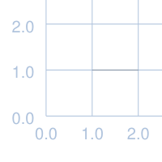
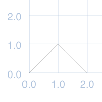
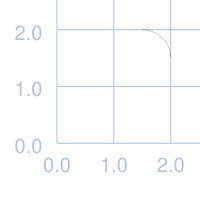
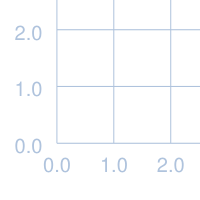
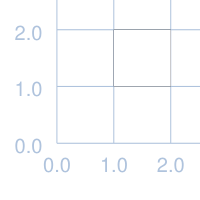
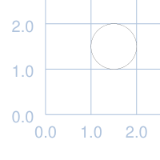
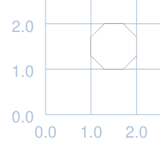
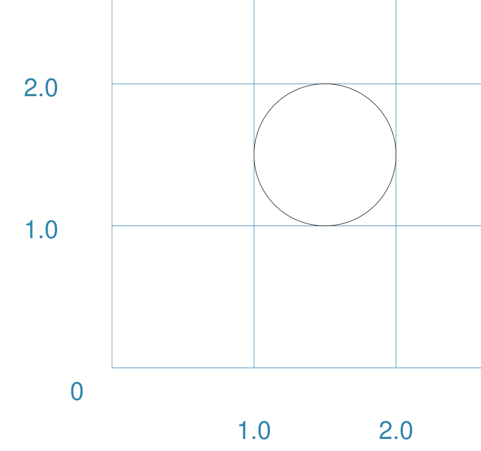
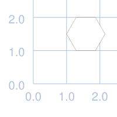
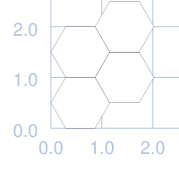

# pyprototypr: Core Shapes

## Table of Contents

* [Index of Shapes](#index_shapes)
* [Overview](#overview)
* [Commonalities](#commonalties)
* [Linear Shapes](#linear_shapes)
* [Enclosed Shapes](#enclosed_shapes)
* [Compound Shapes](#compound_shapes)
* [Shapes' Common Properties](#common_properties)

## Index of Shapes 

* [Arc](#arc)
* [AutoGrid](#autogrid)
* [Bezier](#bezier)
* [Circle](#circle)
* [Circle](#circle)
* [Ellipse](#ellipse)
* [Hexagon](#hexagon)
* [Hexagons](#hexagons)
* [Line](#line)
* [Octagon](#octagon)
* [PolyLine](#polyline)
* [Rectangle](#rectangle)
* 

## Overview 

These descriptions of the available shapes assume you are familiar with the concepts,
terms and ideas presented in [Basic Concepts](basic_concepts.md) - especially
*units*, *properties* and *defaults*.

Where possible, basic examples show how a shape would appear on a page when **only**
the default properties are used.  This means for most cases, *lines* are drawn in black,
with a width of 1mm (0.1cm) and shapes are *filled* with a white color. The default
length in most cases is 1cm.

To make it easier to see where and how a shape has been drawn, these examples have
been created with a background grid for reference: the values of **x** appear across
the lower edge of the grid (left tp right); those for **y** along the left side (bottom
to top).

> The graphics for these examples were generated from the scripts in the `examples`
> directory - look at the [default_shapes](../examples/simple/default_shapes.py) and
> [customised_shapes](../examples/simple/customised_shapes.py) files.

## Commonalities 

There are some properties that can be set for many of the shapes; examples of these
are presented at the end, rather than being repeated across every shape.

## Linear Shapes 

These shapes are created from a line of some sort; the most basic being a simple line.
A line effectively has only 1 dimension.

### Line [&#9650;](#index_shapes) 

<table>
  <tr>
    <th width="30%">Example #1</th>
    <th>Description</th>
  </tr>
  <tr>
    <td></td>
    <td>
    
This example shows the shape constructed using the command with all defaults:

    <pre>Line()</pre>
    
It has the following properties based on the defaults:
      <ul>
        <li>length of 1cm</li>,
        <li>starts at x-position 1cm and at y-position 1cm</li>,
        <li>heading/default direction is 90&deg; (clockwise from 0&deg; "north").</li>
      </ul>
    

    </td>
  </tr>
</table>

### Polyline [&#9650;](#index_shapes) 

<table>
  <tr>
    <th width="30%">Example #1</th>
    <th>Description</th>
  </tr>
  <tr>
    <td></td>
    <td>
    
This example shows an example of the shape can be constructed using a series of
       points for the line (<b>Note</b> if the points are <b>not</b> defined, then
       the script will not work and will show an error message):

    <pre>Polyline(points=[(0, 0), (1, 1), (2, 0)])</pre>
    
As can be seen from the example; at a minimum, you need to use three points
    to draw a *Polyline*:
      <ul>
        <li>points are supplied in a list of <b>x</b> and <b>y</b> values; each point is
        wrapped with <b>( )</b> brackets, and the whole list is wrapped with
        <b>[ ]</b> brackets</li>
      </ul>
    

    </td>
  </tr>
</table>

### Arc [&#9650;](#index_shapes) 

<table>
  <tr>
    <th width="30%">Example #1</th>
    <th>Description</th>
  </tr>
  <tr>
    <td></td>
    <td>
    
This example shows the shape constructed using the command with all defaults:

    <pre>Arc()</pre>
    
It has the following properties based on the defaults:
      <ul>
        <li>starts at x-position 1cm and at y-position 1cm</li>,
        <li>end at x-position 2cm and at y-position 2cm - based on a default length
            of 1cm</li>,
      </ul>
    

    </td>
  </tr>
</table>

### AutoGrid [&#9650;](#index_shapes) 

<table>
  <tr>
    <th width="30%">Example #1</th>
    <th>Description</th>
  </tr>
  <tr>
    <td></td>
    <td>
    
This example shows the shape constructed using the command with all defaults:

    <pre>AutoGrid()</pre>
    
This grid is designed to quickly construct a grid that can act as a "background"
    reference on which other shapes can be drawn and positioned.  Its unlikely to be
    used as part of a final drawing!

    
It has the following properties based on the defaults:
      <ul>
        <li>grid interval of 1cm</li>,
        <li>starts at x-position 1cm and at y-position 1cm</li>,
        <li>heading/default direction is 90&deg; (clockwise from 0&deg; "north").</li>
      </ul>
    

    </td>
  </tr>
  <tr>
    <th width="30%">Example #2</th>
    <th>Description</th>
  </tr>
    <td></td>
    <td>
      <pre>AutoGrid(subdivisions=5, stroke_width=0.8)</pre>
       
In this example, the AutoGrid shows how additional lines can be added; their
       width is set to a fraction of the normal grid lines ("stroke_width").  For this
       example, the <i>stroke_width</i> has been made thicker than usual.
       

    </td>
  </tr>
</table>

## Enclosed Shapes 

These shapes are created by enclosing an area; the most basic being a simple rectangle.
They effectively have 2 dimensions. The difference between these and linear shapes is
that the area enclosed by the shape can be filled with a color; the default fill color
is white.

> **pyprototypr** comes with a predefined set of named colors, shown in the
> [colors](../examples/colorset.pdf) document.

### Rectangle [&#9650;](#index_shapes) 

<table>
  <tr>
    <th width="30%">Example #1</th>
    <th>Description</th>
  </tr>
  <tr>
    <td></td>
    <td>
    
This example shows the shape constructed using the command with all defaults:

    <pre>Rectangle()</pre>
    
It has the following properties based on the defaults:
      <ul>
        <li>length of 1cm and height of 1cm</li>,
        <li>bottom-left corner at x-position 1cm and at y-position 1cm</li>,
        <li>fill color is white.</li>
      </ul>
    

    </td>
  </tr>
</table>

### Circle [&#9650;](#index_shapes) 

<table>
  <tr>
    <th width="30%">Example #1</th>
    <th>Description</th>
  </tr>
  <tr>
    <td></td>
    <td>
    
This example shows the shape constructed using the command with all defaults:

    <pre>Circle()</pre>
    
It has the following properties based on the defaults:
      <ul>
        <li>diameter of 1cm</li>,
        <li>the "bounding" square has a bottom-left corner x-position 1cm and y-position 1cm</li>,
        <li>fill color is white.</li>
      </ul>
    

    </td>
  </tr>
</table>

### Octagon [&#9650;](#index_shapes) 

<table>
  <tr>
    <th width="30%">Example #1</th>
    <th>Description</th>
  </tr>
  <tr>
    <td></td>
    <td>
    
This example shows the shape constructed using the command with all defaults:

    <pre>Octagon()</pre>
    
It has the following properties based on the defaults:
      <ul>
        <li>height and width of 1cm</li>,
        <li>bottom-left "corner" at x-position 1cm and at y-position 1cm</li>,
        <li>fill color is white.</li>
      </ul>
    

    </td>
  </tr>
</table>

### Ellipse [&#9650;](#index_shapes) 

<table>
  <tr>
    <th width="30%">Example #1</th>
    <th>Description</th>
  </tr>
  <tr>
    <td></td>
    <td>
    
This example shows the shape constructed using the command with all defaults:

    <pre>Ellipse()</pre>
    
It has the following properties based on the defaults:
      <ul>
        <li>starts at x-position 1cm and at y-position 1cm</li>,
        <li>ends at x-position 2cm and at y-position 2cm</li>,
        <li>fill color is white.</li>
      </ul>
    

    </td>
  </tr>
</table>

### Hexagon [&#9650;](#index_shapes) 

Hexagons are a shape widely used in gaming, second only to squares, because of their
ability to create a uniform grid. There is therefore some focus in **pyprototypr** on
being able to set various properties for them that are less applicable to other shapes.

Further information about using hexagons can be found in the section on
[Hexagonal Grids](hexagonal_grids.md).

<table>
  <tr>
    <th width="30%">Example #1</th>
    <th>Description</th>
  </tr>
  <tr>
    <td></td>
    <td>
    
This example shows the shape constructed using the command with all defaults:

    <pre>Hexagon()</pre>
    
It has the following properties based on the defaults:
      <ul>
        <li>height - from flat edge to flat edge - of 1cm</li>,
        <li>bottom-left "corner" at x-position 1cm and at y-position 1cm; so the
            left-point of the hexagon is at x-position 1cm and the bottom flat edge
            is at y-position 1cm </li>,
        <li>fill color is white.</li>
      </ul>
    

    </td>
  </tr>
</table>

## Compound Shapes 

These shapes are created by combining a single shape into a multiple repeated pattern.

### Hexagons [&#9650;](#index_shapes) 

Hexagons are often drawn in a "honeycomb" arrangement to form a grid - for games this
is often used to delineate the spaces in which playing pieces can be placed and their
movement regulated.

Further information about using hexagons can be found in the section on
[Hexagonal Grids](hexagonal_grids.md).

<table>
  <tr>
    <th width="30%">Example #1</th>
    <th>Description</th>
  </tr>
  <tr>
    <td></td>
    <td>
    
This example shows the shape constructed using the command:

    <pre>Hexagons(rows=2, cols=2)</pre>
    
Each hexagon has the usual default properties, but the grid itself also has the
       following defaults:
      <ul>
        <li><i>orientation</i> - </li>,
      </ul>
    

    </td>
  </tr>
</table>

## Shapes' Common Properties 
