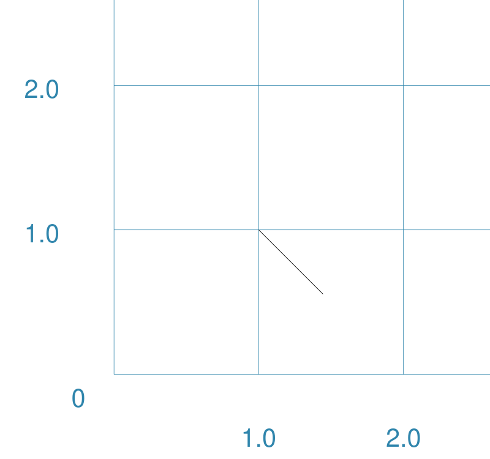
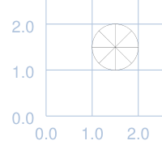
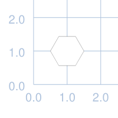
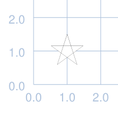
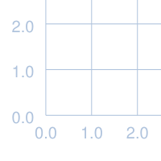
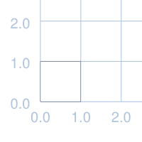

===========
Core Shapes
===========

.. |copy| unicode:: U+000A9 .. COPYRIGHT SIGN
   :trim:
.. |deg|  unicode:: U+00B0 .. DEGREE SIGN
   :ltrim:
.. |uar|  unicode:: U+02191 .. Black Up-Pointing Triangle
   :ltrim:

Table of Contents
-----------------

-  `Index of Shapes`_
-  `Overview`_
-  `Commonalities`_
-  `Linear Shapes`_
-  `Enclosed Shapes`_
-  `Compound Shapes`_
-  `Shapes' Common Properties`_

.. _shapeIndex:

Index of Shapes
---------------

-  `Arc`_
-  `Blueprint`_
-  `Bezier`_
-  `Circle`_
-  `Compass`_
-  `Chord`_
-  `Dot`_
-  `Ellipse`_
-  `Grid`_
-  `Hexagon`_
-  `Hexagons`_
-  `Line`_
-  `Polygon`_
-  `Polyline`_
-  `Rectangle`_
-  `Square`_
-  `Stadium`_
-  `Star`_
-  `Trapezoid`_

Overview
---------

These descriptions of the available shapes assume you are familiar with
the concepts, terms and ideas presented in `Basic
Concepts <basic_concepts.md>`_ - especially *units*, *properties* and
*defaults*. It will also help to at least read through the section on
`Additional Concepts <additional_concepts.rst>`_.

Where possible, the basic examples first show how a shape would appear
on a page when **only** the default properties are used. This means for
most cases, that *lines* are drawn in black, with a stroke width of 1mm
(0.1cm) and shapes are *filled* with a white color. The default length
or height in most cases is 1cm.

To make it easier to see where and how a shape has been drawn, these
examples have been created with a background grid (which **pyprototypr**
refers to as a ``Blueprint``) for cross-reference: the values of **x**
appear across the lower edge of the grid (increasing from left to
right); those for **y** along the left side (increasing from bottom to
top). The grid respects the margins that have been set, although the
numbers themselves are drawn inside the margin!

   The graphics for these examples were generated from the scripts in
   the ``examples`` directory - look at the
   `default_shapes <../examples/simple/default_shapes.py>`_ and
   `customised_shapes <../examples/simple/customised_shapes.py>`_
   scripts.

Commonalities
--------------

There are some properties that can be set for many of the shapes;
examples of these are presented at the end, rather than being repeated
across every shape.

Linear Shapes
--------------

Arc 
~~~
`^ <shapeIndex_>`_

Example #1
++++++++++

.. |arc| image:: images/examples/simple/defaults/arc.png
   :width: 300

===== ======
|arc| This example shows the shape constructed using the command with only
      defaults::

          Arc()

      It has the following properties based on the defaults:

      - starts at x-position 1cm and at y-position 1cm
===== ======

Bezier
~~~~~~
`^ <shapeIndex_>`_

Example #1
++++++++++

===== ======
|bez| This example shows the shape constructed using the command with only
      defaults::

          Bezier()

      It has the following properties based on the defaults:

      - starts at x-position 1cm and at y-position 1cm
===== ======

Chord
~~~~~
`^ <shapeIndex_>`_

Example #1
++++++++++

.. |chd| image:: images/examples/simple/defaults/chord.png
   :width: 300

===== ======
|chd| This example shows the shape constructed using the command with only
      defaults::

          Chord()

      It has the following properties based on the defaults:

      - starts at x-position 1cm and at y-position 1cm
===== ======

Dot
~~~
`^ <shapeIndex_>`_

Example #1
++++++++++

.. |dot| image:: images/examples/simple/defaults/dot.png
   :width: 300

===== ======
|dot| This example shows the shape constructed using the command with only
      defaults::

          Dot()

      It has the following properties based on the defaults:

      - centre at x-position 1cm and at y-position 1cm
===== ======

Line
~~~~
`^ <shapeIndex_>`_

Example #1
++++++++++

.. |lne| image:: images/examples/simple/defaults/line.png
   :width: 300

===== ======
|lne| This example shows the shape constructed using the command with only
      defaults::

          Line()

      It has the following properties based on the defaults:

      - starts at x-position 1cm and at y-position 1cm
      - length of 1cm
      - heading/default direction is 0 |deg| (anti-clockwise from 0 |deg| "east")
===== ======

Polyline
~~~~~~~~
`^ <shapeIndex_>`_

Example #1
++++++++++

.. |ply| image:: images/examples/simple/defaults/polyline.png
   :width: 300

===== ======
|ply| This example shows the shape constructed using the command with only
      defaults::

          Polyline()

      It has the following properties based on the defaults:

      - starts at x-position 1cm and at y-position 1cm
===== ======

Enclosed Shapes
---------------

These shapes are created by enclosing an area; the most basic being a simple rectangle.
They effectively have 2 dimensions (*height* and *width*).

The difference between enclosed and linear shapes is that the area enclosed by
the shape can be filled with a color; the default fill color is *white*.

    **pyprototypr** comes with a predefined set of named colors, shown in the
    `colors <../examples/colorset.pdf>`_ document.

Circle
~~~~~~
`^ <shapeIndex_>`_

Example #1
++++++++++

.. |ccl| image:: images/examples/simple/defaults/circle.png
   :width: 300

===== ======
|ccl| This example shows the shape constructed using the command with only
      defaults::

          Circle()

      It has the following properties based on the defaults:

      - lower-left "corner" at x-position 1cm and at y-position 1cm
      - diameter of 1cm
===== ======

Compass
~~~~~~~
`^ <shapeIndex_>`_

Example #1
++++++++++

===== ======
|cmp| This example shows the shape constructed using the command with only
      defaults::

          Compass()

      It has the following properties based on the defaults:

      - lower-left "corner" at x-position 1cm and at y-position 1cm
      - diameter of 1cm
      - compass lines in all 8 directions, extending from the centre outwards
===== ======

Ellipse
~~~~~~~
`^ <shapeIndex_>`_

Example #1
++++++++++

.. |ell| image:: images/examples/simple/defaults/ellipse.png
   :width: 300

===== ======
|ell| This example shows the shape constructed using the command with only
      defaults::

          Ellipse()

      It has the following properties based on the defaults:

      - lower-left "corner" at x-position 1cm and at y-position 1cm
      - diameter of 1cm
===== ======

Hexagon
~~~~~~~
`^ <shapeIndex_>`_

Example #1
++++++++++

.. |hex| image:: images/examples/simple/defaults/hexagon.png
   :width: 300

===== ======
|hex| This example shows the shape constructed using the command with only
      defaults::

          Hexagon()

      It has the following properties based on the defaults:

      - lower-left "corner" at x-position 1cm and at y-position 1cm
      - flat-to-flat height of 1cm
      - "flat" top
===== ======

Polygon
~~~~~~~
`^ <shapeIndex_>`_

Example #1
++++++++++

===== ======
|pol| This example shows the shape constructed using the command with only
      defaults::

          Polygon()

      It has the following properties based on the defaults:

      - starts at x-position 1cm and at y-position 1cm
      - has 6 sides
===== ======

Rectangle
~~~~~~~~~
`^ <shapeIndex_>`_

Example #1
++++++++++

.. |rct| image:: images/examples/simple/defaults/rectangle.png
   :width: 300

===== ======
|rct| This example shows the shape constructed using the command with only
      defaults::

          Rectangle()

      It has the following properties based on the defaults:

      - lower-left corner at x-position 1cm and at y-position 1cm
      - side of 1cm
===== ======

Square
~~~~~~
`^ <shapeIndex_>`_

Example #1
++++++++++

.. |sqr| image:: images/examples/simple/defaults/square.png
   :width: 300

===== ======
|sqr| This example shows the shape constructed using the command with only
      defaults::

          Square()

      It has the following properties based on the defaults:

      - lower-left corner at x-position 1cm and at y-position 1cm
      - side of 1cm
===== ======

Stadium
~~~~~~~
`^ <shapeIndex_>`_

Example #1
++++++++++

.. |std| image:: images/examples/simple/defaults/stadium.png
   :width: 300

===== ======
|std| This example shows the shape constructed using the command with only
      defaults::

          Stadium()

      It has the following properties based on the defaults:

      - straight edge start at x-position 1cm and at y-position 1cm
      - height and width of 1cm each
      - curved ends at ???
===== ======

Star
~~~~
`^ <shapeIndex_>`_

Example #1
++++++++++

===== ======
|str| This example shows the shape constructed using the command with only
      defaults::

          Star()

      It has the following properties based on the defaults:

      - centre at x-position 1cm and at y-position 1cm
      - "height" of 1cm
      - 5 points
===== ======

Trapezoid
~~~~~~~~~
`^ <shapeIndex_>`_

Example #1
++++++++++

.. |trp| image:: images/examples/simple/defaults/trapezoid.png
   :width: 300

===== ======
|trp| This example shows the shape constructed using the command with only
      defaults::

          Z()

      It has the following properties based on the defaults:

      - starts at x-position 1cm and at y-position 1cm
===== ======

Compound Shapes
---------------

Blueprint
~~~~~~~~~
`^ <shapeIndex_>`_

Example #1
++++++++++

===== ======
|blp| This example shows the shape constructed using the command with only
      defaults::

          Blueprint()

      It has the following properties based on the defaults:

      - starts at the lower-left corner, as defied by the page margins
      - has vertical and horizontal filling the page up to the margins
      - has spacing between lines of 1cm
      - default line color is a shade of blue (``AA``)
      - numbers 
===== ======

Grid
~~~~
`^ <shapeIndex_>`_

Example #1
++++++++++

===== ======
|grd| This example shows the shape constructed using the command with only
      defaults::

          Grid()

      It has the following properties based on the defaults:

      - starts at lower-left corner of page defined by the margin
      - has a default size of 2 in each of the x- and y-directions
===== ======

Hexagons
~~~~~~~~
`^ <shapeIndex_>`_

Hexagons are often drawn in a "honeycomb" arrangement to form a grid - for games
this is often used to delineate the spaces in which playing pieces can be placed
and their movement regulated.

    Further information about using hexagons in grids can be found in the section
    on `Hexagonal Grids <hexagonal_grids.rst>`_.

Shapes' Common Properties
-------------------------
