===========
Core Shapes
===========

.. |copy| unicode:: U+000A9 .. COPYRIGHT SIGN
   :trim:
.. |deg|  unicode:: U+00B0 .. DEGREE SIGN
   :ltrim:
.. |uar|  unicode:: U+02191 .. Black Up-Pointing Triangle
   :ltrim:

.. _pageIndex:

Table of Contents
-----------------

-  `Index of Shapes`_
-  `Overview`_
-  `Commonalities`_
-  `Linear Shapes`_
-  `Enclosed Shapes`_
-  `Compound Shapes`_
-  `Shapes' Common Properties`_

.. _shapeIndex:

Index of Shapes
---------------

-  `Arc`_
-  `Blueprint`_
-  `Bezier`_
-  `Circle`_
-  `Compass`_
-  `Chord`_
-  `Dot`_
-  `DotGrid`_
-  `Ellipse`_
-  `EquilateralTriangle`_
-  `Grid`_
-  `Hexagon`_
-  `Hexagons`_
-  `Line`_
-  `Polygon`_
-  `Polyline`_
-  `Rectangle`_
-  `Sector`_
-  `Square`_
-  `Stadium`_
-  `Star`_
-  `Starfield`_
-  `Text`_
-  `Trapezoid`_

Overview
---------
`^ <pageIndex_>`_

These descriptions of the available shapes assume you are familiar with
the concepts, terms and ideas presented in `Basic
Concepts <basic_concepts.md>`_ - especially *units*, *properties* and
*defaults*. It will also help to at least read through the section on
`Additional Concepts <additional_concepts.rst>`_.

Where possible, the basic examples first show how a shape would appear
on a page when **only** the default properties are used.
This means for most cases, that *lines* are drawn in black, and shapes are
*filled* with a white color. The default length or height in most cases is 1cm.
The only change, for these examples, has been to make the default line width
thicker for easier viewing of the PNG images.

To make it easier to see where and how a shape has been drawn, most of these
examples have been created with a background grid (which **pyprototypr**
refers to as a `Blueprint`_ shape) for cross-reference: the values of **x**
appear across the lower edge of the grid (increasing from left to
right); those for **y** along the left side (increasing from bottom to
top). The grid respects the margins that have been set - so "0" is actually
offset from the physical page corner ... but you will observe that the
Blueprint numbering itself is inside the margin area!

   The graphics for these examples were generated from the scripts in
   the ``examples`` directory - look at the
   `default_shapes <../examples/simple/default_shapes.py>`_ and
   `customised_shapes <../examples/simple/customised_shapes.py>`_
   scripts.

Commonalities
--------------
`^ <pageIndex_>`_

There are some properties that can be set for almost all of the shapes;
examples of these are presented in the section on `Shapes' Common Properties`_
at the end, rather than being described for every single shape.

Linear Shapes
--------------
`^ <pageIndex_>`_

Arc
~~~
`^ <shapeIndex_>`_

Example 1.
++++++++++

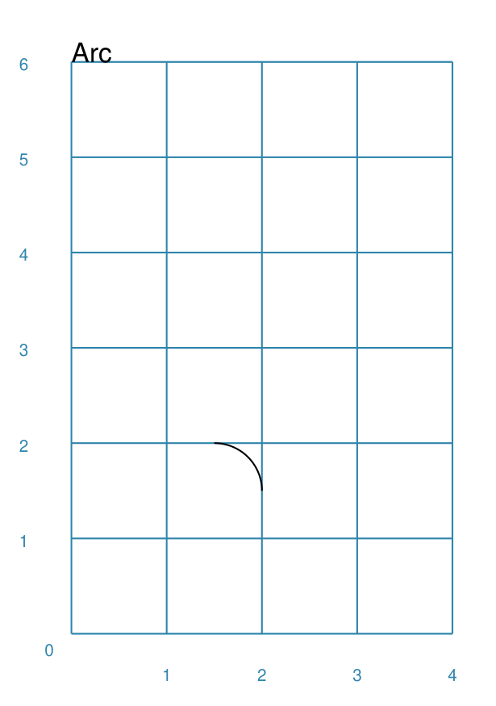

===== ======
|arc| This example shows the shape constructed using the command with only
      defaults::

          Arc()

      It has the following properties based on the defaults:

      - origin is at x-position 1cm and at y-position 1cm
===== ======

Example 2.
++++++++++

.. |ac2| image:: images/customised/arc.png
   :width: 330

===== ======
|ac2| This example shows the shape constructed using the command with these
      properties::

          Arc(x=1, y=1, x1=3, y1=2)

      To help with visualisation, the Arc is surrounded by a red Rectangle::

        Rectangle(
            x=1, y=1, height=1, width=2, dot=0.01,
            stroke=red, fill=None,
            title="Arc(x=1, y=1, x1=3, y1=2)")
        )

      The Arc has the following properties:

      - origin is at x-position 1cm and at y-position 1cm
      - the secondary x-position and y-position are at 3cm and 2cm
===== ======

Bezier
~~~~~~
`^ <shapeIndex_>`_

Example 1.
++++++++++

.. |bez| image:: images/defaults/bezier.png
   :width: 330

===== ======
|bez| This example shows the shape constructed using the command with only
      defaults::

          Bezier()

      It has the following properties based on the defaults:

      - starts at x-position 1cm and at y-position 1cm
===== ======

Chord
~~~~~
`^ <shapeIndex_>`_

Example 1.
++++++++++

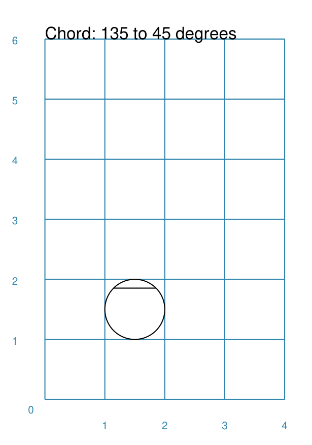

===== ======
|chd| If the shape constructed using only default properties, there will be
      nothing to see::

          Chord()

      This example then shows the shape constructed using the command with these
      properties::

          Chord(shape=Circle(), angle=135, angle1=45)

      It has the following properties based on these values:

      - the circle that helps defines the start and end of the chord line is
        located with its "corner" at x-position 1cm and at y-position 1cm
      - the start of chord is at the intersection of the radius of the circle
        at 135 |deg| with the circle's circumference
      - the end of chord is at the intersection of the radius of the circle
        at 45 |deg| with the circle's circumference

===== ======

Dot
~~~
`^ <shapeIndex_>`_

Example 1.
++++++++++

===== ======
|dot| This example shows the shape constructed using the command with only
      defaults::

          Dot()

      It has the following properties based on the defaults:

      - centre at x-position 1cm and at y-position 1cm
      - diameter of 3 points; there are 72 points in an inch, so this is 1/24th
        of an inch, or approximately 1mm (0.1cm), in size
      - fill color for a Dot is the same as the stroke - default is black
===== ======

Line
~~~~
`^ <shapeIndex_>`_

Example 1.
++++++++++

.. |lne| image:: images/defaults/line.png
   :width: 330

===== ======
|lne| This example shows the shape constructed using the command with only
      defaults::

          Line()

      It has the following properties based on the defaults:

      - starts at x-position 1cm and at y-position 1cm
      - length of 1cm
      - heading/default direction is 0 |deg| (anti-clockwise from 0 |deg| "east")
===== ======

Polyline
~~~~~~~~
`^ <shapeIndex_>`_

Example 1.
++++++++++

.. |ply| image:: images/defaults/polyline.png
   :width: 330

===== ======
|ply| If the shape constructed using only default properties, there will be
      nothing to see::

          Polyline()

      This example then shows the shape constructed using the command with these
      properties::

          Polyline(points=[(0, 0), (1, 1), (2, 0)])

      It has the following properties based on these values:

      - starts at x-position 0cm and at y-position 0cm
      - second point is at x-position 1cm and at y-position 1cm
      - third point is at x-position 2cm and at y-position 0cm
===== ======

Text
~~~~
`^ <shapeIndex_>`_

It may seem strange to view text as a "shape"; but from a drawing point of
view, its really just a series of complex lines drawn in a particular pattern!
Thus text has size, color and position in common with many other shapes, as
well as its own special properties.

Example 1.
++++++++++

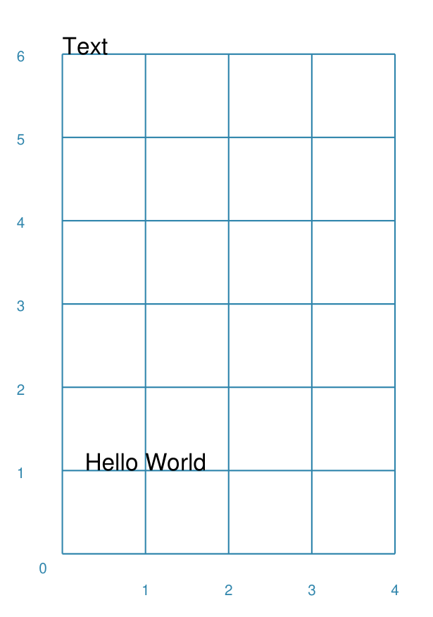

===== ======
|txt| This example shows the shape constructed using the command with only
      defaults; except for the **text** property - this is changed otherwise
      there would not be any text to see!::

          Text(text="Hello World")

      It otherwise has the following properties based on the defaults:

      - centred at x-position 1cm and at y-position 1cm
      - default font size is 12 points
      - default font face is Arial
===== ======

Enclosed Shapes
---------------
`^ <pageIndex_>`_

These shapes are created by enclosing an area; the most basic being a simple rectangle.
They effectively have 2 dimensions (*height* and *width*).

The difference between enclosed and linear shapes is that the area enclosed by
the shape can be filled with a color; the default fill color is *white*.

    **pyprototypr** comes with a predefined set of named colors, shown in the
    `colors <../examples/colorset.pdf>`_ document.

Circle
~~~~~~
`^ <shapeIndex_>`_

.. NOTE::

   There is more detail about the properties that can be defined for a
   Circle in the `customised shapes' Circle <customised_shapes.rst#circle>`_.

Example 1.
++++++++++

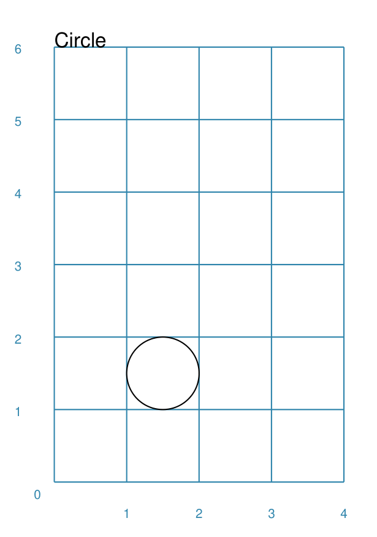

===== ======
|ccl| This example shows the shape constructed using the command with only
      defaults::

          Circle()

      It has the following properties based on the defaults:

      - lower-left "corner" at x-position 1cm and at y-position 1cm
      - diameter of 1cm
===== ======

Compass
~~~~~~~
`^ <shapeIndex_>`_

A Compass is often thought of a specific device used for navigation. Here,
its abstracted somewhat to indicate directional lines drawn within an
enclosing shape; by default, circle.

Example 1.
++++++++++

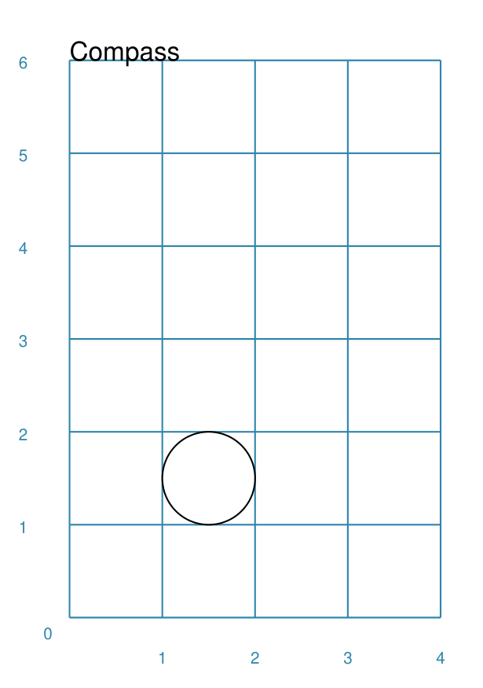

===== ======
|cmp| This example shows the shape constructed using the command with only
      defaults::

          Compass()

      It has the following properties based on the defaults:

      - lower-left "corner" at x-position 1cm and at y-position 1cm
      - diameter of 1cm
      - lines in all 8 directions, extending from the centre outwards; these
        represent the primary - North, South, East and West - and secondary -
        North-East, South-East, North-West and South-West directions.
===== ======

Example 2.
++++++++++

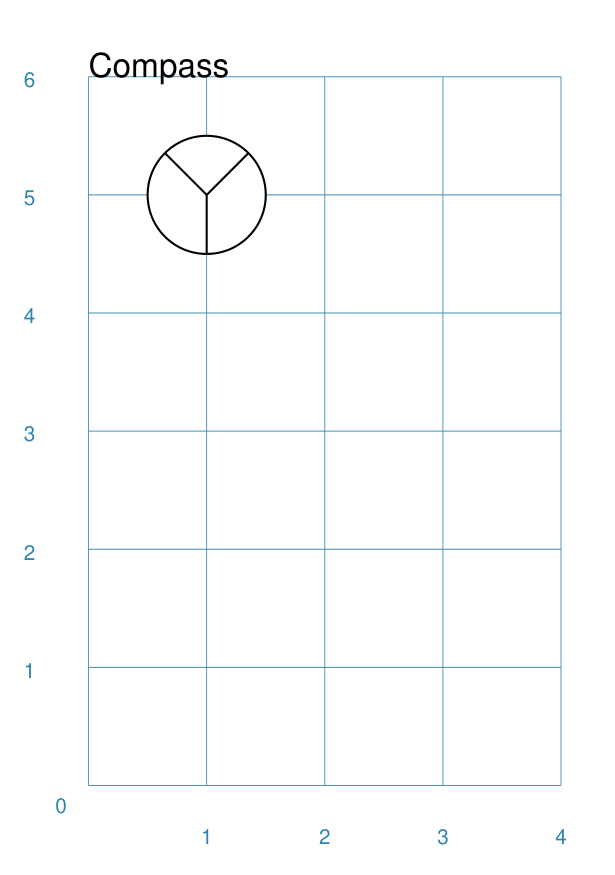

===== ======
|cm2| This example shows the shape constructed using the command with different
      properties.  The top left::

          Compass(cx=1, cy=5, perimeter='circle', directions="ne nw s")

      The Compass shape has the following properties:

      - centred at x-position 1cm and at y-position 5cm
      - *directions* define where the radial lines extend; in this case to the
        North-East, North-West and South

      The centre::

          Compass(
              cx=2, cy=3, perimeter='rectangle', height=2, width=3,
              radii_stroke=red)

      The Compass shape has the following properties:

      - centred at x-position 2cm and at y-position 3cm
      - *perimeter* defines the shape of 'rectangle' that is used to define
        where the radial lines of the compass extend; in this case its in a
        rectangle with a height of `2` cm and width of `3` cm.
      - radial lines extend, by default, in all 8 directions - to the centre of
        the rectangle's bounding lines and to its corners
      - *radii_stroke* defines the line colors used

      The lower right::

          Compass(cx=3, cy=1, perimeter='hexagon', radii_stroke_width=2)

      The Compass shape has the following properties:

      - centred at x-position 3cm and at y-position 1cm
      - *perimeter* defines the shape of 'hexagon' that is used to defined where
        the radial lines of the compass extend; in this case its in a
        hexagon with a default diameter of 1cm, so lines extend in 6 directions
        i.e. no North or South
      - *radii_stroke_width* defines the line thickness used for the radii
===== ======

Ellipse
~~~~~~~
`^ <shapeIndex_>`_

Example 1.
++++++++++

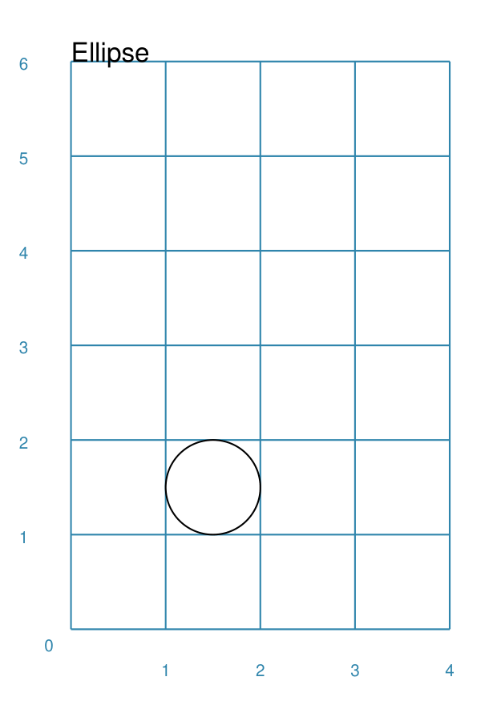

===== ======
|ell| This example shows the shape constructed using the command with only
      defaults::

          Ellipse()

      It has the following properties based on the defaults:

      - lower-left "corner" at x-position 1cm and at y-position 1cm
      - height of 1cm
      - width of 1cm

      Because the *height* and *width* default to the same value, it appears
      as a `Circle`_.

===== ======

EquilateralTriangle
~~~~~~~~~~~~~~~~~~~
`^ <shapeIndex_>`_

Example 1.
++++++++++

.. |eqi| image:: images/defaults/equiangle.png
   :width: 330

===== ======
|eqi| This example shows the shape constructed using the command with only
      defaults::

          EquilateralTriangle()

      It has the following properties based on the defaults:

      - lower-left "corner" at x-position 1cm and at y-position 1cm
      - side of 1cm; all sides are equal
===== ======

Example 2.
++++++++++

.. |eq2| image:: images/customised/equilateral_triangle.png
   :width: 330

===== ======
|eq2| This example shows the shape constructed using the command with the
      various properties.  In the lower section::

        EquilateralTriangle(
          x=2, y=1, flip="north", hand="east", label="NE", fill=gold)
        EquilateralTriangle(
          x=2, y=1, flip="south", hand="east", label="SE", fill=lime)
        EquilateralTriangle(
          x=2, y=1, flip="north", hand="west", label="NW", fill=red)
        EquilateralTriangle(
          x=2, y=1, flip="south", hand="west", label="SW", fill=blue)

      These have the following properties:

      - starting position at x-position 2cm and at y-position 1cm
      - default side of 1cm; all sides are equal
      - *flip* - this can be `north` or `south` and will cause the triangle to
        either point up or down relative to the starting position
      - *hand*  - this can be `west` or `east` and will cause the triangle to
        be drawn to the left or the right relative to the starting position

      The middle section shows::

        EquilateralTriangle(
            x=2, y=3, side=1.5,
            hatch=5, hatch_stroke=red,
            title='Title', heading='Head'
        )

      - starting position at *x*-position 2cm and at *y*-position 3cm
      - *side* of 1.5cm; all sides are equal
      - *hatch* of 5 - this means there will be 5 equally spaced lines drawn
        between opposing sides which run parallel to the third side
      - *hatch_stroke* - customise the hatch lines to show them as `red`

      The top section shows::

        EquilateralTriangle(
            x=1, y=4, stroke_width=1, rotation=45, dot=.05
        )

      - starting position at x-position 1cm and at y-position 4cm
      - *dot* - in the centre
      - *rotation* - of 45 |deg| (from the baseline, anti-clockwise) about
        the centre

===== ======

Hexagon
~~~~~~~
`^ <shapeIndex_>`_

.. NOTE::

   There is more detail about the properties that can be defined for a
   Hexagon in the `customised shapes' Hexagon <customised_shapes.rst#hexagon>`_ section.

Example 1.
++++++++++

.. |hx1| image:: images/defaults/hexagon-flat.png
   :width: 330

===== ======
|hx1| This example shows the shape constructed using the command with only
      defaults::

          Hexagon()

      It has the following properties based on the defaults:

      - lower-left "corner" at x-position 1cm and at y-position 1cm
      - flat-to-flat height of 1cm
      - "flat" top
===== ======

Example 2.
++++++++++

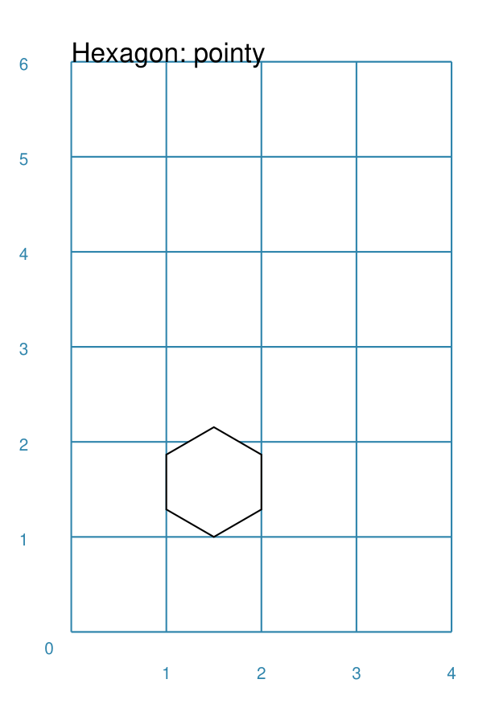

===== ======
|hx2| This example shows the shape constructed using the command with only
      one change to the defaults::

          Hexagon(orientation="pointy")

      It has the following properties based on the defaults:

      - lower-left "corner" at x-position 1cm and at y-position 1cm
      - flat-to-flat height of 1cm
      - "pointy" top set via the *orientation*
===== ======

Polygon
~~~~~~~
`^ <shapeIndex_>`_

A polygon is a shape of constructed of any number of sides of equal length.
A hexagon is just a polygon with 6 sides and an octagon is just a polygon with
8 sides.

Example 1.
++++++++++

.. |pol| image:: images/defaults/polygon.png
   :width: 330

===== ======
|pol| This example shows the shape constructed using the command with only
      defaults::

          Polygon()

      It has the following properties based on the defaults:

      - centre at x-position 1cm and at y-position 1cm
      - has 6 sides
===== ======

Example 2.
++++++++++

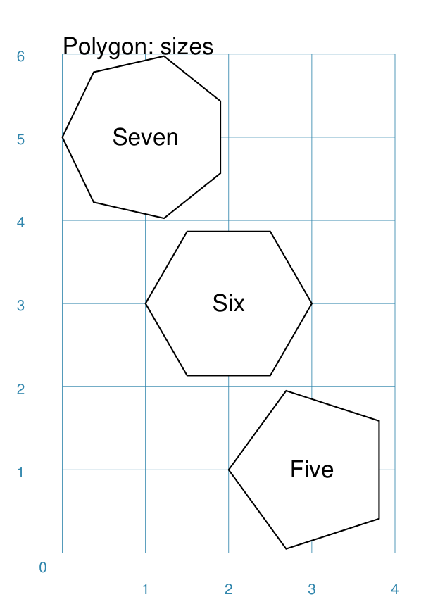

===== ======
|pl1| This example shows three shapes constructed using the command with the
      following properties::

        Polygon(cx=1, cy=5, sides=7, radius=1, label="Seven")
        Polygon(cx=2, cy=3, sides=6, radius=1, label="Six")
        Polygon(cx=3, cy=1, sides=5, radius=1, label="Five")

      It can be seen that each shape is constructed as follows:

      - *centre* - using `cx` and `cy` values
      - *radius* - 1cm in each case
      - *sides* - varying from 7 down to 5

      Even-sided polygons have a "flat" top, whereas odd-sided ones are
      asymmetrical.
===== ======

Example 3.
++++++++++

.. |pl2| image:: images/customised/polygon_radii.png
   :width: 330

===== ======
|pl2| This example shows the shape constructed using the command with the
      additional properties.

      The top example::

          Polygon(cx=2, cy=4, sides=8, radius=1, radii=True)

      It has the following properties:

      - *centre* at x-position 2cm and at y-position 4cm, with a *radius*
        size of 1cm
      - *sides* - 8
      - *radii* - set to `True` to force lines to be drawn from each of the
        vertices of the polygon to its centre

      The lower example::

          Polygon(
              cx=2, cy=1, sides=10, radius=1,
              radii=True,
              radii_offset=0.75, radii_length=0.25, radii_stroke_width=1,
              dot=0.1, dot_stroke=red
          )

      It has the following properties:

      - *centre* at x-position 2cm and at y-position 1cm, with a *radius*
        size of 1cm
      - *sides* - 10
      - *radii* - set to `True` to force lines to be drawn from the centre of
        the polygon to each of its vertices; the radii properties are then set:

        - *radii_offset* - set to 0.5cm; the distance away from the centre that
          the radii will start to be drawn
        - *radii_length*  - set to 0.75cm; the length is shorter than that of
          the complete distance from vertex to centre, so the line goes in the
          same direction but never touches the vertex or the centre
        - *radii_stroke_width* set to 1point; a slightly thicker line
===== ======

Example 4.
++++++++++

.. |pl3| image:: images/customised/polygon_rotation_flat.png
   :width: 330

===== ======
|pl3| This example shows five shapes constructed using the command with
      additional properties::

        Polygon(common=poly6, y=1, x=1.0, label="0")
        Polygon(common=poly6, y=2, x=1.5, rotation=15, label="15")
        Polygon(common=poly6, y=3, x=2.0, rotation=30, label="30")
        Polygon(common=poly6, y=4, x=2.5, rotation=45, label="45")
        Polygon(common=poly6, y=5, x=3.0, rotation=60, label="60")

      The examples have the following properties:

      - *centre* - using `cx` and `cy` values
      - *radius* - 1cm in each case
      - *sides* - the default of 6 in each case ("hexagon" shape)
      - *rotation* - varies from 0 |deg| to 60 |deg| (counter-clockwise from the
        horizontal); the fact that the angle of the sides of the polygon is
        30 |deg| creates a type of regularity, so that a rotation of 60 |deg|
        appears to repeat the first polygon - but the slope of the label inside
        the polygon clearly shows the rotation.
===== ======

Rectangle
~~~~~~~~~
`^ <shapeIndex_>`_

.. NOTE::

   There is more detail about the properties that can be defined for a
   Rectangle in the `customised shapes' Rectangle <customised_shapes.rst#rectangle>`_.

Example 1.
++++++++++

.. |rct| image:: images/defaults/rectangle.png
   :width: 330

===== ======
|rct| This example shows the shape constructed using the command with only
      defaults::

          Rectangle()

      It has the following properties based on the defaults:

      - lower-left corner at x-position 1cm and at y-position 1cm
      - side of 1cm

      Because all sides of the Rectangle are equal, it appears as though it
      is a `Square`_.
===== ======

Sector
~~~~~~
`^ <shapeIndex_>`_

A Sector is like the triangular-shaped wedge that is often cut from a pizza
or cake. It extends from the centre of a "virtual" circle outwards to its
enclosing diameter.  The two "arms" of the sector will cover a certain number
of degrees of the circle (from 1 to 360).

Example 1.
++++++++++

===== ======
|sct| This example shows the shape constructed using the command with only
      defaults::

          Sector()

      It has the following properties based on the defaults:

      - lower-left "corner"at x-position 1cm and at y-position 1cm
      - sector is then drawn inside a circle of diameter 1cm, with an
        *angle_width* of 90 |deg|
===== ======

Example 2.
++++++++++

.. |sc1| image:: images/customised/sectors.png
   :width: 330

===== ======
|sc1| This example shows examples of the shape constructed using the command
      the following properties::

        sctm = Common(cx=2, cy=3, radius=2, fill=black, angle_width=43)
        Sector(common=sctm, angle=40)
        Sector(common=sctm, angle=160)
        Sector(common=sctm, angle=280)

      These all have the following Common properties:

      - centred at x-position 2cm and at y-position 3cm
      - *radius* of 2cm for the enclosing "virtual" circle
      - *fill* color of black
      - *angle_width* - determines the coverage (width of the sector); in these
        cases it is 43 |deg|

      Each sector in this example is drawn at a different *angle*; with the
      this being the "virtual" centre-line  extending through the sector from
      the middle of the  enclosing "virtual" circle.

===== ======

Square
~~~~~~
`^ <shapeIndex_>`_

Example 1.
++++++++++

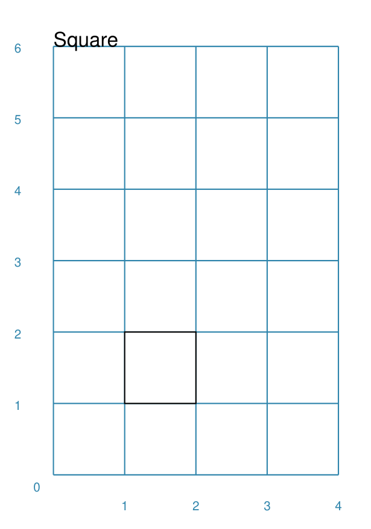

===== ======
|sqr| This example shows the shape constructed using the command with only
      defaults::

          Square()

      It has the following properties based on the defaults:

      - lower-left corner at x-position 1cm and at y-position 1cm
      - side of 1cm
===== ======

Stadium
~~~~~~~
`^ <shapeIndex_>`_

A Stadium is a shape constructed with a rectangle as a base, and then rounded
projections extending from one or more of the sides.

Example 1.
++++++++++

.. |std| image:: images/defaults/stadium.png
   :width: 330

===== ======
|std| This example shows the shape constructed using the command with only
      defaults::

          Stadium()

      It has the following properties based on the defaults:

      - straight edge start at x-position 1cm and at y-position 1cm
      - height and width of 1cm each
      - curved ends at the east (right) and west (left) sides
===== ======

Example 2.
++++++++++

.. |st1| image:: images/customised/stadium_edges.png
   :width: 330

===== ======
|st1| This example shows example of the shape constructed using the command
      with the following properties::

        Stadium(x=0, y=0, height=1, width=1, edges='n', fill=tan, label="north")
        Stadium(x=3, y=1, height=1, width=1, edges='s', fill=tan, label="south")
        Stadium(x=0, y=4, height=1, width=1, edges='e', fill=tan, label="east")
        Stadium(x=3, y=5, height=1, width=1, edges='w', fill=tan, label="west")

      These have the following properties set:

      - *height* and *width* - of 1cm and 1cm respectively
      - *edges* - the display of the rounded projection(s) are set by using
        a letter representing the direction, where 'n' is north ("up"),
        's' is south ("down"), 'e' is east ("right") and 'w' is west ("left"");
        one or more can be used together with spaces between them e.g. 'n e'
        for north **and** east.
===== ======

Star
~~~~
`^ <shapeIndex_>`_

Example 1.
++++++++++

.. |str| image:: images/defaults/star.png
   :width: 330

===== ======
|str| This example shows the shape constructed using the command with only
      defaults::

          Star()

      It has the following properties based on the defaults:

      - centre at x-position 1cm and at y-position 1cm
      - "height" of 1cm
      - 5 points
===== ======

Starfield
~~~~~~~~~
`^ <shapeIndex_>`_

Example 1.
++++++++++

.. |sf0| image:: images/defaults/starfield.png
   :width: 330

===== ======
|sf0| This example shows the shape constructed using the command with only
      defaults::

          Starfield()

      It has the following properties based on the defaults:

      - lower left-corner at x-position 0cm and at y-position 0cm
      - an enclosing area with *height* and *width* of 1cm
      - 10 randomly placed white *color* 'dots' (the starfield *density*)

      Because the default fill color is white, this example adds an extra
      `Rectangle()` shape, with a fill of black, which is drawn first and is
      hence "behind" the field of dots.
===== ======

Example 2.
++++++++++

.. |sf1| image:: images/customised/starfield_rectangle.png
   :width: 330

===== ======
|sf1| This example shows the shape constructed using the command with the
      following properties::

        StarField(
            enclosure=rectangle(x=0, y=0, height=3, width=3),
            density=80,
            colors=[white, white, red, green, blue],
            sizes=[0.4]
        )

      It has the following properties set:

      - lower left-corner at x-position 0cm and at y-position 0cm
      - *enclosure* - the rectangle size determines the boundaries of the area
        (*height* and *width* each of 3cm) inside of which the stars (dots) are
        randomly drawn
      - *density* - there will be a total of "80 multiplied by the enclosure
        area" dots drawn
      - *colors* - are a list of colors, one of which will be randomly chosen
        each time before drawing a dot
      - *sizes* - are a list of randomly chosen dot sizes; in this case there is
        just one value and so all dots will be same size

      Because the default fill color is white, this example adds an extra
      `Rectangle()` shape, with a fill color of black, which is drawn first and
      is hence "behind" the field of dots.
===== ======

Example 3.
++++++++++

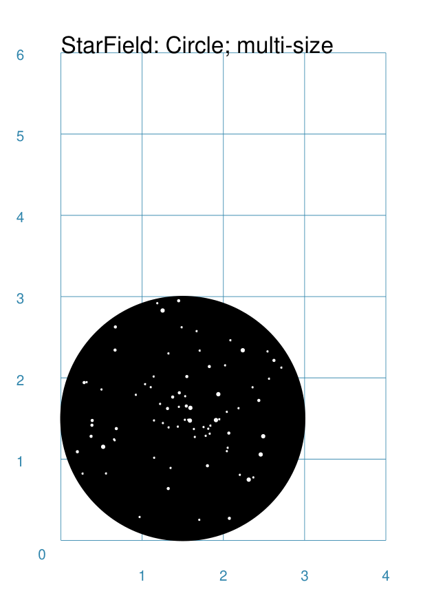

===== ======
|sf2| This example shows the shape constructed using the command with the
      following properties::

        StarField(
            enclosure=circle(x=0, y=0, radius=1.5),
            density=30,
            sizes=[0.15, 0.15, 0.15, 0.15, 0.3, 0.3, 0.5]
        )

      It has the following properties set:

      - lower left "corner" at x-position 0cm and at y-position 0cm
      - *enclosure* - the circle radius (1.5cm) determines the boundaries of
        the area inside of which the stars (dots) are randomly drawn
      - *density* - there will be a total of "30 multiplied by the enclosure
        area" dots drawn
      - *sizes* - are a list of available dot sizes, one of which is randomly
        chosen each time before drawing a dot

      Because the default fill color is white, this example adds an extra
      `Circle()` shape, with a fill color of black, which is drawn first and is
      hence "behind" the field of dots.
===== ======

Example 4.
++++++++++

.. |sf3| image:: images/customised/starfield_poly.png
   :width: 330

===== ======
|sf3| This example shows the shape constructed using the command with the
      following properties::

        StarField(
            enclosure=polygon(x=1.5, y=1.4, sides=10, radius=1.5),
            density=50,
            colors=[white, white, white, red, green, blue],
            sizes=[0.15, 0.15, 0.15, 0.15, 0.3, 0.3, 0.45]
        )

      It has the following properties set:

      - lower left "corner" at x-position 1.5cm and at y-position 1.4cm
      - *enclosure* - the polygon radius (1.5cm) determines the boundaries of
        the area inside of which the stars (dots) are randomly drawn
      - *density* - there will be a total of "50 multiplied by the enclosure
        area" dots drawn
      - *colors* - a list of available dot colors, one of which is randomly
        chosen each time before drawing a dot
      - *sizes* - are a list of available dot sizes, one of which is randomly
        chosen each time before drawing a dot

      Because the default fill color is white, this example adds an extra
      `Polygon()` shape, with a fill color of black, which is drawn first and
      is hence "behind" the field of dots.
===== ======

Trapezoid
~~~~~~~~~
`^ <shapeIndex_>`_

Example 1.
++++++++++

.. |trp| image:: images/defaults/trapezoid.png
   :width: 330

===== ======
|trp| This example shows the shape constructed using the command with only
      defaults::

          Z()

      It has the following properties based on the defaults:

      - starts at x-position 1cm and at y-position 1cm
===== ======

Compound Shapes
---------------
`^ <pageIndex_>`_

Blueprint
~~~~~~~~~
`^ <shapeIndex_>`_

This shape is primarily intended to support drawing while it is "in progress".
It provides a quick and convenient way to orientate and place other shapes
that *are* required for the final product.  Typically one would just comment
out the command when its purpose has been served.

However, different styling options are provided that can make it more useful
for different contexts.

.. NOTE::

   There is more detail about the various properties that can be defined for a
   Blueprint in the section on `customised Blueprint <customised_shapes.rst#blueprint>`_.

Example 1.
++++++++++

.. |blp| image:: images/defaults/blueprint.png
   :width: 330

===== ======
|blp| This example shows the shape constructed using the command with only
      defaults::

          Blueprint()

      It has the following properties based on the defaults:

      - starts at the lower-left corner, as defined by the page margins
      - has vertical and horizontal lines filling the page from the lower left
        corner up to the right and top margins
      - has spacing between lines of 1cm
      - default line color is a shade of blue (`#2F85AC`)
      - the x- and y-axis are numbered from the lower left corner
===== ======

Example 2.
++++++++++

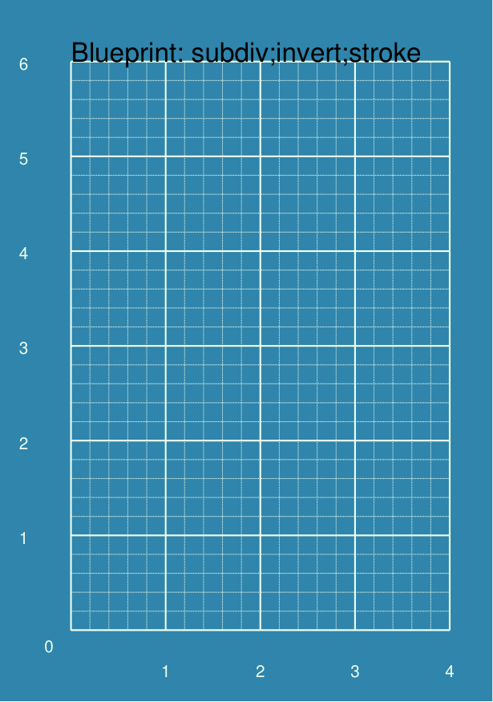

===== ======
|bl2| This example shows the shape constructed using the command with these
      properties::

          Blueprint(subdivisions=5, stroke_width=0.5, style='invert')

      It has the following properties set:

      - *subdivisions* - set to `5`; these are thinner lines drawn between
        the primary lines - they do not have any numbering
      - *stroke_width* - set to `0.5`; this slightly thicker primary line makes
        the grid more visible
      - *style* - set to `invert` so that the lines are white and the fill color
        is now blue
===== ======

DotGrid
~~~~~~~
`^ <shapeIndex_>`_

Example 1.
++++++++++

.. |dtg| image:: images/defaults/dotgrid.png
   :width: 330

===== ======
|dtg| This example shows the shape constructed using the command with only
      defaults::

          DotGrid()

      It has the following properties based on the defaults:

      - lower left at x-position 0cm and at y-position 0cm
      - set of 2 x 2 dots, spaced 1cm apart
===== ======

Example 2.
++++++++++

.. |dg1| image:: images/customised/dotgrid_moleskine.png
   :width: 330

===== ======
|dg1| This example shows the shape constructed using the command with the
      following properties::

        DotGrid(
            stroke=darkgray, width=0.5, height=0.5, dot_point=1, offset_y=-0.25
        )

      It is meant to simulate the dot grid found in Moleskine notebooks, and so
      it has the following properties set:

      - *width* and *height* are the spacing in x and y directions respectively
      - *dot_point* is set to be smaller than the default of 3
      - *stroke* color of `darkgrey` is a lighter color than default of black
      - *offset_y* moves the start of the grid downwards

      *NOTE* If you were to actually create a page that you might use, you
      could consider setting the page color to something like `cornsilk` to
      provide a suitable backdrop; do this by setting the *fill* property of
      the `Create()` command.
===== ======

Grid
~~~~
`^ <shapeIndex_>`_

A Grid is a series of crossed lines - both in the vertical and horizontal
directions - which will, by default, fill the page, as far as possible,
between its margins.

Example 1.
++++++++++

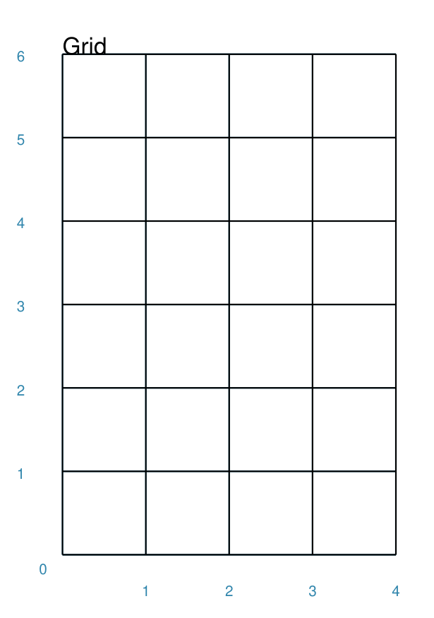

===== ======
|grd| This example shows the shape constructed using the command with only
      defaults::

          Grid()

      It has the following properties based on the defaults:

      - starts at lower-left corner of page defined by the margin
      - has a default grid interval of `1cm` in both the x- and y-direction
===== ======

Example 2.
++++++++++

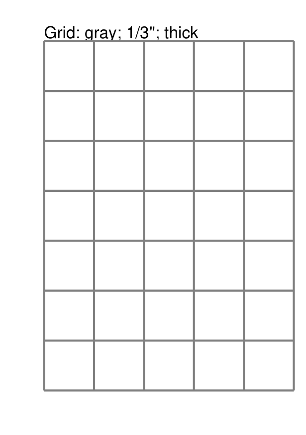

===== ======
|gr2| This example shows the shape constructed using the command with the
      following properties (and without a `Blueprint`_ background)::

          Grid(side=0.85, stroke=gray, stroke_width=1)

      It has the following properties based on the defaults:

      - *side* - the value of `0.85` cm equates to about 1/3 of an inch
      - *stroke_width* - set to `1` point; this much thicker line makes
        the grid clearly visible
      - *stroke* color of `gray` is a lighter color than default of black
===== ======

Example 3.
++++++++++

.. |gr3| image:: images/customised/grid_3x4.png
   :width: 330

===== ======
|gr3| This example shows the shape constructed using the command with the
      following properties::

          Grid(
              x=0.5, y=0.5,
              height=1.25, width=1,
              cols=3, rows=4,
              stroke=gray, stroke_width=1
          )

      It has the following properties based on the defaults:

      - *x* and *y* - each to to `0.5`cm; this offsets the lower-left corner
        of the grid from the page margin
      - *height* - value of `1.25` cm set for the row height
      - *width* - value of `1` cm set for the column width
      - *cols* and *rows* - the grid now has a fixed size  - 3 columns wide by
        4 rows high - rather than being automatically calculated to fill up
        the page
      - *stroke_width* - set to `1` point; this much thicker line makes
        the grid clearly visible
      - *stroke* color of `gray` is a lighter color than default of black

===== ======

Hexagons
~~~~~~~~
`^ <shapeIndex_>`_

Hexagons are often drawn in a "honeycomb" arrangement to form a grid - for games
this is often used to delineate the spaces in which playing pieces can be placed
and their movement regulated.

.. NOTE::

    Very detailed information about using hexagons in grids can be found in the
    section on `Hexagonal Grids <hexagonal_grids.rst>`_.

Example 1.
++++++++++

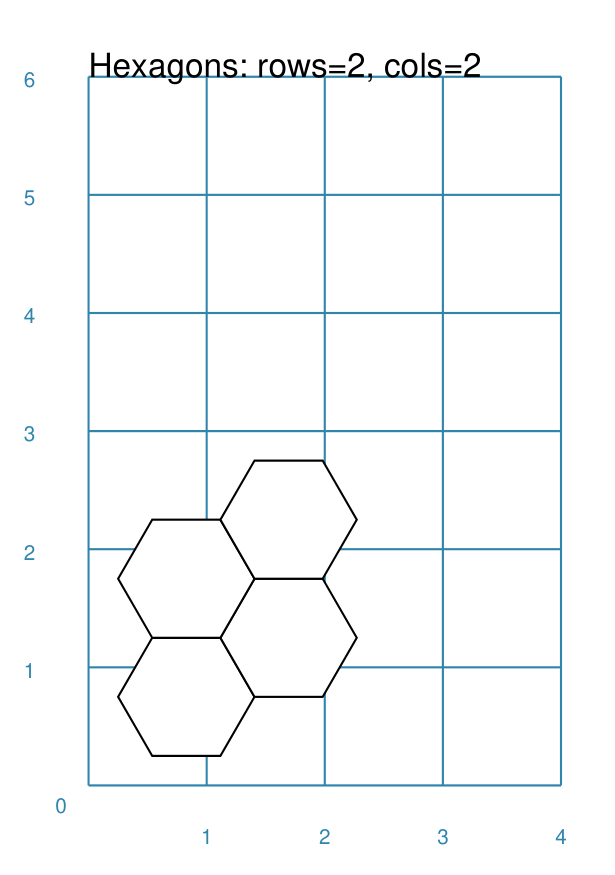

===== ======
|hex| This example shows the shape constructed using the command with two
      basic properties; the number of rows and columns in the grid::

          Hexagons(rows=2, cols=2)

      It has the following properties based on the defaults:

      - lower-left "corner" at x-position 1cm and at y-position 1cm
      - flat-to-flat hexagon height of 1cm
      - "flat" top hexagons
      - size of two rows by two columns ("cols")
      - the "odd" columns - which include the first one - are offset one-half
        of a hexagon "down"
===== ======

.. _commonIndex:

Shapes' Common Properties
-------------------------
`^ <pageIndex_>`_

The following are properties common to many shapes:

- `x and y`_
- `cx and cy`_
- `Fill and Stroke`_
- `Dots and Crosses`_
- `Transparency`_

x and y
~~~~~~~
`^ <commonIndex_>`_

Almost every shape will need to have its position set.  The commom way to do
this is by setting a value for *x* - the distance from the left margin of the
page (or card) to the left edge of the shape; and *y* - the distance from the
bottom margin of the page (or card) to the bottom edge of the shape.

cx and cy
~~~~~~~~~
`^ <commonIndex_>`_

Almost every shape will need to have its position set.  For shapes that allow it,
a commom way to do this is by setting a value for *cx* - the distance from the
left margin of the page (or card) to the centre position of the shape and
*y* - the distance from the bottom margin of the page (or card) to the centre
position of the shape.

Dots and Crosses
~~~~~~~~~~~~~~~~
`^ <commonIndex_>`_

For shapes that have a definable centre - such as a `Circle`_, a `Square`_
or a `Hexagon`_ - it is possible to place a dot, a cross - or both - at this
location.

.. |dnc| image:: images/customised/dots_crosses.png
   :width: 330

===== ======
|dnc| This example shows various shapes constructed using the following
      commands::

        Rhombus(cx=1, cy=5, side=2, dot=0.1, dot_stroke=red)
        Rhombus(
           cx=3, cy=5, side=2,
           cross=0.25, cross_stroke=red, cross_stroke_width=1)

        Polygon(cx=1, cy=3, sides=8, radius=1, dot=0.1, dot_stroke=orange)
        Polygon(
           cx=3, cy=3, sides=8, diameter=2,
           cross=0.25, cross_stroke=orange, cross_stroke_width=1)

        Stadium(cx=1, cy=1, side=1, dot=0.1, dot_stroke=blue)
        Stadium(
            cx=3, cy=1, side=1,
            cross=0.25, cross_stroke=blue, cross_stroke_width=1)

      The shapes have their properties set as follows:

      - *cx* and *cy* set the centre point of the shape
      - *dot* - sets the size of dot at the centre
      - *dot_stroke*  - sets the color of the dot (note that it is "filled in"
        with that same color)
      - *cross* - sets the height and width of the lines that cross at the centre
      - *cross_stroke*  - sets the color of the cross lines
      - *cross_stroke_width* - the thickness of the cross lines
===== ======

Fill and Stroke
~~~~~~~~~~~~~~~
`^ <commonIndex_>`_

Almost every single shape will have a *stroke*, corresponding to the color of
the line used to draw it, and a *stroke_width* which is the thickness in
points (72 points per inch).  All `Enclosed Shapes`_ will have a *fill*
corresponding to the color used for the area inside it.

===== ======
|fst| This example shows a shape constructed using the command::

          Rectangle(fill=yellow, stroke=red, stroke_width=6)

      The shape has the following properties:

      - *fill* color of yellow (this corresponds to hexadecimal value `#FFFF00`)
      - *stroke* color of red (this corresponds to hexadecimal value `#FF0000`)
      - *stroke_width* of 6 points (this corresponds to about 2mm)
===== ======

Transparency
~~~~~~~~~~~~
`^ <commonIndex_>`_

All `Enclosed Shapes`_, that have a *fill*, can have a transparency value set
that will affect the fill color used for the area inside them.

.. |trn| image:: images/defaults/transparency.png
   :width: 330

===== ======
|trn| This example shows a number of Rectangles constructed as follows::

        Rectangle(
            x=1, y=3, height=1, width=2,
            fill="#008000", stroke=silver, transparency=25, label="25%"
        )
        Rectangle(
            x=1, y=4, height=1, width=2,
            fill="#008000", stroke=silver, transparency=50, label="50%"
        )
        Rectangle(
            x=1, y=5, height=1, width=2, fill="#008000",
            stroke=silver, transparency=75, label="75%"
        )

        Rectangle(
            x=0, y=0, height=2, width=2, fill=yellow, stroke=yellow
        )
        Rectangle(
            x=1, y=1, height=2, width=2, fill=red, stroke=red, transparency=50
        )

      The first three Rectangles shapes have the following property set:

      - *transparency* - the lower the value, the more "see through" the color

      The last Rectangle, which also has a transparency value, is drawn
      partially over the Rectangle on the lower-left.  This means there is an
      apparent color change in the overlapping section, because some of the
      underlying color is partially visible.
===== ======
