===========
Core Shapes
===========

These descriptions of the available shapes assume you are familiar with
the concepts, terms and ideas for **pyprototypr** as presented in `Basic
Concepts <basic_concepts.rst>`_ - especially *units*, *properties* and
*defaults*. It will also help to at least browse through the section on
`Additional Concepts <additional_concepts.rst>`_.

.. |copy| unicode:: U+00A9 .. COPYRIGHT SIGN
   :trim:
.. |deg|  unicode:: U+00B0 .. DEGREE SIGN
   :ltrim:
.. |br| raw:: html

    

.. _table-of-contents:

Table of Contents
-----------------

-  `Shape Index`_
-  `Overview`_
-  `Commonalities`_
-  `Linear Shapes`_
-  `Enclosed Shapes`_
-  `Compound Shapes`_
-  `Shapes Common Properties`_

.. _shape-index:

Shape Index
-----------

-  `Arc`_
-  `Arrow`_
-  `Blueprint`_
-  `Bezier`_
-  `Circle`_
-  `Compass`_
-  `Chord`_
-  `Dot`_
-  `DotGrid`_
-  `Ellipse`_
-  `EquilateralTriangle`_
-  `Grid`_
-  `Hexagon`_
-  `Hexagons`_
-  `Image`_
-  `Line`_
-  `Lines`_
-  `Polygon`_
-  `Polyline`_
-  `Polyshape`_
-  `Rectangle`_
-  `Rectangles`_
-  `Rhombus`_
-  `Sector`_
-  `Square`_
-  `Stadium`_
-  `Star`_
-  `Starfield`_
-  `Text`_
-  `Trapezoid`_

Overview
---------
`↑ <table-of-contents_>`_

Where possible, the basic examples first show how a shape would appear
on a page when **only** the default properties are used. This means that,
for most cases, that *lines* are drawn in **black** and shapes that have an
enclosed area are *filled* with a **white** color. The default length, width
or height in most cases is **1cm**. The only change from default, for these
examples, has been to make the default line width (*stroke_width*) thicker
for easier viewing of the small PNG images.

Most shapes can be styled by setting one or more of the
`Shapes Common Properties`_. Other shapes have additional properties available
that allow even further styling.

To make it easier to see where and how a shape has been drawn, most of these
examples have been created with a background grid (which **pyprototypr**
refers to as a `Blueprint`_ shape) added to the page  - a small A8
"business card" size - for cross-reference. In addition, the default line width
(aka *stroke_width*) has been made thicker for easier viewing of the small
PNG images that were generated from the original PDF output.

   The graphics for these examples were generated from either of two of the
   scripts saved in the ``examples`` directory - look at the
   `default_shapes <../examples/simple/default_shapes.py>`_ and
   `customised_shapes <../examples/simple/customised_shapes.py>`_
   scripts.  The program first creates a PDF, then generates a PNG file for
   each page in the PDF.

Commonalities
--------------
`↑ <table-of-contents_>`_

There are some properties that can be set for almost all of the shapes;
examples of these are presented in the section on `Shapes Common Properties`_
at the end, rather than being described in detail for every single shape.

    **HINT** Bear in mind that if a property, that it does not support, is
    provided for a shape then that property and its value will simply be ignored.

.. _linearIndex:

Linear Shapes
--------------
`↑ <shape-index_>`_

Arc
~~~
`↑ <shape-index_>`_

An arc is curved line.

Example 1.
++++++++++

.. |arc| image:: images/defaults/arc.png
   :width: 330

===== ======
|arc| This example shows the shape constructed using the command with only
      defaults::

          Arc()

      It has the following properties based on the defaults:

      - origin is at x-position ``1`` cm and at y-position ``1`` cm
===== ======

Example 2.
++++++++++

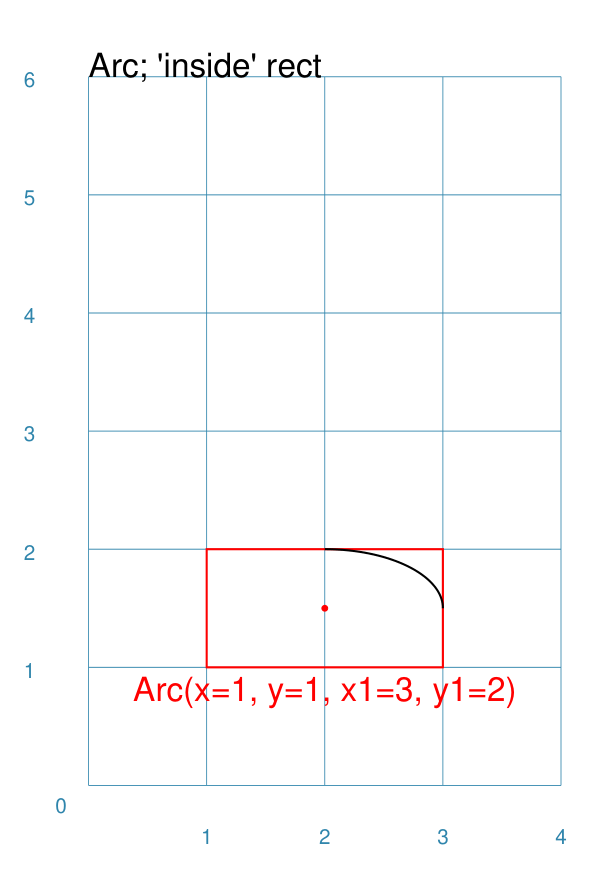

===== ======
|ac2| This example shows the shape constructed using the command with these
      properties::

          Arc(x=1, y=1, x1=3, y1=2)

      To help with visualisation, the Arc is surrounded by a red Rectangle::

        Rectangle(
            x=1, y=1, height=1, width=2, dot=0.02,
            stroke=red, fill=None,
            title="Arc(x=1, y=1, x1=3, y1=2)")
        )

      The Arc has the following properties:

      - origin is at x-position ``1`` cm and at y-position ``1`` cm
      - the secondary x-position and y-position are at ``3`` cm and ``2`` cm
===== ======

Bezier
~~~~~~
`↑ <shape-index_>`_

A Bezier is a curve that has inflection points, allowing it to "bend".

Example 1.
++++++++++

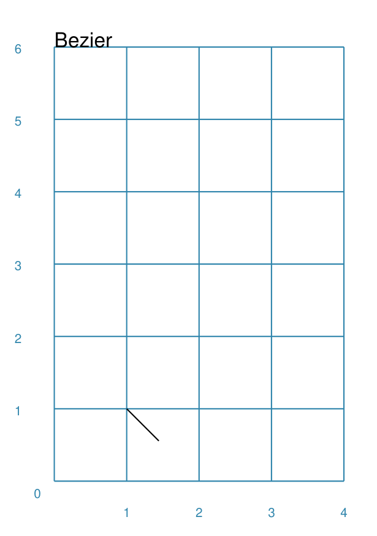

===== ======
|bez| This example shows the shape constructed using the command with only
      defaults::

          Bezier()

      It has the following properties based on the defaults:

      - starts at x-position ``1`` cm and at y-position ``1`` cm
===== ======

Example 2.
++++++++++

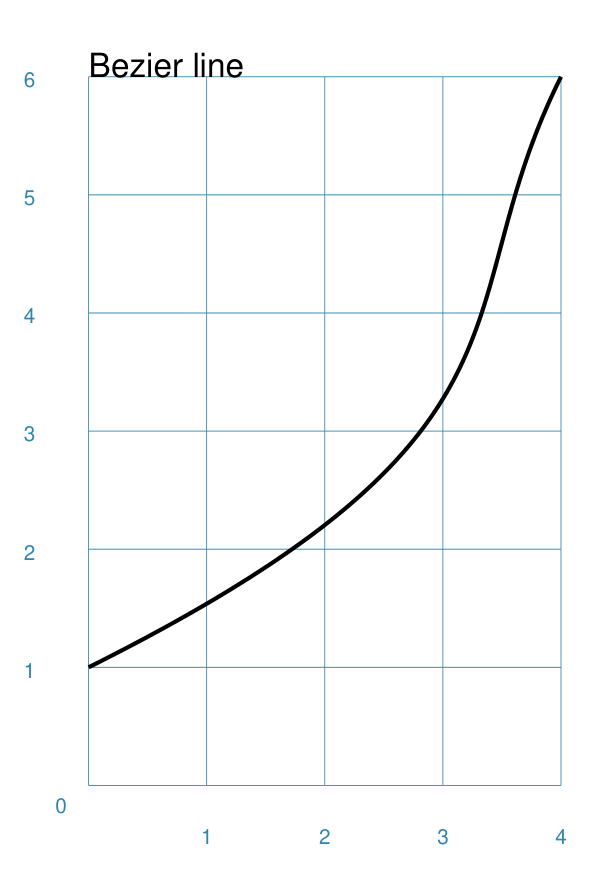

===== ======
|bz1| This example shows the shape constructed using the command with the
      following properties::

          Bezier(x=0, y=1, x1=4, y1=3, x2=3, y2=4, x3=4, y3=6, stroke_width=1)

      It has the following properties based on the defaults:

      - starts at x-position ``0`` cm and at y-position ``1`` cm
      - has the inflection points set by *x1* and *y1* and then *x2* and *y2*
      - ends at position *x3* of ``4`` cm and at *y3* of ``6`` cm
===== ======

Chord
~~~~~
`↑ <shape-index_>`_

A chord is a straight line joining two points on a circle's diameter.

Example 1.
++++++++++

.. |chd| image:: images/defaults/chord.png
   :width: 330

===== ======
|chd| If the shape constructed using only default properties, there will be
      nothing to see::

          Chord()

      This example then shows the shape constructed using the command with these
      properties::

          Chord(shape=Circle(), angle=135, angle1=45)

      It has the following properties based on these values:

      - the circle that helps defines the start and end of the chord line is
        located with its "corner" at x-position ``1`` cm and at y-position ``1`` cm
      - the start of chord is at the intersection of the radius of the circle
        at 135 |deg| with the circle's circumference
      - the end of chord is at the intersection of the radius of the circle
        at 45 |deg| with the circle's circumference

===== ======

Dot
~~~
`↑ <shape-index_>`_

A dot is a small, filled `Circle`_.

Example 1.
++++++++++

.. |dot| image:: images/defaults/dot.png
   :width: 330

===== ======
|dot| This example shows the shape constructed using the command with only
      defaults::

          Dot()

      It has the following properties based on the defaults:

      - centre at x-position ``1`` cm and at y-position ``1`` cm
      - diameter of ``3`` points; there are 72 points in an inch, so this is 1/24th
        of an inch, or approximately 1mm (``0.1`` cm), in size
      - fill color for a Dot is the same as the stroke - default is black
===== ======

Line
~~~~
`↑ <shape-index_>`_

Example 1.
++++++++++

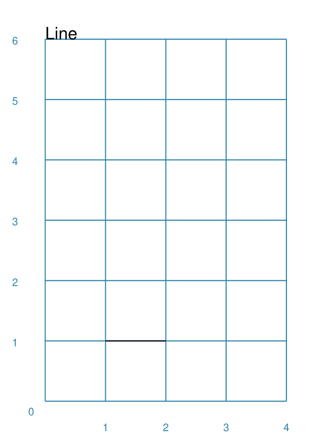

===== ======
|lne| This example shows the shape constructed using the command with only
      defaults::

          Line()

      It has the following properties based on the defaults:

      - starts at x-position ``1`` cm and at y-position ``1`` cm
      - length of ``1`` cm
      - heading/default direction is 0 |deg| (anti-clockwise from 0 |deg| "east")
===== ======

Example 2.
++++++++++

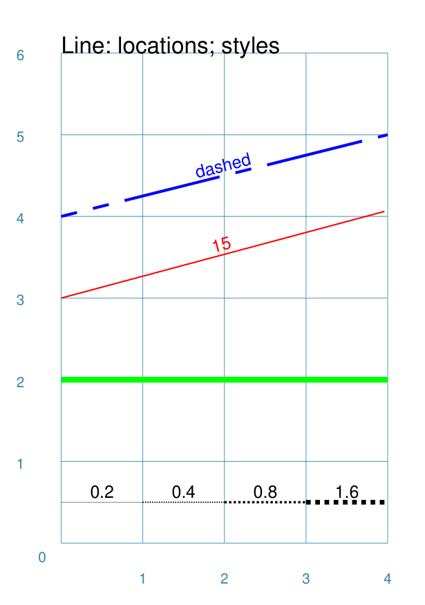

===== ======
|ln1| This example shows Lines constructed using commands with the
      following properties::

        Line(x=0, y=4, x1=4, y1=5, stroke=blue, stroke_width=1,
             dashed=[0.2, 0.2, 0.2, 0.2, 1.0, 0.0], label="dashed", font_size=6)

        Line(x=0, y=3, length=4.1, angle=15, stroke=red, label="15", font_size=6)

        Line(x=0, y=2, length=4, stroke=lime, stroke_width=2)

        Line(x=0, y=0.5, stroke_width=0.2, dotted=True, label="0.2", font_size=6)
        Line(x=1, y=0.5, stroke_width=0.4, dotted=True, label="0.4", font_size=6)
        Line(x=2, y=0.5, stroke_width=0.8, dotted=True, label="0.8", font_size=6)
        Line(x=3, y=0.5, stroke_width=1.6, dotted=True, label="1.6", font_size=6)

      The various black lines have:

      - *x* and *y* set as their starting point
      - a default length of ``1`` cm

      The thin red line has:

      - *x* and *y* set as a starting point
      - *x1* and *y1* set as an ending point

      and the line length is calculated based on these points.

      The thick green line and the thin red line both have:

      - *x* and *y* set as their starting point
      - *length* to set the specific size of the line

      The thin red line has:

      - *angle* - of 15 |deg| (from the baseline, anti-clockwise) to guide
        the direction in which the line is drawn; if not given (as in the case
        of the thick green line) this will be 0 |deg|

      The medium blue line has a style set so that it is not a normal solid
      line:

      - *dashed* - a list, shown by the square brackets from `[` to `]`,
        which provides a number of "on"/"off" pairs; the line is drawn for a
        distance matching an "on" value followed by a gap matching an "off"
        value; when the end of the list is reached it starts again until the
        full length of the line is drawn

      The various black lines have these properties:

      - *stroke_width* - set as value in points (and labelled accordingly)
      - *dotted* - has a value of ``True``, which then generates a series of
        small lines, followed by gaps, of sizes equal to the line's
        *stroke_width*
===== ======

Polyline
~~~~~~~~
`↑ <shape-index_>`_

A polyline is a series of lines joining points.

Example 1.
++++++++++

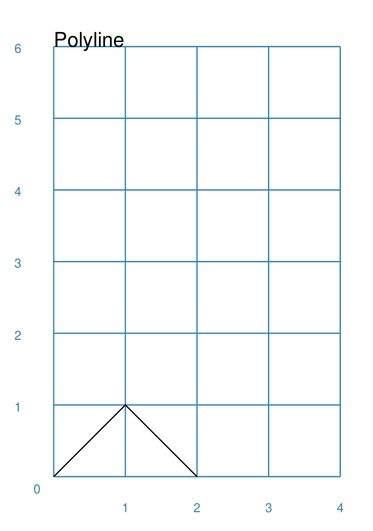

===== ======
|ply| The shape cannot be constructed using only default properties::

          Polyline()

      Nothing will be visible; instead you will see a warning::

        WARNING:: There are no points to draw the Polyline

      This example then shows the shape constructed using the command with these
      properties::

          Polyline(points=[(0, 0), (1, 1), (2, 0)])

      It has the following properties based on these values:

      - starts at x-position ``0`` cm and at y-position ``0`` cm
      - second point is at x-position ``1`` cm and at y-position ``1`` cm
      - third point is at x-position ``2`` cm and at y-position ``0`` cm

      The *points* for a Polyline are in a list, as shown by the square brackets
      from `[` to `]`, and then each *x* and *y* are provided as a pair of
      values in round brackets.  The *x* and *y* are separated by a comma.
      Each pair of values in the list is also separated by a comma.
===== ======

Text
~~~~
`↑ <shape-index_>`_

It may seem strange to view text as a "shape"; but from a drawing point of
view, its really just a series of complex lines drawn in a particular pattern!
Thus text has size, color and position in common with many other shapes, as
well as its own special properties.

Example 1.
++++++++++

.. |txt| image:: images/defaults/text.png
   :width: 330

===== ======
|txt| This example shows the shape constructed using the command with only
      defaults; except for the **text** property - this is changed otherwise
      there would not be any text to see!::

          Text(text="Hello World")

      It otherwise has the following properties based on the defaults:

      - centred at x-position ``1`` cm and at y-position ``1`` cm
      - default font size is ``12`` points
      - default font face is ``Arial``
===== ======

Enclosed Shapes
---------------
`↑ <table-of-contents_>`_

These shapes are created by enclosing an area; the most basic being a simple rectangle.
They effectively have two dimensions: *height* and *width*.

The difference between enclosed and linear shapes is that the area enclosed by
the shape can be filled with a color; the default fill color is *white*.
There is an overview on how color is used in the
`Basic Concepts section <basic_concepts.rst>`_

    *Reminder:* **pyprototypr** comes with a predefined set of named colors, shown in the
    `colors <../examples/colorset.pdf>`_ PDF file.

Arrow
~~~~~~
`↑ <shape-index_>`_

An Arrow consists of two main parts; the tail (or body) and the head.  In terms
of **pyprototypr** conventions, the tail is the part that takes on the common
properties of *height* and *width*; while the dimensions for the head, if not
provided, are calculated from those.

Example 1.
++++++++++

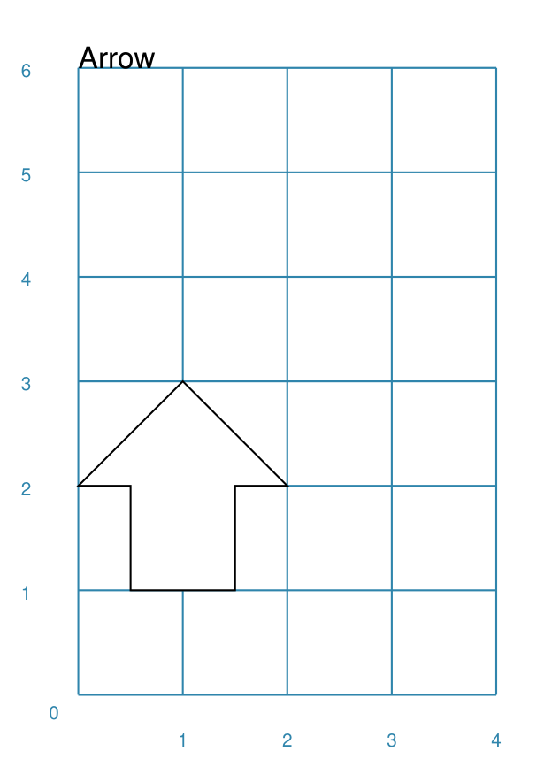

===== ======
|ar0| This example shows the shape constructed using the command with only
      defaults::

          Arrow()

      It has the following properties based on the defaults:

      - centre-bottom point at x-position ``1`` cm and at y-position ``1`` cm
      - *height* of the tail portion of ``1`` cm
      - *head_height* of the head portion of ``1`` cm (based on the *height*)
      - *head_width* of the head portion of ``2`` cm; the maximum distance
        between the two arrowhead "wingtips" - for which the default value is
        calculated as equal to twice the *width*
===== ======

Example 2.
++++++++++

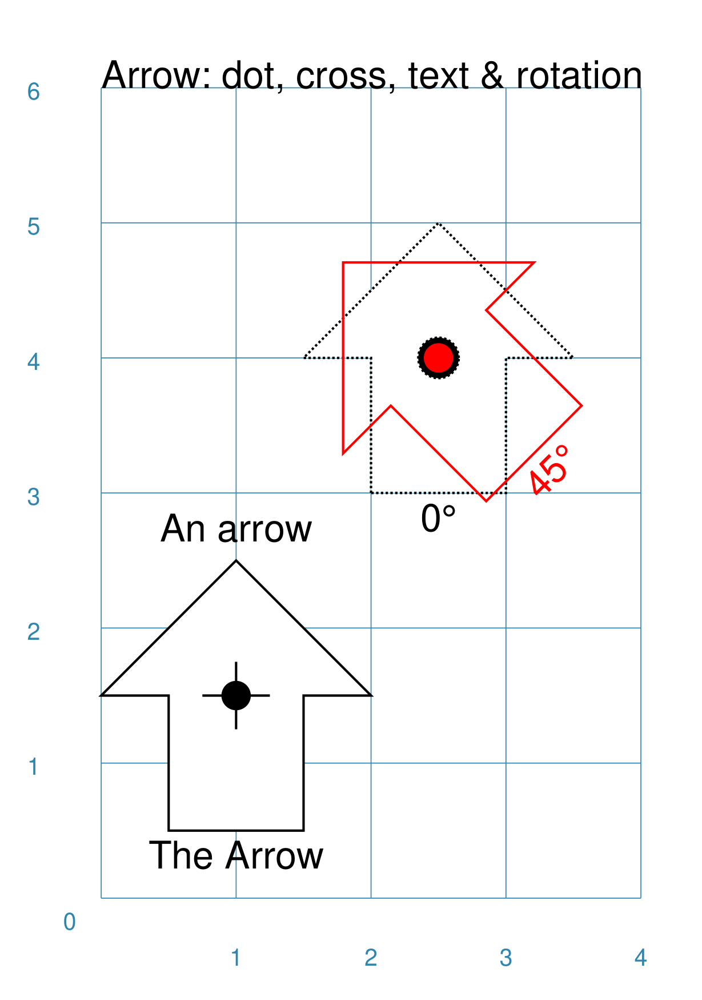

===== ======
|ar1| This example shows the shape constructed using the commands as follows:

      .. code:: python

        Arrow(
            x=1, y=0.5,
            title="The Arrow", heading="An arrow",
            dot=0.1, cross=0.5)

        Arrow(
            x=2.5, y=3, title="0\u00B0", dot=0.15, dotted=True)
        Arrow(
            x=2.5, y=3, title="45\u00B0", dot=0.1,
            fill=None, stroke=red, dot_stroke=red, rotation=45)

      The shapes all set the following properties:

      - centre-bottom point at *x* and *y*
      - *title* appears below the shape
      - *dot* - small, filled circle; this also marks the **centre** of the
        Arrow

      The lower-left Arrow also sets the following properties:

      - *heading* appears above the shape
      - *cross* small pair of lines superimposed on the dot (also at the
        Arrow's centre)

      The two arrows in the top-right are superimposed; the red outline Arrow
      shares the same centre as the black dotted Arrow below it.  The red
      arrow is rotated 45 |deg| to the left about the centre.

      .. NOTE::

         The degrees sign is a Unicode character i.e. a "\\u" followed by four
         numbers and/or letters. For access to full Unicode lists as well as
         the option to search for characters by name, see:
         https://www.compart.com/en/unicode/plane/U+0000

===== ======

Example 3.
++++++++++

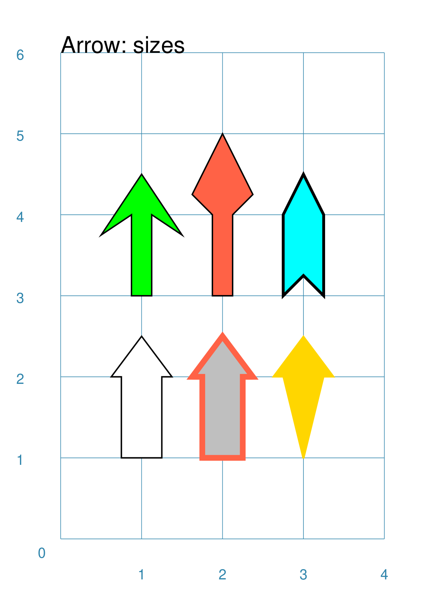

===== ======
|ar2| This example shows the shape constructed using the commands as follows:

      .. code:: python

        Arrow(
            x=1, y=3, height=1, width=0.25, head_height=0.5, head_width=1,
            points_offset=-0.25,
            fill=lime)
        Arrow(
            x=2, y=3, height=1, width=0.25, head_height=1, head_width=0.75,
            points_offset=0.25,
            fill=tomato)
        Arrow(
            x=3, y=3, height=1, width=0.5, head_height=0.5, head_width=0.5,
            tail_notch=0.25,
            fill=aqua, stroke=black, stroke_width=1)
        Arrow(
            x=1, y=1, height=1, width=0.5, head_height=0.5, head_width=0.75)
        Arrow(
            x=2, y=1, height=1, width=0.5, head_height=0.5, head_width=0.75,
            tail_width=0.75, transparency=50,
            fill=silver, stroke=tomato, stroke_width=2)
        Arrow(
            x=3, y=1, height=1, width=0.5, head_height=0.5, head_width=0.75,
            tail_width=0.01,
            fill_stroke=gold)

      The shapes all set the following properties:

      - centre-bottom point at *x* and *y*
      - *height* of the tail portion (``1`` cm for all)
      - *width* of the tail portion
      - *head_height* sets height of the head portion
      - *head_width* sets width of the head portion (maximum dsistance between
        the outer arrowhead "wingtips")

      The **silver** arrow has these properties:

      - *tail_width* of ``0.75`` cm; this means the base of the arrow is wider
        than the body (the width at the top of the tail section)
      - *transparency* - set to ``50`` %; the grid is partly visible through it

      The **gold** arrow has these properties:

      - *tail_width* of ``0.01`` cm; this means the base of the arrow is much
        narrow than the body (the width at the top of the tail section)

      The **green** (``lime`` fill) arrow has these properties:

      - *points_offset* of ``-0.25`` cm; this means that the two "wingtips" of
        the arrowhead are not in line with the top of the tail portion but are
        moved backwards towards the tail

      The **red** (``tomato`` fill)  arrow has these properties:

      - *points_offset* of ``0.25`` cm; this means that the two "wingtips" of
        the arrowhead are not in line with the top of the tail portion but
        are moved forwards, away from the tail; and the head has been been
        made narrower and longer

      The **blue** (``aqua`` fill) arrow has these properties:

      - *tail_notch* of ``0.25`` cm; this means the base has a small inwards
        facing triangle "cut" out of it

      The blue arrow also has matching *width* and *head_width* (of ``0.5`` cm)
      which means that there are no visible arrowhead "wingtips".

===== ======

Circle
~~~~~~
`↑ <shape-index_>`_

.. NOTE::

   There is more detail about the properties that can be defined for a
   Circle in the `customised Circles <customised_shapes.rst#circle>`_ section.

Example 1.
++++++++++

.. |ccl| image:: images/defaults/circle.png
   :width: 330

===== ======
|ccl| This example shows the shape constructed using the command with only
      defaults::

          Circle()

      It has the following properties based on the defaults:

      - lower-left "corner" at x-position ``1`` cm and at y-position ``1`` cm
      - diameter of ``1`` cm
===== ======

Compass
~~~~~~~
`↑ <shape-index_>`_

A Compass is often thought of a specific device used for navigation. Here,
its abstracted somewhat to indicate directional lines - specified by traditional
compass directions - drawn within an enclosing shape; by default, circle.

Example 1.
++++++++++

.. |cmp| image:: images/defaults/compass.png
   :width: 330

===== ======
|cmp| This example shows the shape constructed using the command with only
      defaults::

          Compass()

      It has the following properties based on the defaults:

      - lower-left "corner" at x-position ``1`` cm and at y-position ``1`` cm
      - diameter of ``1`` cm
      - lines in all 8 directions, extending from the centre outwards; these
        represent the primary - North, South, East and West - and secondary -
        North-East, South-East, North-West and South-West directions.
===== ======

Example 2.
++++++++++

.. |cm2| image:: images/customised/compass.png
   :width: 330

===== ======
|cm2| This example shows the shape constructed using the command with different
      properties.  The top left::

          Compass(cx=1, cy=5, perimeter='circle', directions="ne nw s")

      This Compass shape has the following properties:

      - centred at x-position ``1`` cm and at y-position ``5`` cm
      - *directions* define where the radial lines extend; in this case to the
        North-East, North-West and South

      The centre::

          Compass(
              cx=2, cy=3, perimeter='rectangle', height=2, width=3,
              radii_stroke=red)

      This Compass shape has the following properties:

      - centred at x-position ``2`` cm and at y-position ``3`` cm
      - *perimeter* defines the shape of the ``rectangle`` that is used to define
        where the radial lines of the compass extend; in this case it is a
        rectangle with a height of ``2`` cm and width of ``3`` cm.
      - radial lines extend, by default, in all 8 directions - to the centre of
        the ``rectangle``'s bounding lines and to its corners
      - *radii_stroke* defines the line colors used

      The lower right::

          Compass(cx=3, cy=1, perimeter='hexagon', radii_stroke_width=2)

      This Compass shape has the following properties:

      - centred at x-position ``3`` cm and at y-position ``1`` cm
      - *perimeter* - defines the shape of ``hexagon`` that is used to defined
        where the radial lines of the compass extend; in this case its in a
        hexagon with a default diameter of ``1`` cm, so lines extend in all
        ``6`` directions i.e. there is no North or South
      - *radii_stroke_width* - set to ``2`` points; a much thicker line
===== ======

Ellipse
~~~~~~~
`↑ <shape-index_>`_

Example 1.
++++++++++

.. |ell| image:: images/defaults/ellipse.png
   :width: 330

===== ======
|ell| This example shows the shape constructed using the command with only
      defaults::

          Ellipse()

      It has the following properties based on the defaults:

      - lower-left "corner" at x-position ``1`` cm and at y-position ``1`` cm
      - height of ``1`` cm
      - width of ``1`` cm

      Because the *height* and *width* default to the same value, it appears
      as a `Circle`_.

===== ======

Example 2.
++++++++++

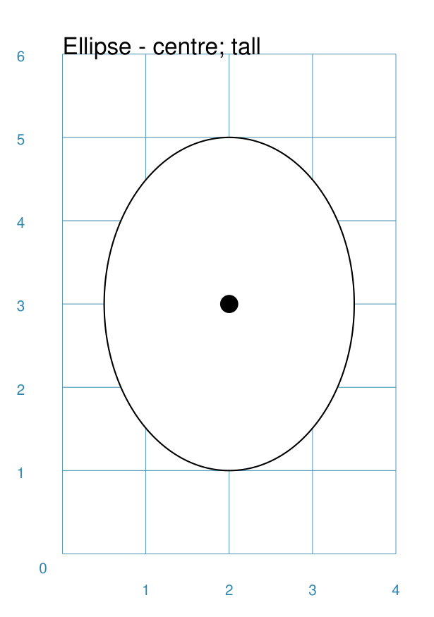

===== ======
|el1| This example shows the shape constructed using the command with these
      properties::

          Ellipse(cx=2, cy=3, width=3, height=4, dot=0.1)

      It has the following properties set for it:

      - centre at x-position ``2`` cm and at y-position ``3`` cm
      - *height* of ``4`` cm
      - *width* of ``3`` cm

      Because the *height* is greater than the *width* it has more an egg-shape.
===== ======

EquilateralTriangle
~~~~~~~~~~~~~~~~~~~
`↑ <shape-index_>`_

Example 1.
++++++++++

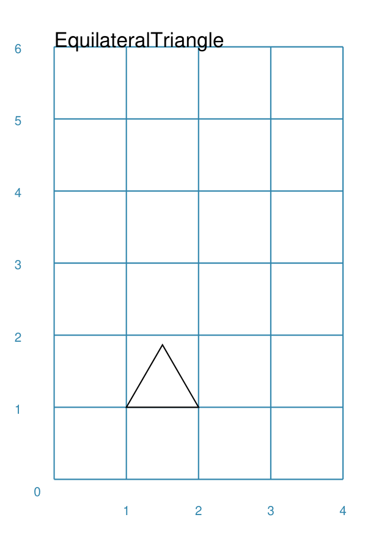

===== ======
|eqi| This example shows the shape constructed using the command with only
      defaults::

          EquilateralTriangle()

      It has the following properties based on the defaults:

      - lower-left "corner" at x-position ``1`` cm and at y-position ``1`` cm
      - side of ``1`` cm; all sides are equal
===== ======

Example 2.
++++++++++

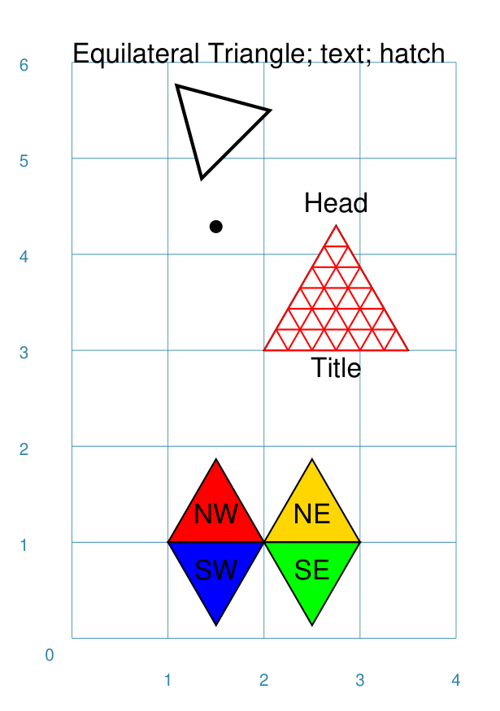

===== ======
|eq2| This example shows the shape constructed using the command with the
      various properties.  In the lower section::

        EquilateralTriangle(
          x=2, y=1, flip="north", hand="east", label="NE", fill=gold)
        EquilateralTriangle(
          x=2, y=1, flip="south", hand="east", label="SE", fill=lime)
        EquilateralTriangle(
          x=2, y=1, flip="north", hand="west", label="NW", fill=red)
        EquilateralTriangle(
          x=2, y=1, flip="south", hand="west", label="SW", fill=blue)

      These have the following properties:

      - starting position at x-position ``2`` cm and at y-position ``1`` cm
      - default side of ``1`` cm; all sides are equal
      - *flip* - this can be ``north`` or ``south`` and will cause the triangle
        to either point up or down relative to the starting position
      - *hand*  - this can be ``west`` or ``east`` and will cause the triangle
        to be drawn to the left or the right relative to the starting position

      The middle section shows::

        EquilateralTriangle(
            x=2, y=3, side=1.5,
            hatch=5, hatch_stroke=red,
            title='Title', heading='Head'
        )

      - starting position at *x*-position ``2`` cm and at *y*-position ``3`` cm
      - *side* of ``1.5`` cm; all sides are equal
      - *hatch* of ``5`` - this means there will be 5 equally spaced lines drawn
        between opposing sides which run parallel to the third side
      - *hatch_stroke* - customise the hatch lines to show them as ``red``

      The top section shows::

        EquilateralTriangle(
            x=1, y=4, stroke_width=1, rotation=45, dot=.05
        )

      - starting position at x-position ``1`` cm and at y-position ``4`` cm
      - *dot* - in the centre
      - *rotation* - of 45 |deg| (from the baseline, anti-clockwise) about
        the centre

===== ======

Hexagon
~~~~~~~
`↑ <shape-index_>`_

.. NOTE::

   There is more detail about the properties that can be defined for a
   Hexagon in the `customised shapes' Hexagon <customised_shapes.rst#hexagon>`_ section.

Example 1.
++++++++++

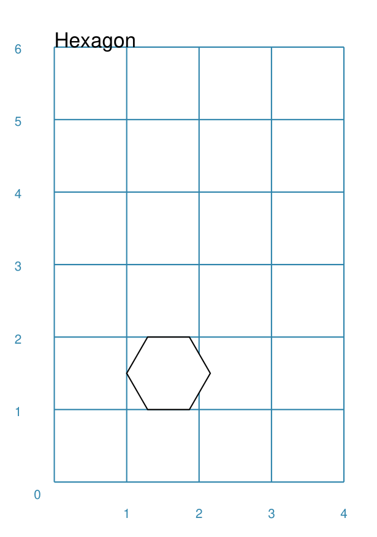

===== ======
|hx1| This example shows the shape constructed using the command with only
      defaults::

          Hexagon()

      It has the following properties based on the defaults:

      - lower-left "corner" at x-position ``1`` cm and at y-position ``1`` cm
      - flat-to-flat height of ``1`` cm
      - "flat" top
===== ======

Example 2.
++++++++++

.. |hx2| image:: images/defaults/hexagon-pointy.png
   :width: 330

===== ======
|hx2| This example shows the shape constructed using the command with only
      one change to the defaults::

          Hexagon(orientation="pointy")

      It has the following properties based on the defaults:

      - lower-left "corner" at x-position ``1`` cm and at y-position ``1`` cm
      - flat-to-flat height of ``1`` cm
      - a ``pointy`` top set via the *orientation*
===== ======

Polygon
~~~~~~~
`↑ <shape-index_>`_

A polygon is a shape constructed of any number of sides of equal length.
For example, a hexagon is a polygon with 6 sides and an octagon is a polygon
with 8 sides.

    **HINT** Unlike the `Hexagon`_ shape, a Polygon can be rotated!

Example 1.
++++++++++

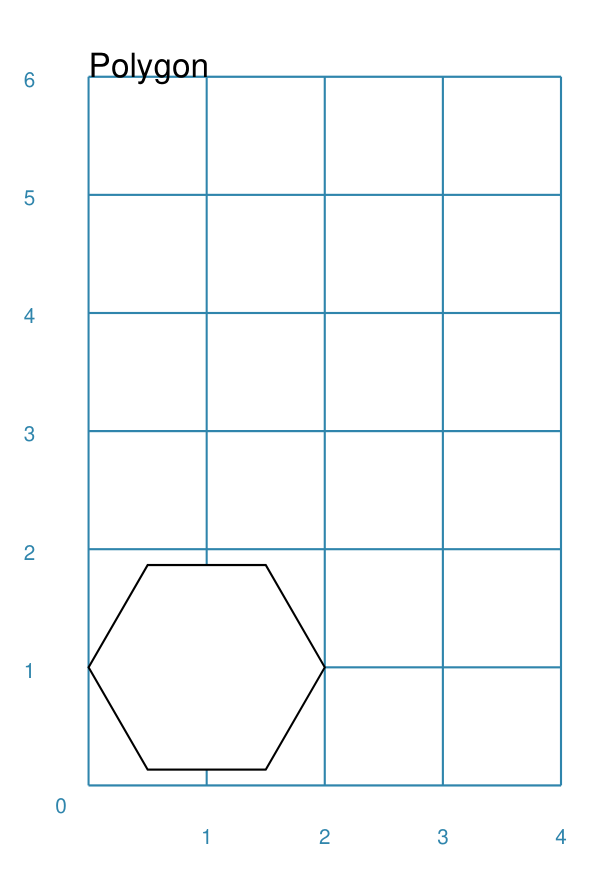

===== ======
|pol| This example shows the shape constructed using the command with only
      defaults::

          Polygon()

      It has the following properties based on the defaults:

      - centre at x-position ``1`` cm and at y-position ``1`` cm
      - ``6`` sides
      - a *side* length of  ``1`` cm
===== ======

Example 2.
++++++++++

.. |pl1| image:: images/customised/polygon_sizes.png
   :width: 330

===== ======
|pl1| This example shows three shapes constructed using the command with the
      following properties::

        Polygon(cx=1, cy=5, sides=7, radius=1, label="Seven")
        Polygon(cx=2, cy=3, sides=6, radius=1, label="Six")
        Polygon(cx=3, cy=1, sides=5, radius=1, label="Five")

      It can be seen that each shape is constructed as follows:

      - *centre* - using *cx* and *cy* values
      - *radius* - ``1`` cm in each case
      - *sides* - varying from ``7`` down to ``5``

      Even-sided polygons have a "flat" top, whereas odd-sided ones are
      asymmetrical; this can be adjusted through `rotation`_.
===== ======

Example 3.
++++++++++

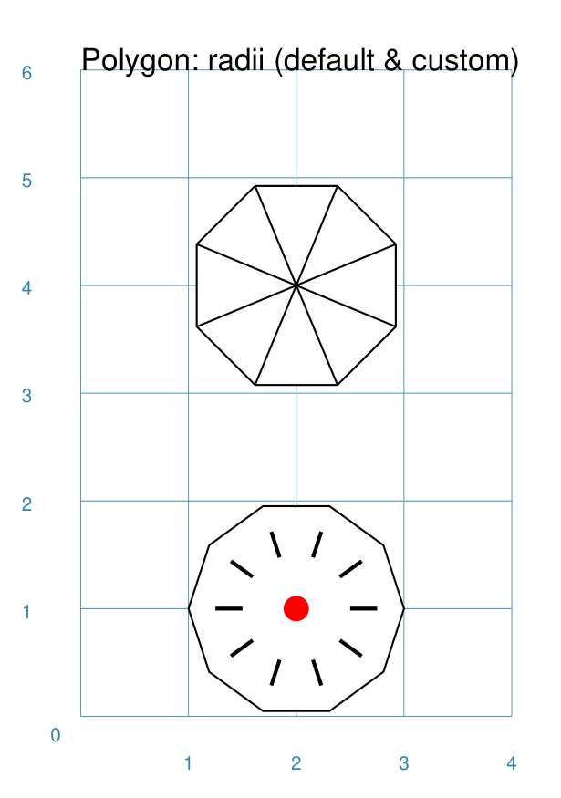

===== ======
|pl2| This example shows the shape constructed using the command with the
      additional properties.

      The top example::

          Polygon(cx=2, cy=4, sides=8, radius=1, radii=True)

      It has the following properties:

      - *centre* at x-position ``2`` cm and at y-position ``4`` cm, with a *radius*
        size of ``1`` cm
      - *sides* - ``8`` sides
      - *radii* - set to ``True`` to force lines to be drawn from each of the
        vertices of the polygon to its centre

      The lower example::

          Polygon(
              cx=2, cy=1, sides=10, radius=1,
              radii=True,
              radii_offset=0.75, radii_length=0.25, radii_stroke_width=1,
              dot=0.1, dot_stroke=red
          )

      It has the following properties:

      - *centre* at x-position ``2`` cm and at y-position ``1`` cm, with a *radius*
        size of ``1`` cm
      - *sides* - ``10``
      - *radii* - set to ``True`` to force lines to be drawn from the centre of
        the polygon to each of its vertices; the radii properties are then set:

        - *radii_offset* - set to ``0.5`` cm; the distance away from the centre
          that the radii will start to be drawn
        - *radii_length*  - set to ``0.75`` cm; the length is shorter than that of
          the complete distance from vertex to centre, so the line goes in the
          same direction but never touches the vertex or the centre
        - *radii_stroke_width* - set to ``1`` point; a slightly thicker line
===== ======

Example 4.
++++++++++

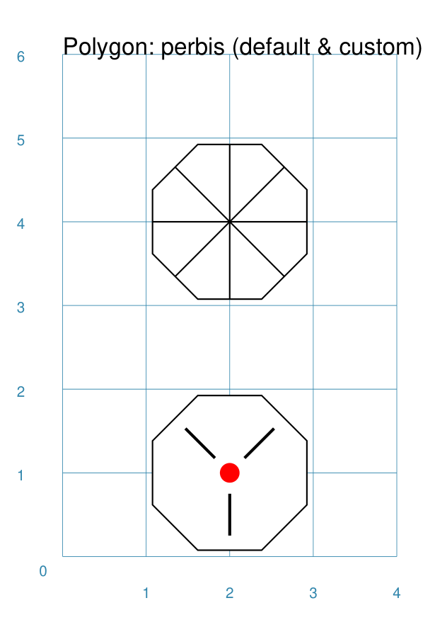

===== ======
|pl3| This example shows the shape constructed using the command with the
      additional properties.

      The top example::

          Polygon(cx=2, cy=4, sides=8, radius=1, perbis=True)

      It has the following properties:

      - *centre* at x-position ``2`` cm and at y-position ``4`` cm, with a *radius*
        size of ``1`` cm
      - *sides* - ``8`` sides (an octagon)
      - *perbis* - set to ``True`` to force lines to be drawn from each of the
        centres of the sides of the polygon to its centre

      The lower example::

          Polygon(
            cx=2, cy=1, sides=8, radius=1,
            perbis=True, perbis_directions="2,4,7",
            perbis_offset=0.25, perbis_length=0.5, perbis_stroke_width=1,
            dot=0.1, dot_stroke=red)

      It has the following properties:

      - *centre* at x-position ``2`` cm and at y-position ``1`` cm, with a *radius*
        size of ``1`` cm
      - *sides* - ``8`` (an octagon)
      - *perbis* - set to ``True`` to force lines to be drawn from each of the
        centres of the sides of the polygon to its centre; the line properties
        are then set:

        - *perbis_offset* - set to ``0.25`` cm; the distance away from the centre
          that the lines will start to be drawn
        - *perbis_length*  - set to ``0.5`` cm; the length is shorter than that of
          the complete distance from centre point to edge, so the line goes in
          the same direction but never touches the vertex or the edge
        - *perbis_stroke_width* - set to ``1`` point; a slightly thicker line
        - *perbis_directions* - the edges of the polygon are numbered from the
          east-most facing edge as 1, and then in an anti-clockwise direction.
===== ======

Example 5.
++++++++++

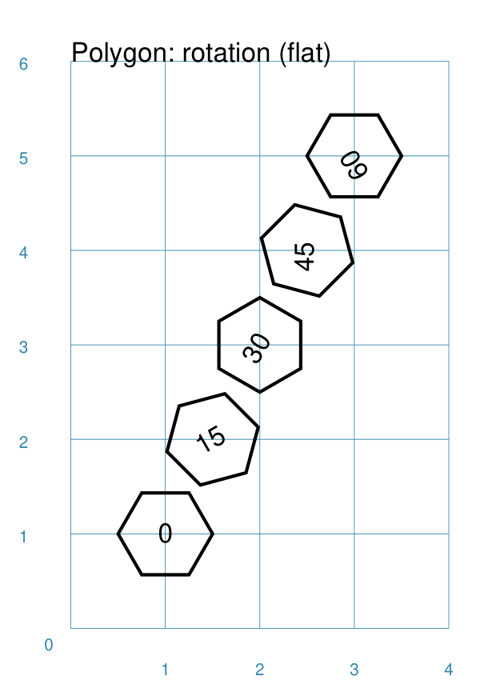

===== ======
|pl4| This example shows five shapes constructed using the command with
      additional properties::

        Polygon(common=poly6, y=1, x=1.0, label="0")
        Polygon(common=poly6, y=2, x=1.5, rotation=15, label="15")
        Polygon(common=poly6, y=3, x=2.0, rotation=30, label="30")
        Polygon(common=poly6, y=4, x=2.5, rotation=45, label="45")
        Polygon(common=poly6, y=5, x=3.0, rotation=60, label="60")

      The examples have the following properties:

      - *x* and *y* - set the lower-left location
      - *radius* - ``1`` cm in each case
      - *sides* - the default of ``6`` in each case (a `hexagon`_ shape)
      - *rotation* - varies from 0 |deg| to 60 |deg| (anti-clockwise from the
        horizontal); the fact that the angle of the sides of the polygon is
        30 |deg| creates a type of regularity, so that the polygon with the
        rotation of 60 |deg| appears to match the first polygon - but the slope
        of the label inside that polygon clearly shows that rotation has
        happened.
===== ======

Polyshape
~~~~~~~~~
`↑ <shape-index_>`_

A Polyshape is an irregular `polygon`_, constructed using a series of points.

Example 1.
++++++++++

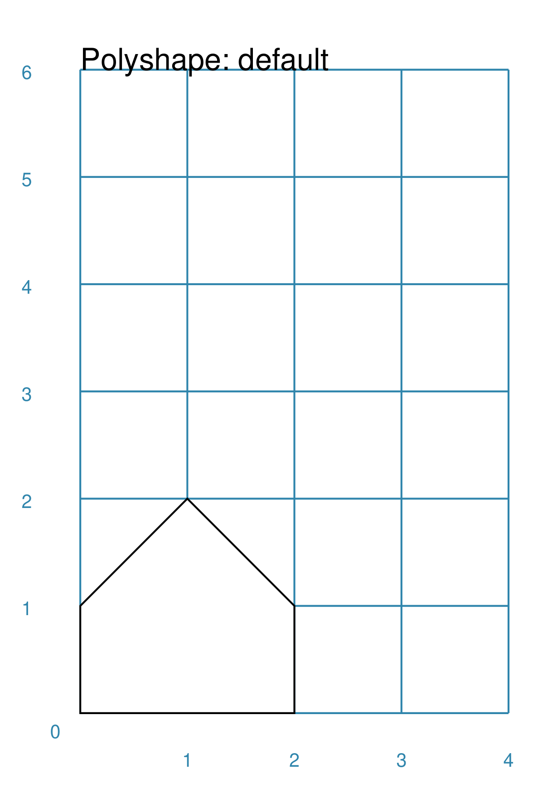

===== ======
|shp| If the shape is constructed using the command with only defaults::

        Polyshape()

      Then nothing will be visible; instead you will see a warning::

        WARNING:: There are no points to draw the Polyshape

      Like `polyline`_, the Polyshape requires a list of points to be constructed.
      This example shows how to do this using the command with these properties::

        Polyshape(points=[(0, 0), (0, 1), (1,  2), (2, 1), (2, 0)])

      It has the following properties:

      - starts at x-position ``0`` cm and at y-position ``0`` cm
      - second point is at x-position ``0`` cm and at y-position ``1`` cm
      - third point is at x-position ``1`` cm and at y-position ``2`` cm
      - etc.

      The *points* for a Polyshape, which represent its vertices are given in a
      list, as shown by the square brackets from `[` to `]`, and then each *x*
      and *y* are provided as a pair of values in round brackets.  The *x* and
      *y* are separated by a comma. Each pair of values in the list is also
      separated by a comma.

      Lines are drawn between each successive point in the list; **including a
      line from the last to the first**.

      The default *stroke* and *fill* apply to this example of a Polyshape.
===== ======

Example 2.
++++++++++

While the Polyshape does not have the ability to be constructed using a
*cx* and *cy* pair like other symmetric shapes, it is possible to provide
these values to the shape command, and they can then be used for label, plus
the `dot and cross`_, similar to other shapes.  **Note** that the program has
no way of knowing or "checking" the values that you supply to it!

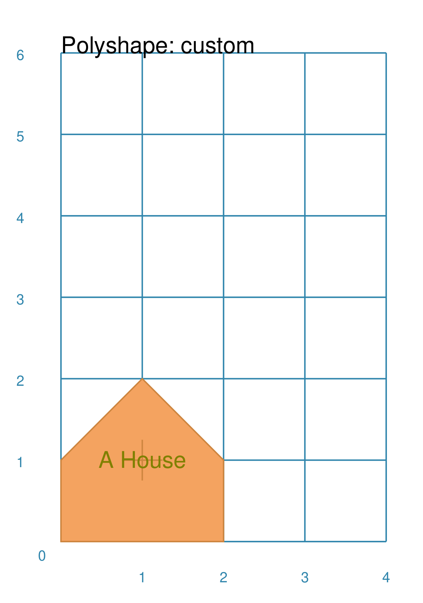

===== ======
|sh2| The shape is constructed using the command with these properties::

        Polyshape(
              points=[(0, 0), (0, 1), (1,  2), (2, 1), (2, 0)],
              cx=1, cy=1,
              label='A House',
              label_stroke=olive,
              cross=0.5,
              fill=sandybrown,
              stroke=peru,
        )

      As in Example 1, the *points* are used to construct the outline of the
      shape. Other properties:

      - the centre is defined to be at x-position ``1`` cm and y-position
        ``1`` cm; this will affect the drawing of the cross and the label but
        does **not** affect the drawing of the shape itself
      - *cross* - sets the length of each of the two lines that cross at the
        centre to be ``0.5`` cm
      - *label* - sets the text appearing at the defined centre position
      - *fill* color of ``sandybrown`` (corresponds to hexadecimal value ``#F4A460``)
        that defines the color of the interior of the shape
      - *stroke* color of ``peru`` (corresponds to hexadecimal value ``#CD853F``)

===== ======

Example 3.
++++++++++

There are two other options available.

In addition to the *cx* and *cy* pair, an *x* and *y* pair can also be provided;
these values will be used to offset ("move") the Polyshape from the position it
would normally occupy.

It is also possible to provide the *points* as a string of space-separated
pairs of values; so instead of ``[(0,0), (1,1)]`` just use ``"0,0 1,1"``.

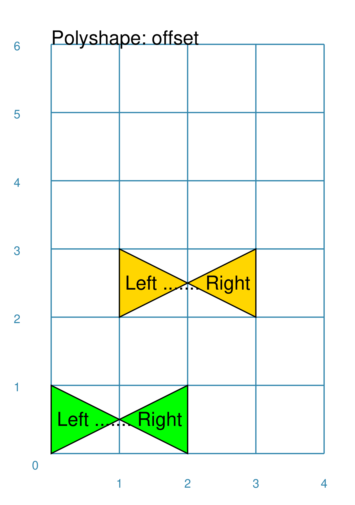

===== ======
|sh3| The shapes are constructed using the command with these properties::

        Polyshape(
            points="0,0 0,1 2,0 2,1 0,0",
            cx=1, cy=0.5,
            fill=lime, label="Left ....... Right")
        Polyshape(
            points="0,0 0,1 2,0 2,1 0,0",
            cx=1, cy=0.5,
            fill=gold, label="Left ....... Right",
            x=1, y=2)

      As in Example 2, the *points* are used to construct the outline of the
      shape. In this case, they are a string of space-separated pairs of values.

      Other properties:

      - the centre is defined to be at x-position ``1`` cm and y-position
        ``0.5`` cm; this will affect the drawing of the label
        but does **not** affect the drawing of the shape itself
      - *label* - sets the text appearing at the defined centre position
      - *fill* color defines the color of the interior of the shape

      In the ``gold``-filled Polyshape, the *x* and *y* values have been set,
      causing the whole shape to move up and to the right.
===== ======

Rectangle
~~~~~~~~~
`↑ <shape-index_>`_

.. NOTE::

   There is more detail about the properties that can be defined for a
   Rectangle in the `customised Rectangle <customised_shapes.rst#rectangle>`_
   section.

Example 1.
++++++++++

.. |rct| image:: images/defaults/rectangle.png
   :width: 330

===== ======
|rct| This example shows the shape constructed using the command with only
      defaults::

          Rectangle()

      It has the following properties set for it:

      - lower-left corner at x-position ``1`` cm and at y-position ``1`` cm
      - *width* and *height* - default to ``1`` cm

      Because all sides of the Rectangle are equal, it appears as though it
      is a `Square`_.
===== ======

Example 2.
++++++++++

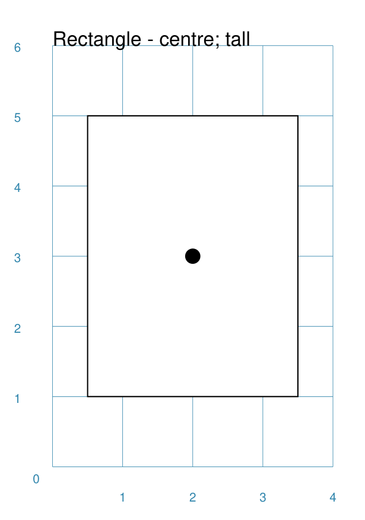

===== ======
|rc1| This example shows the shape constructed using the command with these
      properties::

          Rectangle(cx=2, cy=3, width=3, height=4, dot=0.1)

      It has the following properties set for it:

      - *cx* and *cy* - set the centre at x-position ``2`` cm and
        y-position ``3`` cm
      - *height* of ``4`` cm
      - *width* of ``3`` cm
      - *dot* - a small, filled circle placed at the centre

      Because the *height* is greater than the *width* the Rectangle has a
      card-like appearance.
===== ======

Rhombus
~~~~~~~
`↑ <shape-index_>`_

Example 1.
++++++++++

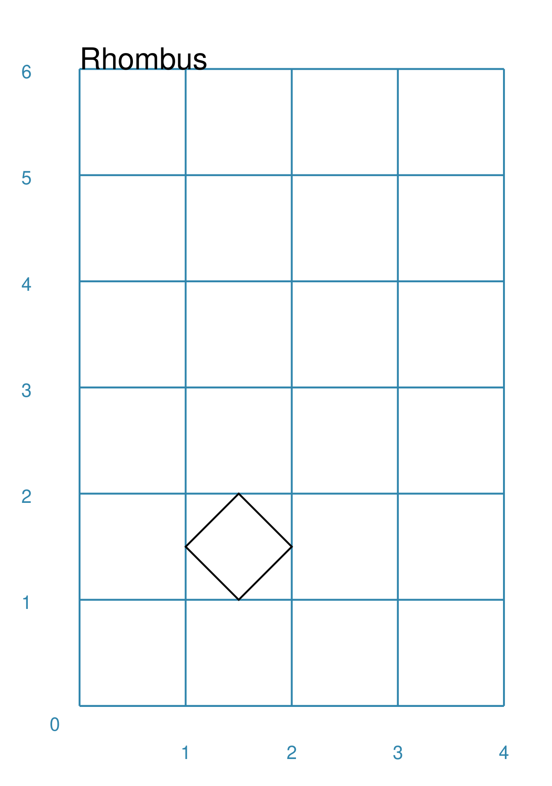

===== ======
|rh0| This example shows the shape constructed using the command with only
      defaults::

          Rhombus()

      It has the following properties based on the defaults:

      - starts at x-position ``1`` cm and at y-position ``1`` cm
      - *width* of ``1`` cm
      - *height* of ``1`` cm

      Because the sides are of equal length, the Rhombus appears to be a
      rotated Square.
===== ======

Example 2.
++++++++++

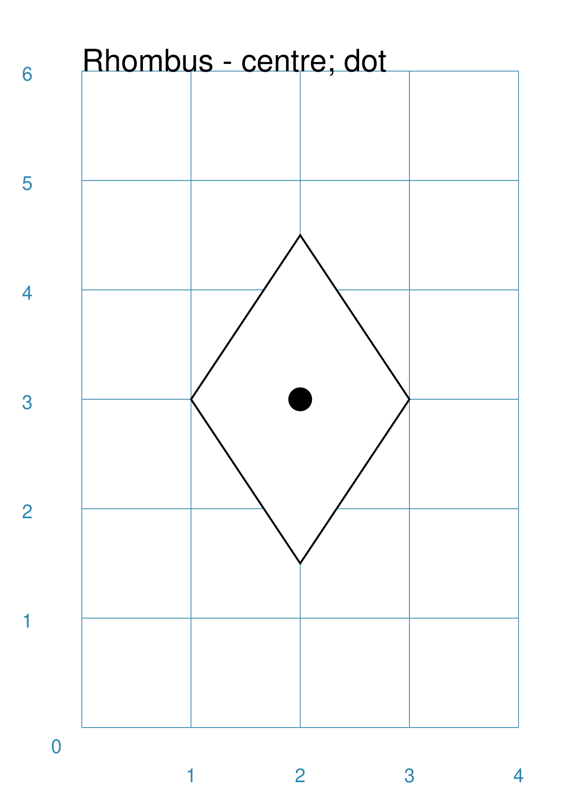

===== ======
|rh1| This example shows the shape constructed using the command with these
      properties::

          Rhombus(cx=2, cy=3, width=2, height=3, dot=0.1)

      It has the following properties set for it:

      - centre at x-position ``2`` cm and at y-position ``3`` cm
      - *width* of ``2`` cm
      - *height* of ``3`` cm
      - *dot* of size ``0.1``
===== ======

Example 3.
++++++++++

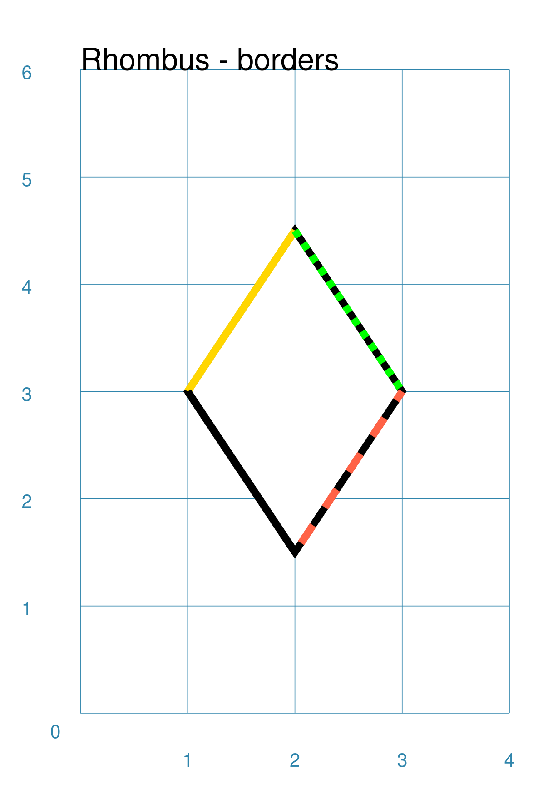

===== ======
|rh2| This example shows the shape constructed using the command with these
      properties::

          Rhombus(
            cx=2, cy=3, width=2, height=3,
            borders=[
                ("nw", 2, gold),
                ("ne", 2, lime, True),
                ("se", 2, tomato, [0.1,0.2,0.1,0]),
                ("sw", 2)
            ]
          )

      It has the following properties set for it:

      - centre at x-position ``2`` cm and at y-position ``3`` cm
      - *width* of ``2`` cm
      - *height* of ``3`` cm
      - *borders* - a list of sets of custom settings for each side; each set
        can contain""

        - `direction` - one of ne(northeast), se(southeast), nw(northwest),
          or sw(southwest)
        - `width` - the line thickness
        - `color` - either a named color or a hexadecimal value
        - `style` - ``True`` makes it dotted; or a list of values creates dashes

        Direction and width are required, but color and style are optional. One
        or more border values can be used together with spaces between them
        e.g. ``ne se`` to draw lines on both northeast **and** southeast sides.

===== ======

Sector
~~~~~~
`↑ <shape-index_>`_

A Sector is like the triangular-shaped wedge that is often cut from a pizza
or cake. It extends from the centre of a "virtual" circle outwards to its
enclosing diameter.  The two "arms" of the sector will cover a certain number
of degrees of the circle (from 1 to 360).

Example 1.
++++++++++

.. |sct| image:: images/defaults/sector.png
   :width: 330

===== ======
|sct| This example shows the shape constructed using the command with only
      defaults::

          Sector()

      It has the following properties based on the defaults:

      - lower-left "corner"at x-position ``1`` cm and at y-position ``1`` cm
      - sector is then drawn inside a circle of diameter ``1`` cm, with a
        default *angle_width* of 90 |deg|
===== ======

Example 2.
++++++++++

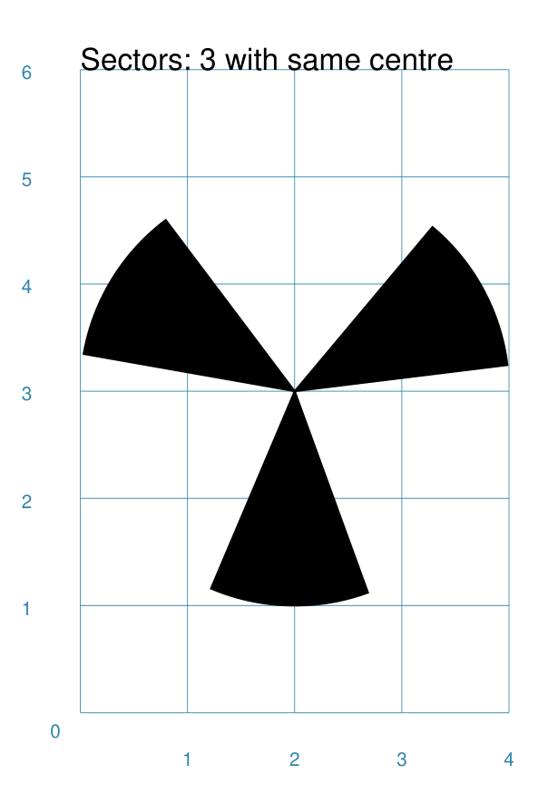

===== ======
|sc1| This example shows examples of the Sector constructed using commands
      with the following properties::

        sctm = Common(
            cx=2, cy=3, radius=2, fill=black, angle_width=43)
        Sector(common=sctm, angle=40)
        Sector(common=sctm, angle=160)
        Sector(common=sctm, angle=280)

      These all have the following Common properties:

      - centred at x-position ``2`` cm and at y-position ``3`` cm
      - *radius* of ``2`` cm for the enclosing "virtual" circle
      - *fill* color of black
      - *angle_width* - determines the coverage (i.e. the "width" of the
        Sector); in all these cases it is 43 |deg|

      Each sector in this example is drawn at a different *angle*; with the
      this being the "virtual" centre-line  extending through the sector,
      outwards from the middle of the  enclosing "virtual" circle.
===== ======

Square
~~~~~~
`↑ <shape-index_>`_

Example 1.
++++++++++

.. |sqr| image:: images/defaults/square.png
   :width: 330

===== ======
|sqr| This example shows the shape constructed using the command with only
      defaults::

          Square()

      It has the following properties based on the defaults:

      - lower-left corner at x-position ``1`` cm and at y-position ``1`` cm
      - side of ``1`` cm
===== ======

Example 2.
++++++++++

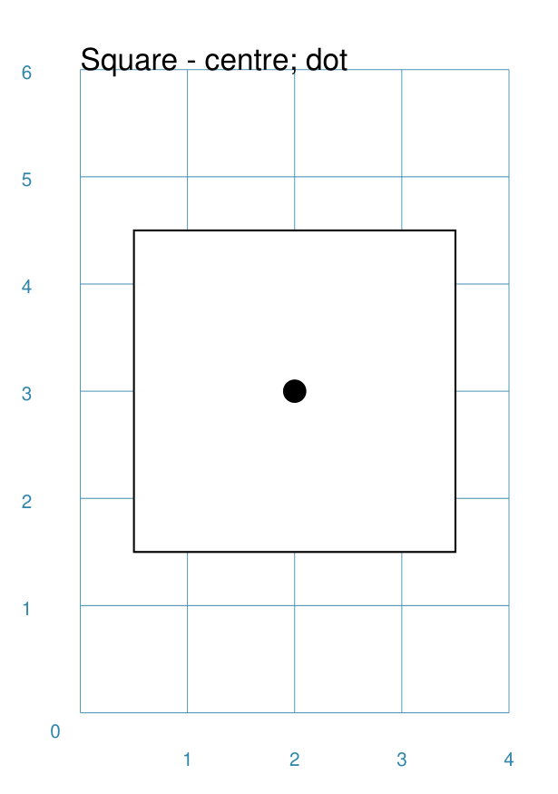

===== ======
|sq1| This example shows the shape constructed using the command with these
      properties::

          Square(cx=2, cy=3, side=3, dot=0.1)

      It has the following properties set for it:

      - centre at x-position ``2`` cm and at y-position ``3`` cm
      - *side* of ``3`` cm; both *width* and *height* match this
      - *dot* - a small, filled circle placed at the centre
===== ======

Stadium
~~~~~~~
`↑ <shape-index_>`_

A Stadium is a shape constructed with a rectangle as a base, and then curved
projections extending from one or more of the sides.

Example 1.
++++++++++

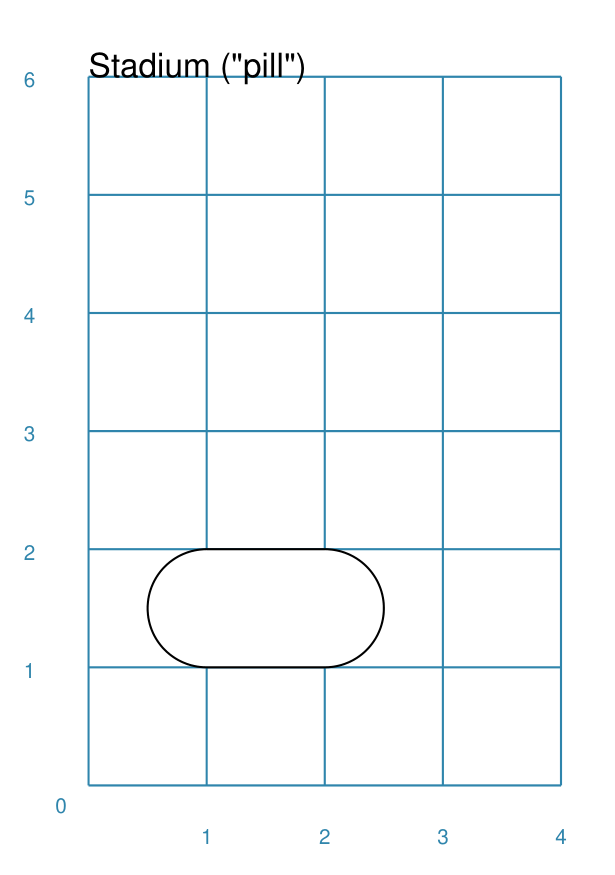

===== ======
|std| This example shows the shape constructed using the command with only
      defaults::

          Stadium()

      It has the following properties based on the defaults:

      - straight edge start at x-position ``1`` cm and at y-position ``1`` cm
      - height and width of ``1`` cm each
      - curved ends at the east (right) and west (left) sides
===== ======

Example 2.
++++++++++

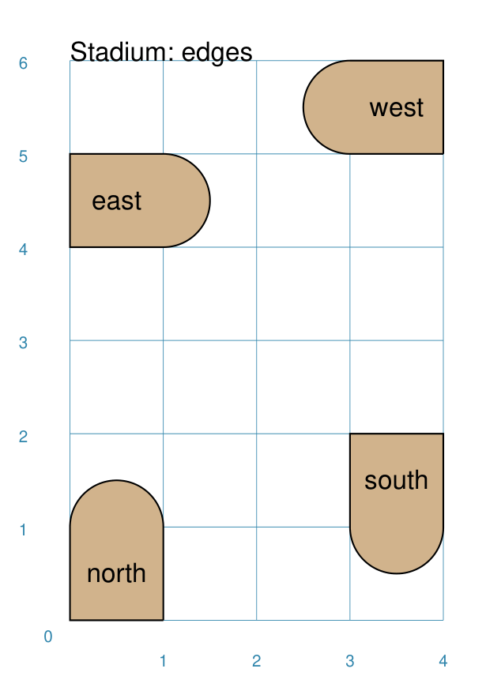

===== ======
|st1| This example shows example of the shape constructed using the command
      with the following properties::

        Stadium(
          x=0, y=0, height=1, width=1, edges='n', fill=tan, label="north")
        Stadium(
          x=3, y=1, height=1, width=1, edges='s', fill=tan, label="south")
        Stadium(
          x=0, y=4, height=1, width=1, edges='e', fill=tan, label="east")
        Stadium(
          x=3, y=5, height=1, width=1, edges='w', fill=tan, label="west")

      These have the following properties set:

      - *height* and *width* - of ``1`` cm and ``1`` cm respectively
      - *edges* - the display of the rounded projection(s) can also be set using
        a letter to represent the direction, where ``n`` is ``north`` ("up"),
        ``s`` is ``south`` ("down"), ``e`` is ``east`` ("right") and
        ``w`` is ``west`` ("left"");
        one or more edge values can be used together with spaces between them
        e.g. ``n e`` to draw both north **and** east.
===== ======

Star
~~~~
`↑ <shape-index_>`_

A Star is five-pointed shape; essentially made by extending the sides for a
pentagram outwards to meet at a point.

To create more varied kinds of stars, see the triangle petal shapes that can
be created via a `customised Circle <customised_shapes.rst#circlepetalstriangle>`_

Example 1.
++++++++++

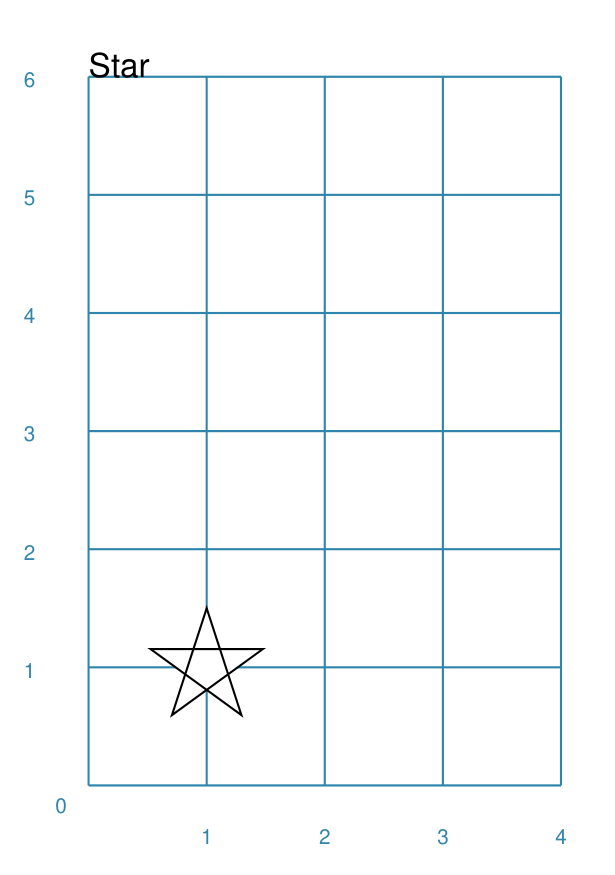

===== ======
|str| This example shows the shape constructed using the command with only
      defaults::

          Star()

      It has the following properties based on the defaults:

      - centre at x-position ``1`` cm and at y-position ``1`` cm
      - "height" of ``1`` cm
===== ======

Example 2.
++++++++++

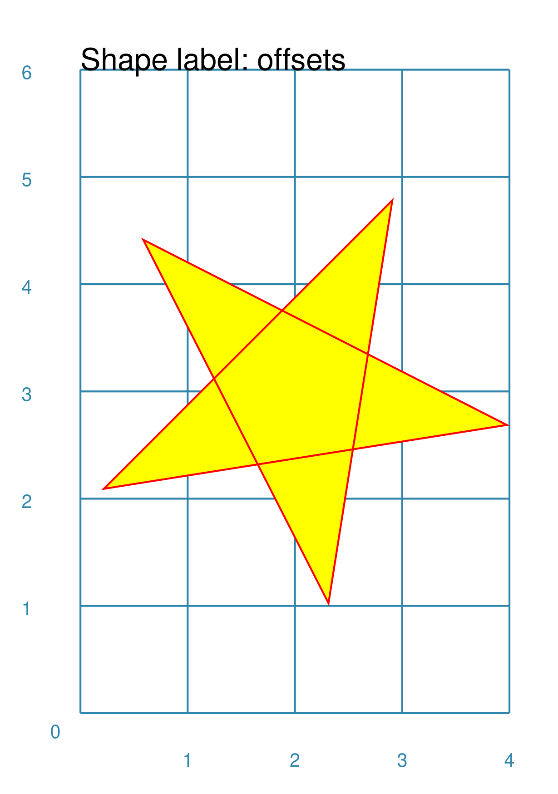

===== ======
|st2| This example shows the shape constructed using the command with these
      properties::

          Star(
            cx=2, cy=3, radius=2, fill=yellow, stroke=red, rotation=45)

      It has the following properties that differ from the defaults:

      - centre at x-position ``2`` cm and at y-position ``3`` cm
      - *radius* of ``2`` cm
      - *fill* color of ``yellow`` (corresponds to hexadecimal value ``#FFFF00``)
        that defines the color of the interior of the Star
      - *stroke* color of ``red`` (corresponds to hexadecimal value ``#FF0000``)
        that defines the color of the border of the Star
      - *rotation* -  of 45 |deg| (from the baseline, anti-clockwise) about
        the centre
===== ======

Starfield
~~~~~~~~~
`↑ <shape-index_>`_

A Starfield is a shape in which a number of small dots are scattered at random
to simulate what might be seen looking at a portion of the night sky.

The number of dots drawn depends on the "density", which is the product of the
actual area of the shape multiplied by the density value.

    If you want repeatable randomness - that is to say, the same sequence of
    random numbers being generated every time the program is run - then assign
    a value to the *seeding* property; for example::

              Starfield(seeding=42)

    The images used for this document are created with such a setting; but only
    to avoid the code repository detecting a "change" each time the script runs.

Example 1.
++++++++++

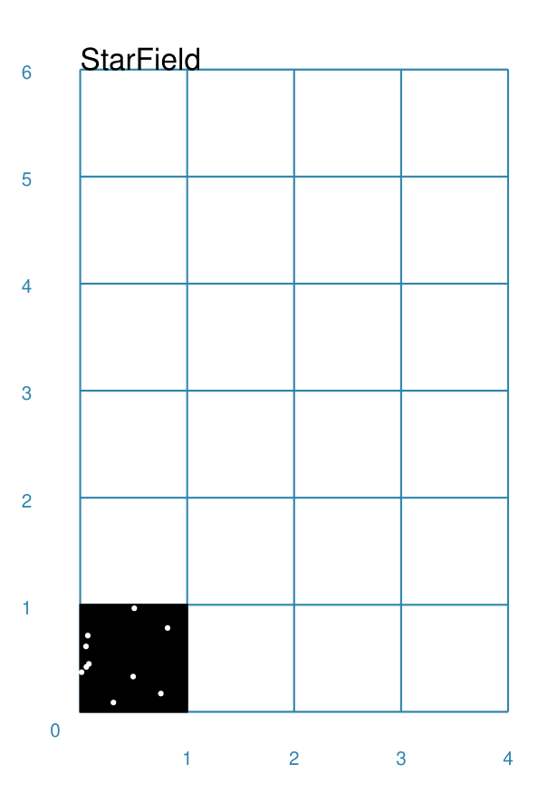

===== ======
|sf0| This example shows the shape constructed using the command with only
      defaults::

          Starfield()

      It has the following properties based on the defaults:

      - lower left-corner at x-position ``0`` cm and at y-position ``0`` cm
      - an enclosing area with *height* and *width* of ``1`` cm
      - 10 randomly placed ``white`` *color* 'dots' (the starfield *density*)

      Because the default fill color is white, this example adds an extra
      `Rectangle()` shape, with a fill of black, which is drawn first and is
      hence "behind" the field of dots.
===== ======

Example 2.
++++++++++

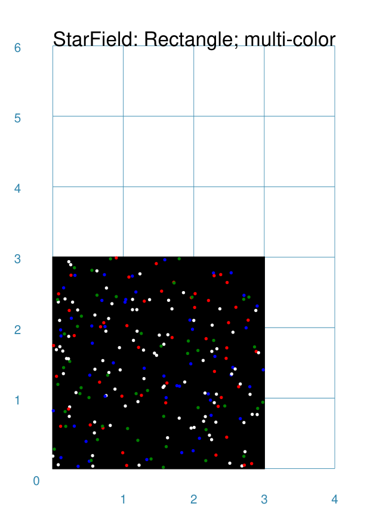

===== ======
|sf1| This example shows the shape constructed using the command with the
      following properties::

        StarField(
            enclosure=rectangle(x=0, y=0, height=3, width=3),
            density=80,
            colors=[white, white, red, green, blue],
            sizes=[0.4]
        )

      It has the following properties set:

      - lower left-corner at x-position ``0`` cm and at y-position ``0`` cm
      - *enclosure* - the rectangle size determines the boundaries of the area
        (*height* and *width* each of ``3`` cm) inside of which the stars (dots) are
        randomly drawn
      - *density* - there will be a total of "80 multiplied by the enclosure
        area" dots drawn
      - *colors* - is a list of colors, one of which will be randomly chosen
        each time before drawing a dot
      - *sizes* - is a list of randomly chosen dot sizes; in this case there is
        just one value and so all dots will be same size

      Because the default fill color is white, this example adds an extra
      `Rectangle()` shape, with a fill color of black, which is drawn first and
      is hence "behind" the field of dots.
===== ======

Example 3.
++++++++++

.. |sf2| image:: images/customised/starfield_circle.png
   :width: 330

===== ======
|sf2| This example shows the shape constructed using the command with the
      following properties::

        StarField(
            enclosure=circle(x=0, y=0, radius=1.5),
            density=30,
            sizes=[0.15, 0.15, 0.15, 0.15, 0.3, 0.3, 0.5]
        )

      It has the following properties set:

      - lower left "corner" at x-position ``0`` cm and at y-position ``0`` cm
      - *enclosure* - the `circle` radius (``1.5`` cm) determines the boundaries
        of the area inside of which the stars (dots) are randomly drawn
      - *density* - there will be a total of "30 multiplied by the enclosure
        area" dots drawn
      - *sizes* - is a list of available dot sizes, one of which is randomly
        chosen from the list each time before drawing a dot

      Because the default fill color is white, this example adds an extra
      `Circle()` shape, with a fill color of black, which is drawn first and is
      hence "behind" the field of dots.
===== ======

Example 4.
++++++++++

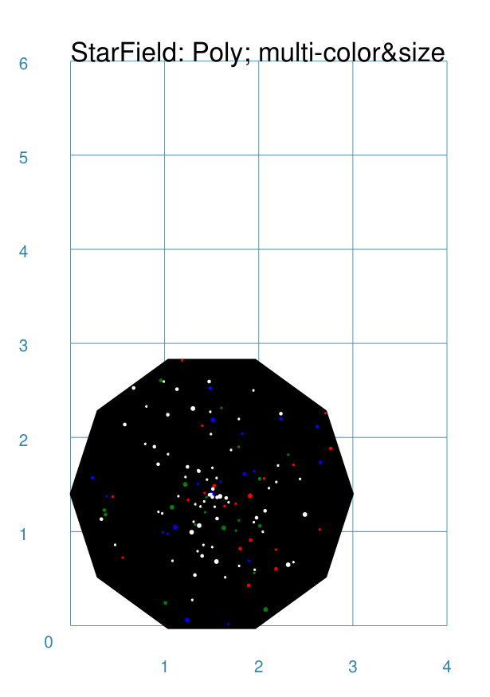

===== ======
|sf3| This example shows the shape constructed using the command with the
      following properties::

        StarField(
            enclosure=polygon(x=1.5, y=1.4, sides=10, radius=1.5),
            density=50,
            colors=[white, white, white, red, green, blue],
            sizes=[0.15, 0.15, 0.15, 0.15, 0.3, 0.3, 0.45]
        )

      It has the following properties set:

      - lower left "corner" at x-position ``1.5`` cm and y-position ``1.4`` cm
      - *enclosure* - the polygon radius (``1.5`` cm) determines the boundaries
        of the area inside of which the stars (dots) are randomly drawn
      - *density* - there will be a total of "50 multiplied by the enclosure
        area" dots drawn
      - *colors* - a list of available dot colors, one of which is randomly
        chosen from the list each time before drawing a dot
      - *sizes* - a list of available dot sizes, one of which is randomly
        chosen from the list each time before drawing a dot

      Because the default fill color is white, this example adds an extra
      `Polygon()` shape, with a fill color of black, which is drawn first and
      is hence "behind" the field of dots.
===== ======

Trapezoid
~~~~~~~~~
`↑ <shape-index_>`_

Example 1.
++++++++++

.. |trp| image:: images/defaults/trapezoid.png
   :width: 330

===== ======
|trp| This example shows the shape constructed using the command with only
      defaults::

          Trapezoid()

      It has the following properties based on the defaults:

      - starts at x-position ``1`` cm and at y-position ``1`` cm
      - *width* of ``1`` cm
      - *height* of ``1`` cm
      - *top* - the upper edge of the shape defaults to half the *width*
===== ======

Example 2.
++++++++++

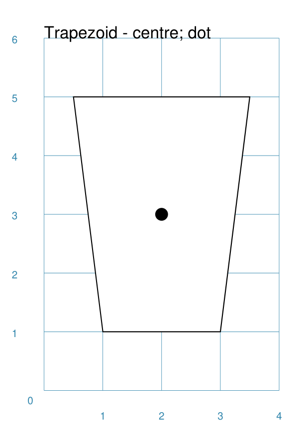

===== ======
|tr1| This example shows the shape constructed using the command with these
      properties::

          Trapezoid(cx=2, cy=3, width=3, top=2, height=4, flip='s', dot=0.1)

      It has the following properties set for it:

      - centre at x-position ``2`` cm and at y-position ``3`` cm
      - *width* of ``3`` cm
      - *height* of ``4`` cm
      - *top* of ``2`` cm
      - *flip* of ``s`` (for ``south``) means the "top" is drawn below the base
===== ======

Example 3.
++++++++++

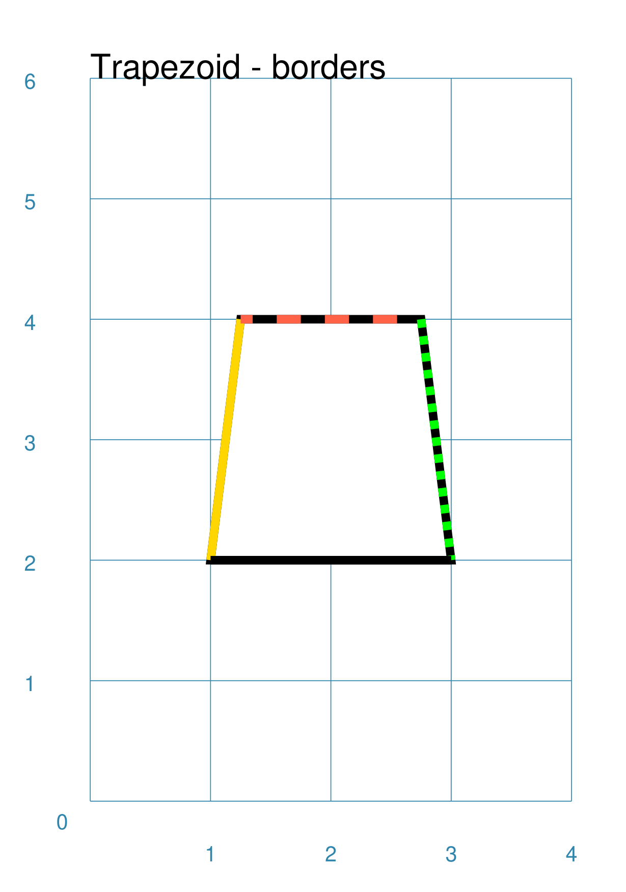

===== ======
|tr3| This example shows the shape constructed using the command with these
      properties::

        Trapezoid(
            cx=2, cy=3, width=2, height=2, top=1.5, stroke_width=2,
            borders=[
                ("w", 2, gold),
                ("e", 2, lime, True),
                ("n", 2, tomato, [0.1,0.2,0.1,0]),
                ("s", 2)
            ]
        )

      It has the following properties set for it:

      - centre at x-position ``2`` cm and at y-position ``3`` cm
      - *width* of ``2`` cm
      - *height* of ``3`` cm
      - *top* of ``1.5`` cm
      - *borders* - a list of sets of custom settings for each side; each set
        can contain""

        - `direction` - one of n(orth), s(outh), e(ast) or w(est)
        - `width` - the line thickness
        - `color` - either a named color or a hexadecimal value
        - `style` - ``True`` makes it dotted; or a list of values creates dashes

        Direction and width are required, but color and style are optional. One
        or more border values can be used together with spaces between them
        e.g. ``n s`` to draw lines on both north **and** south sides.

===== ======

.. _compoundIndex:

Compound Shapes
---------------
`↑ <table-of-contents_>`_

Compound shapes are ones composed of multiple elements; but the program takes
care of drawing all of them based on the properties supplied.

The following are all such shapes:

- `Blueprint`_
- `DotGrid`_
- `Grid`_
- `Hexagons`_
- `Image`_
- `Lines`_
- `Rectangles`_

Blueprint
~~~~~~~~~
`↑ <shape-index_>`_

This shape is primarily intended to support drawing while it is "in progress".
It provides a quick and convenient underlying grid that can help to orientate
and place other shapes that *are* required for the final product.  Typically,
one would just comment out this command when its purpose has been served.

On the grid, the values of **x** appear across the lower edge (increasing
from left to right); those for **y** along the left side (increasing from
bottom to top). The grid respects the margins that have been set - so the
lower-left grid corner shown as "0" is actually offset from the physical
page corner... but you will observe that the Blueprint numbering itself is
located inside the margin area!

Different styling options are provided that can make the Blueprint more
useful in different contexts.

.. NOTE::

   There is more detail about the various properties that can be defined for a
   Blueprint in the section on `customised Blueprint <customised_shapes.rst#blueprint>`_.

Example 1.
++++++++++

.. |blp| image:: images/defaults/blueprint.png
   :width: 330

===== ======
|blp| This example shows the shape constructed using the command with only
      defaults::

          Blueprint()

      It has the following properties based on the defaults:

      - starts at the lower-left corner, as defined by the page margins
      - has vertical and horizontal lines filling the page from the lower left
        corner up to the right and top margins
      - has spacing between lines of ``1`` cm
      - default line color is a shade of ``blue`` (``#2F85AC``)
      - the x- and y-axis are numbered from the lower left corner
===== ======

Example 2.
++++++++++

.. |bl2| image:: images/customised/blueprint_subdiv.png
   :width: 330

===== ======
|bl2| This example shows the shape constructed using the command with these
      properties::

          Blueprint(subdivisions=5, stroke_width=0.5, style='invert')

      It has the following properties set:

      - *subdivisions* - set to ``5``; these are the number of thinner lines that
        are drawn between each pair of primary lines - they do not have any
        numbering and are *dotted*
      - *stroke_width* - set to ``0.5``; this slightly thicker primary line makes
        the grid more visible
      - *style* - set to ``invert`` so that the lines and number colors are white
        and the fill color is now a shade of ``blue`` (``#2F85AC``)
===== ======

DotGrid
~~~~~~~
`↑ <shape-index_>`_

Example 1.
++++++++++

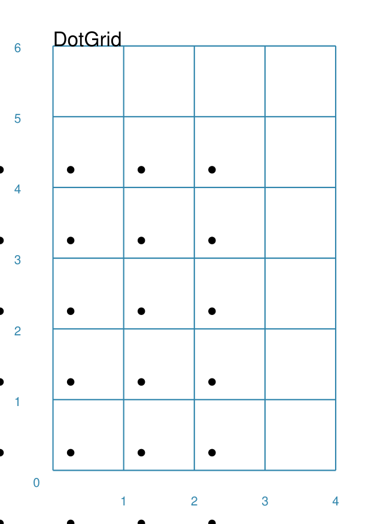

===== ======
|dtg| This example shows the shape constructed using the command with only
      defaults::

          DotGrid()

      It has the following properties based on the defaults:

      - lower left at absolute page x-position ``0`` cm and y-position ``0`` cm
        i.e. the margins are ignored
      - a set of lines, spaced ``1`` cm apart, are created extending to the
        right- and top- margins
===== ======

Example 2.
++++++++++

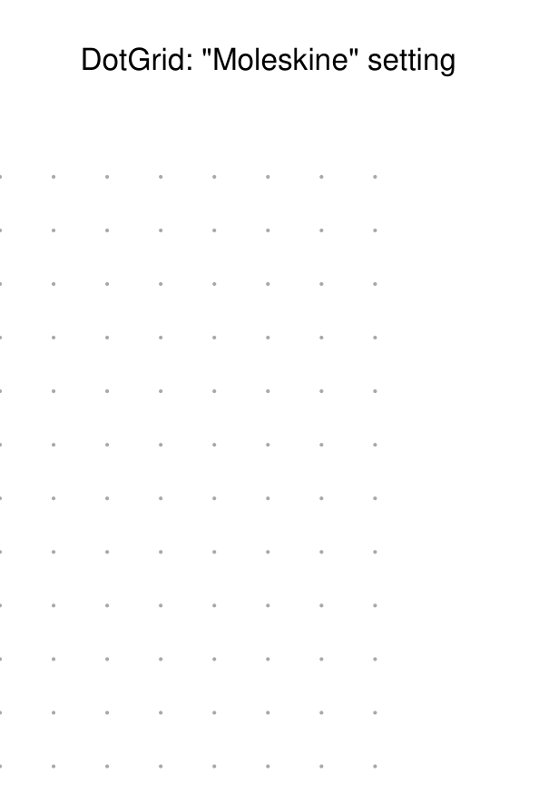

===== ======
|dg1| This example shows the shape constructed using the command with the
      following properties::

        DotGrid(
            stroke=darkgray, width=0.5, height=0.5, dot_point=1, offset_y=-0.25
        )

      It is meant to simulate the dot grid found in Moleskine notebooks, and so
      it has the following properties set:

      - *width* and *height* are the spacing in x and y directions respectively
      - *dot_point* is set to be smaller than the default of ``3``
      - *stroke* color of ``darkgrey`` is a lighter shade than the default black
      - *offset_y* moves the start of the grid slightly downwards by 1/4 of a cm

      **NOTE** If you wanted to create a notebook page that for actual use,
      you could consider setting the page color to something like ``cornsilk``
      to provide a suitable backdrop for the light grey of the grid; do this by
      setting the *fill* property of the `Create()` command.
===== ======

Grid
~~~~
`↑ <shape-index_>`_

A Grid is a series of crossed lines - both in the vertical and horizontal
directions - which will, by default, fill the page, as far as possible,
between its margins.

Example 1.
++++++++++

.. |grd| image:: images/defaults/grid.png
   :width: 330

===== ======
|grd| This example shows the shape constructed using the command with only
      defaults::

          Grid()

      It has the following properties based on the defaults:

      - starts at lower-left corner of page defined by the margin
      - has a default grid interval of ``1`` cm in both the x- and y-direction
===== ======

Example 2.
++++++++++

.. |gr2| image:: images/customised/grid_gray.png
   :width: 330

===== ======
|gr2| This example shows the shape constructed using the command with the
      following properties (and without a `Blueprint`_ background)::

          Grid(side=0.85, stroke=gray, stroke_width=1)

      It has the following properties based on the defaults:

      - *side* - the value of ``0.85`` cm equates to about 1/3 of an inch
        and sets the size of each square in the grid
      - *stroke_width* - set to ``1`` point; this thicker line makes the grid
        more visible
      - *stroke* color - set to ``gray`` i.e. a lighter color shade than the
        default of black
===== ======

Example 3.
++++++++++

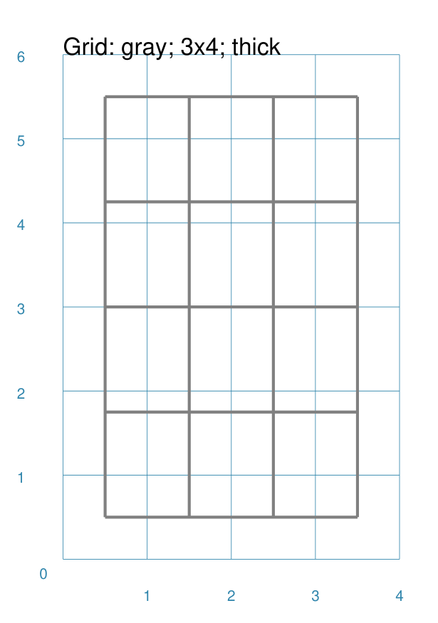

===== ======
|gr3| This example shows the shape constructed using the command with the
      following properties::

          Grid(
              x=0.5, y=0.5,
              height=1.25, width=1,
              cols=3, rows=4,
              stroke=gray, stroke_width=1
          )

      It has the following properties set for it:

      - *x* and *y* - each set to ``0.5`` cm; this offsets the lower-left corner
        of the grid from the page margin
      - *height* - value of ``1.25`` cm set for the row height
      - *width* - value of ``1`` cm set for the column width
      - *cols* and *rows* - the grid now has a fixed size of ``3`` columns wide
        and ``4`` rows high - rather than being automatically calculated to
        fill up the page
      - *stroke_width* - set to ``1`` point; this much thicker line makes
        the grid clearly visible
      - *stroke* color of `gray` is a lighter color than default of black
===== ======

Image
~~~~~
`↑ <shape-index_>`_

Pedantically speaking, an image is not like the other shapes in the sense that
it does not consist of lines and areas drawn by **pyprototypr**  itself.  It is
an external file which is simply inserted into the drawing. It does, however,
share a number of common aspects with other shapes - such as an x & y position,
a width and height and the ability to be rotated. It can also be "drawn over"
by other shapes appearing further on in a script.

Example 1.
++++++++++

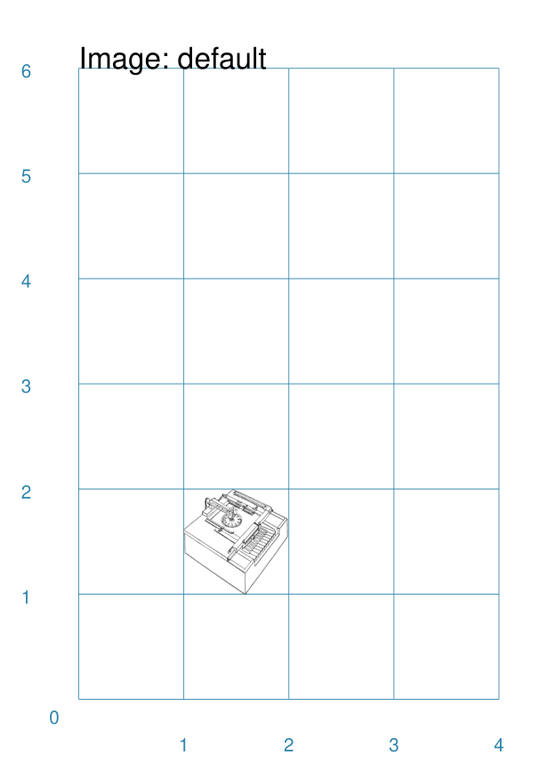

===== ======
|im1| If the shape was constructed using only default properties, there will be
      nothing to see::

          Image()

      This example then shows the shape constructed with just a single property::

        Image("sholes_typewriter.png")

      It has the following other properties based on the defaults:

      - lower-left corner at x-position ``1`` cm and at y-position ``1`` cm
      - *width* and *height* - default to ``1`` cm; this may distort the image if it
        is not square in shape
===== ======

Example 2.
++++++++++

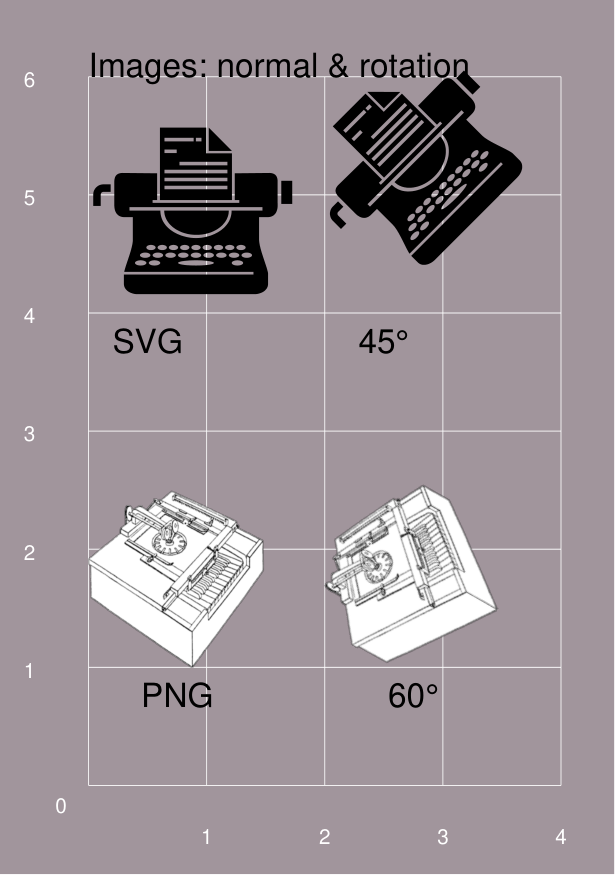

===== ======
|im2| This example shows the shape constructed using the command with the
      following properties::

        Image(
          "sholes_typewriter.png",
          x=0, y=1, width=1.5, height=1.5, title="PNG")
        Image(
          "sholes_typewriter.png",
          x=2, y=1, width=1.5, height=1.5, title="60\u00B0",
          rotation=60)
        Image(
          "noun-typewriter-3933515.svg",
          x=0, y=4, scaling=0.15, title="SVG")
        Image(
          "noun-typewriter-3933515.svg",
          x=2, y=4, scaling=0.15, title="45\u00B0",
          rotation=45)

      Each image has the following properties set for it:

      - name of the image file; this must be the first property set
      - *x* and *y* - these values set the lower-left corner

      The PNG images also have the following properties set for them:

      - *height* - set to ``1.5`` cm; this value may cause some distortion
      - *width* - set to ``1.5`` cm; this value may cause some distortion

      The SVG images also have the following properties set for them:

      - *scaling* - set to the fraction ``0.15`` or 15% of its actual size; |br|
        because SVG is a vector format, there will be no distortion.

      Two of the images - ones on the right - are rotated about a centre point
      (calculated based on the image's height and width)

      The `Blueprint`_ background is set to ``grey``; just to highlight that both
      images have transparent sections and how anything "behind" them will
      show through.
===== ======

Hexagons
~~~~~~~~
`↑ <shape-index_>`_

Hexagons are often drawn in a "honeycomb" arrangement to form a grid - for games
this is often used to delineate the spaces in which playing pieces can be placed
and their movement regulated.

.. NOTE::

   Very detailed information about using hexagons in grids can be found in the
   section on `Hexagonal Grids <hexagonal_grids.rst>`_.

Example 1.
++++++++++

.. |hex| image:: images/defaults/hexagons-2x2.png
   :width: 330

===== ======
|hex| This example shows the shape constructed using the command with two
      basic properties; the number of rows and columns in the grid::

          Hexagons(rows=2, cols=2)

      It has the following properties based on the defaults:

      - lower-left "corner" at x-position ``1`` cm and at y-position ``1`` cm
      - flat-to-flat hexagon *height* of ``1`` cm
      - "flat" top hexagons
      - size of ``2`` *rows* by ``2`` *cols* ("columns")
      - the "odd" columns - which includes the first one - are offset one-half
        of a hexagon "downwards"
===== ======

Lines
~~~~~~
`↑ <shape-index_>`_

Lines are simply a series of parallel lines drawn over repeating rows - for
horizontal lines - or columns - for vertical lines.

Example 1.
++++++++++

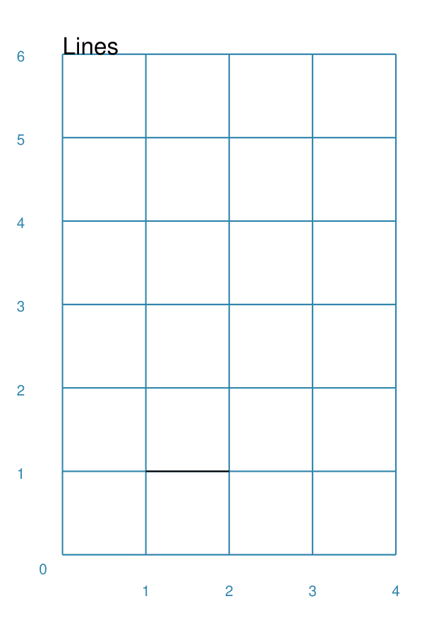

===== ======
|ls0| This example shows the shape constructed using the command with only
      defaults::

          Lines()

      It has the following properties based on the defaults:

      - starts at x-position ``1`` cm and at y-position ``1`` cm
      - heading/default direction is 0 |deg| (anti-clockwise from 0 |deg| "east")
      - has a default number of lines of ``1``
      - line length of ``1`` cm
===== ======

Example 2.
++++++++++

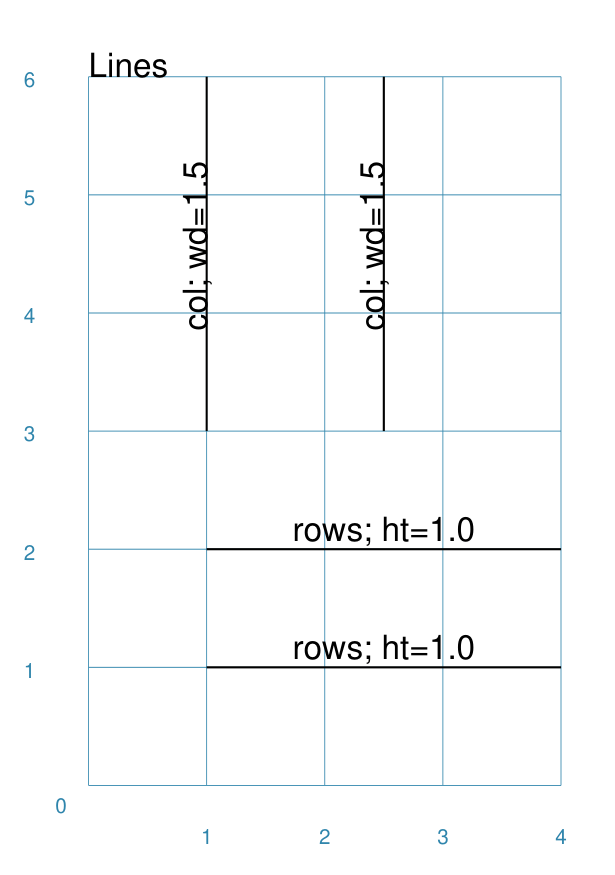

===== ======
|ls1| This example shows the shapes constructed using the command with the
      following properties::

        Lines(
            x=1, x1=4, y=1, y1=1,
            rows=2, height=1,
            label_size=8, label="rows; ht=1.0")
        Lines(
            x=1, x1=1, y=3, y1=6,
            cols=2, width=1.5,
            label_size=8, label="col; wd=1.5")

      The first command has the following properties:

      - *x* and *y* - both set at ``1`` cm
      - *rows* - set to ``2`` to create two parallel horizontal lines
      - *height* - value of ``1`` cm set for the row height; this is the
        separation between each line

      The second command has the following properties:

      - *x* and *y* - both set at ``1`` cm
      - *cols* - set to ``2`` to create two parallel vertical lines
      - *width* - value of ``1.5`` cm set for the column width; this sets the
        separation between each line

      Note that the *label* that has been set applies to **every** line that is
      drawn.
===== ======

Rectangles
~~~~~~~~~~
`↑ <shape-index_>`_

Rectangles can be drawn in a row-by-column layout to form a grid - for games
this is often used to delineate a track or other spaces in which playing pieces
can be placed.

Example 1.
++++++++++

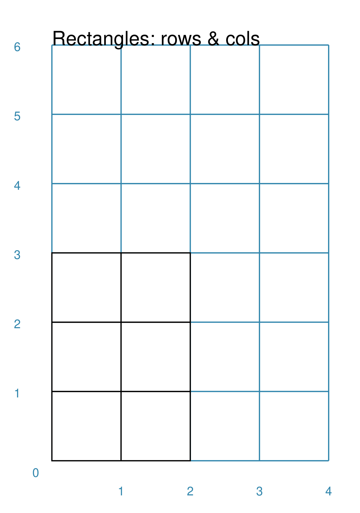

===== ======
|rc0| This example shows the shape constructed using the command with these
      properties::

          Rectangles(rows=3, cols=2)

      It has the following properties based on the defaults:

      - starts at x-position ``1`` cm and at y-position ``1`` cm
      - *height* and *width* of ``1`` cm each
===== ======

Example 2.
++++++++++

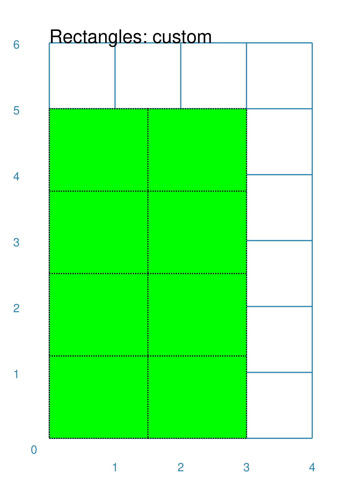

===== ======
|rn1| This example shows the Rectangles constructed using the command with
      these properties::

          Rectangles(
             rows=4, cols=2, width=1.5, height=1.25, dotted=True, fill=lime)

      It has the following properties based on the defaults:

      - starts at x-position ``1`` cm and at y-position ``1`` cm
      - *fill* color of ``lime``
      - *dotted* lines
      - *height* of ``1.25`` cm set for each Rectangle's height
      - *width* of ``1.5`` cm set for each Rectangle's width
===== ======

.. _shapes-common-properties:

Shapes Common Properties
------------------------
`↑ <table-of-contents_>`_

The following are properties common to many shapes that can be set to create
the desired output:

- `x and y`_
- `cx and cy`_
- `Fill and Stroke`_
- `Dot and Cross`_
- `Rotation`_
- `Text Descriptions`_
- `Transparency`_
- `Centre Shape`_

x and y
~~~~~~~
`^ <shapes-common-properties_>`_

Almost every shape will need to have its position set.  The common way to do
this is by setting a value for **x** - the distance from the left margin of the
page (or card) to the left edge of the shape; and/or **y** - the distance from
the bottom margin of the page (or card) to the bottom edge of the shape.

cx and cy
~~~~~~~~~
`^ <shapes-common-properties_>`_

Almost every shape will need to have its position set.  For shapes that allow it,
a common way to do this is by setting a value for **cx** - the distance from the
left margin of the page (or card) to the centre position of the shape and/or
**cy** - the distance from the bottom margin of the page (or card) to the centre
position of the shape.

Dot and Cross
~~~~~~~~~~~~~
`^ <shapes-common-properties_>`_

For shapes that have a definable centre - such as a `Circle`_, a `Square`_
or a `Hexagon`_ - it is possible to place a dot, a cross - or both - at this
location.  The color for these items will, if not provided, take on the color
of the shape which they are part of; see the `Stadium` example below.

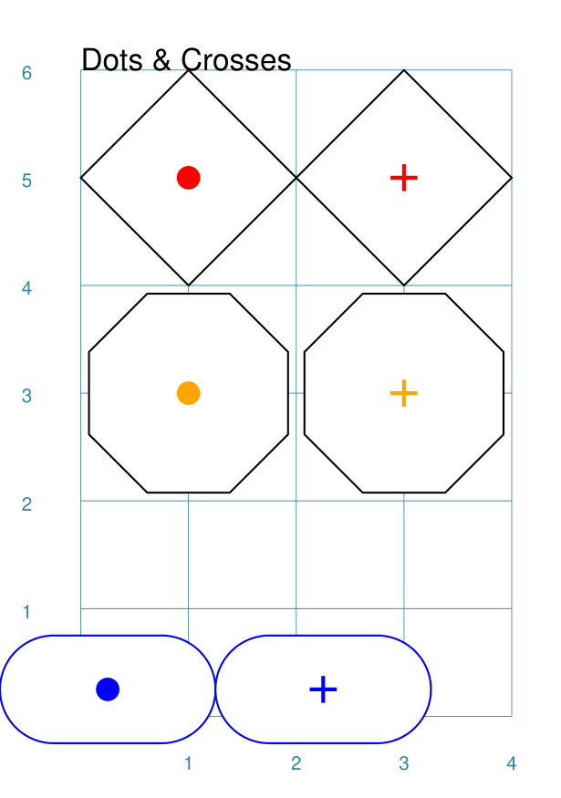

===== ======
|dnc| This example shows various shapes constructed using the following
      commands::

        Rhombus(cx=1, cy=5, side=2, dot=0.1, dot_stroke=red)
        Rhombus(
           cx=3, cy=5, side=2,
           cross=0.25, cross_stroke=red, cross_stroke_width=1)

        Polygon(
          cx=1, cy=3, sides=8, radius=1, dot=0.1, dot_stroke=orange)
        Polygon(
           cx=3, cy=3, sides=8, diameter=2,
           cross=0.25, cross_stroke=orange, cross_stroke_width=1)

        Stadium(cx=1, cy=1, side=1, stroke=blue, dot=0.1)
        Stadium(
            cx=3, cy=1, side=1, stroke=blue,
            cross=0.25, cross_stroke=blue, cross_stroke_width=1)

      The shapes have their properties set as follows:

      - *cx* and *cy* set the centre point of the shape
      - *dot* - sets the size of dot at the centre
      - *dot_stroke*  - sets the color of the dot (note that the dot is "filled
        in" with that same color); defaults to match the *stroke* of the shape
        that it is part of
      - *cross* - sets the length of each of the two lines that cross at the
         centre
      - *cross_stroke*  - sets the color of the cross lines; defaults to the
        stroke of the shape that it is part of
      - *cross_stroke_width* - sets the thickness of the cross lines
===== ======

Fill and Stroke
~~~~~~~~~~~~~~~
`^ <shapes-common-properties_>`_

Almost every single shape will have a *stroke*, corresponding to the color of
the line used to draw it, and a *stroke_width* which is the thickness in
points (72 points per inch); the default line color is black.

All `Enclosed Shapes`_ will have a *fill* corresponding to the color used for
the area inside it; the default fill color is white.

A "shortcut" to setting both fill and stroke to be the same for a shape,
is to use the property *fill_stroke* (see Example 2 below).

If the fill is set to the keyword ``None`` (note the uppercase "N"), the area
will have no fill color, and effectively become transparent.

If the stroke is set to the keyword ``None`` (note the uppercase "N"), the line
will have no color, and effectively become transparent.

.. |fsb| image:: images/defaults/fill-stroke.png
   :width: 330

===== ======
|fsb| This example shows a shape constructed using the command::

          Rectangle(fill=yellow, stroke=red, stroke_width=6)

      The shape has the following properties that differ from the defaults:

      - *fill* color of ``yellow`` (corresponds to hexadecimal value ``#FFFF00``)
        that defines the color of the interior of the shape
      - *stroke* color of ``red`` (corresponds to hexadecimal value ``#FF0000``)
        that defines the color of the border of the shape
      - *stroke_width* - set to ``6`` points (corresponds to about 2mm or 0.2cm)

      It can be seen that very thick lines "straddle" a centre line running
      through the defined location; so in this case the Rectangle is both
      larger in outer dimensions than the expected 1x1 cm and smaller in the
      inner dimensions than the expected 1x1 cm.
===== ======

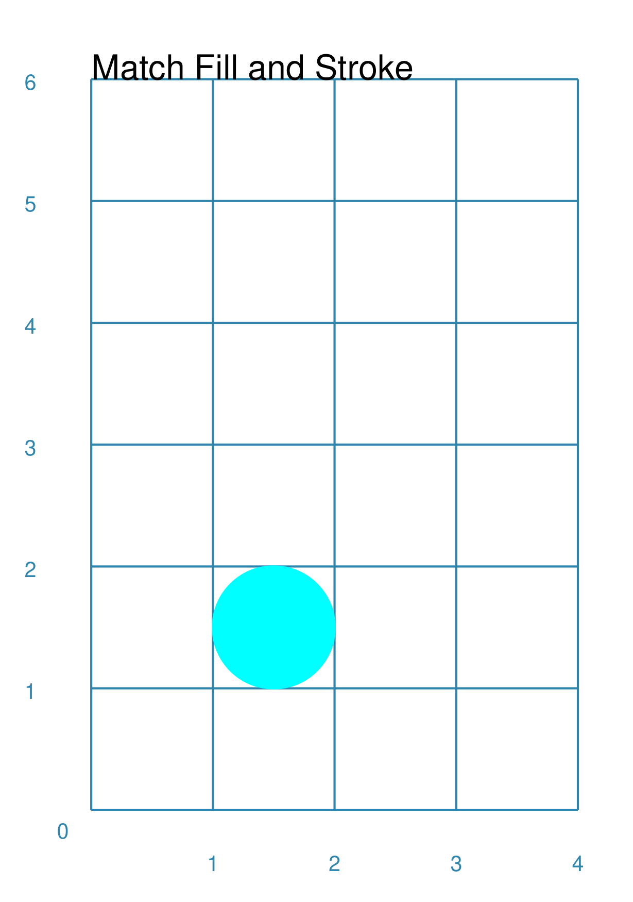

===== ======
|fst| This example shows a shape constructed using the command::

          Circle(fill_stroke=aqua)

      The shape has the following properties that differ from the defaults:

      - *fill_stroke* color of ``aqua`` (this corresponds to hexadecimal value
        of ``#00FFFF``), and is a ""shortcut"" which sets **both** the *fill*
        and *stroke* at same time,  so that the line used to draw the
        circumference is the same as the fill of the interior.
===== ======

Rotation
~~~~~~~~
`^ <shapes-common-properties_>`_

Every shape that has a calculated centre will support a *rotation* property.
Rotation takes place in anti-clockwise direction, from the horizontal, around
the centre of the shape.

Example 1. Rhombus
++++++++++++++++++

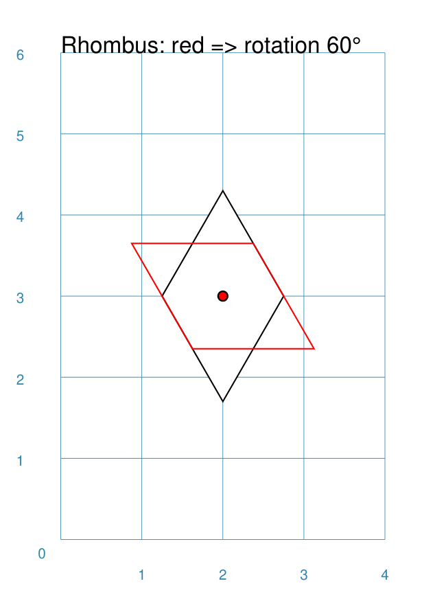

===== ======
|rt1| This example shows the shape constructed using these commands::

        Rhombus(
            cx=2, cy=3, width=1.5, height=2*equilateral_height(1.5), dot=0.06)
        Rhombus(
            cx=2, cy=3, width=1.5, height=2*equilateral_height(1.5), dot=0.04,
            fill=None, stroke=red, rotation=60)

      The shape with the black outline and large dot in the centre is the
      "normal" Rhombus.

      The shape with the red outline and smaller, red dot in the centre is the
      rotated Rhombus.

      - *fill* color is `None` so no fill is used; this makes it completely
        transparent.
      - *rotation* of ``60`` is the number of degrees, anti-clockwise, that
        it has been rotated

      Because the second shape is completely transparent, its possible to see
      how it is drawn relative to the first.
===== ======

Example 2. Polygon
++++++++++++++++++

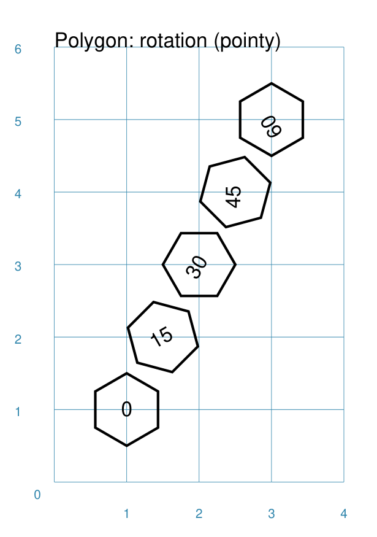

===== ======
|rt2| This example shows five shapes constructed using the command with
      additional properties::

        poly6 = Common(
          fill=None, sides=6, diameter=1, stroke_width=1, orientation='flat')

        Polygon(common=poly6, y=1, x=1.0, label="0")
        Polygon(common=poly6, y=2, x=1.5, rotation=15, label="15")
        Polygon(common=poly6, y=3, x=2.0, rotation=30, label="30")
        Polygon(common=poly6, y=4, x=2.5, rotation=45, label="45")
        Polygon(common=poly6, y=5, x=3.0, rotation=60, label="60")

      The examples have the following properties:

      - *centre* - using `cx` and `cy` values
      - *radius* - ``1`` cm in each case
      - *sides* - the default of 6 in each case ("hexagon" shape)
      - *rotation* - varies from 0 |deg| to 60 |deg| (anti-clockwise from the
        horizontal)

      Note that the fact that the angle of the sides of the polygon is 30 |deg|
      creates a type of regularity, so that the last polygon with the rotation
      of 60 |deg| appears to match the first polygon - but the slope of the
      label inside that last polygon clearly shows that rotation has happened.
===== ======

Text Descriptions
~~~~~~~~~~~~~~~~~
`^ <shapes-common-properties_>`_

Being able to associate a description, or identifier, with a shape can be
useful.

There are three kinds of text that can be added to a shape, without having to
specify their location or other details.

.. NOTE::

   Obviously, a `Text`_ shape can also be placed anywhere, including being
   superimposed on another shape, in order to handle more complex text needs.

The three "simple" text types that can be added to a shape are:

- *heading* - this appears above the shape  (slightly offset)
- *label* - this appears in the middle of the shape
- *title* - this appears below the shape (slightly offset)

All types are, by default, centred horizontally. Each type can be customised
in terms of its color, size and face by appending *_stroke*, *_size* and
*_face* respectively to the type's name.

The *label* text can, in addition, be **moved** relative to the shape's centre
by using *mx* and *my* properties; positive values will move the text to
the right and up; and negative values will move the text to the left and down.

Example 1. Descriptions
+++++++++++++++++++++++

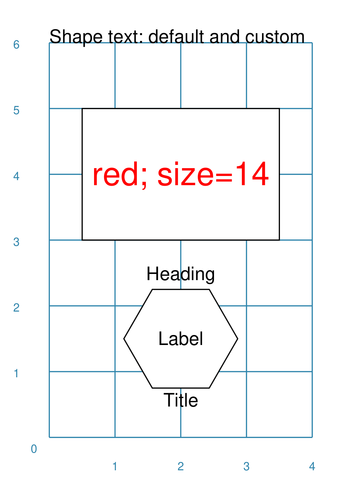

===== ======
|tx1| This example shows two shapes constructed using these commands to change
      default properties::

        Hexagon(
            cx=2, cy=1.5, height=1.5,
            title="Title", label="Label", heading="Heading")
        Rectangle(
            x=0.5, y=3, width=3, height=2,
            label="red; size=14", label_stroke=red, label_size=14)

      The Hexagon shows where the *heading*, *label* and *title* appear.

      The Rectangle shows how the *label* can be customised in terms of its
      *stroke* (``red``) and font *size* (``14`` points).
===== ======

Example 2. Text Offsets
+++++++++++++++++++++++

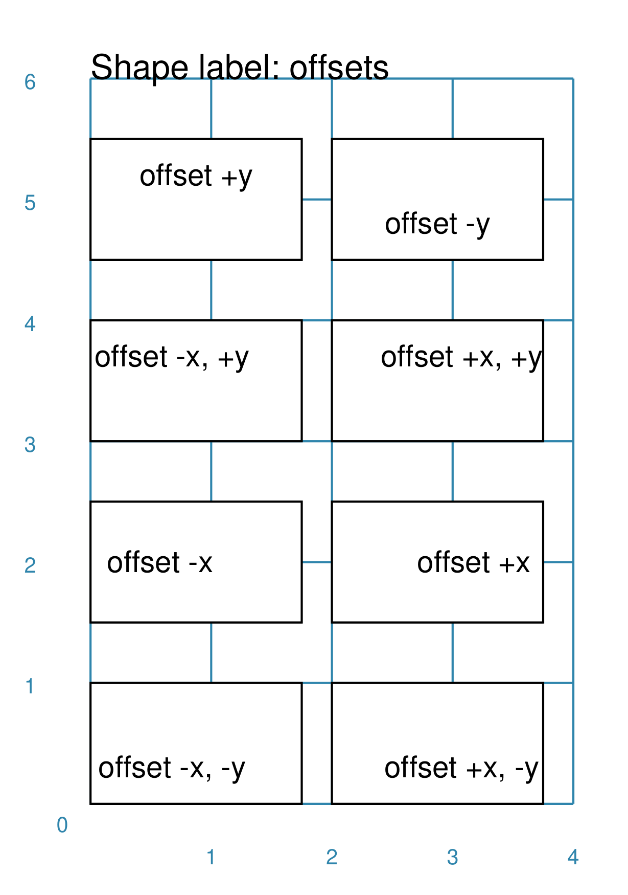

===== ======
|tx2| This example shows five Rectangles constructed using the command with
      additional properties::

        rct = Common(height=1.0, width=1.75, stroke_width=.5, label_size=7)
        Rectangle(
          common=rct, x=0, y=0.0, label="offset -x, -y",
          label_mx=-0.2, label_my=-0.2)
        Rectangle(
          common=rct, x=0, y=1.5, label="offset -x",
          label_mx=-0.3)
        Rectangle(
          common=rct, x=0, y=3.0, label="offset -x, +y",
          label_mx=-0.2, label_my=0.2)
        Rectangle(
          common=rct, x=2, y=0.0, label="offset +x, -y",
          label_mx=0.2, label_my=-0.2)
        Rectangle(
          common=rct, x=2, y=1.5, label="offset +x",
          label_mx=0.3)
        Rectangle(
          common=rct, x=2, y=3.0, label="offset +x, +y",
          label_mx=0.2, label_my=0.2)
        Rectangle(
          common=rct, x=0, y=4.5, label="offset -y",
          label_my=-0.2)
        Rectangle(
          common=rct, x=2, y=4.5, label="offset +y",
          label_my=0.2)

      It can be seen that setting different values for each of *label_my* and
      *label_mx* cause the label, normally at the centre, to be shifted away
      from it.
===== ======

Transparency
~~~~~~~~~~~~
`^ <shapes-common-properties_>`_

All `Enclosed Shapes`_, that have a *fill*, can have a transparency value set
that will affect the fill color used for the area inside them.

If a shape needs to be completely transparent - i.e. no color at all being
visible - then set the *fill* value to ``None``.

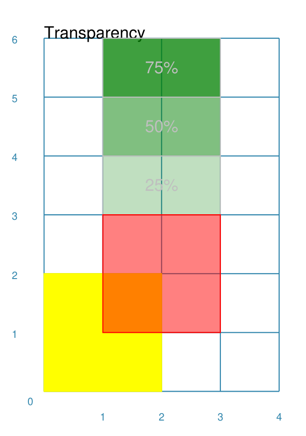

===== ======
|trn| This example shows a number of Rectangles constructed as follows::

        Rectangle(
            x=1, y=3, height=1, width=2, fill="#008000", stroke=silver,
            transparency=25, label="25%"
        )
        Rectangle(
            x=1, y=4, height=1, width=2, fill="#008000", stroke=silver,
            transparency=50, label="50%"
        )
        Rectangle(
            x=1, y=5, height=1, width=2, fill="#008000", stroke=silver,
            transparency=75, label="75%"
        )

        Rectangle(
            x=0, y=0, height=2, width=2, fill=yellow, stroke=yellow
        )
        Rectangle(
            x=1, y=1, height=2, width=2, fill=red, stroke=red,
            transparency=50
        )

      The first three Rectangles shapes have the following property set:

      - *transparency* - the lower the value, the more "see through" the color

      The last Rectangle, which also has a transparency value, is drawn
      partially over the Rectangle on the lower-left.  This means there is an
      apparent color change in the overlapping section, because some of the
      underlying color is partially visible.
===== ======

Centre Shape
~~~~~~~~~~~~
`^ <shapes-common-properties_>`_

Any shape that can be defined using its centre, may have another shape -
called a "centre shape" - placed inside of it.

Only a dot, cross or label (if any are defined) will be drawn superimposed
on the centre-shape.

The centre-shape can be shifted from the centre by setting values for
*centre_shape_mx* and *centre_shape_my*.

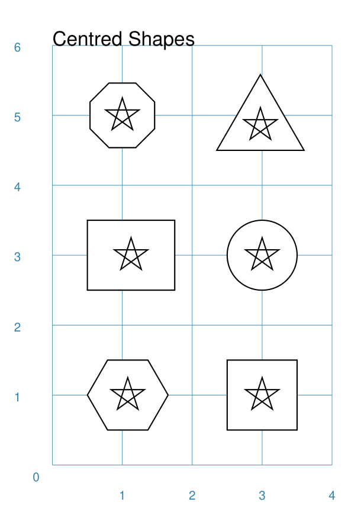

===== ======
|cs0| This example shows a number of shapes constructed as follows::

        small_star = star(radius=0.25)
        Polygon(
            cx=1, cy=5, radius=0.5, sides=8, centre_shape=small_star)
        EquilateralTriangle(
            x=2.35, y=4.5, side=1.25, centre_shape=small_star)
        Rectangle(
            x=0.5, y=2.5, height=1, width=1.25, centre_shape=small_star)
        Circle(
            cx=3, cy=3, radius=0.5, centre_shape=small_star)
        Hexagon(
            x=0.5, y=0.5, height=1, centre_shape=small_star)
        Square(
            x=2.5, y=0.5, height=1, centre_shape=small_star)

      At the start, a Star shape is defined by the lowercase ``star()`` command
      which means the shape is not drawn at this time but rather assigned to
      a named value - ``small_star`` so that it can be referred to further on.

      Each of the other shapes in the script can now use this named shape as
      their ``centre_shape``.

      Note that regardless of whether the primary shape's position is defined
      using ``x`` and ``y``, or  ``cx`` and ``cy``, the star is still drawn
      in the centre of that shape.

===== ======

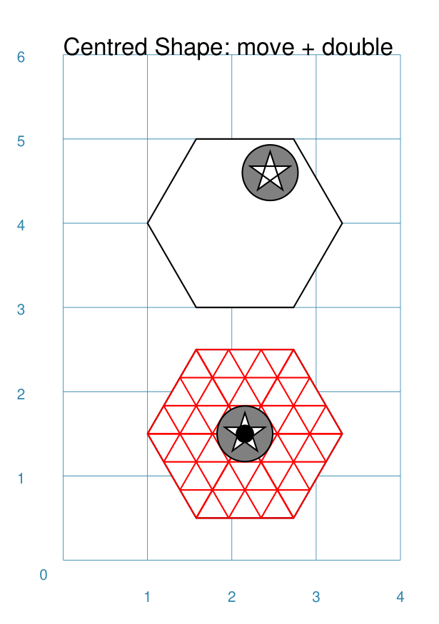

===== ======
|cs1| This example shows Hexagon shapes constructed as follows::

        small_star = star(radius=0.25)
        small_circle = circle(
            radius=0.33, fill=grey, centre_shape=small_star)
        Hexagon(x=1, y=3, height=2,
            centre_shape=small_circle,
            centre_shape_mx=0.3, centre_shape_my=0.6)
        Hexagon(
            x=1, y=0.5, height=2, hatch=5, hatch_stroke=red, dot=0.1,
            centre_shape=small_circle)

      As in the first example, the ``small_star`` is defined but not drawn.
      Then the ``small_star`` is assigned as the ``centre_shape``  to
      ``small_circle``; a shape that is also not drawn.  This circle is used
      as the ``centre_shape``  for both of the Hexagons.

      The top Hexagon shows how the centre-shape can be moved with the ``*_mx``
      and ``*_my`` values.  Positive values move it up and to the right;
      negative values move it down and to the left.

      The lower Hexagon shows how the centre-shape is drawn super-imposed
      over other features in the Hexagon, except for the ``dot``.

===== ======
