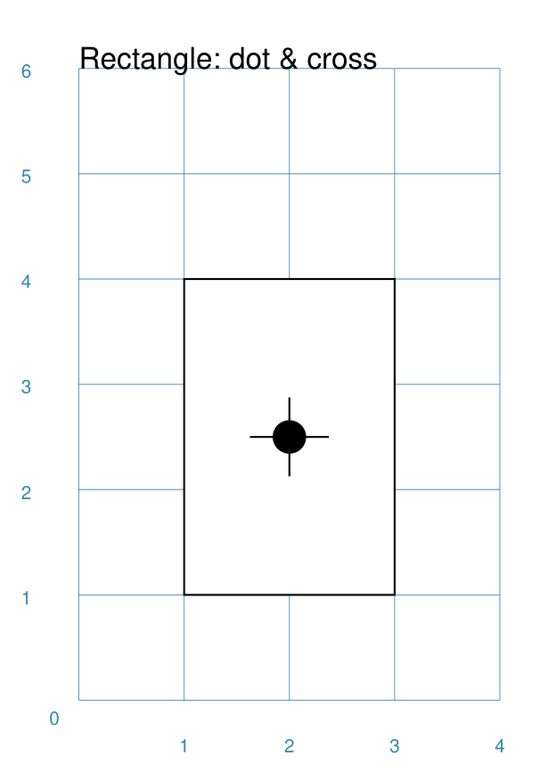
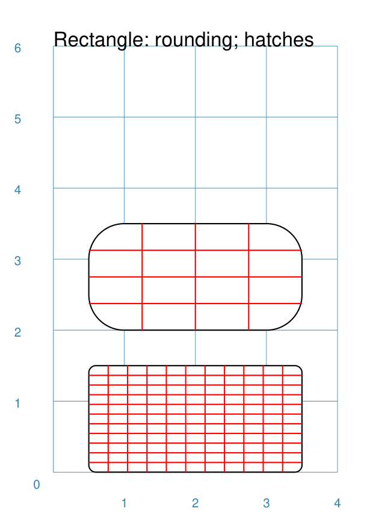
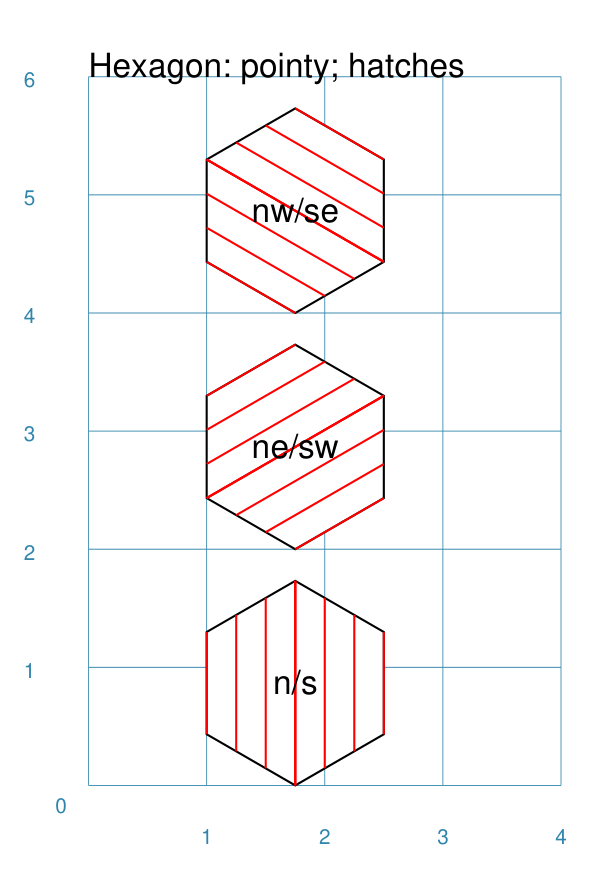
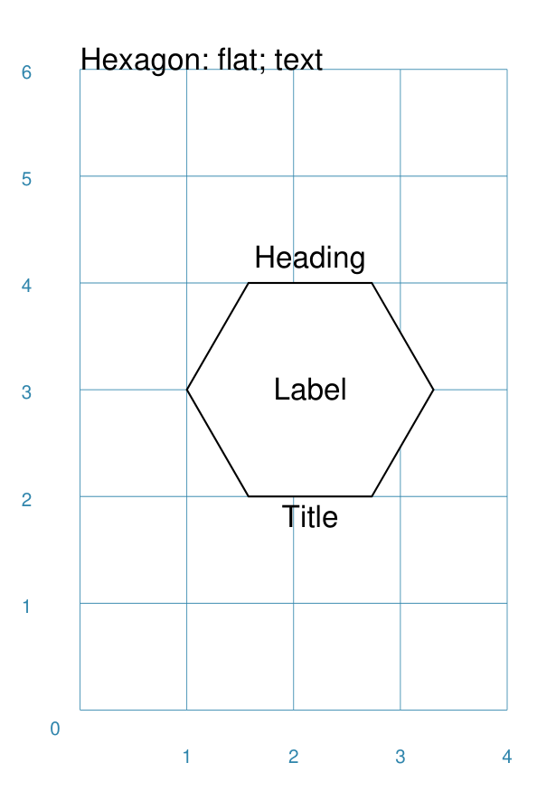
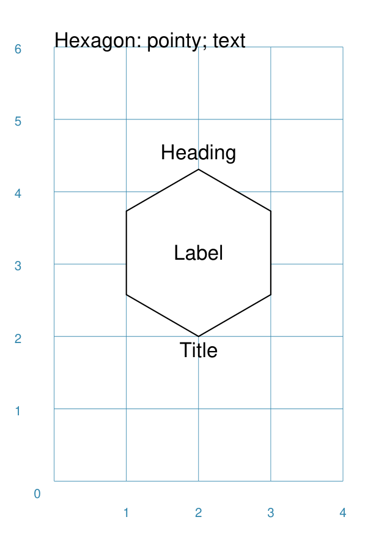

=================
Customised Shapes
=================

.. |copy| unicode:: U+000A9 .. COPYRIGHT SIGN
   :trim:
.. |deg|  unicode:: U+00B0 .. DEGREE SIGN
   :ltrim:

.. _pageIndex:

Table of Contents
=================

- `Overview`_
- `Rectangle`_
- `Hexagon`_
- `Circle`_
- `Blueprint`_

Overview
========
`↑ <pageIndex_>`_

These descriptions assume you are familiar with the concepts, terms and ideas
for **pyprototypr** as presented in `Basic Concepts <basic_concepts.md>`_ -
especially *units*, *properties* and *defaults*.

You should have already seen how these shapes were created, with defaults,
in `Core Shapes <core_shapes.md>`_.

To make it easier to see where and how a shape has been drawn, most of these
examples have been created with a background grid (which **pyprototypr**
refers to as a `Blueprint`_ shape) added to the page - a small A8 "business card"
size - for cross-reference. In addition, the default line width (aka *stroke_width*)
has been made thicker for easier viewing of the small PNG images.

.. _rectIndex:

Rectangle
=========
`↑ <pageIndex_>`_

A Rectangle is a very common shape in many designs; there are a number of ways
that it can be customised.

- `Centred <rectCentred_>`_
- `Cross and Dot <rectCross_>`_
- `Chevron <rectChevron_>`_
- `Hatch <rectHatch_>`_
- `Notch <rectNotch_>`_
- `Peak <rectPeak_>`_
- `Rotation <rectRotation_>`_
- `Rounding <rectRounding_>`_

.. _rectCentred:

Centred
-------
`^ <rectIndex_>`_

.. |rcn| image:: images/custom/rectangle/centre.png
   :width: 330

===== ======
|rcn| This example shows a Rectangle constructed using the command::

          Rectangle(cx=2, cy=3)

      It has the following properties that differ from the defaults:

      - *cx* and *cy* are used to set the centre of the Rectangle at `2` and `3`
        centimetres respectively
===== ======

.. _rectCross:

Cross and Dot
-------------
`^ <rectindex_>`_

A cross or a dot are symbols that mark the centre of the Rectangle.

===== ======
|rdc| This example shows a Rectangle constructed using the command::

          Rectangle(height=3, width=2, cross=0.75, dot=0.15)

      It has the following properties that differ from the defaults:

      - *height* and *width* are used to set the size of the Rectangle at `3`
        and `2` centimetres respectively
      - *cross* - the length of each of the two lines that cross at the centre
        is set to `0.75` cm (7.5mm)
      - *dot* - a circle with a diameter of `0.15` cm (1.5mm); the fill color
        for the dot is the same as the stroke (default is black)
===== ======

.. _rectChevron:

Chevron
-------
`^ <rectIndex_>`_

A chevron converts sides of the Rectangle into two triangular peaks that both
point in a specified direction.  This creates an arrow-like effect.

.. |rcv| image:: images/custom/rectangle/chevron.png
   :width: 330

===== ======
|rcv| This example shows Rectangles constructed using these commands::

        Rectangle(
            x=3, y=2, height=2, width=1, font_size=4,
            label="chevron:N:0.5", title="title-N", heading="head-N",
            chevron='N', chevron_height=0.5
        )
        Rectangle(
            x=0, y=2, height=2, width=1, font_size=4,
            label="chevron:S:0.5", title="title-S", heading="head-S",
            chevron='S', chevron_height=0.5
        )
        Rectangle(
            x=1, y=4.5, height=1, width=2, font_size=4,
            label="chevron:W:0.5", title="title-W", heading="head-W",
            chevron='W', chevron_height=0.5
        )
        Rectangle(
            x=1, y=0.5, height=1, width=2, font_size=4,
            label="chevron:E:0.5", title="title-E", heading="head-E",
            chevron='E', chevron_height=0.5
        )

      The Rectangles all have the following properties that differ from the defaults:

      - *x* and *y*, *height* and *width* - set the basic configuration
      - *label*, *title* and *heading* - text to describe the shape's setting
      - *chevron* - the primary compass direction in which the chevron is
        pointing; N(orth), S(outh), E(ast) or W(est)
      - *chevron_height* - the distance of the chevron peak from the side of
        the rectangle
===== ======

.. _rectHatch:

Hatch
-----
`^ <rectIndex_>`_

Hatches are a set of parallel lines that are drawn, in a specified direction, across
the length or width of the Rectangle in a vertical, horizontal or diagonal direction.

.. |rht| image:: images/custom/rectangle/hatch.png
   :width: 330

===== ======
|rht| This example shows Rectangles constructed using these commands::

        htch = Common(
          height=1.5, width=1, hatch=5, hatch_width=0.1, hatch_stroke=red)

        Rectangle(common=htch, x=0, y=0,  hatch_directions='w', label="W")
        Rectangle(common=htch, x=1.5, y=0, hatch_directions='e', label="E")
        Rectangle(common=htch, x=3, y=0, hatch_directions='ne', label="NE\nSW")

        Rectangle(common=htch, x=1.5, y=2, hatch_directions='n', label="N")
        Rectangle(common=htch, x=0, y=2,  hatch_directions='s', label="S")
        Rectangle(common=htch, x=3, y=2, hatch_directions='nw', label="NW\nSE")

        Rectangle(common=htch, x=0, y=4, label="all")
        Rectangle(common=htch, x=1.5, y=4, hatch_directions='o', label="O")
        Rectangle(common=htch, x=3, y=4, hatch_directions='d', label="D")

      These Rectangles all share the following Common properties that differ from the
      defaults:

      - *height* and *width* - set the basic configuration
      - *hatch* - sets the **number** of lines to be drawn; the spacing between them is
        equal and depends on the direction
      - *hatch_width* - set to `0.1` point; a fairly thin line
      - *hatch_stroke* - set to the color `red` to make it stand out from the sides

      Each Rectangle has its own setting for:

      - *x* and *y* - different positions on the page for the lower-left corner
      - *label* - text to help identify it
      - *hatch_directions* - if not specified, hatches will be drawn in all directions -
        otherwise:

        - `n` (North) or `s` (South) draws vertical lines;
        - `w` (West) or `e` (East) draws horizontal lines;
        - `nw` (North-West) or `se` (South-East) draws diagonal lines from top-left to
          bottom-right;
        - `ne` (North-East) or `sw` (South-West) draws diagonal lines from
          bottom-left to top-right;
        - `o` (orthogonal) draws vertical **and** horizontal lines;
        - `d` (diagonal) draws diagonal lines between all corners
===== ======

.. _rectNotch:

Notch
-----
`^ <rectIndex_>`_

Notches are small indents - or outdents - that are drawn in the corners of the
Rectangle.

.. |rnt| image:: images/custom/rectangle/notch.png
   :width: 330

.. |rns| image:: images/custom/rectangle/notch_style.png
   :width: 330

===== ======
|rnt| This example shows Rectangles constructed using these commands::

        Rectangle(
            x=2, y=1, height=2, width=1,
            label="notch:0.5", label_size=5,
            notch=0.25,
        )
        Rectangle(
            x=1, y=4, height=1, width=2,
            label="notch:.25/.5 loc: NW, SE", label_size=5,
            notch_y=0.25,  notch_x=0.5, notch_corners="NW SE",
        )

      These shares the following properties:

      - *x* and *y*, *height* and *width* - set the basic configuration
      - *label*, *label_size* - text to describe the shape's setting

      The first Rectangle has:

      - *notch* - the size of the triangular shape that will be "cut" off the
        corners of the rectangle

      The second Rectangle has:

      - *notch_x* - the distance from the corner in the x-direction where the
        notch will start
      - *notch_Y* - the distance from the corner in the Y-direction where the
        notch will start
      - *notch_corners* - the specific corners of the rectangle where the notchj will be
        applied
===== ======

===== ======
|rns| These examples shows Rectangles constructed using these commands::

        styles = Common(
          height=1, width=3.5, x=0.25, notch=0.25, label_size=7, fill=silver)

        Rectangle(
          common=styles, y=0,  notch_style='snip',
          label='Notch: snip (s)')
        Rectangle(
          common=styles, y=1.25, notch_style='step',
          label='Notch: step (t)')
        Rectangle(
          common=styles, y=2.5, notch_style='fold',
          label='Notch: fold (o)')
        Rectangle(
          common=styles, y=3.75, notch_style='flap',
          label='Notch: flap (l)')

      These Rectangles all share the following Common properties that differ from the
      defaults:

      - *height* and *width* - set the basic configuration
      - *x* - sets the position of the left edge
      - *fill* - set to the color `silver` so the interior color differs from the
        default white elsewhere
      - *notch* - sets the size of notch, in terms of distance from the corner

      Each *notch_style* results in a slightly different effect:

      - *flap* - makes it appear that the corner has a small, liftable flap
      - *fold* - makes it appear there is a crease across the corner
      - *step* - is sillohette of a step "cut out"
      - *snip* - is a small triangle "cut out"; this is the default style
===== ======

.. _rectPeak:

Peak
----
`^ <rectIndex_>`_

A peak is small triangular shape that juts out from the side of a Rectangle in
a specified direction

.. |rpk| image:: images/custom/rectangle/peak.png
   :width: 330

===== ======
|rpk| This example shows Rectangles constructed using these commands::

        Rectangle(
            x=1, y=4, width=2, height=1.5,
            font_size=6, label="points = s",
            peaks=[("s", 1), ("e", 0.25)]
        )
        Rectangle(
            x=1, y=1, width=2, height=1,
            font_size=6, label="peaks = *",
            peaks=[("*", 0.2)]
        )

      The Rectangles all have the following properties that differ from the defaults:

      - *x* and *y*, *width* and *height* - set the basic configuration
      - *label*, *font_size* - for the text to describe the shape's peak setting
      - *peaks* - the value(s) used to create the peak; this is a list, shown by the
        square brackets from `[` to `]`, of one or more sets, each enclosed by the round
        brackets, consisting of a *directions* and a peak *size*.  Directions are the
        primary compass directions - (n)orth, (s)outh, (e)ast and (w)est, and sizes are
        the distances of the centre of the peak from the edge of the Rectangle.
        As a short-cut the direction value of `*` means that peaks are drawn in all
        four directions.
===== ======

.. _rectRotation:

Rotation
--------
`^ <rectIndex_>`_

.. |rrt| image:: images/custom/rectangle/rotation.png
   :width: 330

Rotation takes place in anti-clockwise direction, from the horizontal, around
the centre of the Rectangle.

===== ======
|rrt| This example shows Rectangles constructed using the commands::

        Rectangle(cx=2, cy=3, width=1.5, height=3, dot=0.06)
        Rectangle(
            cx=2, cy=3, width=1.5, height=3, fill=None,
            stroke=red, stroke_width=.3, rotation=45, dot=0.04)

      It has the following properties:

      - ...
      - ...
===== ======

.. _rectRounding:

Rounding
--------
`^ <rectIndex_>`_

===== ======
|rnd| This example shows a Rectangle constructed using the command::

          Rectangle()

      It has the following properties:

      - ...
      - ...
===== ======

.. _hexIndex:

Hexagon
=======
`↑ <pageIndex_>`_

A key property for a hexagon is its *orientation*; this can either be *flat*,
which is the default, or *pointy*. The examples below show how commands can be
applied to each.

.. _hexCentre:

Centre
------
`^ <hexIndex_>`_

.. |hcn| image:: images/custom/hexagon/centre.png
   :width: 330

===== ======
|hcn| This example shows Hexagons constructed using these commands::

          Hexagon(cx=2, cy=1)
          Hexagon(cx=2, cy=3, orientation='pointy')

      These have the following properties:

      - ...
      - ...
===== ======

.. _hexCross:

Dot & Cross
-----------
`^ <hexIndex_>`_

.. |hcd| image:: images/custom/hexagon/dot_cross.png
   :width: 330

===== ======
|hcd| This example shows Hexagons constructed using these commands::

        Hexagon(x=-0.25, y=4, height=2,
                dot=0.1, dot_stroke=red)
        Hexagon(x=1.75, y=3.5, height=2,
                cross=0.25, cross_stroke=red, cross_stroke_width=1)

        Hexagon(x=0, y=1, height=2,
                dot=0.1, dot_stroke=red,
                orientation='pointy')
        Hexagon(x=2, y=1, height=2,
                cross=0.25, cross_stroke=red, cross_stroke_width=1,
                orientation='pointy')

      It has the following properties:

      - ...
      - ...
===== ======

.. _hexHachFlat:

Hatch: Flat
-----------
`^ <hexIndex_>`_

.. |hhf| image:: images/custom/hexagon/hatch_flat.png
   :width: 330

===== ======
|hhf| This example shows Hexagons constructed using these commands::

        hxgn = Common(height=1.5, hatch=5, hatch_stroke=red, orientation='flat')
        Hexagon(common=hxgn, x=2, y=0, hatch_directions='e', label="e/w")
        Hexagon(common=hxgn, x=2, y=2, hatch_directions='ne', label="ne/sw")
        Hexagon(common=hxgn, x=2, y=4, hatch_directions='nw', label="nw/se")

      These have the following properties:

      - ...
      - ...
===== ======

.. _hexHatchPointy:

Hatch: Pointy
-------------
`^ <hexIndex_>`_

===== ======
|hhp| This example shows a Hexagon constructed using the command::

        hxgn = Common(height=1.5, hatch=5, hatch_stroke=red, orientation='pointy')
        Hexagon(common=hxgn, x=2, y=0, hatch_directions='n', label="n/s")
        Hexagon(common=hxgn, x=2, y=2, hatch_directions='ne', label="ne/sw")
        Hexagon(common=hxgn, x=2, y=4, hatch_directions='nw', label="nw/se")

      These have the following properties:

      - ...
      - ...
===== ======

.. _hexRadii:

Radii
-----
`^ <hexIndex_>`_

Radii are like spokes of a bicyle wheel; they are drawn from the vertices
towards the centre of a shape.

Radii: Flat
-----------
`^ <hexIndex_>`_

.. |hrf| image:: images/custom/hexagon/radii_flat.png
   :width: 330

===== ======
|hrf| This example shows a Hexagon constructed using the command::

        hxg = Common(
            height=1.5, font_size=8,
            dot=0.05, dot_stroke=red,
            orientation="flat")

        Hexagon(common=hxg, x=0.25, y=0.25, radii='sw', label="SW")
        Hexagon(common=hxg, x=0.25, y=2.15, radii='w', label="W")
        Hexagon(common=hxg, x=0.25, y=4, radii='nw', label="NW")
        Hexagon(common=hxg, x=2.25, y=4, radii='ne', label="NE")
        Hexagon(common=hxg, x=2.25, y=2.15, radii='e', label="E")
        Hexagon(common=hxg, x=2.25, y=0.25, radii='se', label="SE")

      These have the following properties:

      - *common* - all Hexagons drawn with the Common value of `hxg` will
        share the same properties; height, font size, dot and orientation
      - *x* and *y* to set the lower-left position
      - *radii* - a compass direction in which the radius is drawn
        (centre to vertex)
      - *label* - the text displayed in the centre
===== ======

Radii: Pointy
-------------
`^ <hexIndex_>`_

.. |hrp| image:: images/custom/hexagon/radii_pointy.png
   :width: 330

===== ======
|hrp| This example shows a Hexagon constructed using the command::

        hxg = Common(
            height=1.5, font_size=8,
            dot=0.05, dot_stroke=red,
            orientation="pointy")
        Hexagon(common=hxg, x=0.25, y=0.25, radii='sw', label="SW")
        Hexagon(common=hxg, x=0.25, y=2.15, radii='nw', label="NW")
        Hexagon(common=hxg, x=0.25, y=4, radii='n', label="N")
        Hexagon(common=hxg, x=2.25, y=4, radii='ne', label="NE")
        Hexagon(common=hxg, x=2.25, y=0.25, radii='s', label="S")
        Hexagon(common=hxg, x=2.25, y=2.15, radii='se', label="SE")

      These have the following properties:

      - *common* - all Hexagons drawn with the Common value of `hxg` will
        share the same properties; height, font size, dot and orientation
      - *x* and *y* to set the lower-left position
      - *radii* - a compass direction in which the radius is drawn
        (centre to vertex)
      - *label* - the text displayed in the centre
===== ======

.. _hexText:

Text: Flat
----------
`^ <hexIndex_>`_

===== ======
|htf| This example shows a Hexagon constructed using this command::

        Hexagon(
            y=2,
            height=2,
            title="Title",
            label="Label",
            heading="Heading")

      It has the following properties:

      - ...
      - ...
===== ======

Text: Pointy
------------
`^ <hexIndex_>`_

===== ======
|htp| This example shows a Hexagon constructed using the command::

        Hexagon(
            y=2,
            height=2,
            orientation='pointy',
            title="Title",
            label="Label",
            heading="Heading")

      It has the following properties:

      - ...
      - ...
===== ======

.. _circleIndex:

Circle
======
`↑ <pageIndex_>`_

A Circle is a very common shape in many designs; it provides a numbers of
ways that it can be customised.

.. _blueprintIndex:

Blueprint
=========
`↑ <pageIndex_>`_

This shape is primarily intended to support drawing while it is "in progress".
It provides a quick and convenient way to orientate and place other shapes
that *are* required for the final product.  Typically one would just comment
out the command when its purpose has been served.

.. _blueSub:

Subdivisions - dotted
---------------------
`↑ <blueprintIndex_>`_

.. |bl2| image:: images/custom/blueprint/subdivisions.png
   :width: 330

===== ======
|bl2| This example shows the shape constructed using the command with these
      properties::

          Blueprint(subdivisions=5, stroke_width=0.5)

      It has the following properties set:

      - *subdivisions* - set to `5`; these are the number of thinner lines that
        are drawn between each pair of primary lines - they do not have any
        numbering and are *dotted*
      - *stroke_width* - set to `0.5`; this slightly thicker primary line makes
        the grid more visible
===== ======
