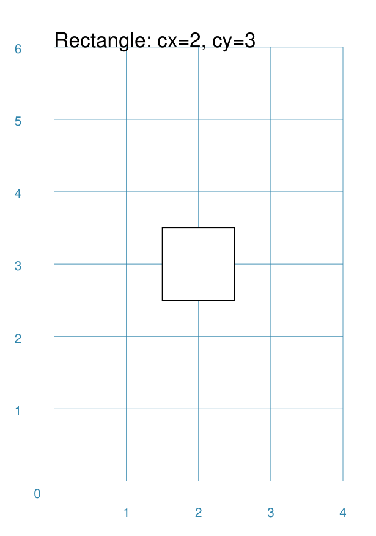
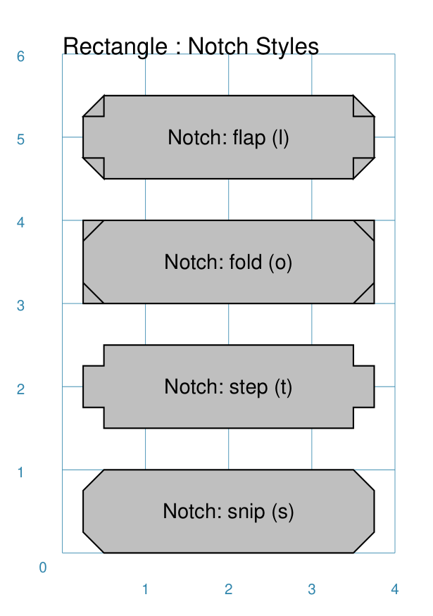

=================
Customised Shapes
=================

.. |copy| unicode:: U+000A9 .. COPYRIGHT SIGN
   :trim:
.. |deg|  unicode:: U+00B0 .. DEGREE SIGN
   :ltrim:

.. _pageIndex:

Table of Contents
=================

- `Overview`_
- `Rectangle`_
- `Hexagon`_
- `Circle`_
- `Blueprint`_
 
Overview
========

Rectangle
=========

Centred
-------
`^ <pageIndex_>`_

===== ======
|rcn| This example shows a Rectangle constructed using the command::

          Rectangle()

      It has the following properties:

      - ...
      - ...
===== ======

Cross and Dot
-------------
`^ <pageIndex_>`_

.. |rdc| image:: images/custom/rectangle/dot_cross.png
   :width: 300

===== ======
|rdc| This example shows a Rectangle constructed using the command::

          Rectangle()

      It has the following properties:

      - ...
      - ...
===== ======

Chevron
-------
`^ <pageIndex_>`_

.. |rcv| image:: images/custom/rectangle/chevron.png
   :width: 300

===== ======
|rcv| This example shows a Rectangle constructed using the command::

          Rectangle()

      It has the following properties:

      - ...
      - ...
===== ======

Hatch
-----
`^ <pageIndex_>`_

.. |rht| image:: images/custom/rectangle/hatch.png
   :width: 300

===== ======
|rht| This example shows a Rectangle constructed using the command::

          Rectangle()

      It has the following properties:

      - ...
      - ...
===== ======

Notch
-----
`^ <pageIndex_>`_

.. |rnt| image:: images/custom/rectangle/notch.png
   :width: 300

===== ======
|rnt| This example shows a Rectangle constructed using the command::

          Rectangle()

      It has the following properties:

      - ...
      - ...
===== ======

===== ======
|rns| These examples shows a Rectangle constructed using the command::

          Rectangle()

      Each style type results in a slightly different effect:

      - ...
      - ...
===== ======

Peak
----
`^ <pageIndex_>`_

.. |rpk| image:: images/custom/rectangle/peak.png
   :width: 300

===== ======
|rpk| This example shows a Rectangle constructed using the command::

          Rectangle()

      It has the following properties:

      - ...
      - ...
===== ======

Rotation
--------
`^ <pageIndex_>`_

.. |rrt| image:: images/custom/rectangle/rotation.png
   :width: 300

===== ======
|rrt| This example shows a Rectangle constructed using the command::

          Rectangle()

      It has the following properties:

      - ...
      - ...
===== ======

Rounding
--------
`^ <pageIndex_>`_

.. |rnd| image:: images/custom/rectangle/rounding.png
   :width: 300

===== ======
|rnd| This example shows a Rectangle constructed using the command::

          Rectangle()

      It has the following properties:

      - ...
      - ...
===== ======

Hexagon
=======

A key property for a hexagon is its *orientation*

Centre
------
`^ <pageIndex_>`_

.. |hcn| image:: images/custom/hexagon/centre.png
   :width: 300

===== ======
|hcn| This example shows a Hexagon constructed using the command::

          Hexagon()

      It has the following properties:

      - ...
      - ...
===== ======

Cross & Dot
-----------
`^ <pageIndex_>`_

.. |hcd| image:: images/custom/hexagon/dot_cross.png
   :width: 300

===== ======
|hcd| This example shows a Hexagon constructed using the command::

          Hexagon()

      It has the following properties:

      - ...
      - ...
===== ======

Cross & Dot
-----------
`^ <pageIndex_>`_

.. |hcd| image:: images/custom/hexagon/dot_cross.png
   :width: 300

===== ======
|hcd| This example shows a Hexagon constructed using the command::

          Hexagon()

      It has the following properties:

      - ...
      - ...
===== ======

Hatch
-----------
`^ <pageIndex_>`_

.. |hht| image:: images/custom/hexagon/hatch.png
   :width: 300

===== ======
|hht| This example shows a Hexagon constructed using the command::

          Hexagon()

      It has the following properties:

      - ...
      - ...
===== ======

Radii
-----
`^ <pageIndex_>`_

.. |hrf| image:: images/custom/hexagon/radii_flat.png
   :width: 300

.. |hrp| image:: images/custom/hexagon/radii_pointy.png
   :width: 300

Radii are like spokes of a bicyle wheel; they are drawn from the centre of
a shape towards its vertices.  

===== ======
|hrf| This example shows a flat Hexagon constructed using the command::

          Hexagon()

      It has the following properties:

      - ...
      - ...
===== ======

Text
----
`^ <pageIndex_>`_

.. |htf| image:: images/custom/hexagon/text_flat.png
   :width: 300

.. |htp| image:: images/custom/hexagon/text_pointy.png
   :width: 300

===== ======
|htf| This example shows a flat Hexagon constructed using the command::

          Hexagon()

      It has the following properties:

      - ...
      - ...
===== ======

===== ======
|htp| This example shows a pointy Hexagon constructed using the command::

          Hexagon()

      It has the following properties:

      - ...
      - ...
===== ======

Circle
======

Blueprint
=========
