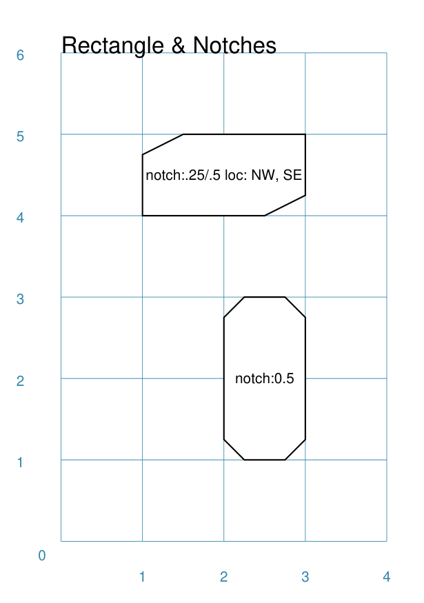
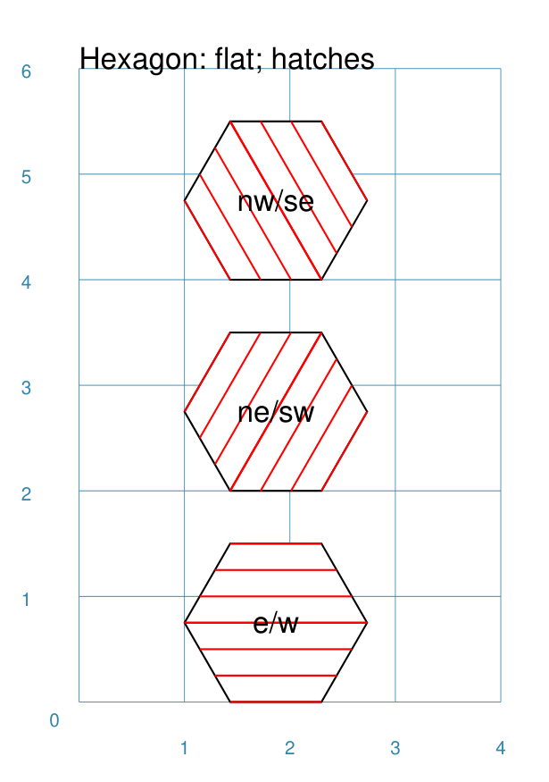
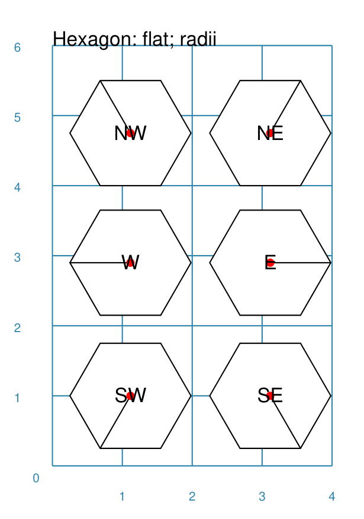
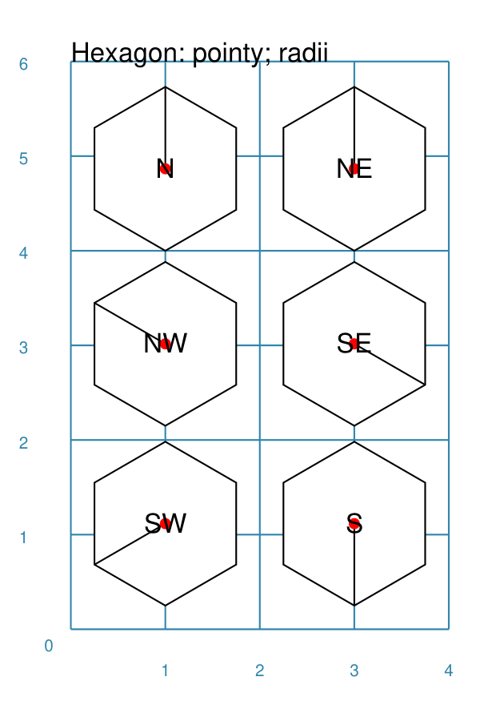
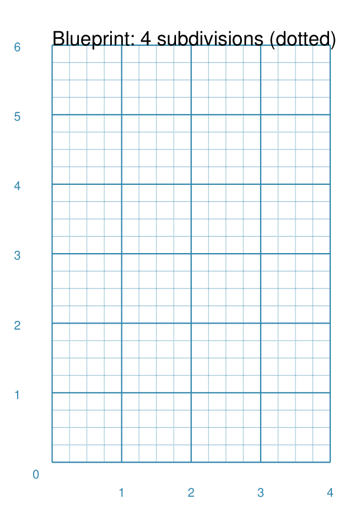

=================
Customised Shapes
=================

.. |copy| unicode:: U+000A9 .. COPYRIGHT SIGN
   :trim:
.. |deg|  unicode:: U+00B0 .. DEGREE SIGN
   :ltrim:

.. _pageIndex:

Table of Contents
=================

- `Overview`_
- `Rectangle`_
- `Hexagon`_
- `Circle`_
- `Blueprint`_

Overview
========
`↑ <pageIndex_>`_

Rectangle
=========
`↑ <pageIndex_>`_

A Rectangle is a very common shape in many designs; it provides a numbers of
ways that it can be customised.

Centred
-------
`^ <pageIndex_>`_

.. |rcn| image:: images/custom/rectangle/centre.png
   :width: 330

===== ======
|rcn| This example shows a Rectangle constructed using the command::

          Rectangle()

      It has the following properties:

      - ...
      - ...
===== ======

Cross and Dot
-------------
`^ <pageindex_>`_

.. |rdc| image:: images/custom/rectangle/dot_cross.png
   :width: 330

===== ======
|rdc| This example shows a Rectangle constructed using the command::

          Rectangle()

      It has the following properties:

      - ...
      - ...
===== ======

Chevron
-------
`^ <pageIndex_>`_

===== ======
|rcv| This example shows a Rectangle constructed using the command::

          Rectangle()

      It has the following properties:

      - ...
      - ...
===== ======

Hatch
-----
`^ <pageIndex_>`_

.. |rht| image:: images/custom/rectangle/hatch.png
   :width: 330

===== ======
|rht| This example shows a Rectangle constructed using the command::

          Rectangle()

      It has the following properties:

      - ...
      - ...
===== ======

Notch
-----
`^ <pageIndex_>`_

.. |rns| image:: images/custom/rectangle/notch_style.png
   :width: 330

===== ======
|rnt| This example shows a Rectangle constructed using the command::

          Rectangle()

      It has the following properties:

      - ...
      - ...
===== ======

===== ======
|rns| These examples shows a Rectangle constructed using the command::

          Rectangle()

      Each style type results in a slightly different effect:

      - ...
      - ...
===== ======

Peak
----
`^ <pageIndex_>`_

.. |rpk| image:: images/custom/rectangle/peak.png
   :width: 330

===== ======
|rpk| This example shows a Rectangle constructed using the command::

          Rectangle()

      It has the following properties:

      - ...
      - ...
===== ======

Rotation
--------
`^ <pageIndex_>`_

.. |rrt| image:: images/custom/rectangle/rotation.png
   :width: 330

===== ======
|rrt| This example shows a Rectangle constructed using the command::

          Rectangle()

      It has the following properties:

      - ...
      - ...
===== ======

Rounding
--------
`^ <pageIndex_>`_

.. |rnd| image:: images/custom/rectangle/rounding.png
   :width: 330

===== ======
|rnd| This example shows a Rectangle constructed using the command::

          Rectangle()

      It has the following properties:

      - ...
      - ...
===== ======

.. _hexIndex:

Hexagon
=======
`↑ <pageIndex_>`_

A key property for a hexagon is its *orientation*; this can either be *flat*,
which is the default, or *pointy*. The examples below show how commands can be
applied to each.

Centre
------
`^ <hexIndex_>`_

===== ======
|hcn| This example shows Hexagons constructed using these commands::

          Hexagon(cx=2, cy=1)
          Hexagon(cx=2, cy=3, orientation='pointy')

      These have the following properties:

      - ...
      - ...
===== ======

Dot & Cross
-----------
`^ <hexIndex_>`_

.. |hcd| image:: images/custom/hexagon/dot_cross.png
   :width: 330

===== ======
|hcd| This example shows Hexagons constructed using these commands::

        Hexagon(x=-0.25, y=4, height=2,
                dot=0.1, dot_stroke=red)
        Hexagon(x=1.75, y=3.5, height=2,
                cross=0.25, cross_stroke=red, cross_stroke_width=1)

        Hexagon(x=0, y=1, height=2,
                dot=0.1, dot_stroke=red,
                orientation='pointy')
        Hexagon(x=2, y=1, height=2,
                cross=0.25, cross_stroke=red, cross_stroke_width=1,
                orientation='pointy')

      It has the following properties:

      - ...
      - ...
===== ======

Hatch: Flat
-----------
`^ <hexIndex_>`_

===== ======
|hhf| This example shows Hexagons constructed using these commands::

        hxgn = Common(height=1.5, hatch=5, hatch_stroke=red, orientation='flat')
        Hexagon(common=hxgn, x=2, y=0, hatch_directions='e', label="e/w")
        Hexagon(common=hxgn, x=2, y=2, hatch_directions='ne', label="ne/sw")
        Hexagon(common=hxgn, x=2, y=4, hatch_directions='nw', label="nw/se")

      These have the following properties:

      - ...
      - ...
===== ======

Hatch: Pointy
-------------
`^ <hexIndex_>`_

.. |hhp| image:: images/custom/hexagon/hatch_pointy.png
   :width: 330

===== ======
|hhp| This example shows a Hexagon constructed using the command::

        hxgn = Common(height=1.5, hatch=5, hatch_stroke=red, orientation='pointy')
        Hexagon(common=hxgn, x=2, y=0, hatch_directions='n', label="n/s")
        Hexagon(common=hxgn, x=2, y=2, hatch_directions='ne', label="ne/sw")
        Hexagon(common=hxgn, x=2, y=4, hatch_directions='nw', label="nw/se")

      These have the following properties:

      - ...
      - ...
===== ======

Radii
-----
`^ <hexIndex_>`_

Radii are like spokes of a bicyle wheel; they are drawn from the vertices
towards the centre of a shape.

Radii: Flat
-----------
`^ <hexIndex_>`_

===== ======
|hrf| This example shows a Hexagon constructed using the command::

        hxg = Common(
            height=1.5, font_size=8,
            dot=0.05, dot_stroke=red,
            orientation="flat")

        Hexagon(common=hxg, x=0.25, y=0.25, radii='sw', label="SW")
        Hexagon(common=hxg, x=0.25, y=2.15, radii='w', label="W")
        Hexagon(common=hxg, x=0.25, y=4, radii='nw', label="NW")
        Hexagon(common=hxg, x=2.25, y=4, radii='ne', label="NE")
        Hexagon(common=hxg, x=2.25, y=2.15, radii='e', label="E")
        Hexagon(common=hxg, x=2.25, y=0.25, radii='se', label="SE")

      These have the following properties:

      - *common* - all Hexagons drawn with the Common value of `hxg` will
        share the same properties; height, font size, dot and orientation
      - *x* and *y* to set the lower-left position
      - *radii* - a compass direction in which the radius is drawn
        (centre to vertex)
      - *label* - the text displayed in the centre
===== ======

Radii: Pointy
-------------
`^ <hexIndex_>`_

===== ======
|hrp| This example shows a Hexagon constructed using the command::

        hxg = Common(
            height=1.5, font_size=8,
            dot=0.05, dot_stroke=red,
            orientation="pointy")
        Hexagon(common=hxg, x=0.25, y=0.25, radii='sw', label="SW")
        Hexagon(common=hxg, x=0.25, y=2.15, radii='nw', label="NW")
        Hexagon(common=hxg, x=0.25, y=4, radii='n', label="N")
        Hexagon(common=hxg, x=2.25, y=4, radii='ne', label="NE")
        Hexagon(common=hxg, x=2.25, y=0.25, radii='s', label="S")
        Hexagon(common=hxg, x=2.25, y=2.15, radii='se', label="SE")

      These have the following properties:

      - *common* - all Hexagons drawn with the Common value of `hxg` will
        share the same properties; height, font size, dot and orientation
      - *x* and *y* to set the lower-left position
      - *radii* - a compass direction in which the radius is drawn
        (centre to vertex)
      - *label* - the text displayed in the centre
===== ======

Text: Flat
----------
`^ <hexIndex_>`_

.. |htf| image:: images/custom/hexagon/hatch_text_flat.png
   :width: 330

===== ======
|htf| This example shows a Hexagon constructed using this command::

        Hexagon(
            y=2,
            height=2,
            title="Title",
            label="Label",
            heading="Heading")

      It has the following properties:

      - ...
      - ...
===== ======

Text: Pointy
------------
`^ <hexIndex_>`_

.. |htp| image:: images/custom/hexagon/hatch_text_pointy.png
   :width: 330

===== ======
|htp| This example shows a Hexagon constructed using the command::

        Hexagon(
            y=2,
            height=2,
            orientation='pointy',
            title="Title",
            label="Label",
            heading="Heading")

      It has the following properties:

      - ...
      - ...
===== ======

.. _circleIndex:

Circle
======
`↑ <pageIndex_>`_

A Circle is a very common shape in many designs; it provides a numbers of
ways that it can be customised.

.. _blueprintIndex:

Blueprint
=========
`↑ <pageIndex_>`_

This shape is primarily intended to support drawing while it is "in progress".
It provides a quick and convenient way to orientate and place other shapes
that *are* required for the final product.  Typically one would just comment
out the command when its purpose has been served.

Subdivisions - dotted
---------------------
`↑ <blueprintIndex_>`_

===== ======
|bl2| This example shows the shape constructed using the command with these
      properties::

          Blueprint(subdivisions=5, stroke_width=0.5)

      It has the following properties set:

      - *subdivisions* - set to `5`; these are the number of thinner lines that
        are drawn between each pair of primary lines - they do not have any
        numbering and are *dotted*
      - *stroke_width* - set to `0.5`; this slightly thicker primary line makes
        the grid more visible
===== ======
