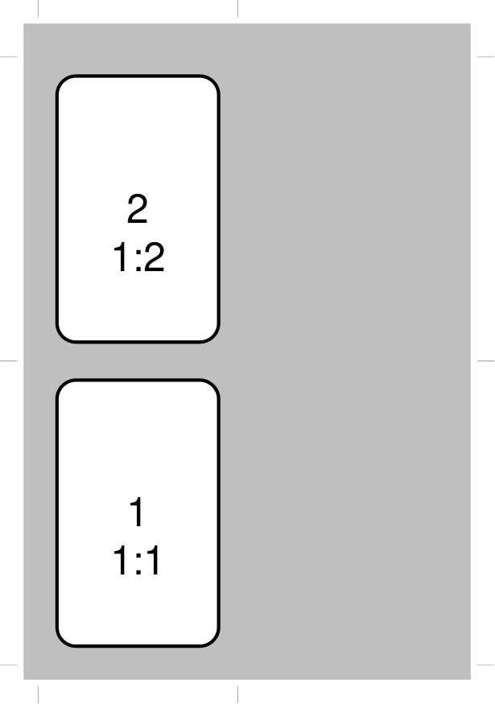

================
The Deck Command
================

This section assumes you are very familiar with the concepts, terms and
ideas for `pyprototypr <index.rst>`_ as presented in the
`Basic Concepts <basic_concepts.rst>`_ , that you understand all of the
`Additional Concepts <additional_concepts.rst>`_
and that you've created some basic scripts of your own using the
`Core Shapes <core_shapes.rst>`_.

It also assumes you have read through the section on
`card decks <card_decks.rst>`_.

.. _table-of-contents:

Table of Contents
=================

- `Overview`_

  - `Primary Properties`_
  - `Secondary Properties`_
- `Property Examples`_

Overview
========
`↑ <table-of-contents_>`_

This command provides the overall "framework" for the cards that are defined
in the script.  It's primary purpose is to set the card size, and then
calculate how many cards appear on a page.  It manages the "flow" of cards as
they get drawn.

Primary Properties
------------------

The following are key properties that will usually need to be set for a
``Deck``:

- **cards** - this is the number of cards appearing in the deck; it defaults
  to 9; note that other commands such as ``Data()`` and ``Matrix()`` can alter
  this value
- **height** - this is the card height for a rectangular card;
  it defaults to 8.8 cm
- **width** - this is the card width for a rectangular card;
  it defaults to 6.3 cm

Secondary Properties
--------------------

The following are other properties that can also be set for a ``Deck``:

- **cols** - the maximum number of card columns that should appear on a
  page
- **copy** - the name of a column in the dataset defined by
  `the Data Command <card_decks.rst#the-data-command>`_) that specifies
  how many copies of a card are needed
- **fill** - sets the color of the card's area; defaults to white
- **frame** - the default card frame is a rectangle (or square, if the
  height and width match); but can be set to *hexagon* or *circle*
- **grid_marks** - if set to ``True``, will cause small marks (``1`` cm in
  length) to be drawn at the border of the page that align with the edges of
  the card frames
- **grid_length** - if set to ``True``, will cause small marks to be drawn at
  the border of the page that align with the edges of the cards
- **mask** - an expression which should evaluate to ``True` or ``False``;
  this expression uses the same kind of syntax as the
  `T(emplate) command <card_decks.rst#the-template-command>`_
  and it uses data available from the Deck's
  `Data Command <card_decks.rst#the-data-command>`_); if ``True``
  then any matching cards will be masked i.e. ignored and not drawn
- **radius** - this is a circular or hexagonal card *frame*'s radius;
  it defaults to 2.54 cm (1"
- **rounding** - sets the size of rounding on each corner of a rectangular
  frame card
- **rows** - the maximum number of card rows that should appear on a page
- **stroke** - sets the color of the card's border; defaults to black

.. _property-examples:

Property Examples
=================
`↑ <table-of-contents_>`_

- `Example 1. Defaults`_
- `Example 2. Card bleed`_
- `Example 3. Full bleed`_
- `Example 4. Offset`_
- `Example 5. Grid Marks`_
- `Example 6. Card Spacing`_
- `Example 7. Clean Layout`_
- `Example 8. Column Limit`_
- `Example 9. Row Limit`_
- `Example 10. Circular Frame`_

These examples are shown on a small A8-sized page, as the purpose is to
illustrate how the Deck properties are used; normally cards would be
set out on an A4- or Letter-sized page, but the principle will be the
same.

In all cases, for rectangular cards, a basic ``Rectangle``, with a thick
border, is used as the shape that is drawn on each card.  This purely for
illustration purposes - your cards would have their own set of shapes
that would you want to display.

The ``Rectangle`` also has its *label* set to show the Card's *sequence*
number i.e. the order in  which it is drawn (usually bottom-to-top and
left-to-right), followed by its *column* and *row* number.
The script for all this is:

  .. code:: python

    Card(
        '*',
        rectangle(
            x=0.2, y=0.2,
            width=1.7, height=2.8,
            stroke_width=1, rounding=0.2,
            label='{{sequence}}\n{{id}}')
    )

In your script, the ``Deck()`` command should appear first, followed
by one or more ``Card()`` commands.

.. HINT::

  Remember that **any number** of ``Card()`` commands, each drawing one or
  more shapes on one or more cards, can be used in a script!

Example 1. Defaults
-------------------
`^ <property-examples_>`_

===== ======
|d01| This example shows the definition of a deck for a set of small
      cards.

      The card size means that there will be 4 rectangular cards on each
      A8 page:

      .. code:: python

        Deck(
            cards=4,
            height=3.2,
            width=2.1)

      The outline for

===== ======

Example 2. Card bleed
---------------------
`^ <property-examples_>`_

===== ======
|d02| This example shows the definition of a deck for a set of small
      cards. The card size means that there will be 4 rectangular cards
      on each A8 page:

      .. code:: python

        Deck(
            cards=4,
            height=3.2,
            width=2.1,
            fill=silver)

===== ======

Example 3. Full bleed
---------------------
`^ <property-examples_>`_

===== ======
|d03| This example shows the definition of a deck for a set of small
      cards. The card size means that there will be 4 rectangular cards
      on each A8 page:

      .. code:: python

        Deck(
            cards=4,
            height=3.2,
            width=2.1,
            fill=silver,
            bleed_fill=grey)

===== ======

Example 4. Offset
-----------------
`^ <property-examples_>`_

===== ======
|d04| This example shows the definition of a deck for a set of small
      cards. The card size means that there will be 4 rectangular cards
      on each A8 page:

      .. code:: python

        Deck(
            cards=4,
            height=3.2,
            width=2.1,
            stroke=red,
            fill=silver,
            bleed_fill=grey,
            offset=0.25)

===== ======

Example 5. Grid Marks
---------------------
`^ <property-examples_>`_

.. |d05| image:: images/decks/cards_deck_05.png
   :width: 330

===== ======
|d05| This example shows the definition of a deck for a set of small
      cards. The card size means that there will be 4 rectangular cards
      on each A8 page:

      .. code:: python

        Deck(
            cards=4,
            height=3.2,
            width=2.1,
            stroke=red,
            bleed_fill=silver,
            offset=0.25,
            grid_marks=True,
            grid_length=0.18)

===== ======

Example 6. Card Spacing
-----------------------
`^ <property-examples_>`_

===== ======
|d06| This example shows the definition of a deck for a set of small
      cards. The card size means that there will be 4 rectangular cards
      on each A8 page:

      .. code:: python

        Deck(
            cards=4,
            height=3.2,
            width=2.1,
            stroke=red,
            bleed_fill=silver,
            offset=0.15,
            grid_marks=True,
            grid_length=0.18,
            spacing=0.1,
            spacing_y=0.15)

===== ======

Example 7. Clean Layout
-----------------------
`^ <property-examples_>`_

===== ======
|d07| This example shows the definition of a deck for a set of small
      cards. The card size means that there will be 4 rectangular cards
      on each A8 page:

      .. code:: python

        Deck(
            cards=4,
            height=3.2,
            width=2.1,
            stroke=None,
            bleed_fill=silver,
            offset=0.15,
            grid_marks=True,
            grid_length=0.18,
            spacing=0.15)

===== ======

Example 8. Column Limit
-----------------------
`^ <property-examples_>`_

===== ======
|d08| This example shows the definition of a deck for a set of small
      cards. The card size means that there will be 4 rectangular cards
      on each A8 page:

      .. code:: python

        Deck(
            cards=4,
            height=3.2,
            width=2.1,
            stroke=None,
            bleed_fill=silver,
            offset=0.15,
            grid_marks=True,
            grid_length=0.18,
            cols=1)

===== ======

Example 9. Row Limit
--------------------
`^ <property-examples_>`_

===== ======
|d09| This example shows the definition of a deck for a set of small
      cards. The card size means that there will be 4 rectangular cards
      on each A8 page:

      .. code:: python

        Deck(
            cards=4,
            height=3.2,
            width=2.1,
            stroke=None,
            bleed_fill=silver,
            offset=0.15,
            grid_marks=True,
            grid_length=0.18,
            rows=1)

===== ======

Example 10. Circular Frame
--------------------------
`^ <property-examples_>`_

===== ======
|d10| This example shows the definition of a deck for a set of small
      cards. The card size means that there will be 6 circular cards
      on each A8 page:

      .. code:: python

        Deck(
            cards=6,
            radius=1,
            bleed_fill=silver,
            offset=0.15,
            grid_marks=True,
            grid_length=0.18,
            spacing=0.15,
            frame='circle')

      The **frame** property also can be seen "in action" in various
      examples; see a `hexagonal example <examples/cards.rst#hexagon-cards>`_
      and another `circular example <examples/cards.rst#circle-cards>`_.

===== ======
