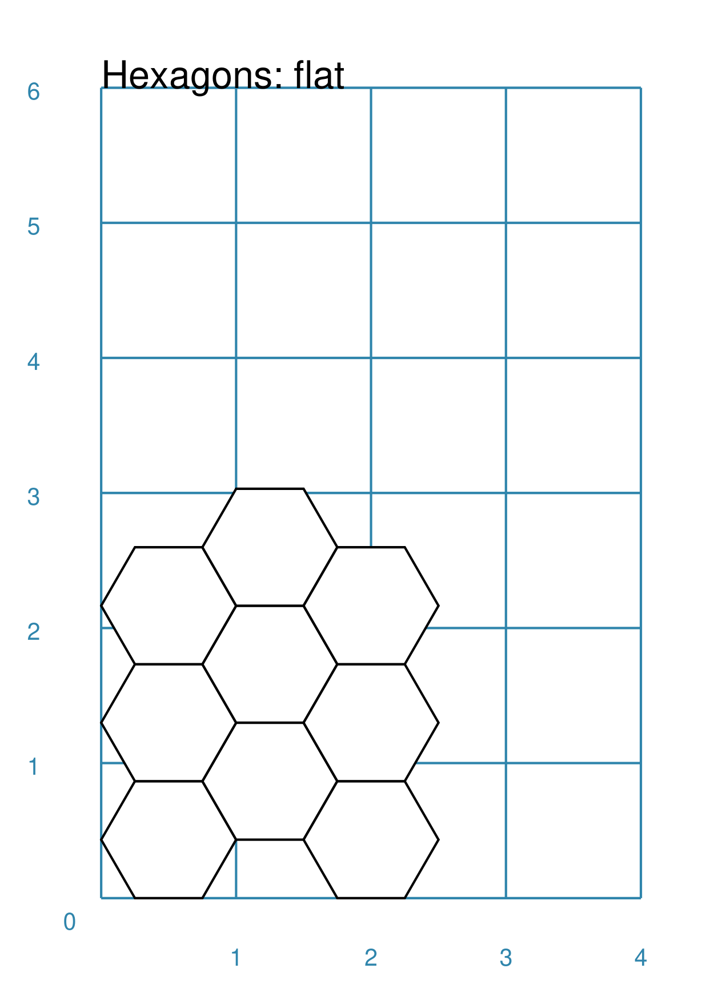

===============
Hexagonal Grids
===============

.. |copy| unicode:: U+000A9 .. COPYRIGHT SIGN
   :trim:
.. |deg|  unicode:: U+00B0 .. DEGREE SIGN
   :ltrim:

Hexagonal grids are now widely used in the table top gaming industry.

They are particularly suitable in providing an overlay for maps and have been
used for decades in war games and role playing games, but can also act as grids
or tiles in regular board games.

.. _pageIndex:

Table of Contents
=================

- `Overview`_
- `Rectangular Hexagonal Grid`_
- `Circular Hexagonal Grid`_
- `Footnotes`_

Overview
========
`↑ <pageIndex_>`_

These descriptions assume you are familiar with the concepts, terms and ideas
for **pyprototypr** as presented in `Basic Concepts <basic_concepts.rst>`_ -
especially *units*, *properties* and *defaults*.

You should have already seen how a single Hexagon and a basic grid of Hexagons
are created using defaults, in `Core Shapes <core_shapes.rst#hexagon>`_. You
should also have seen how a single Hexagon can be further enhanced in
`Customised Shapes <customised_shapes.rst#hexagon>`_.

.. _rectIndex:

Rectangular Hexagonal Grid
==========================
`↑ <pageIndex_>`_

The basic hexagonal grid is laid out in a rectangular fashion. It can be
customised in a number of ways.

- `Rows & Columns <rectRowsCols_>`_

.. _rectRowsCols:

Rows and Columns
----------------
`^ <rectIndex_>`_

===== ======
|rr1| This example shows a grid constructed using the command::

        Hex

      It has the following properties that differ from the defaults:

      - *cx* and *cy* are used to set
===== ======

Circular Hexagonal Grid
=======================
`↑ <pageIndex_>`_

Footnotes
=========
`↑ <pageIndex_>`_

Hexagonal grids are now widely used in the gaming industry. They are
particularly suitable in providing an overlay for maps. As such they
have been used for decades in war games and role playing games, but also
as grids or tiles in board games - one of the more well-known examples
of this is in the popular game *“Catan”*, first released as *“Settlers
of Catan”* in the early 1990s.

There are in fact a number of software tools available for creating
hexagonal grids of various kinds. A few of them, some of which are
game-specific, are listed below:

-  *HEXGRID* (https://hamhambone.github.io/hexgrid/) - an online hex
   grid generator which interactively creates a display, downloadable as
   a PNG image.
-  *mkhexgrid* (https://www.nomic.net/~uckelman/mkhexgrid/) - a
   command-line program which generates hexagonal grids, used for
   strategy games, as PNG or SVG images.
-  *Hex Map Extension*
   (https://github.com/lifelike/hexmapextension/tree/master) - an
   extension for creating hex grids in *Inkscape* that can also be used
   to make brick patterns of staggered rectangles.
-  *hexboard* (https://www.ctan.org/pkg/hexboard) - a package for LATEX
   that provides functionality for drawing Hex boards and games.
-  *map18xx* (https://github.com/XeryusTC/map18xx) - a 18xx hex map and
   tile generator that outputs to SVG files, scaled to fit A4 paper.
-  *18xx Maker* (https://www.18xx-maker.com/) - uses 18xx game
   definitions written in JSON, displays them, and renders them for
   printing.
-  *ps18xx* (https://github.com/18xx/ps18xx/tree/master) - software for
   running 18XX email games, and creating maps and tile sheets.

The options and facilities provided by these tools have been the primary
inspiration for how hexagonal grids work in **pyprototypr**. So if the
functionality available here does not work for you, then possibly one of
these other tools would be of better use.

   For everything - and I mean **everything** - related to how hexagonal
   grids are designed and calculated the single most useful reference is
   https://www.redblobgames.com/grids/hexagons/

A Sub Footnote
--------------

The 18xx train games hex maps are often criticised for their poor aesthetic.
A fascinating article that engages with this topic - and is perhaps relevant
even at the prototyping stage being supported by this program - is available at
https://medium.com/grandtrunkgames/mawgd4-18xx-tiles-and-18xx-maps-8a409bba4230
