===============
Hexagonal Grids
===============

.. |copy| unicode:: U+000A9 .. COPYRIGHT SIGN
   :trim:
.. |deg|  unicode:: U+00B0 .. DEGREE SIGN
   :ltrim:

Hexagonal grids are now widely used in the table top gaming industry.

They are particularly suitable in providing an overlay for maps and have been
used for decades in war games and role playing games, but can also act as grids
or tiles in regular board games.

.. _table-of-contents:

Table of Contents
=================

- `Overview`_
- `Rectangular Hexagonal Grid`_
- `Circular Hexagonal Grid`_
- `Diamond Hexagonal Grid`_
- `Grid Locations and LinkLines`_
- `Other Hexagonal Grid Resources`_

Overview
========
`↑ <table-of-contents_>`_

These descriptions assume you are familiar with the concepts, terms and ideas
for **pyprototypr** as presented in `Basic Concepts <basic_concepts.rst>`_ -
especially *units*, *properties* and *defaults*.

You should have already seen how a single Hexagon and a basic grid of Hexagons
are created using defaults, in `Core Shapes <core_shapes.rst#hexagon>`_. You
should also have seen how a single Hexagon can be further enhanced in
`Customised Shapes <customised_shapes.rst#hexagon>`_.

.. _rectIndex:

Rectangular Hexagonal Grid
==========================
`↑ <table-of-contents_>`_

The basic hexagonal grid is laid out in a rectangular fashion. It can be
customised in a number of ways.

- `Rows and Columns <rectRowsCols_>`_
- `Coordinates <rectCoords_>`_
- `Caltrops <rectCaltrops_>`_
- `Hidden <rectHidden_>`_
- `Offset <rectOffset_>`_
- `Radii <rectRadii_>`_

.. _rectRowsCols:

Rows and Columns
----------------
`^ <rectIndex_>`_

.. |rr1| image:: images/custom/hexagonal_grid/rect_basic_flat.png
   :width: 330

===== ======
|rr1| This example shows a grid constructed using the command::

        Hexagons(
            side=0.5,
            x=0, y=0,
            rows=3, cols=3,
        )

      It has the following properties that differ from the defaults:

      - *side* sets the length of each side of a hexagon in the grid
      - *x* and *y* are used to set the lower-left corner of the grid
      - *rows* sets the number of rows  in the grid
      - *cols* sets the number of columns in the grid
===== ======

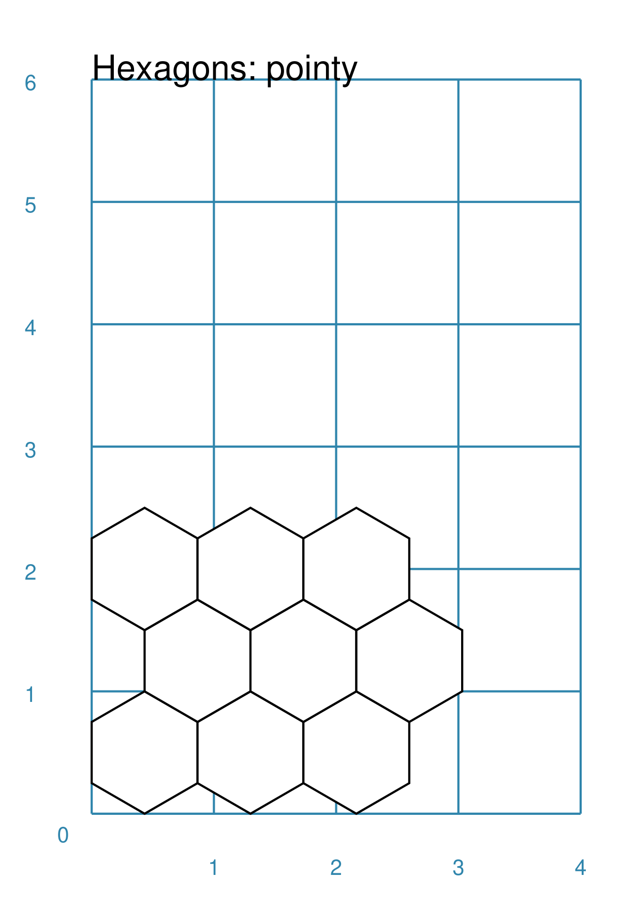

===== ======
|rr2| This example shows a grid constructed using the command::

        Hexagons(
            side=0.5,
            x=0, y=0,
            rows=3, cols=3,
            orientation='pointy',
        )

      It has the following properties that differ from the defaults:

      - *side* sets the length of each side of a hexagon in the grid
      - *x* and *y* are used to set the lower-left corner of the grid
      - *rows* sets the number of rows  in the grid
      - *cols* sets the number of columns in the grid
===== ======

.. _rectCoords:

Coordinates
-----------
`^ <rectIndex_>`_

Every location in a grid has a row and column number - these are not, by
default, displayed on the grid; but they are needed in some cases; for example,
to support grid references for a wargame map.

The coordinate system starts at the top-left of the grid; the column is, by
default, the first value (the "x" location) and the row is the second value
(the "y" location).

The coordinates can be displayed using either letters (upper or lowercase) or
numbers (the default behaviour). A separator may be specified to help
visualise, or differentiate, the row versus the column value. For numeric
coordinates, numbers have a "zero padding"; so ``1`` is displayed as ``01``.

The coordinates can also be displayed in various positions within the hexagon.

Most coordinate property names are prefixed with ``coord_``.

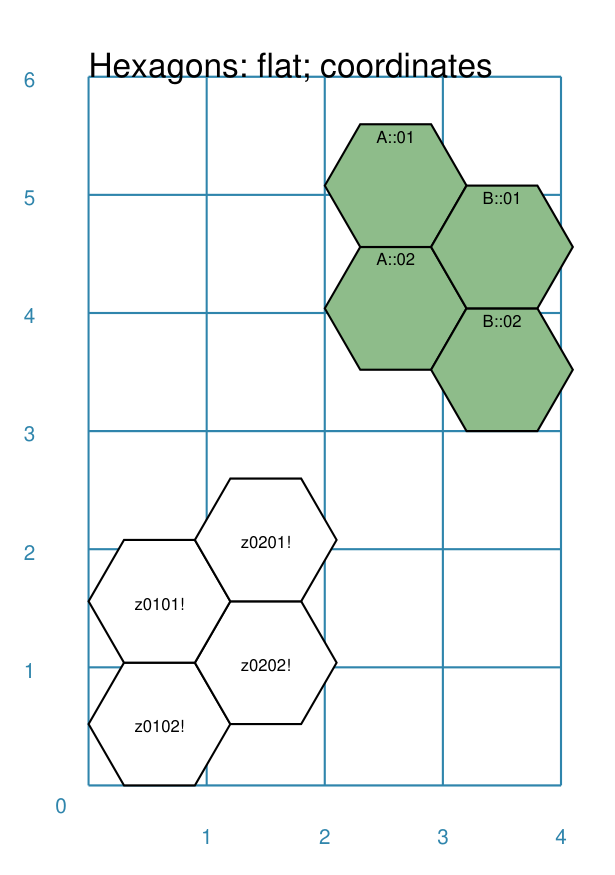

===== ======
|rc1| This example shows grids constructed using the commands::

        Hexagons(
            side=0.6,
            x=2, y=3,
            rows=2, cols=2,
            fill=darkseagreen,
            hex_offset="odd",
            coord_position="top",
            coord_type_x="upper",
            coord_separator='::',
        )
        Hexagons(
            side=0.6,
            x=0, y=0,
            rows=2, cols=2,
            coord_position="middle",
            coord_prefix='z',
            coord_suffix='!',
        )

      Each has the following properties that differ from the defaults:

      - *side* sets the length of each side of a hexagon in the grid
      - *x* and *y* are used to set the lower-left corner of the grid
      - *rows* sets the number of rows  in the grid
      - *cols* sets the number of columns in the grid
      - *coord_position* can be ``top``, ``middle`` or ``bottom`` to set
        the vertical position of the coordinates text; the horizontal
        always matches to the hexagon's centre

      The green grid also has:

      - *hex_offset* - controls the appearance of the
        `column offset <rectOffset_>`_
      - *coord_type_x* - ``upper`` displays the column (x-value) as an
        uppercase letter
      - *coord_separator* - can be any text used that must be displayed between
        the row and column values; in this case it is two colons ``::``

      The white grid also has:

      - *coord_prefix* - this is text that appears before the row and column
        values are shown (to their left)
      - *coord_suffix* - this is text that appears after the row and column
        values are shown (to their right)
===== ======

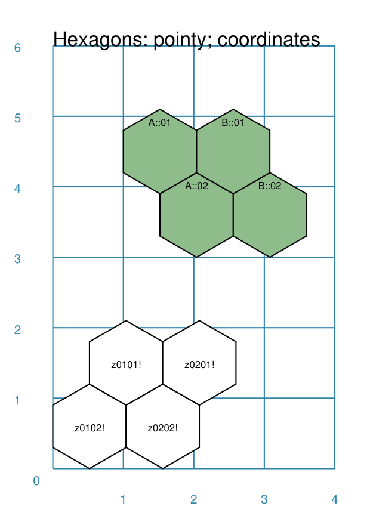

===== ======
|rc2| This example shows grids constructed using the commands::

        Hexagons(
            side=0.6,
            x=1, y=3,
            rows=2, cols=2,
            orientation='pointy',
            fill=darkseagreen,
            hex_offset="odd",
            coord_position="top",
            coord_type_x="upper",
            coord_separator='::',
        )
        Hexagons(
            side=0.6,
            x=0, y=0,
            rows=2, cols=2,
            orientation='pointy',
            coord_position="middle",
            coord_prefix='z',
            coord_suffix='!',
        )

      Each has the following properties that differ from the defaults:

      - *side* sets the length of each side of a hexagon in the grid
      - *x* and *y* are used to set the lower-left corner of the grid
      - *rows* sets the number of rows  in the grid
      - *cols* sets the number of columns in the grid
      - *orientation* set to ``pointy`` to have hexagons with pointed tops
      - *coord_position* can be ``top``, ``middle`` or ``bottom`` to set
        the vertical position of the coordinate text

      The green grid also has:

      - *hex_offset* - controls the appearance of the
        `row offset <rectOffset_>`_
      - *coord_type_x* - ``upper`` displays the column (x-value) as an
        uppercase letter
      - *coord_separator* - can be any text used that must be displayed between
        the row and column values; in this case it is two colons ``::``

      The white grid also has:

      - *coord_prefix* - this is text that appears before the row and column
        values are shown (to their left)
      - *coord_suffix* - this is text that appears after the row and column
        values are shown (to their right)
===== ======

.. _rectCaltrops:

Caltrops
--------
`^ <rectIndex_>`_

Caltrops is a term when the point at which three hexagons meet is drawn by
a set of three small lines; these replace the normal edge of the hexagon.

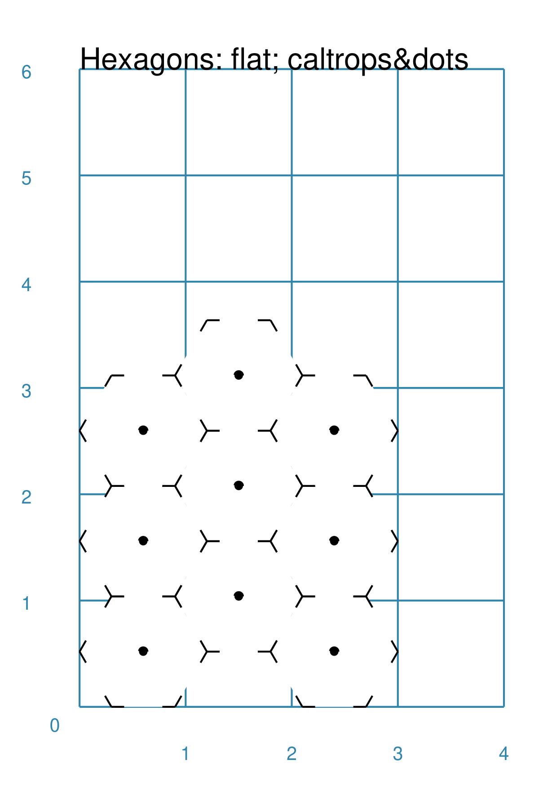

===== ======
|rp1| This example shows a grid constructed using the command::

        Hexagons(
            side=0.6,
            x=0, y=0,
            rows=3, cols=3,
            dot=0.04,
            caltrops="medium",
        )

      It has the following properties that differ from the defaults:

      - *side* sets the length of each side of a hexagon in the grid
      - *x* and *y* are used to set the lower-left corner of the grid
      - *rows* sets the number of rows  in the grid
      - *cols* sets the number of columns in the grid
      - *dot* draws a small dot (of size ``0.04``) in the centre of the
        hexagon
      - *caltrops* sets the size of the caltrop lines; this can be ``small``,
        ``medium`` or ``large``
===== ======

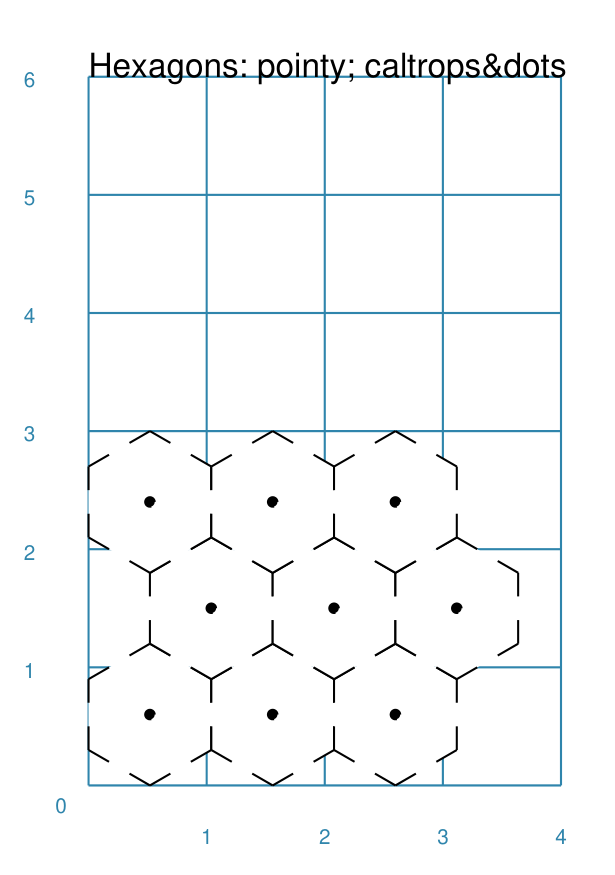

===== ======
|rp2| This example shows a grid constructed using the command::

        Hexagons(
            side=0.6,
            x=0, y=0,
            rows=3, cols=3,
            orientation='pointy',
            dot=0.04,
            caltrops="large",
        )

      It has the following properties that differ from the defaults:

      - *side* sets the length of each side of a hexagon in the grid
      - *x* and *y* are used to set the lower-left corner of the grid
      - *rows* sets the number of rows  in the grid
      - *cols* sets the number of columns in the grid
      - *orientation* set to ``pointy`` to have hexagons with pointed tops
      - *dot* draws a small dot (of size ``0.04``) in the centre of the
        hexagon
      - *caltrops* sets the size of the caltrop lines; this can be ``small``,
        ``medium`` or ``large``
===== ======

.. _rectHidden:

Hidden
------
`^ <rectIndex_>`_

As every location in a grid has a row and column number, these values can be
used to hide or mask certain hexagons from being displayed.  This can be useful
when a grid is designed for a scenario where not all hexagons are needed.

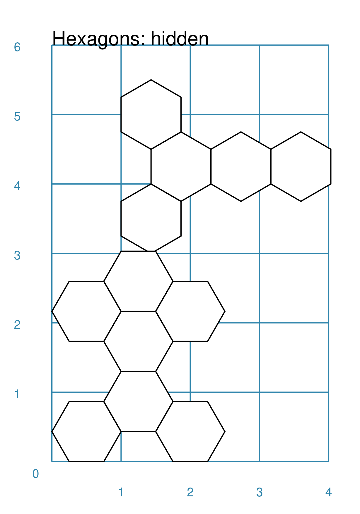

===== ======
|rdd| This example shows grids constructed using the commands::

        Hexagons(
            side=0.5,
            x=1, y=3,
            rows=3, cols=3,
            orientation='pointy',
            fill=darkseagreen,
            hidden=[(1, 2), (1, 3), (3, 2), (3, 3)]
        )
        Hexagons(
            side=0.5,
            x=0, y=0,
            rows=3, cols=3,
            hidden="2,1 2,3"
        )

      Each has the following properties that differ from the defaults:

      - *x* and *y* are used to set the lower-left corner of the grid
      - *rows* sets the number of rows  in the grid
      - *cols* sets the number of columns in the grid

      In the green pointy grid:

      - *hidden* - this is a list, shown by the square brackets
        (``[`` to ``]``), of one or more sets of row and column numbers,
        each pair enclosed by the round brackets;
        the second and third columns are hidden in both the first and the
        third row

      In the white flat grid:

      - *hidden* - this is a string, which should contain one or more
        pairs of row and column numbers, each pair separated by a space;
        here the second row hexagon is hidden in both first and second
        columns

===== ======

.. _rectOffset:

Offset
------
`^ <rectIndex_>`_

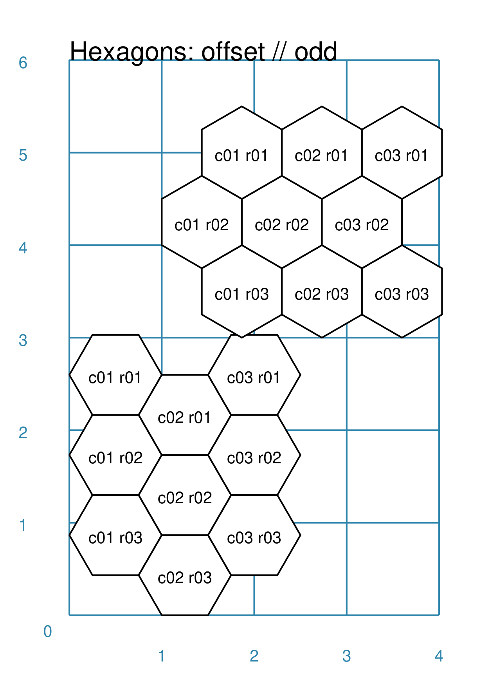

===== ======
|rof| This example shows grids constructed using the commands::

        Hexagons(
            side=0.5,
            x=1, y=3,
            rows=3, cols=3,
            hex_offset="odd",
            orientation='pointy',
            fill=darkseagreen,
            coord_position="middle",
            coord_font_size=5,
            coord_separator=' r',
            coord_prefix='c',
        )
        Hexagons(
            side=0.5,
            x=0, y=0,
            rows=3, cols=3,
            hex_offset="odd",
            coord_position="middle",
            coord_font_size=5,
            coord_separator=' r',
            coord_prefix='c',
        )

      Each has the following properties that differ from the defaults:

      - *side* sets the length of each side of a hexagon in the grid
      - *x* and *y* are used to set the lower-left corner of the grid
      - *rows* sets the number of rows  in the grid
      - *cols* sets the number of columns in the grid
      - *hex_offset* - if ``odd``, then every odd column - for a flat grid - or
        every odd row - for a pointy grid - is offset one-half hexagon from
        those on either side
      - *coord_...* - various settings to control the appearance of the
        `hex coordinates <rectCoords_>`_
===== ======

.. _rectRadii:

Radii
-----
`^ <rectIndex_>`_

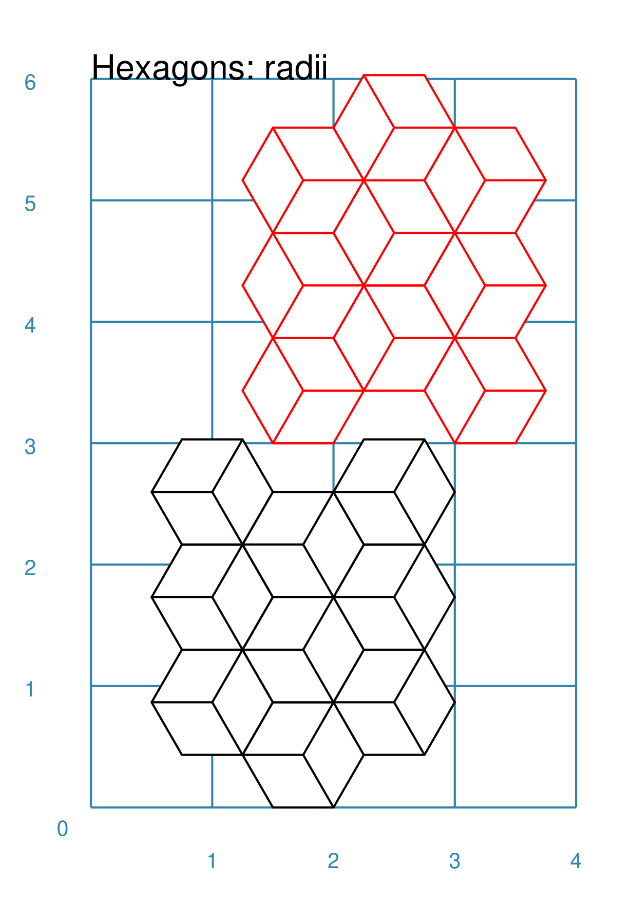

===== ======
|rdi| This example shows grids constructed using the commands::

        Hexagons(
            side=0.5,
            x=0.5, y=0,
            rows=3, cols=3,
            hex_offset="odd",
            radii="w ne se",
        )
        Hexagons(
            side=0.5,
            x=1.25, y=3,
            rows=3, cols=3,
            stroke=red,
            radii_stroke=red,
            hex_offset="even",
            radii="e nw sw",
        )

      Each has the following properties that differ from the defaults:

      - *side* sets the length of each side of a hexagon in the grid
      - *x* and *y* are used to set the lower-left corner of the grid
      - *rows* sets the number of rows  in the grid
      - *cols* sets the number of columns in the grid
      - *hex_offset* determines which columns are shifted
      - *radii* - as described for a
        `customised hexagon <customised_shapes.rst#hexagon>`_,this will
        setup lines running from each hexagon centre to the vertices, as
        define by the directions specified
===== ======

.. _circIndex:

Circular Hexagonal Grid
=======================
`↑ <table-of-contents_>`_

An alternative to the basic hexagonal grid, is a circular, or circle, layout.

Most of the properties that associated with the basic grid are can also be
used for the circular grid: coordinates; caltrops; radii and hidden hexagons.

- `Basic <circBasic_>`_
- `Nested Shapes <circNested_>`_

.. _circBasic:

Basic
-----
`^ <circIndex_>`_

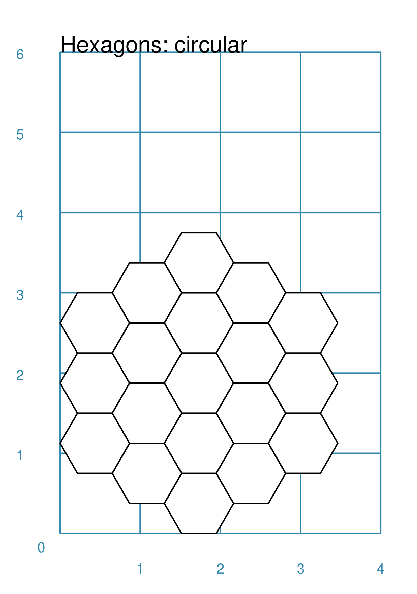

===== ======
|cbs| This example shows a grid constructed using the command::

        Hexagons(
            x=0, y=0,
            height=0.75,
            sides=3,
            hex_layout="circle",
        )

      It has the following properties that differ from the defaults:

      - *x* and *y* are used to set the lower-left corner of the grid
      - *height* sets the side-to-side height of a hexagon in the grid
      - *sides* sets the number of hexagons running along each "edge" of the
        grid - there are six sides in all
      - *hex_layout* is set to ``circle`` to create the circular effect

===== ======

.. _circNested:

Nested Shapes
-------------
`^ <circIndex_>`_

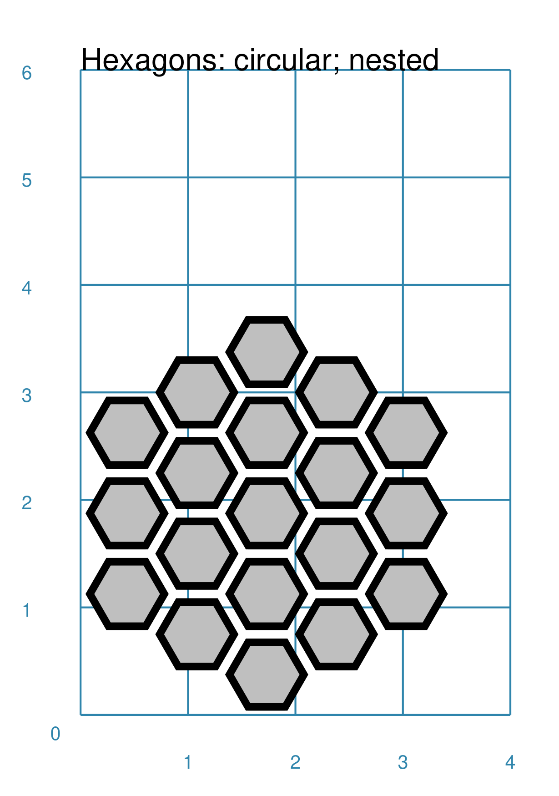

===== ======
|cns| This example shows a grid constructed using the command::

        Hexagons(
            x=0, y=0,
            height=0.75,
            sides=3,
            stroke=None, fill=None,
            hex_layout="circle",
            centre_shape=hexagon(
                stroke=black, fill=silver, height=0.6, stroke_width=2),
        )

      It has the following properties that differ from the defaults:

      - *x* and *y* are used to set the lower-left corner of the grid
      - *height* sets the side-to-side height of a hexagon in the grid
      - *sides* sets the number of hexagons running along each "edge" of the
        grid - there are six sides in all
      - *hex_layout* is set to ``circle`` to create the circular pattern
      - *centre_shape* - defines a shape whose centre location will match
        that of the hexagon within which it is "nested"; in this case its
        size is smaller (``0.6`` is less than ``0.75``) so there is a "gap"
        around each of these shapes.

===== ======

.. _diamIndex:

Diamond Hexagonal Grid
======================
`↑ <table-of-contents_>`_

An alternative to the basic hexagonal grid, is a diamond layout.

Most of the properties that associated with the basic grid are can also be
used for the diamond grid: coordinates; caltrops; radii and hidden hexagons.

.. _diamBasic:

Basic
-----
`^ <diamIndex_>`_

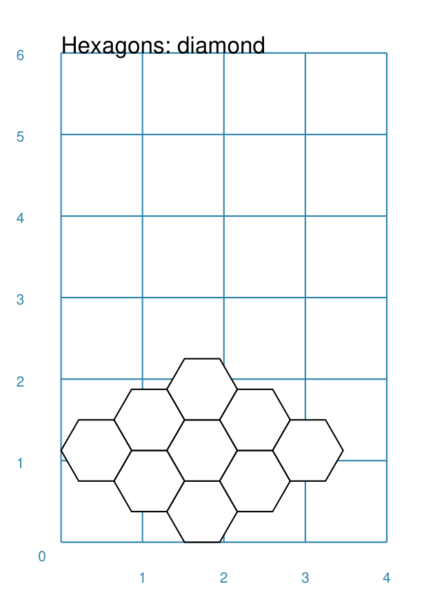

===== ======
|dmb| This example shows a grid constructed using the command::

        Hexagons(
            x=0, y=0,
            height=0.75,
            rows=3,
            hex_layout="diamond",
        )

      It has the following properties that differ from the defaults:

      - *x* and *y* are used to set the lower-left corner of the grid
      - *height* sets the side-to-side height of a hexagon in the grid
      - *row* sets the number of hexagons in each row of the grid
      - *hex_layout* is set to ``diamond`` to create the layout pattern
===== ======

Grid Locations and LinkLines
============================

In order to layout objects within a hexagonal grid, it is possible to use
the ``Location()`` or ``Locations()`` command to specify the "what, where and
how". In addition, the ``LinkLines()`` command allows the creation of lines
to join one or more hexagons within the grid.

These commands should work with any of the types of hexgonal grid layouts
described above.

Locations
---------

Example 1.  Basic Location
~~~~~~~~~~~~~~~~~~~~~~~~~~

.. |xl0| image:: images/custom/hexagonal_grid/hexgrid_location_basic.png
   :width: 330

===== ======
|xl0| This example shows a location constructed using the command::

        hexgrid = Hexagons(
            side=0.5,
            x=0, y=0,
            rows=6, cols=4,
        )
        Locations(
            hexgrid,
            "0204, 0101",
            [circle(common=a_circle)]
        )
      It has the following properties:

      The default way to identify a

===== ======

Other Hexagonal Grid Resources
==============================
`↑ <table-of-contents_>`_

There are already a number of software tools available for creating
hexagonal grids of various kinds. A few of them, some of which are
game-specific, are listed below:

-  *HEXGRID* (https://hamhambone.github.io/hexgrid/) - an online hex
   grid generator which interactively creates a display, downloadable as
   a PNG image.
-  *mkhexgrid* (https://www.nomic.net/~uckelman/mkhexgrid/) - a
   command-line program which generates hexagonal grids, used for
   strategy games, as PNG or SVG images.
-  *Hex Map Extension*
   (https://github.com/lifelike/hexmapextension/tree/master) - an
   extension for creating hex grids in *Inkscape* that can also be used
   to make brick patterns of staggered rectangles.
-  *hexboard* (https://www.ctan.org/pkg/hexboard) - a package for LATEX
   that provides functionality for drawing Hex boards and games.
-  *map18xx* (https://github.com/XeryusTC/map18xx) - a 18xx hex map and
   tile generator that outputs to SVG files, scaled to fit A4 paper.
-  *18xx Maker* (https://www.18xx-maker.com/) - uses 18xx game
   definitions written in JSON, displays them, and renders them for
   printing.
-  *ps18xx* (https://github.com/18xx/ps18xx/tree/master) - software for
   running 18XX email games, and creating maps and tile sheets.

The options and facilities provided by these tools have been the primary
inspiration for how hexagonal grids work in **pyprototypr**. So if the
functionality available here does not work for you, then possibly one of
these other tools would be of better use.

   For everything - and I mean **everything** - related to how hexagonal
   grids are designed and calculated the single most useful reference is
   https://www.redblobgames.com/grids/hexagons/

An 18xx Footnote
----------------

The "18xx" train games hex maps are often criticised for their poor aesthetic.
A fascinating article that deals with this topic - and is perhaps relevant
even at the prototyping stage being supported by this program - is available at
https://medium.com/grandtrunkgames/mawgd4-18xx-tiles-and-18xx-maps-8a409bba4230
