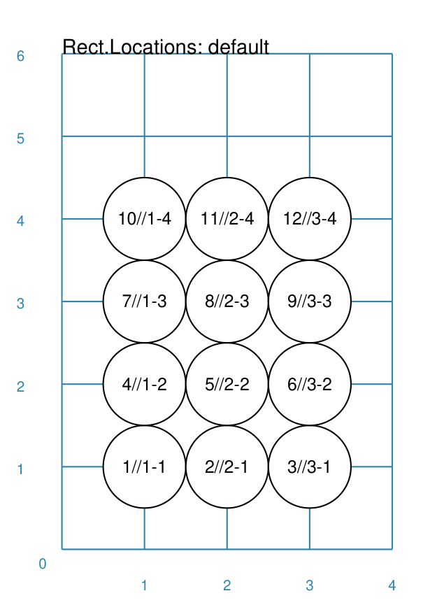
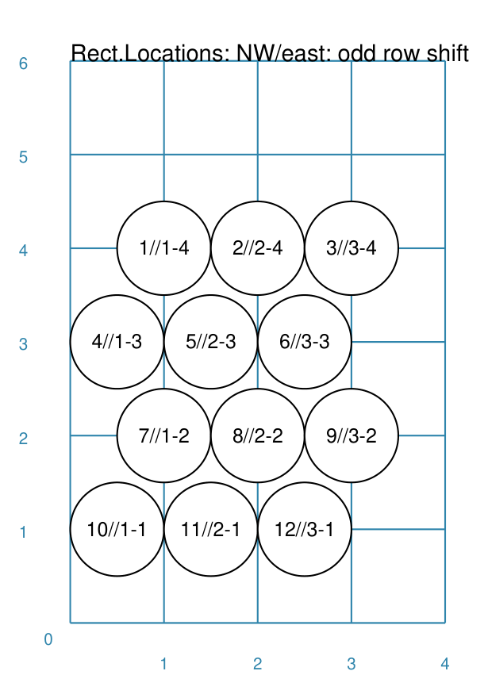
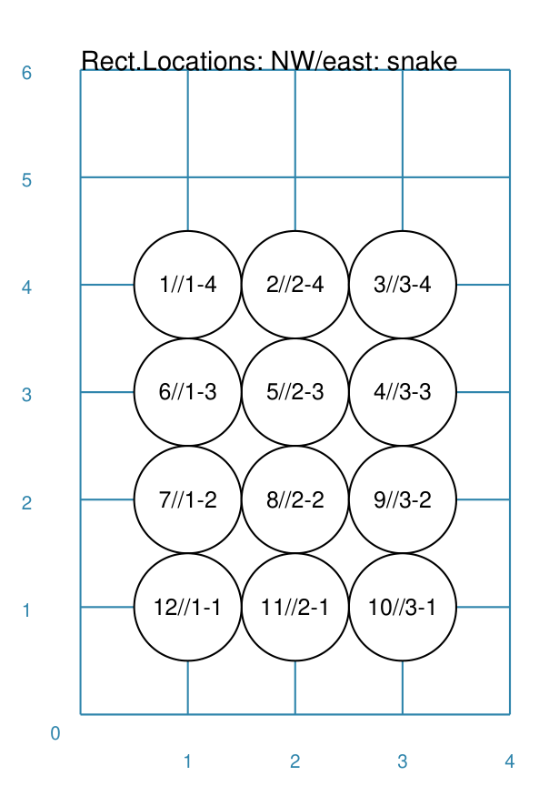
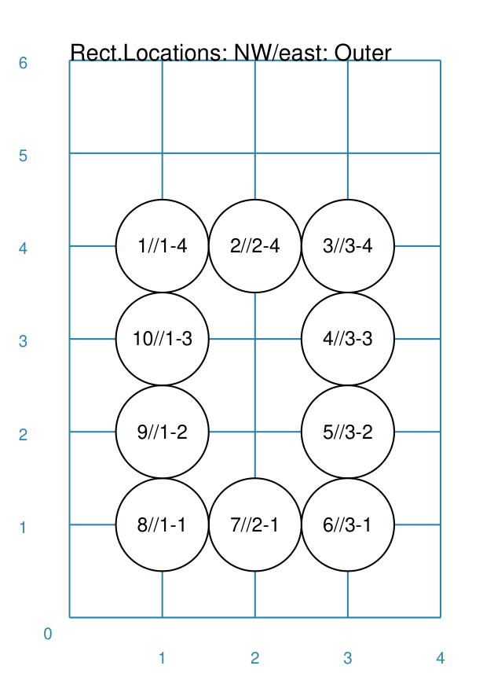
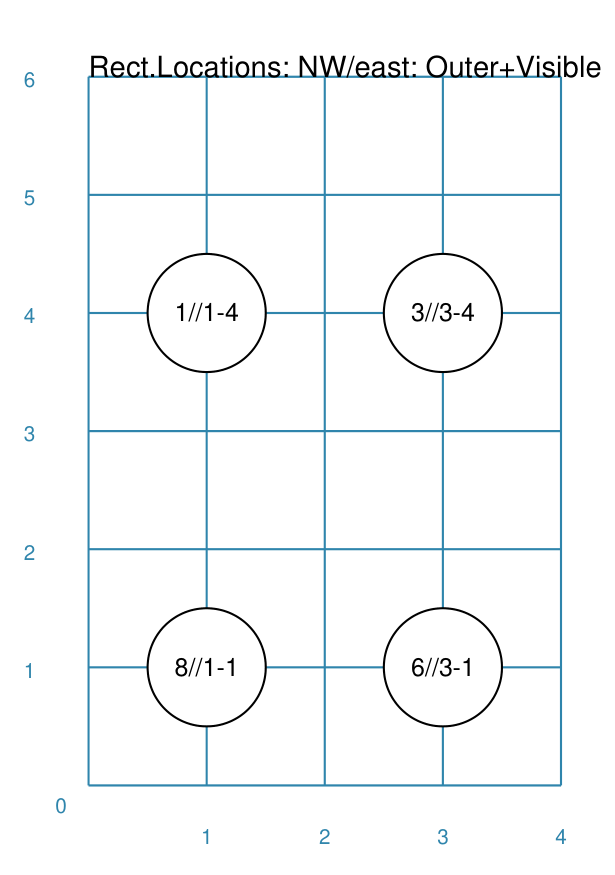

============================
RectangularLocations Command
============================

**pyprototypr** allows you to directly define where elements, that make up
your design, should be placed within a page, or over a series of pages
within a ``Deck``, but it also includes commands that let you place, or
"`layout <layouts.rst>`_", elements in a more repetitive or regular way
within a page.

.. _table-of-contents:

Table of Contents
=================

- `Overview`_
- `Usage`_
- `Key Properties`_


Overview
========
`↑ <table-of-contents_>`_

The ``RectangularLocations()`` command defines an ordered series
of row and column locations that create a rectangular spacing.  The x- and
y-values of these rows and columns are then used to set the centres of
the elements that can be placed there using the ``Layout()`` command.

The rows and columns themselves are not drawn - if needed you can use the
*debug* property to display them (see `Example 8. Debug`_  below).

Apart from the ``RectangularLocations()`` command described here, there are
also other ways to place elements on a page:

- `Sequences <layouts_sequence.rst>`_
- `Tracks <layouts_track.rst>`_
- `TriangularLocations <layouts_triangular.rst>`_


Usage
=====
`↑ <table-of-contents_>`_

The ``RectangularLocations()`` command accepts the following properties:

- **cols** - this is the number of locations in the horizontal direction
- **rows** - this is the number of locations in the vertical direction
- **spacing** - this is horizontal distance between columns, as well as the
  vertical distance between rows, in the grid; defaults to ``1`` cm
- **col_spacing** - this is horizontal distance between columns in the grid;
  defaults to **spacing**
- **row_spacing** - this is vertical distance between rows in the grid;
  defaults to **spacing**
- **direction** - this is compass direction of the line of travel when
  creating the row and column layout
- **start** - this is initial corner, defined a ecomdary compass direction,
  from where the grid is drawn
- **pattern** - this is the way in which the grid is draw; default is draw
  each row, and then move across columns in a regular line; but:

  - **snaking** - means the direction is reversed across each row
  - **outer** - means only the locations in the outer-most edge of the grid
    are created

The ``Layout()`` command accepts the following properties:

- **grid** - this *must* be the first property used for the command; it will
  refer to, in this case, a row & column grid created by ``RectangularLocations()``
- **shapes** - this is a list of one or more of the core shapes available,
  for example, a circle or rectangle
- **debug** - this will display the centre points of the grid, along with any
  extra information specified.  Allowed settings for debug include:

  - *none* - only locations are shown
  - *count* - shows the sequence number (i.e. the order of drawing)
  - *xy* - shows x- and y-settings
  - *yx* - shows y- and x-settings
  - *rowcol* - shows row and column numbers
  - *colrow* - shows column and row numbers
  - *id* - shows the internal ID number assigned to the location

.. _key-properties:

Key Properties
==============
`↑ <table-of-contents_>`_

All examples below make use of common ```Circle`` shape (called *a_circle*)
defined as:

  .. code:: python

    circles = Common(
        x=0, y=0, diameter=1.0,
        label="{count}/{col}-{row}", label_size=6)
    a_circle = circle(common=circles)

Example 1. Rows and Columns
---------------------------
`^ <key-properties_>`_



===== ======
|r00| This example shows the element constructed using the following values
      for its properties.

      .. code:: python

        rect = RectangularLocations(
            cols=3, rows=4)
        Layout(rect, shapes=[a_circle,])

===== ======

Example 2. Start and Direction
------------------------------
`^ <key-properties_>`_

.. |r01| image:: images/layouts/rect_basic_east.png
   :width: 330

===== ======
|r01| This example shows the element constructed using the following values
      for its properties.

      .. code:: python

        rect = RectangularLocations(
            cols=3, rows=4,
            start="NW", direction="east")
        Layout(rect, shapes=[a_circle,])

===== ======

Example 3. Row and Column Offset
--------------------------------
`^ <key-properties_>`_

.. |02a| image:: images/layouts/rect_basic_east_even.png
   :width: 330

===== ======
|02a| This example shows the element constructed using the following values
      for its properties.

      .. code:: python

        rect = RectangularLocations(
            cols=3, rows=4, start="NW", direction="east",
            col_even=0.5)
        Layout(rect, shapes=[a_circle,])

===== ======



===== ======
|02b| This example shows the element constructed using the following values
      for its properties.

      .. code:: python

        rect = RectangularLocations(
            cols=3, rows=4, start="NW", direction="east",
            row_odd=0.5)
        Layout(rect, shapes=[a_circle,])

===== ======

Example 4. Snaking
------------------
`^ <key-properties_>`_



===== ======
|r03| This example shows the element constructed using the following values
      for its properties.

      .. code:: python

          rect = RectangularLocations(

===== ======

Example 5. Outer Edge
---------------------
`^ <key-properties_>`_



===== ======
|r04| This example shows the element constructed using the following values
      for its properties.

      .. code:: python

        rect = RectangularLocations(
            cols=3, rows=4, start="NW", direction="east",
            pattern="outer")
        Layout(rect, shapes=[a_circle,])

===== ======

Example 6. Masking
------------------
`^ <key-properties_>`_


===== ======
|r05| This example shows the element constructed using the following values
      for its properties.

      .. code:: python

        rect = RectangularLocations(
            cols=3, rows=4, start="NW", direction="east",
            pattern="outer")
        Layout(rect, shapes=[a_circle,], masked=[2,7])

===== ======

Example 7. Visibility
---------------------
`^ <key-properties_>`_



===== ======
|r06| This example shows the element constructed using the following values
      for its properties.

      .. code:: python

        rect = RectangularLocations(
            cols=3, rows=4, start="NW", direction="east",
            pattern="outer")
        Layout(rect, shapes=[a_circle,], visible=[1,3,6,8])

===== ======

Example 8. Debug
----------------
`^ <key-properties_>`_

.. |07a| image:: images/layouts/rect_basic_debug.png
   :width: 330

===== ======
|07a| This example shows the element constructed using the following values
      for its properties.

      .. code:: python

        rect = RectangularLocations(cols=3, rows=4)
        Layout(rect, debug='none')

===== ======

.. |07b| image:: images/layouts/rect_basic_debug_count.png
   :width: 330

===== ======
|07b| This example shows the element constructed using the following values
      for its properties.

      .. code:: python

        rect = RectangularLocations(cols=3, rows=4)
        Layout(rect, debug='count')

===== ======


.. |07c| image:: images/layouts/rect_basic_debug_xy.png
   :width: 330

===== ======
|07c| This example shows the element constructed using the following values
      for its properties.

      .. code:: python

        rect = RectangularLocations(cols=3, rows=4)
        Layout(rect, debug='xy')

===== ======
