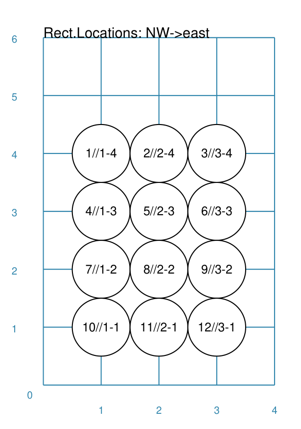
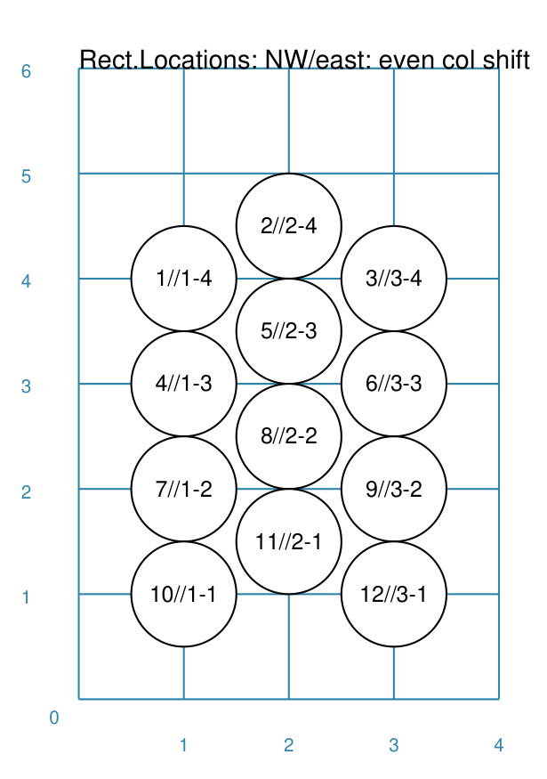
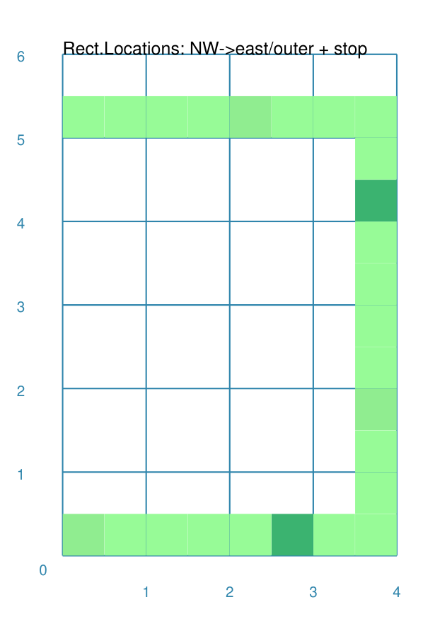
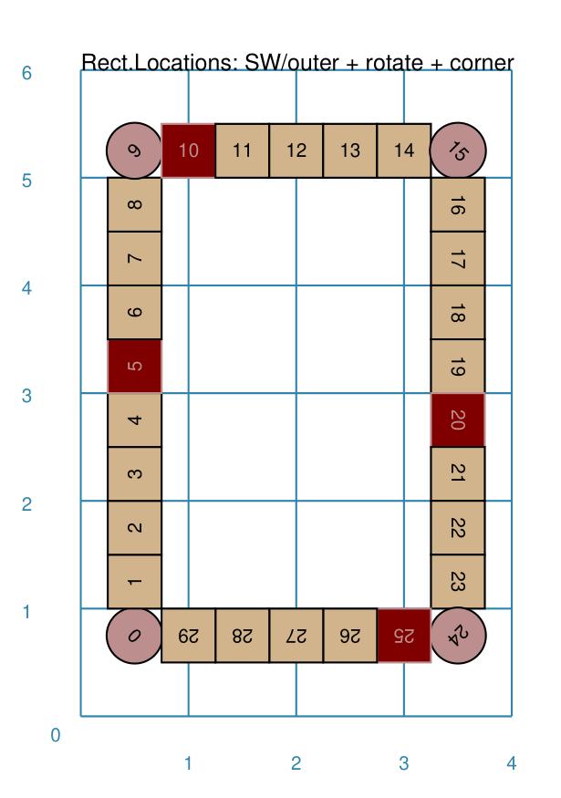

============================
RectangularLocations Command
============================

.. |deg|  unicode:: U+00B0 .. DEGREE SIGN
   :ltrim:

**pyprototypr** allows you to directly define where elements, that make up
your design, should be placed within a page, or over a series of pages
within a ``Deck``, but it also includes commands that let you place, or
"`layout <layouts.rst>`_", elements in a more repetitive or regular way
within a page.

.. _table-of-contents:

Table of Contents
=================

- `Overview`_
- `Usage`_
- `Key Properties`_

Overview
========
`↑ <table-of-contents_>`_

The ``RectangularLocations()`` command defines an ordered series
of row and column locations that create a rectangular grid.  The x- and
y-values of these rows and columns are then used to set the centres of
the elements that can be placed there using the ``Layout()`` command.

The rows and columns themselves are not drawn - if needed you can use the
*debug* property to display them (see `Example 10. Debug`_  below).

Apart from the ``RectangularLocations()`` command described here, there are
also other ways to place elements on a page:

- `Sequences <layouts_sequence.rst>`_
- `Tracks <layouts_track.rst>`_
- `TriangularLocations <layouts_triangular.rst>`_

Usage
=====
`↑ <table-of-contents_>`_

The ``RectangularLocations()`` command accepts the following properties:

- **cols** - this is the number of locations in the horizontal direction; this
  defaults to *2*
- **rows** - this is the number of locations in the vertical direction; this
  defaults to *2*
- **spacing** - this is horizontal distance between columns, as well as the
  vertical distance between rows, in the grid; defaults to ``1`` cm
- **col_spacing** - this is horizontal distance between columns in the grid;
  defaults to **spacing**
- **row_spacing** - this is vertical distance between rows in the grid;
  defaults to **spacing**
- **direction** - this is compass direction of the line of travel when
  creating the row and column layout; the default is e(ast).
- **start** - this is the initial corner, defined a secondary compass direction,
  from where the grid is initially drawn; values can be *ne*, *nw*, *se*, and
  *sw* (the default i.e. the lower-left corner)
- **pattern** - this is the way in which the grid is drawn; the default
  behaviour is to draw each row, and then move across all columns in a regular
  line; but the setting can also be:

  - *snaking* - which means the direction is reversed across each row
  - *outer* - which means only the locations in the outer-most edge of the grid
    are created

The ``RectangularLocations()`` creates a "virtual" grid that always has the
first row and first column in the lower-left corner and the last row and last
column in the upper-right corner.

The ``Layout()`` command accepts the following properties:

- **grid** - this *must* be the first property used for the command; it will
  refer to, in this case, a row & column grid created by ``RectangularLocations()``
- **shapes** - this is a list of one or more of the core shapes available,
  for example, a circle or rectangle; if no shapes are provided, the program
  will issue a ``WARNING``
- **masked** - a list of sequence numbers for the locations in which shapes
  should **not** be displayed
- **visible** - a list of sequence numbers for the **only** locations in
  which shapes that should displayed
- **locations** - a list of sets of ``(col, row)`` pairs; these are locations
  that will be used for drawing, in the order that they appear
- **debug** - this will display the centre points of the grid, along with any
  extra information specified.  Allowed settings for debug include:

  - *none* - only the locations are shown (as small dots, matching the color
    of the `Blueprint <core_shapes.rst#blueprint>`_)
  - *count* - shows the sequence number (i.e. the order of drawing)
  - *xy* - shows x- and y-values
  - *yx* - shows y- and x-values
  - *rowcol* - shows row and column numbers
  - *colrow* - shows column and row numbers
  - *id* - shows the internal ID number assigned to the location

.. _key-properties:

Key Properties
==============
`↑ <table-of-contents_>`_

- `Example 1. Rows and Columns`_
- `Example 2. Start and Direction`_
- `Example 3. Row and Column Spacing`_
- `Example 4. Row and Column Offset`_
- `Example 5. Snaking`_
- `Example 6. Outer Edge`_

  - `Example 6b. Outer Edge - Stop and Start`_
  - `Example 6c. Outer Edge - Rotation`_

- `Example 7. Masked`_
- `Example 8. Visible`_
- `Example 9. Locations Setting`_
- `Example 10. Debug`_

All examples below make use of a common ``Circle`` shape (assigned to
the name *a_circle*) defined as:

  .. code:: python

    circles = Common(
        x=0, y=0, diameter=1.0,
        label="{count}/{col}-{row}", label_size=6)
    a_circle = circle(common=circles)

In these examples, the placeholder names ``{count}``, ``{col}`` and ``{row}``
will be replaced, in the label for the Circle, by the values for the row and
column in which that circle is placed, as well as by the sequence number
(order) in which that Circle is drawn.

Example 1. Rows and Columns
---------------------------
`^ <key-properties_>`_

.. |r00| image:: images/layouts/rect_basic_default.png
   :width: 330

===== ======
|r00| This example shows the design constructed using the following values
      for the shapes' properties.

      .. code:: python

        rect = RectangularLocations(
            cols=3, rows=4)
        Layout(rect, shapes=[a_circle])

===== ======

Example 2. Start and Direction
------------------------------
`^ <key-properties_>`_

===== ======
|r01| This example shows the design constructed using the following values
      for the shapes' properties.

      .. code:: python

        rect = RectangularLocations(
            cols=3, rows=4,
            start="NW", direction="east")
        Layout(rect, shapes=[a_circle])

===== ======

Example 3. Row and Column Spacing
---------------------------------
`^ <key-properties_>`_

.. |02a| image:: images/layouts/rect_basic_spacing.png
   :width: 330

===== ======
|02a| This example shows the design constructed using the following values
      for the shapes' properties.

      .. code:: python

        rect = RectangularLocations(
            cols=3, rows=4, start="NW", direction="east",
            spacing=1.25)
        Layout(rect, shapes=[a_circle])

===== ======

.. |02b| image:: images/layouts/rect_basic_spacing_row_col.png
   :width: 330

===== ======
|02b| This example shows the design constructed using the following values
      for the shapes' properties.

      .. code:: python

        rect = RectangularLocations(
            cols=3, rows=4, start="NW", direction="east",
            x=1.5, y=1.5,
            row_spacing=1.25, col_spacing=0.75)
        Layout(rect, shapes=[a_circle])

===== ======

Example 4. Row and Column Offset
--------------------------------
`^ <key-properties_>`_

===== ======
|03a| This example shows the design constructed using the following values
      for the shapes' properties.

      .. code:: python

        rect = RectangularLocations(
            cols=3, rows=4, start="NW", direction="east",
            col_even=0.5)
        Layout(rect, shapes=[a_circle])

===== ======

.. |03b| image:: images/layouts/rect_basic_east_odd.png
   :width: 330

===== ======
|03b| This example shows the design constructed using the following values
      for the shapes' properties.

      .. code:: python

        rect = RectangularLocations(
            cols=3, rows=4, start="NW", direction="east",
            row_odd=0.5)
        Layout(rect, shapes=[a_circle])

===== ======

Example 5. Snaking
------------------
`^ <key-properties_>`_

.. |r03| image:: images/layouts/rect_basic_snake.png
   :width: 330

===== ======
|r03| This example shows the design constructed using the following values
      for the shapes' properties.

      .. code:: python

        rect = RectangularLocations(
            cols=3, rows=4, start="NW", direction="east",
            pattern="snake")
        Layout(rect, shapes=[a_circle])

===== ======

Example 6. Outer Edge
---------------------
`^ <key-properties_>`_

.. |r04| image:: images/layouts/rect_basic_outer.png
   :width: 330

===== ======
|r04| This example shows the design constructed using the following values
      for the shapes' properties.

      .. code:: python

        rect = RectangularLocations(
            cols=3, rows=4, start="NW", direction="east",
            pattern="outer")
        Layout(rect, shapes=[a_circle])

===== ======

Example 6b. Outer Edge - Stop and Start
---------------------------------------
`^ <key-properties_>`_

===== ======
|r4b| This example shows the design constructed using the following values
      for the shapes' properties.

      .. code:: python

        rct_small = Common(label_size=5, side=0.48)
        rct1 = square(common=rct_small, fill_stroke=palegreen)
        rct5 = square(common=rct_small, fill_stroke=lightgreen)
        rct10 = square(common=rct_small, fill_stroke=mediumseagreen)

        rect = RectangularLocations(
            x=0.25, y=0.25, cols=8, rows=11, spacing=0.5
            start="NW", direction="east", pattern="outer",
            stop=26)
        Layout(rect, shapes=[rct1]*4 + [rct5] + [rct1]*4 + [rct10])

      This example shows how by providing a value for *stop* - the locations
      stop at sequence number ``26``.

      This example shows how to easily provide multiple copies of multiple
      shapes that will be drawn.  Using the ``[rct1`]*4`` ensures that four
      copies of the Rectangle are drawn.  Similarly, using ``+`` adds others
      to the list of *shapes*; thereby creating the pattern shown of different
      numbers of colors od green.  Note that it does not matter how many
      locations will be used; when all shapes in the list have been processed
      the cycle will start again with the first.

===== ======

Example 6c. Outer Edge - Rotation
---------------------------------
`^ <key-properties_>`_

===== ======
|r4c| This example shows the design constructed using the following values
      for the shapes' properties.

      .. code:: python

        rct_common = Common(
            label_size=5, points=[('s', 0.1)], height=0.5, width=0.5)
        circ = circle(
            label="{count_zero}",
            label_size=5, radius=0.26, fill=rosybrown)
        rct2 = rectangle(
            common=rct_common, label="{count_zero}",
            fill=tan)
        rct3 = rectangle(
            common=rct_common, label="{count_zero}",
            fill=maroon, stroke=white)

        locs = RectangularLocations(
            x=0.5, y=0.75, cols=7, rows=10, spacing=0.5,
            start="SW", direction="north", pattern="outer")
        Layout(
            locs,
            shapes=[rct3] + [rct2]*4,
            rotations=[
                ("1", 135), ("2-9", 90),
                ("10", 45),
                ("16", -45), ("17-24", 270),
                ("25", 225), ("26-30", 180),],
            corners=[('*',circ)])

      This example also shows how to provide multiple copies of multiple
      shapes that will be drawn.

      Labels are created by use of the ``{count_zero}`` placeholder; appending
      the ``_zero`` to the usual ``count`` means the numbering starts from
      zero.

      It adds *rotations* settings for specific sequence values in a list of
      sets of value; for example, ``("17-24", 270)`` rotates the shapes at all
      the sequence values from 17 to 24 (inclusive) by 270 |deg|.

      The *corners* settings allows the corner elements to be replaced by those
      appearing in this list - in this case the use of ``*`` means all of them.

===== ======

Example 7. Masked
-----------------
`^ <key-properties_>`_

.. |r05| image:: images/layouts/rect_basic_outer_mask.png
   :width: 330

===== ======
|r05| This example shows the design constructed using the following values
      for the shapes' properties.

      .. code:: python

        rect = RectangularLocations(
            cols=3, rows=4, start="NW", direction="east",
            pattern="outer")
        Layout(rect, shapes=[a_circle], masked=[2,7])

===== ======

Example 8. Visible
------------------
`^ <key-properties_>`_

.. |r06| image:: images/layouts/rect_basic_outer_visible.png
   :width: 330

===== ======
|r06| This example shows the design constructed using the following values
      for the shapes' properties.

      .. code:: python

        rect = RectangularLocations(
            cols=3, rows=4, start="NW", direction="east",
            pattern="outer")
        Layout(rect, shapes=[a_circle], visible=[1,3,6,8])

===== ======

Example 9. Locations Setting
----------------------------
`^ <key-properties_>`_

===== ======
|r07| This example shows the design constructed using the following values
      for the shapes' properties.

      .. code:: python

        rect = RectangularLocations(cols=3, rows=4)
        Layout(
          rect,
          shapes=[
              a_circle, rectangle(label="{count}/{col}-{row}", label_size=6)],
          locations=[(1,2), (2,3), (3,1), (1,1), (3,4)])

===== ======

Example 10. Debug
-----------------
`^ <key-properties_>`_

.. |10a| image:: images/layouts/rect_basic_debug.png
   :width: 330

===== ======
|10a| This example shows the design constructed using the following values
      for the shapes' properties.

      .. code:: python

        rect = RectangularLocations(
            cols=3, rows=4, x=0.5, y=0.5)
        Layout(rect, debug='none')

===== ======

.. |10b| image:: images/layouts/rect_basic_debug_count.png
   :width: 330

===== ======
|10b| This example shows the design constructed using the following values
      for the shapes' properties.

      .. code:: python

        rect = RectangularLocations(
            cols=3, rows=4, x=0.5, y=0.5)
        Layout(rect, debug='count')

===== ======

.. |07c| image:: images/layouts/rect_basic_debug_colrow.png
   :width: 330

===== ======
|07c| This example shows the design constructed using the following values
      for the shapes' properties.

      .. code:: python

        rect = RectangularLocations(
            cols=3, rows=4, x=0.5, y=0.5)
        Layout(rect, debug='colrow')

===== ======
