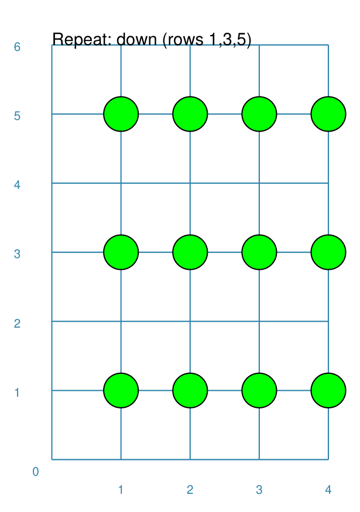
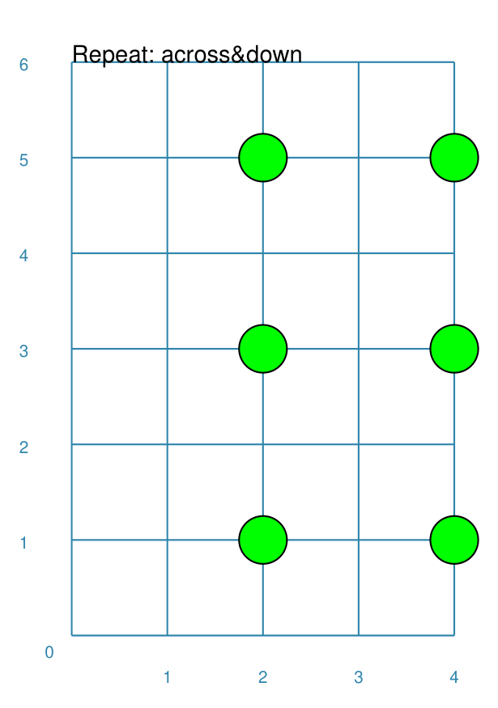

==============
Repeat Command
==============

**pyprototypr** allows you to directly define where elements, that make up
your design, should be placed within a page, or over a series of pages
within a ``Deck``, but it also includes commands that let you place, or
"`layout <layouts.rst>`_", elements in a more repetitive or regular way
within a page.

Overview
========

The ``Repeat()`` command is designed to repeat a shape across a rectangles
grid pattern

Apart from the ``Repeat()`` command described here, there are also:

- `Sequences <layouts_sequence.rst>`_
- `Tracks <layouts_track.rst>`_
- `RectangularLocations <layouts_rectangular.rst>`_
- `TriangularLocations <layouts_triangular.rst>`_

Usage
=====

The ``Repeat()`` command accepts the following properties:

- **shape** - this is one of the `core shapes <core_shapes.rst>`_ available,
  for example, a circle or rectangle; the properties of that shape will
  determine where the first one in the sequence is drawn; the shape should
  always be specified with a lowercase initial soathat ``Repeat()`` can handle
  the drawing.
- **cols** - the number of columns (across) for which the shape is repeated
- **rows** - the number of rows (upwards) for which the shape is repeated
- **offset** - the distance between each repeat of the shape; this defaults to
  0 (zero) not 1
- **offset_across** - the distance between each repeat of the shape in the
  horizontal direction (between columns); defaults to the **offset** value
- **offset_down** - the distance between each repeat of the shape in the
  vertical direction (between rows); defaults to the **offset** value
- **across** - a set (list of whole numbers surrounded by curved brackets)
  containing only those *column* numbers which should be active
- **down** - a set (list of whole numbers surrounded by curved brackets)
  containing only those *row* numbers which should be active

All the examples below make use of a commonly-defined shape:

.. code:: python

    marble = Circle(cx=1, cy=1, radius=0.25, fill=lime)

Example 1.
----------

.. |rp0| image:: images/layouts/repeat_basic.png
   :width: 330

===== ======
|rp0| This example shows the Repeat created using differing values for
      its properties.

      .. code:: python

        Repeat(marble, cols=4, rows=5)

      In this case, because there is *no* offset between the columns or the
      rows, the shape is not drawn anywhere else except at the start location.

===== ======

Example 2.
----------

.. |rp1| image:: images/layouts/repeat_offset.png
   :width: 330

===== ======
|rp1| This example shows the Repeat created using differing values for
      its properties.

      .. code:: python

        Repeat(marble, cols=4, rows=5, offset=1)

      In this case, because there is an offset of ``1`` cm between the columns
      and the rows, and so the shape drawn at 20 different locations.

===== ======

Example 3.
----------

.. |rp2| image:: images/layouts/repeat_offset_acrossdown.png
   :width: 330

===== ======
|rp2| This example shows the Repeat created using differing values for
      its properties.

      .. code:: python

        Repeat(marble, cols=4, rows=4,
               offset_across=0.75, offset_down=1.25)

      In this case, there are different offsets between the columns
      versus the rows; so the shapes are closer together between the columns
      (offset of ``0.75`` cm) and further apart for the rows (offset of
      ``1.25`` cm);  the shape is here drawn at **16** different locations.

===== ======

Example 4.
----------

===== ======
|rp3| This example shows the Repeat created using differing values for
      its properties.

      .. code:: python

        Repeat(marble, cols=4, rows=5, offset=1,
               across=(2, 4))

      In this case, there is the same offset of ``1`` cm between the columns
      and the rows; however, the **across** property sets only two of the
      columns as being active, and so the shape is only drawn at **10**
      different locations.

===== ======

Example 5.
----------

===== ======
|rp4| This example shows the Repeat created using differing values for
      its properties.

      .. code:: python

        Repeat(marble, cols=4, rows=5, offset=1,
               down=(1, 3, 5))

      In this case, there is the same offset of ``1`` cm between the columns
      and the rows; however, the **down** property sets only three of the
      columns as being active, and so the shape is only drawn at **12**
      different locations.

===== ======

Example 6.
----------

===== ======
|rp5| This example shows the Repeat created using differing values for
      its properties.

      .. code:: python

        Repeat(marble, cols=4, rows=5, offset=1,
               across=(2, 4), down=(1, 3, 5))

      In this case, there is the same offset of ``1`` cm between the columns
      and the rows; however, the **across** property sets only two of the
      columns as being active, and the **down** property sets only three of
      the columns as being active, and so the shape is only drawn at **6**
      different locations.

===== ======
