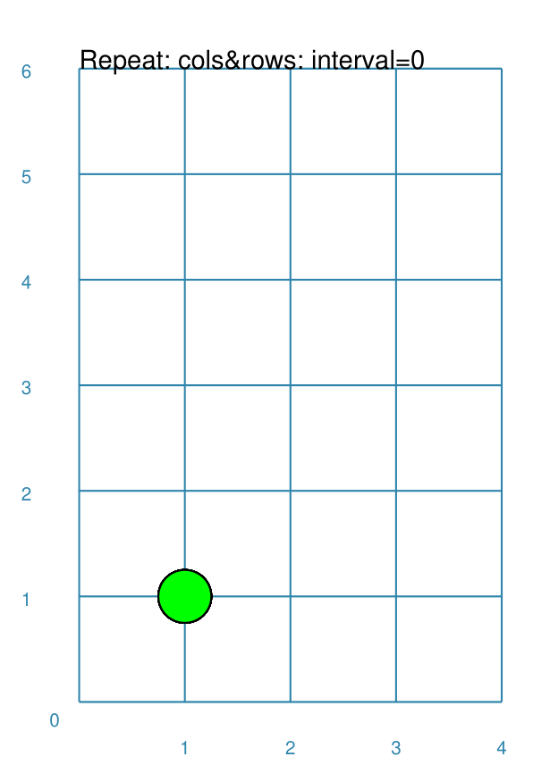

==============
Repeat Command
==============

**pyprototypr** allows you to directly define where elements, that make up
your design, should be placed within a page, or over a series of pages
within a ``Deck``, but it also includes commands that let you place, or
"`layout <layouts.rst>`_", elements in a more repetitive or regular way
within a page.

Overview
========

The ``Repeat()`` command is designed to repeat a shape across a rectangles
grid pattern

Apart from the ``Repeat()`` command described here, there are also:

- `Sequences <layouts_sequence.rst>`_
- `Tracks <layouts_track.rst>`_
- `RectangularLocations <layouts_rectangular.rst>`_
- `TriangularLocations <layouts_triangular.rst>`_

Usage
=====

The ``Repeat()`` command accepts the following properties:

- **shape** - this is one of the core shapes available, for example, a circle
  or rectangle; the properties of that shape will determine where the first one
  in the sequence is drawn; the shape should always be specified with a
  lowercase initial soathat ``Repeat()`` can handle the drawing.
- **cols** -
- **rows** -
- **offset** - the distance between each repeat of the shape; this defaults to
  0 (zero) not 1
- **offset_across** and **offset_down** - the distance between the centre of the
  shapes
  that is drawn, starting from the location of the shape as it is first defined

Example 1.
----------

===== ======
|sqv| This example shows the element constructed using differing values for the
      its properties.

      The example with **normal integer numbers** (top of example) is created by:

      .. code:: python

        Repeat(marble, cols=4, rows=5)

===== ======
