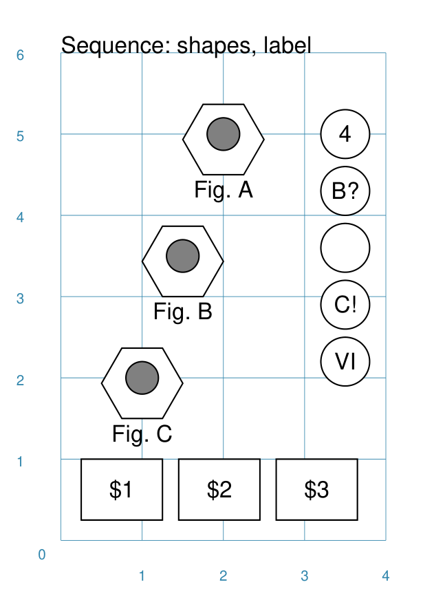

================
Sequence Command
================

**pyprototypr** allows you to directly define where elements, that make up
your design, should be placed within a page, or over a series of pages
within a ``Deck``, but it also includes commands that let you place, or
"`layout <layouts.rst>`_", elements in a more repetitive or regular way
within a page.

Overview
========

The `Sequence()` command is designed to lay out a number of values - letters or
numbers, or shapes - in a straight line.

Apart from the ``Sequence()`` command described here, there are also:

- `Tracks <layouts_track.rst>`_
- `RectangularLocations <layouts_rectangular.rst>`_
- `TriangularLocations <layouts_triangular.rst>`_

Usage
=====

The ``Sequence()`` command accepts the following properties:

- **shape** - this is one of the core shapes available, for example, a circle
  or rectangle; the properties of that shape will determine where the first one
  in the sequence is drawn; the shape should always be specified with a
  lowercase initial so the the ``Sequence()`` can handle the drawing.
- **setting** - [1] this can be a *set* i.e. a number of values enclosed in
  `(...)` round brackets; representing these attributes required to construct
  the sequence:

  - *start* - the value the sequence starts with
  - *end* - the value the sequence ends with
  - *interval* - the difference between one value and next - if negative, the
    values decrease
  - *type* - the sequence can be `letter`, `number`, `roman`, or `excel`
- **setting** - [2] alternatively, the setting can be specified by providing a
  list of values (using square ``[...]`` brackets); these are drawn in the order
  provided and can be a mix of letters or numbers
- **gap_x** and **gap_y** - the distance between the centre of each shape
  that is drawn, starting from the location of the first as the reference point;
  negative numbers means the distances are to the left and down (rather than to
  the right and up)

Example 1.
----------

.. |sqv| image:: images/layouts/sequence_values.png
   :width: 330

===== ======
|sqv| This example shows the element constructed using differing values for the
      its properties.  In each case the ``Text()`` shape is used to display the
      values in the sequence; the values are automatically assigned to its
      **text** property.

      The example with **normal integer numbers** (top of example) is created by:

      .. code:: python

          Sequence(
              text(x=1, y=5.),
              setting=(10, 0, -2, 'number'),
              gap_x=0.5,
          )

      Here the progression is one of numbers. The range starts at ``10`` and
      the sequence will use every second number because the interval is ``-2``.
      The first shape is drawn at ``1.5`` cm and the ``gap_x`` property means
      that each shape will be ``0.5`` cm to the right (positive ``x`` direction)
      of the previous one; they will be in a level line, because the default
      ``y_gap`` value is zero.

      The example with **lowercase letters** (middle top) is created by:

      .. code:: python

          Sequence(
              text(x=1, y=3.5),
              setting=('h', 'b', -2, 'letter'),
              gap_y=0.5,
              gap_x=0.5,
          )

      Here the progression is one of letters - they will be lowercase because
      the start letter - ``h`` - is lowercase.  The sequence ends with a ``b``;
      the sequence will use every second letter because the interval value is
      set to ``-2``.  After the first shape is drawn, each following shape will
      be ``0.5`` cm to the right (``gap_x``) and ``0.5`` cm (``gap_y``) above the
      previous one.

      The example with **uppercase letters** (middle bottom) is created by:

      .. code:: python

          Sequence(
              text(x=1, y=3),
              setting=('B', 'H', 2, 'letter'),
              gap_y=-0.5,
              gap_x=0.5,
          )

      Here the progression is one of uppercase letters because the start letter
      is ``B``. After the first shape is drawn, each following shape will be
      ``0.5`` cm to the right and below - because ``gap_y`` is negative - the
      previous one.

      The example with **Roman numerals** (lower down) is created by:

      .. code:: python

          Sequence(
              text(x=0.5, y=1),
              setting=(5, 11, 1, 'roman'),
              gap_x=0.5,
          )

      Here the progression is one of Roman numbers. The range starts at ``5``,
      which is a ``V`` in Roman, and ends at ``11`` which is a ``XI`` in Roman.

      The example with **Excel columns** (lower edge of example) is created by:

      .. code:: python

          Sequence(
              text(x=0.5, y=0.25),
              setting=(27, 52, 5, 'excel'),
              gap_x=0.5,
          )

      Here the progression is one of Excel column headers; this ranges from
      ``A`` for the first column to ``Z`` for the 26th column, and then starts
      to use letter pairs, as seen here where every ``5`` th column header's
      letters are used.

===== ======

Example 2.
----------

===== ======
|sq2| This example shows the element constructed using differing values for the
      its properties.  In these cases, values in the sequence are being assigned
      to a text-based property using the special ``{SEQUENCE}`` keyword; when this
      is encountered, it is replaced by the **actual** value of the sequence item.

      The example with **hexagons** (top left) is created by:

      .. code:: python

          Sequence(
              hexagon(
                 x=0.5, y=1.5, radius=0.5,
                  title_size=8, title="Fig. {SEQUENCE}"),
              setting=('C', 'A', -1),
              gap_y=1.5,
              gap_x=0.5,
          )

      Here the progression is one of uppercase letters (start letter is ``C``).
      Note that the *letter* value is missing from the setting; this is because
      the type of value can be inferred from the start and end values. Each letter
      in the sequence is assigned to the ``{SEQUENCE}`` keyword and so that
      sequence value becomes part of the ``Hexagon`` 's title text.

      The example with **rectangles** (lower edge) is created by:

      .. code:: python

          Sequence(
              rectangle(
                  x=0.25, y=0.25, height=0.75, width=1,
                  label_size=8, label="${SEQUENCE}"),
              setting=(1, 3, 1, 'number'),
              gap_x=1.2,
          )

      Here the progression is one of numbers; with each number in the sequence
      is assigned to the ``{SEQUENCE}`` keyword and substituted into the text as
      part of the ``Rectangle`` 's label; the `$` is just a normal character.

      The example with **circles** (top right) is created by:

      .. code:: python

          Sequence(
              circle(
                  cx=3.5, cy=5, radius=0.3,
                  label="{SEQUENCE}"),
              setting=[4, 'B?', '', 10, 'VI'],
              gap_y=-0.7,
          )

      Here the progression is a specific list of values; the items separated
      by commas between the square brackets from ``[`` to ``]``.  In this case,
      the list is a mixture of letters and numbers; which are assigned as
      part of the ``Cirle`` 's label via the ``{SEQUENCE}`` keyword.

      **NOTE** that the ``''`` - empty quotes - for the third item in the
      ``setting`` mean that nothing is assigned to the ``{SEQUENCE}`` but
      that the ``Cirle`` itself is still drawn!

===== ======
