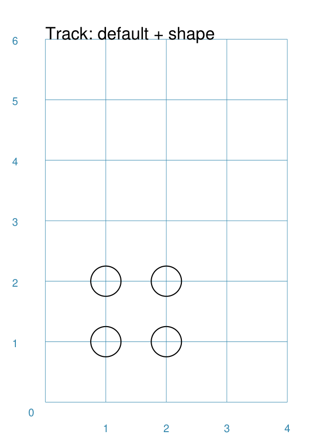
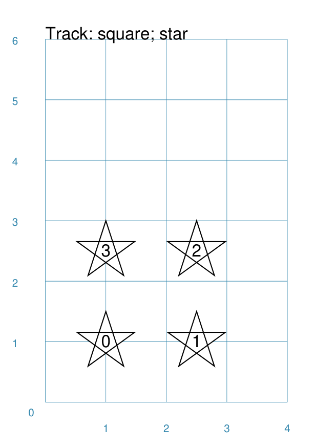
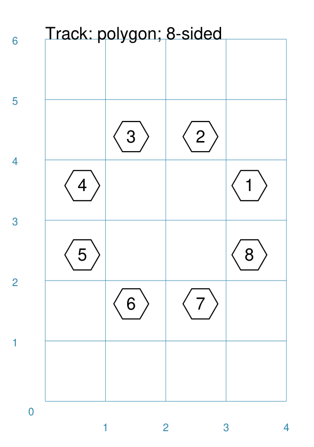
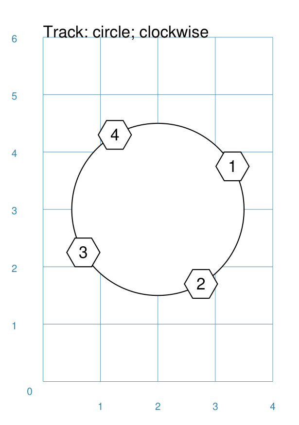
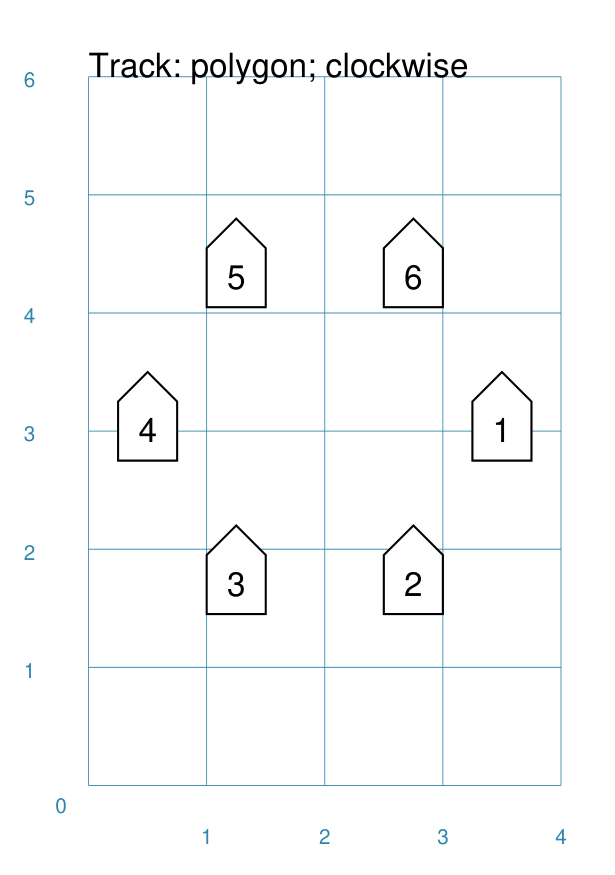
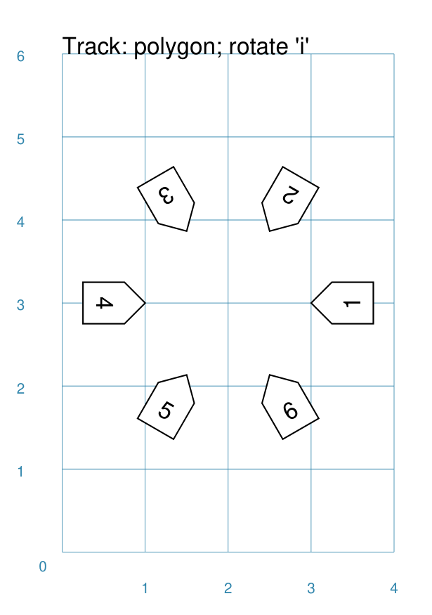
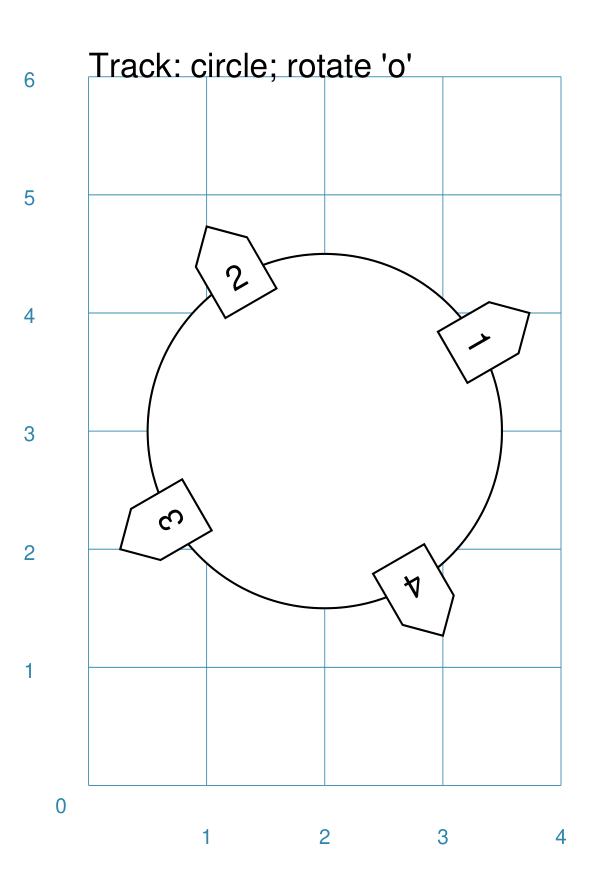
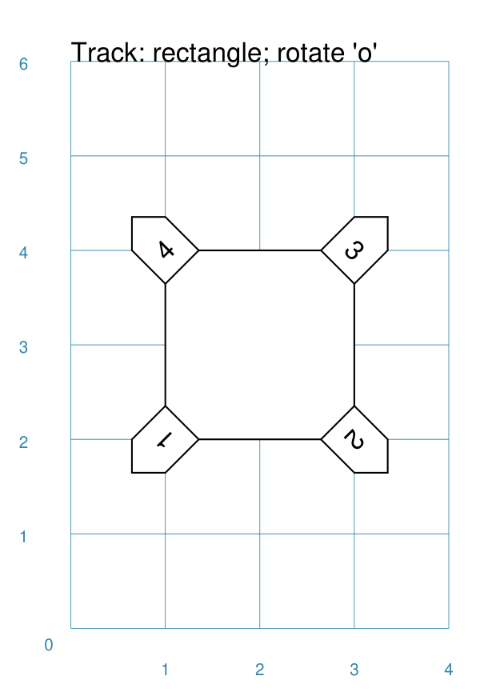

=============
Track Command
=============

**pyprototypr** allows you to directly define where elements, that make up
your design, should be placed within a page, or over a series of pages
within a `deck <card_decks.rst>`_, but it also includes commands that let you
place, or "`layout <layouts.rst>`_", elements in a more repetitive or regular
way within a page.

This section assumes you are very familiar with the concepts, terms and
ideas for `pyprototypr <index.rst>`_ as presented in the
`Basic Concepts <basic_concepts.rst>`_ , that you understand all of the
`Additional Concepts <additional_concepts.rst>`_
and that you've created some basic scripts of your own using the
`Core Shapes <core_shapes.rst>`_.

.. _table-of-contents:

Table of Contents
=================

- `Overview`_
- `Usage`_
- `Key Properties`_

Overview
========
`↑ <table-of-contents_>`_

The `Track()` command is designed to lay out a number of items - letters or
numbers, or shapes - at the vertices of another shape.

Apart from the ``Track()`` command described here, there are also:

- `Sequences <layouts_sequence.rst>`_
- `RectangularLocations <layouts_rectangular.rst>`_
- `TriangularLocations <layouts_triangular.rst>`_

Usage
=====
`↑ <table-of-contents_>`_

The ``Track()`` command accepts the following properties:

- **shape** - this is one of the core shapes available, for example, a circle
  or rectangle

.. _key-properties:

Key Properties
==============
`↑ <table-of-contents_>`_

- `Example 1. Default`_
- `Example 2. Track with a Shape`_
- `Example 3. Track with sequence`_
- `Example 4. Square Track with Star`_
- `Example 5. Polygon Track`_
- `Example 6. Polygon Track with stop`_
- `Example 7. Polyline Track`_
- `Example 8. Circle Track - clockwise`_
- `Example 9. Polygon Track - custom shape`_
- `Example 10. X`_
- `Example 11. X`_
- `Example 12. X`_
- `Example 13. X`_
- `Example 13. X`_
- `Example 15. X`_

Example 1. Default
------------------
`^ <key-properties_>`_

===== ======
|tk1| This example shows the Track constructed using the default values for
      its properties.

      .. code:: python

          Track()

===== ======

Example 2. Track with a Shape
-----------------------------
`^ <key-properties_>`_

===== ======
|tk2| This example shows the Track constructed using differing values for
      its properties.

      .. code:: python

        shp = circle(cx=1, cy=1, radius=0.5, fill=None)
        Track(
          rectangle(),
          shapes=[shp])

===== ======

Example 3. Track with sequence
------------------------------
`^ <key-properties_>`_

.. |tk3| image:: images/tracks/track_default_count.png
   :width: 330

===== ======
|tk3| This example shows the Track constructed using differing values for
      its properties.

      .. code:: python

        shp = circle(cx=1, cy=1, radius=0.5, label='{{sequence}}')
        Track(
          rectangle(),
          shapes=[shp])

===== ======

Example 4. Square Track with Star
---------------------------------
`^ <key-properties_>`_

===== ======
|tk4| This example shows the Track constructed using differing values for
      its properties.

      .. code:: python

        shp = star(cx=1, cy=1, vertices=5, radius=0.5, label='{{sequence}}')
        Track(
          square(side=1.5),
          shapes=[shp])

===== ======

Example 5. Polygon Track
------------------------
`^ <key-properties_>`_

===== ======
|tk5| This example shows the Track constructed using differing values for
      its properties.

      .. code:: python

        shp = hexagon(cx=1, cy=1, height=0.5, label='{{sequence}}')
        Track(
           polygon(cx=2, cy=3, radius=1.5, sides=8),
           shapes=[shp])

===== ======

Example 6. Polygon Track with stop
----------------------------------
`^ <key-properties_>`_

.. |tk6| image:: images/tracks/track_polygon_hex_stop.png
   :width: 330

===== ======
|tk6| This example shows the Track constructed using differing values for
      its properties.

      .. code:: python

        shp = hexagon(cx=1, cy=1, height=0.5, label='{{sequence}}')
        Track(
          polygon(cx=2, cy=3, radius=1.5, sides=8),
          shapes=[shp]*8,
          stop=7)

===== ======

Example 7. Polyline Track
-------------------------
`^ <key-properties_>`_

.. |tk7| image:: images/tracks/track_polyline.png
   :width: 330

===== ======
|tk7| This example shows the Track constructed using differing values for
      its properties.

      .. code:: python

        shp = hexagon(cx=1, cy=1, height=0.5, label='{{sequence}}')
        Track(
          Polyline(points=[(0, 0), (1, 2), (2, 1), (3, 3), (1, 5)]),
          shapes=[shp])

===== ======

Example 8. Circle Track - clockwise
-----------------------------------
`^ <key-properties_>`_

===== ======
|tk8| This example shows the Track constructed using differing values for
      its properties.

      .. code:: python

        shp = hexagon(cx=1, cy=1, height=0.5, label='{{sequence}}')
        Track(
             Circle(cx=2, cy=3, radius=1.5),
             angles=[30,120,210,300],
             shapes=[shp],
             clockwise='t'
        )

===== ======

Example 9. Polygon Track - custom shape
---------------------------------------
`^ <key-properties_>`_

.. |tk9| image:: images/tracks/track_polygon_six.png
   :width: 330

===== ======
|tk9| This example shows the Track constructed using differing values for
      its properties.

      .. code:: python

        shp = rectangle(
          cx=1, cy=1, width=0.5, height=0.5,
          label='{{sequence}}', peaks=[("n", 0.25)])
        Track(
            polygon(cx=2, cy=3, sides=6, radius=1.5),
            shapes=[shp],
        )

===== ======

Example 10. X
-------------
`^ <key-properties_>`_

===== ======
|tc0| This example shows the Track constructed using differing values for
      its properties.

      .. code:: python

          Track()

===== ======

Example 11. X
-------------
`^ <key-properties_>`_

===== ======
|tc1| This example shows the Track constructed using differing values for
      its properties.

      .. code:: python

          Track()

===== ======

Example 12. X
-------------
`^ <key-properties_>`_

.. |tc2| image:: images/tracks/track_polygon_rotate_o.png
   :width: 330

===== ======
|tc2| This example shows the Track constructed using differing values for
      its properties.

      .. code:: python

          Track()

===== ======

Example 13. X
-------------
`^ <key-properties_>`_

===== ======
|tc3| This example shows the Track constructed using differing values for
      its properties.

      .. code:: python

          Track()

===== ======

Example 14. X
-------------
`^ <key-properties_>`_

.. |tc4| image:: images/tracks/track_square_rotate_i.png
   :width: 330

===== ======
|tc4| This example shows the Track constructed using differing values for
      its properties.

      .. code:: python

          Track()

===== ======

Example 15. X
-------------
`^ <key-properties_>`_

===== ======
|tc5| This example shows the Track constructed using differing values for
      its properties.

      .. code:: python

          Track()

===== ======
