=================
Customised Shapes
=================

.. |dash| unicode:: U+2014 .. EM DASH SIGN
.. |copy| unicode:: U+000A9 .. COPYRIGHT SIGN
   :trim:
.. |deg|  unicode:: U+00B0 .. DEGREE SIGN
   :ltrim:

The descriptions here assume you are familiar with the concepts, terms
and ideas for :doc:`protograf <index>` as presented in the
:doc:`Basic Concepts <basic_concepts>` - especially *units*, *properties*
and *defaults*.

You should have already seen how these shapes were created, with defaults,
in :doc:`Core Shapes <core_shapes>`.

.. _table-of-contents:

Table of Contents
=================

- `Overview`_
- `Rectangle`_
- `Hexagon`_
- `Circle`_
- `Blueprint`_

Overview
========
`↑ <table-of-contents_>`_

To make it easier to see where and how a shape has been drawn, most of these
examples have been created with a background grid (which **protograf**
refers to as a `Blueprint`_ shape) added to the page - a small A8
"business card" size - for cross-reference. In addition, the default line width
(aka *stroke_width*) has been made thicker for easier viewing of the small
PNG images that were generated from the original PDF output.

A number of examples also used the ``Common`` command - this allows shared
properties to be defined once and then used by any number of shapes.

.. _rectangle:

Rectangle
=========
`↑ <table-of-contents_>`_

A Rectangle is a very common shape in many designs; there are a number of ways
that it can be customised.

- `Borders <rectBorders_>`_
- `Centred <rectCentred_>`_
- `Cross and Dot <rectCross_>`_
- `Chevron <rectChevron_>`_
- `Hatch <rectHatch_>`_
- `Notch <rectNotch_>`_
- `Peak <rectPeak_>`_
- `Rotation <rectRotation_>`_
- `Rounding <rectRounding_>`_

.. _rectCentred:

Centred
-------
`^ <rectangle_>`_

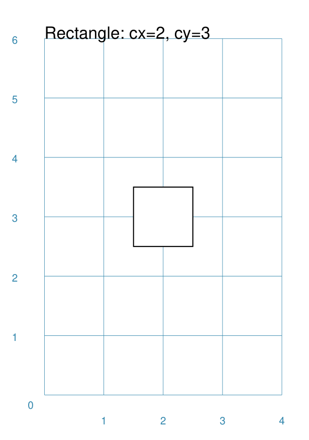

.. table::
   :width: 100
   :widths: 30, 70

   ===== ======
   |rcn| This example shows a Rectangle constructed using the command:

         .. code:: python

            Rectangle(cx=2, cy=3)

         It has the following properties that differ from the defaults:

         - *cx* and *cy* are used to set the centre of the Rectangle at
           ``2`` and ``3`` centimetres respectively

   ===== ======

.. _rectCross:

Cross and Dot
-------------
`^ <rectangle_>`_

A cross or a dot are symbols that mark the centre of the Rectangle.

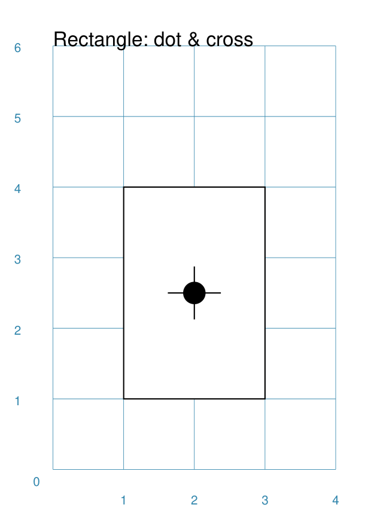

.. table::
   :width: 100
   :widths: 30,70

   ===== ======
   |rdc| This example shows a Rectangle constructed using the command:

         .. code:: python

           Rectangle(height=3, width=2, cross=0.75, dot=0.15)

         It has the following properties that differ from the defaults:

         - *height* and *width* are used to set the size of the Rectangle at ``3``
           and ``2`` centimetres respectively
         - *cross* - the length of each of the two lines that cross at the centre
           is set to ``0.75`` cm (7.5mm)
         - *dot* - a circle with a diameter of ``0.15`` cm (1.5mm); the fill color
           for the dot is the same as the stroke (default is ``black``)

   ===== ======

.. _rectChevron:

Chevron
-------
`^ <rectangle_>`_

A chevron converts sides of the Rectangle into two triangular peaks that both
point in a specified direction.  This creates an arrow-like effect.

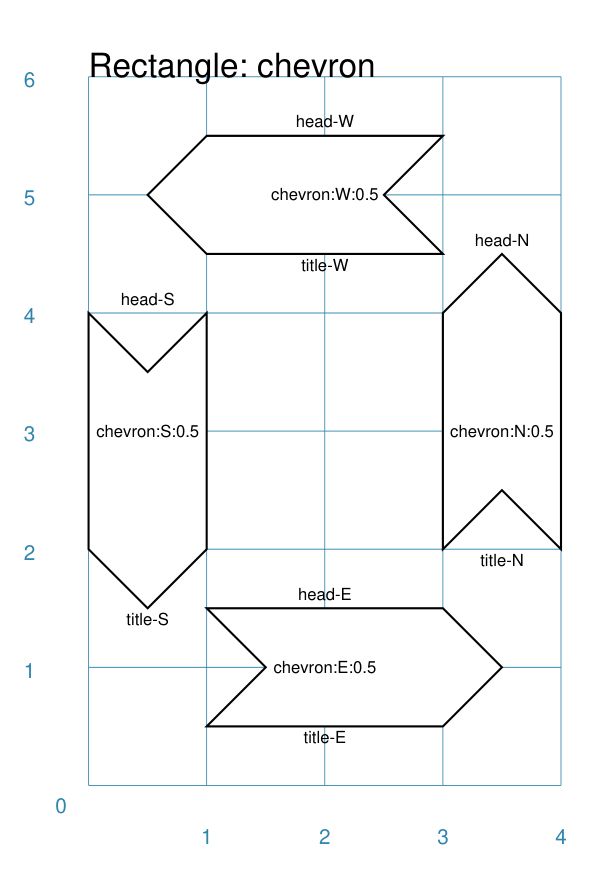

.. table::
   :width: 100
   :widths: 30,70

   ===== ======
   |rcv| This example shows Rectangles constructed using these commands:

         .. code:: python

           Rectangle(
               x=3, y=2, height=2, width=1, font_size=4,
               label="chevron:N:0.5", title="title-N", heading="head-N",
               chevron='N', chevron_height=0.5
           )
           Rectangle(
               x=0, y=2, height=2, width=1, font_size=4,
               label="chevron:S:0.5", title="title-S", heading="head-S",
               chevron='S', chevron_height=0.5
           )
           Rectangle(
               x=1, y=4.5, height=1, width=2, font_size=4,
               label="chevron:W:0.5", title="title-W", heading="head-W",
               chevron='W', chevron_height=0.5
           )
           Rectangle(
               x=1, y=0.5, height=1, width=2, font_size=4,
               label="chevron:E:0.5", title="title-E", heading="head-E",
               chevron='E', chevron_height=0.5
           )

         The Rectangles all have the following properties that differ from
         the defaults:

         - *x* and *y*, *height* and *width* - set the basic configuration
         - *label*, *title* and *heading* - text to describe the shape's setting
         - *chevron* - the primary compass direction in which the chevron is
           pointing; N(orth), S(outh), E(ast) or W(est)
         - *chevron_height* - the distance of the chevron peak from the side of
           the rectangle

   ===== ======

.. _rectHatch:

Hatch
-----
`^ <rectangle_>`_

Hatches are a set of parallel lines that are drawn, in a specified direction, across
the length or width of the Rectangle in a vertical, horizontal or diagonal direction.

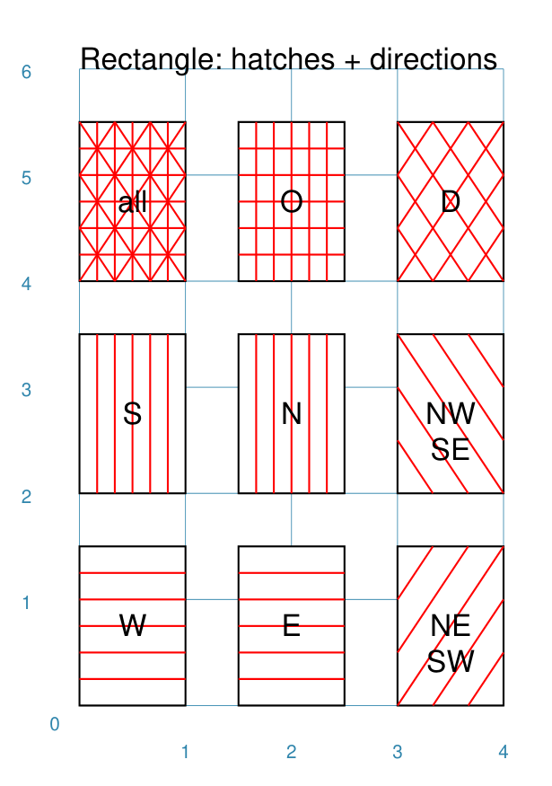

.. table::
   :width: 100
   :widths: 30, 70

   ===== ======
   |rht| This example shows Rectangles constructed using these commands:

         .. code:: python

           htch = Common(
             height=1.5, width=1, hatch_count=5, hatch_width=0.1, hatch_stroke=red)

           Rectangle(
             common=htch, x=0, y=0,  hatch='w', label="W")
           Rectangle(
             common=htch, x=1.5, y=0, hatch='e', label="E")
           Rectangle(
             common=htch, x=3, y=0, hatch='ne', label="NE\nSW")

           Rectangle(
             common=htch, x=1.5, y=2, hatch='n', label="N")
           Rectangle(
             common=htch, x=0, y=2,  hatch='s', label="S")
           Rectangle(
             common=htch, x=3, y=2, hatch='nw', label="NW\nSE")

           Rectangle(
             common=htch, x=0, y=4, label="all")
           Rectangle(
             common=htch, x=1.5, y=4, hatch='o', label="O")
           Rectangle(
             common=htch, x=3, y=4, hatch='d', label="D")

         These Rectangles all share the following Common properties that
         differ from the defaults:

         - *height* and *width* - set the basic configuration
         - *hatch_count* - sets the **number** of lines to be drawn; the
           intervals between them are equal and depend on the direction
         - *hatch_width* - set to ``0.1`` point; a fairly thin line
         - *hatch_stroke* - set to the color ``red`` to make it stand out
           from the rectangle sides

         Each Rectangle has its own setting for:

         - *x* and *y* - different positions on the page for the lower-left
           corner
         - *label* - text to help identify it
         - *hatch* - if not specified, hatches will be drawn
           in all directions - otherwise:

           - ``n`` (North) or ``s`` (South) draws vertical lines;
           - ``w`` (West) or ``e`` (East) draws horizontal lines;
           - ``nw`` (North-West) or ``se`` (South-East) draws diagonal lines
             from top-left to bottom-right;
           - ``ne`` (North-East) or ``sw`` (South-West) draws diagonal lines
             from bottom-left to top-right;
           - ``o`` (orthogonal) draws vertical **and** horizontal lines;
           - ``d`` (diagonal) draws diagonal lines between all corners

   ===== ======

.. _rectNotch:

Notch
-----
`^ <rectangle_>`_

Notches are small indents - or outdents - that are drawn in the corners of the
Rectangle.

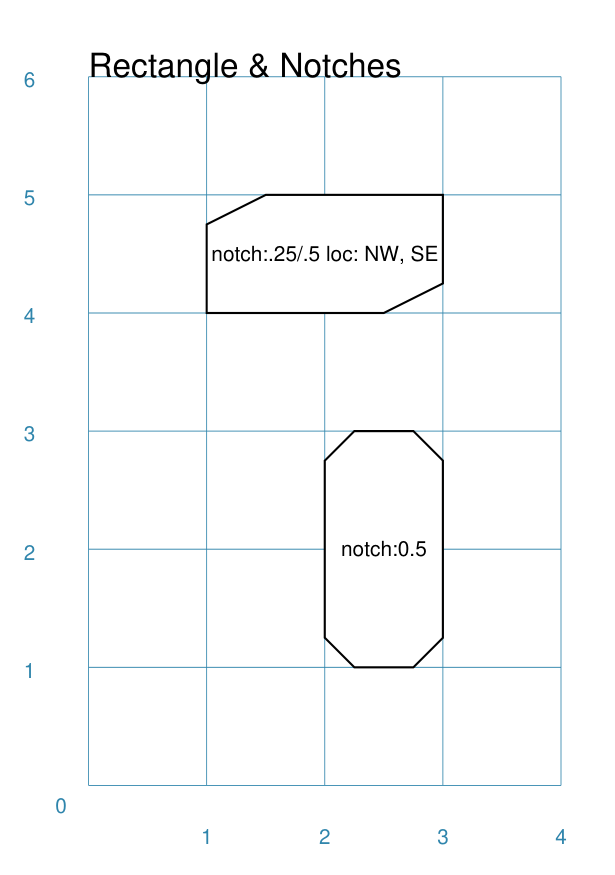

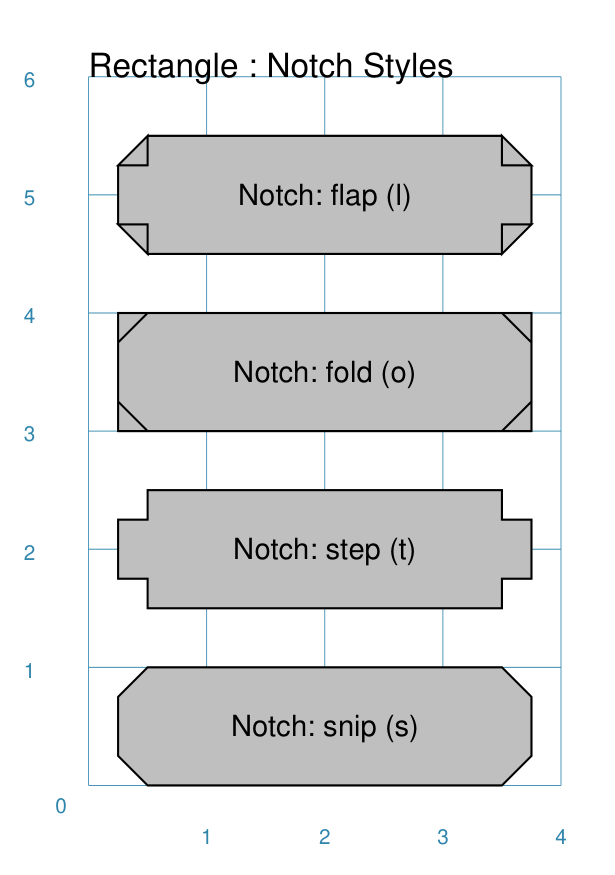

===== ======
|rnt| This example shows Rectangles constructed using these commands:

      .. code:: python

        Rectangle(
            x=2, y=1, height=2, width=1,
            label="notch:0.5", label_size=5,
            notch=0.25,
        )
        Rectangle(
            x=1, y=4, height=1, width=2,
            label="notch:.25/.5 loc: NW, SE", label_size=5,
            notch_y=0.25,  notch_x=0.5, notch_corners="NW SE",
        )

      These share the following properties:

      - *x* and *y*, *height* and *width* - set the basic configuration
      - *label*, *label_size* - text to describe the shape's setting

      The first Rectangle has:

      - *notch* - the size of the triangular shape that will be "cut" off the
        corners of the rectangle

      The second Rectangle has:

      - *notch_x* - the distance from the corner in the x-direction where the
        notch will start
      - *notch_Y* - the distance from the corner in the Y-direction where the
        notch will start
      - *notch_corners* - the specific corners of the rectangle where the notch
        will be applied

===== ======

===== ======
|rns| These examples shows Rectangles constructed using these commands:

      .. code:: python

        styles = Common(
          height=1, width=3.5, x=0.25, notch=0.25, label_size=7, fill=silver)

        Rectangle(
          common=styles, y=0,  notch_style='snip',
          label='Notch: snip (s)')
        Rectangle(
          common=styles, y=1.25, notch_style='step',
          label='Notch: step (t)')
        Rectangle(
          common=styles, y=2.5, notch_style='fold',
          label='Notch: fold (o)')
        Rectangle(
          common=styles, y=3.75, notch_style='flap',
          label='Notch: flap (l)')

      These Rectangles all share the following Common properties that differ from the
      defaults:

      - *height* and *width* - set the basic configuration
      - *x* - sets the position of the left edge
      - *fill* - set to the color ``silver`` so the interior color differs from
        the default white elsewhere
      - *notch* - sets the size of notch, in terms of distance from the corner

      Each *notch_style* results in a slightly different effect:

      - *flap* - makes it appear that the corner has a small, liftable flap
      - *fold* - makes it appear there is a crease across the corner
      - *step* - is sillohette of a step "cut out"
      - *snip* - is a small triangle "cut out"; this is the default style

===== ======

.. _rectPeak:

Peak
----
`^ <rectangle_>`_

A peak is small triangular shape that juts out from the side of a Rectangle in
a specified direction

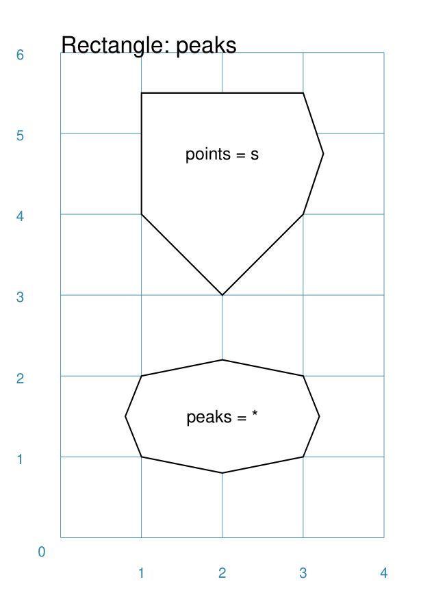

===== ======
|rpk| This example shows Rectangles constructed using these commands:

      .. code:: python

        Rectangle(
            x=1, y=4, width=2, height=1.5,
            font_size=6, label="points = s",
            peaks=[("s", 1), ("e", 0.25)]
        )
        Rectangle(
            x=1, y=1, width=2, height=1,
            font_size=6, label="peaks = *",
            peaks=[("*", 0.2)]
        )

      The Rectangles all have the following properties that differ from the defaults:

      - *x* and *y*; *width* and *height* - set the basic configuration
      - *label*, *font_size* - for the text to describe the shape's peak setting
      - *peaks* - the value(s) used to create the peak

      The *peaks* property is a list:

      - the square brackets (``[`` to ``]``) contain one or more sets
      - a set is enclosed by round brackets, consisting of *directions* and
        a peak *size*:

        - Directions are the primary compass directions - (n)orth,
          (s)outh, (e)ast and (w)est,
        - Sizes are the distances of the centre of the peak from the edge
          of the Rectangle.

        *Note* If the value ``*`` is used for a direction, it is a short-cut
        meaning that peaks should drawn in all four directions.

===== ======

.. _rectRotation:

Rotation
--------
`^ <rectangle_>`_

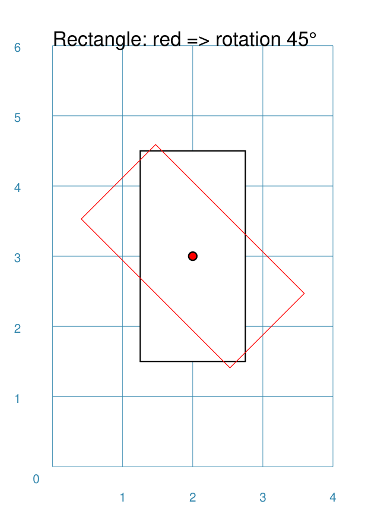

Rotation takes place in anti-clockwise direction, from the horizontal, around
the centre of the Rectangle.

===== ======
|rrt| This example shows Rectangles constructed using the commands:

      .. code:: python

        Rectangle(cx=2, cy=3, width=1.5, height=3, dot=0.06)
        Rectangle(
            cx=2, cy=3, width=1.5, height=3, fill=None,
            stroke=red, stroke_width=.3, rotation=45, dot=0.04)

      The first, upright, Rectangle is a normal one, with a black outline, and
      centred at x-location ``2`` cm and y-location ``3`` cm.  It has a small
      black *dot* in the centre.

      The second Rectangle is similar to the first, except:

      - *fill* - set to ``None``. It is efectively fully transparent, allowing
        the first Rectangle to be seen "below"
      - *stroke* - set to ``red`` to highlight it
      - *dot* - has the same color as the *stroke* (by default) and is smaller
        than the *dot* of the  first Rectangle
      - *rotation* - of 45 |deg|; counter-clockwise from the horizontal

===== ======

.. _rectRounding:

Rounding
--------
`^ <rectangle_>`_

Rounding changes the corners of a Rectangle from a sharp, right-angled, join
into the arc of a quarter-circle.

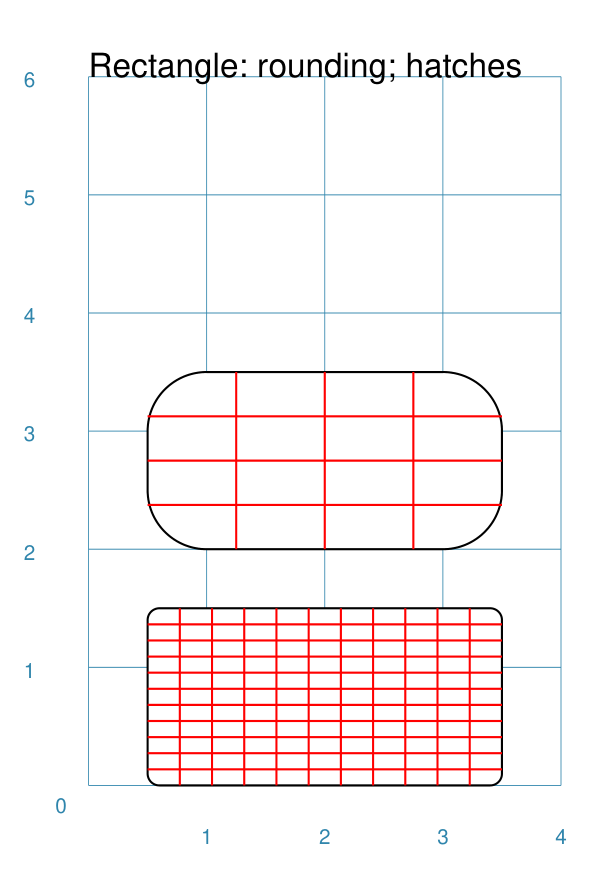

===== ======
|rnd| This example shows Rectangles constructed using the commands:

      .. code:: python

        rct = Common(
            x=0.5, height=1.5, width=3.0, stroke_width=.5,
            hatch_stroke=red, hatch='o')
        Rectangle(
            common=rct, y=2.0, rounding=0.5,  hatch_count=3)
        Rectangle(
            common=rct, y=0.0, rounding=0.1, hatch_count=10)

      Both Rectangles share the Common properties of:

      - *x* the left side location
      - *height* and *width*
      - *hatch_stroke* - set to ``red``
      - *hatch* directions of ``o`` (for orthogonal)A8

      These properties set the color and directions of the lines crossing
      the Rectangles.

      The first Rectangle has these specific properties:

      - *rounding* - set to ``0.5``; the radius of the circle used for the corner
      - *hatch_count* - set to ``3``; the number of lines crossing the Rectangle
        in both vertical and horizontal directions.

      The second Rectangle has these specific properties:

      - *rounding* - set to ``0.1``; the radius of the circle used for the corner
      - *hatch_count* - set to  ``10``; the number of lines crossing the Rectangle
        in both vertical and horizontal directions.

      It should be noted that if the rounding is too large in comparison with
      the number of hatches, as in this example:

        .. code:: python

          Rectangle(common=rct, y=2.0, rounding=0.5, hatch_count=10)

      then the program will issue an error::

        No hatching permissible with this size rounding in the rectangle

===== ======

.. _rectBorders:

Borders
-------
`^ <rectangle_>`_

The ``Borders`` property allows for the normal line that is drawn around the
Rectangle to be overwritten on specific sides by another type of line.

The ``Borders`` property is specified by providing a set of values, which are
comma-separated inside of round brackets, in the following order:

- direction - one of (n)orth, (s)outh, (e)ast or (w)est
- width - the line thickness
- color - either a named color or a hexadecimal value
- style - ``True`` makes it dotted; or a list of values creates dashes

Direction and width are required, but color and style are optional.  One
or more border values can be used together with spaces between them
e.g. ``n s`` to draw both lines on both north **and** south sides.

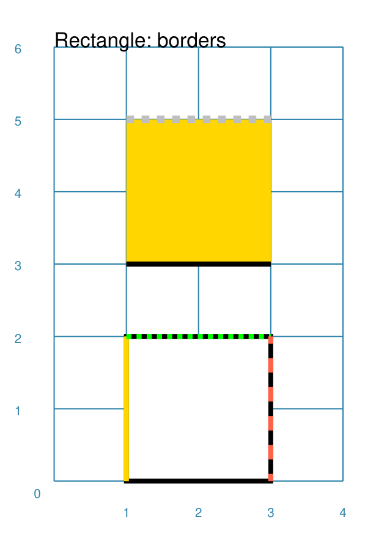

===== ======
|rb1| This example shows Rectangles constructed using these commands:

      .. code:: python

        Rectangle(
            y=3, height=2, width=2, stroke=None, fill=gold,
            borders=[
                ("n", 2, silver, True),
                ("s", 2),
            ]
        )
        Rectangle(
            y=0, height=2, width=2, stroke_width=1.9,
            borders=[
                ("w", 2, gold),
                ("n", 2, lime, True),
                ("e", 2, tomato, [0.1,0.2,0.1,0]),
            ]
        )

      The top rectangle has a *fill* but no *stroke* i.e. no lines are drawn
      around it. There are two *borders* that are set in the list (shown in
      the square brackets going from ``[`` to ``]``):

      - first border sets a thick grey dotted line for the top (north) edge
      - second border sets a thick line for the bottom (south) edge; no color
        is given so it defaults to black

      The lower rectangle has a thick *stroke_width* as its outline, with a
      default *fill* of white and default *stroke* of black.

      There are three *borders* that are set in the list (the square brackets
      going from ``[`` to ``]``):

      - first border sets a thick yellow line for the left (west) edge
      - second border sets a thick green dotted line for the top (north) edge
      - third border sets a thick red dashed line for the left (west) edge

      *Note* that for both dotted and dashed lines, any underlying color or
      image will "show though" the gaps in the line.

===== ======

.. _hexIndex:

Hexagon
=======
`↑ <table-of-contents_>`_

A key property for a hexagon is its *orientation*; this can either be *flat*,
which is the default, or *pointy*. The examples below show how commands can be
applied to each.

- `Borders <hexBorders_>`_
- `Centre <hexCentre_>`_
- `Dot and Cross <hexCross_>`_
- `Hatch: Flat <hexHatchFlat_>`_
- `Hatch: Pointy <hexHatchPointy_>`_
- `Radii: Flat <hexRadiiFlat_>`_
- `Radii: Pointy <hexRadiiPointy_>`_
- `Perbis: Flat <hexPerbisFlat_>`_
- `Perbis: Pointy <hexPerbisPointy_>`_
- `Text: Flat <hexTextFlat_>`_
- `Text: Pointy <hexTextPointy_>`_

.. _hexCentre:

Centre
------
`^ <hexagon_>`_

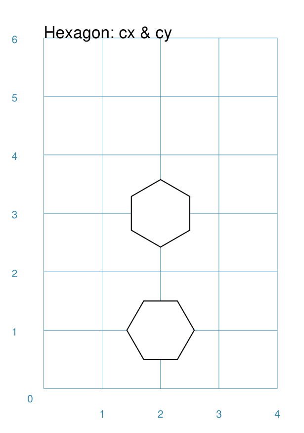

===== ======
|hcn| This example shows Hexagons constructed using these commands:

      .. code:: python

          Hexagon(cx=2, cy=3, orientation='pointy')
		  Hexagon(cx=2, cy=1)

      Both Hexagons are located via their centres - *cx* and *cy*.

      The upper Hexagon also has the *orientation* property set to
      ``pointy``, ensuring there is a "peak" at the top of it.

      The lower Hexagon has the default *orientation* value of ``flat``.

===== ======

.. _hexCross:

Dot & Cross
-----------
`^ <hexagon_>`_

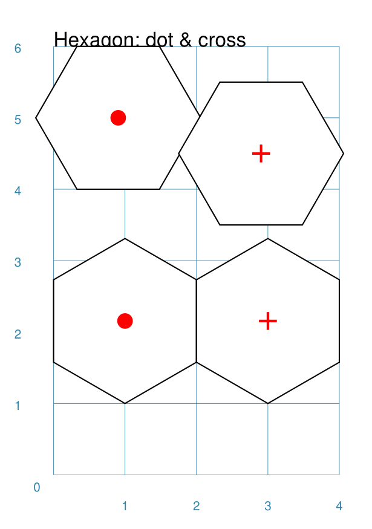

===== ======
|hcd| This example shows Hexagons constructed using these commands:

      .. code:: python

        Hexagon(x=-0.25, y=4, height=2,
                dot=0.1, dot_stroke=red)
        Hexagon(x=1.75, y=3.5, height=2,
                cross=0.25, cross_stroke=red, cross_stroke_width=1)

        Hexagon(x=0, y=1, height=2,
                dot=0.1, dot_stroke=red,
                orientation='pointy')
        Hexagon(x=2, y=1, height=2,
                cross=0.25, cross_stroke=red, cross_stroke_width=1,
                orientation='pointy')

      These Hexagons have properties set as follows:

      - *x* and *y* - set the lower-left position of the Hexagon
      - *height* - sets the distance from flat-edge to flat-edge
      - *dot* - sets the size of dot at the centre
      - *dot_stroke*  - sets the color of the dot. Note that the dot is "filled
        in" with that same color.
      - *cross* - sets the length of each of the two lines that cross at the centre
      - *cross_stroke*  - sets the color of the cross lines
      - *cross_stroke_width* - sets the thickness of the cross lines
      - *orientation* - if set to `pointy`, there will be a "peak" at the top

===== ======

.. _hexHatchFlat:

Hatch: Flat
-----------
`^ <hexagon_>`_

Hatches are a set of parallel lines that are drawn across
the Hexagon from one opposing side to another in a vertical, horizontal or
diagonal direction.

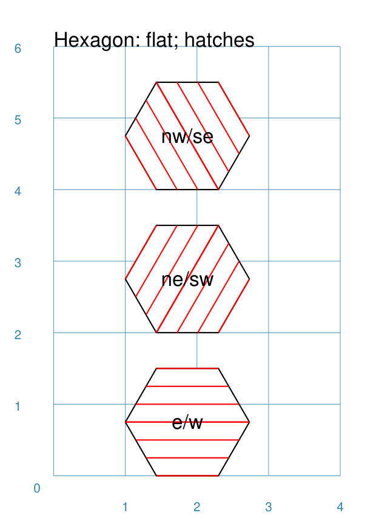

===== ======
|hhf| This example shows Hexagons constructed using these commands:

      .. code:: python

        hxgn = Common(
            x=1, height=1.5, orientation='flat', hatch_count=5, hatch_stroke=red)
        Hexagon(common=hxgn, y=0, hatch='e', label="e/w")
        Hexagon(common=hxgn, y=2, hatch='ne', label="ne/sw")
        Hexagon(common=hxgn, y=4, hatch='nw', label="nw/se")

      These Hexagons all share the following Common properties that differ
      from the defaults:

      - *x* and *height* - set the basic configuration
      - *orientation* - set to ``flat``, so there will be no "peak" at the top
      - *hatch_count* - sets the **number** of lines to be drawn. The interval
        between them is equal and depends on the direction
      - *hatch_stroke* - set to the color ``red`` to make it stand out from the
        hexagon sides

      Each Hexagon has its own setting for:

      - *y* - different positions on the page for the lower corner
      - *label* - text to help identify it
      - *hatch* - if not specified, hatches will be drawn in all directions -
        otherwise:

        - ``w`` (West) or ``e`` (East) draws horizontal lines
        - ``ne`` (North-East) or ``sw`` (South-West) draws diagonal lines from
          bottom-left to top-right
        - ``nw`` (North-West) or ``se`` (South-East) draws diagonal lines from
          top-left to bottom-right

===== ======

.. _hexHatchPointy:

Hatch: Pointy
-------------
`^ <hexagon_>`_

Hatches are a set of parallel lines that are drawn, in a specified direction,
across the Hexagon from one opposing side to another in a vertical, horizontal
or diagonal direction.

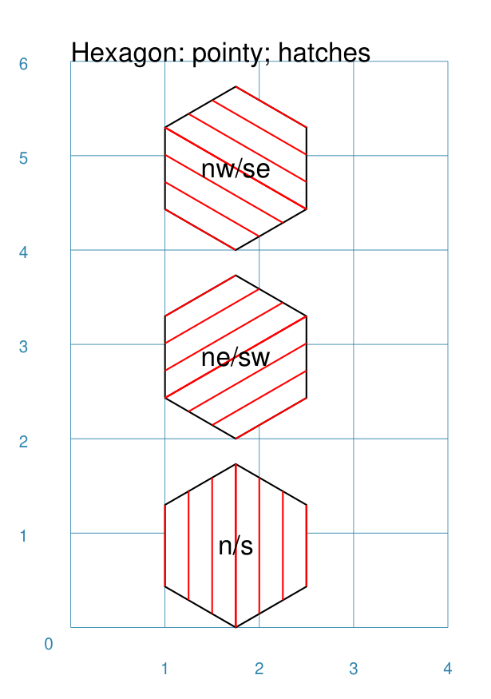

===== ======
|hhp| This example shows Hexagons constructed using these commands:

      .. code:: python

        hxgn = Common(
            x=1, height=1.5, orientation='pointy',
            hatch_count=5, hatch_stroke=red)
        Hexagon(common=hxgn, y=0, hatch='n', label="n/s")
        Hexagon(common=hxgn, y=2, hatch='ne', label="ne/sw")
        Hexagon(common=hxgn, y=4, hatch='nw', label="nw/se")

      These Hexagons all share the following Common properties that differ
      from the defaults:

      - *x* and *height* - set the basic configuration
      - *orientation* - set to ``pointy``, so there will be a "peak" at the top
      - *hatch_count* - sets the **number** of lines to be drawn; the interval
        between them is equal and depends on the direction
      - *hatch_stroke* - set to the color ``red`` to make it stand out from the
        Hexagon sides

      Each Hexagon has its own setting for:

      - *y* - different positions on the page for the lower corner
      - *label* - text to help identify it
      - *hatch* - if not specified, hatches will be drawn in all directions -
        otherwise:

        - ``n`` (West) or ``s`` (East) draws vertical lines
        - ``ne`` (North-East) or ``sw`` (South-West) draws diagonal lines from
          bottom-left to top-right
        - ``nw`` (North-West) or ``se`` (South-East) draws diagonal lines from
          top-left to bottom-right

===== ======

.. _hexRadiiFlat:

Radii: Flat
-----------
`^ <hexagon_>`_

Radii are like spokes of a bicycle wheel; they are drawn from the vertices
of a Hexagon towards its centre.

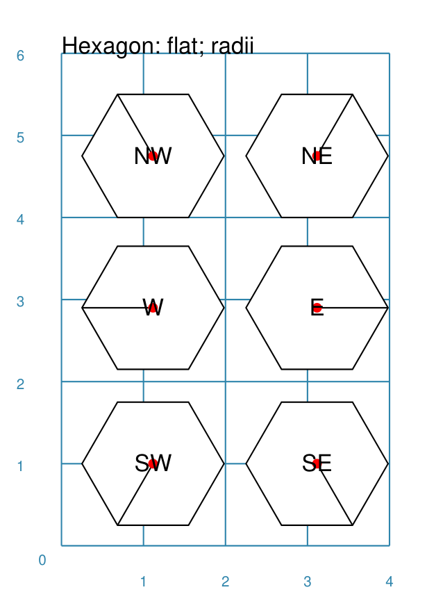

===== ======
|hrf| This example shows Hexagons constructed using these commands:

      .. code:: python

        hxg = Common(
            height=1.5, font_size=8,
            dot=0.05, dot_stroke=red,
            orientation="flat")

        Hexagon(common=hxg, x=0.25, y=0.25, radii='sw', label="SW")
        Hexagon(common=hxg, x=0.25, y=2.15, radii='w', label="W")
        Hexagon(common=hxg, x=0.25, y=4, radii='nw', label="NW")
        Hexagon(common=hxg, x=2.25, y=4, radii='ne', label="NE")
        Hexagon(common=hxg, x=2.25, y=2.15, radii='e', label="E")
        Hexagon(common=hxg, x=2.25, y=0.25, radii='se', label="SE")

      These have the following properties:

      - *common* - all Hexagons drawn with the Common value of ``hxg`` will
        share the same properties; height, font size, dot and orientation
      - *x* and *y* to set the lower-left position
      - *radii* - a compass direction in which the radius is drawn
        (centre to vertex)
      - *label* - the text displayed in the centre shows the compass direction

===== ======

.. _hexRadiiPointy:

Radii: Pointy
-------------
`^ <hexagon_>`__

Radii are like spokes of a bicycle wheel; they are drawn from the vertices
of a Hexagon towards its centre.

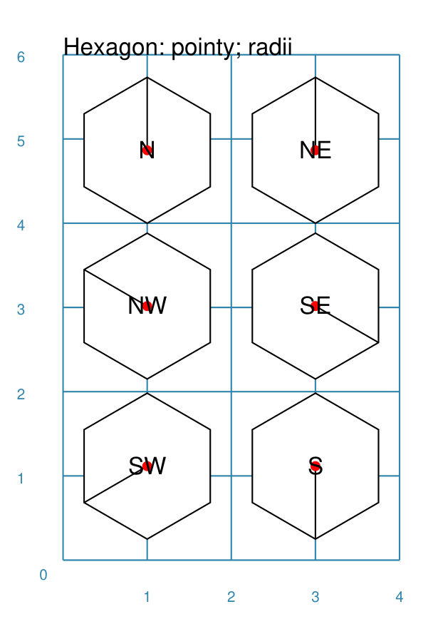

===== ======
|hrp| This example shows Hexagons constructed using these commands:

      .. code:: python

        hxg = Common(
            height=1.5, font_size=8,
            dot=0.05, dot_stroke=red,
            orientation="pointy")
        Hexagon(common=hxg, x=0.25, y=0.25, radii='sw', label="SW")
        Hexagon(common=hxg, x=0.25, y=2.15, radii='nw', label="NW")
        Hexagon(common=hxg, x=0.25, y=4, radii='n', label="N")
        Hexagon(common=hxg, x=2.25, y=4, radii='ne', label="NE")
        Hexagon(common=hxg, x=2.25, y=0.25, radii='s', label="S")
        Hexagon(common=hxg, x=2.25, y=2.15, radii='se', label="SE")

      These have the following properties:

      - *common* - all Hexagons drawn with the Common value of ``hxg`` will
        share the same properties; height, font size, dot and orientation
      - *x* and *y* to set the lower-left position
      - *radii* - a compass direction in which the radius is drawn
        (centre to vertex)
      - *label* - the text displayed in the centre

===== ======

.. _hexPerbisFlat:

Perbis: Flat
------------
`^ <hexagon_>`_

"Perbis" is a shortcut name for "perpendicular bisector". These lines are like
spokes of a bicycle wheel; they are drawn from the mid-points of the edges of
a Hexagon towards its centre.

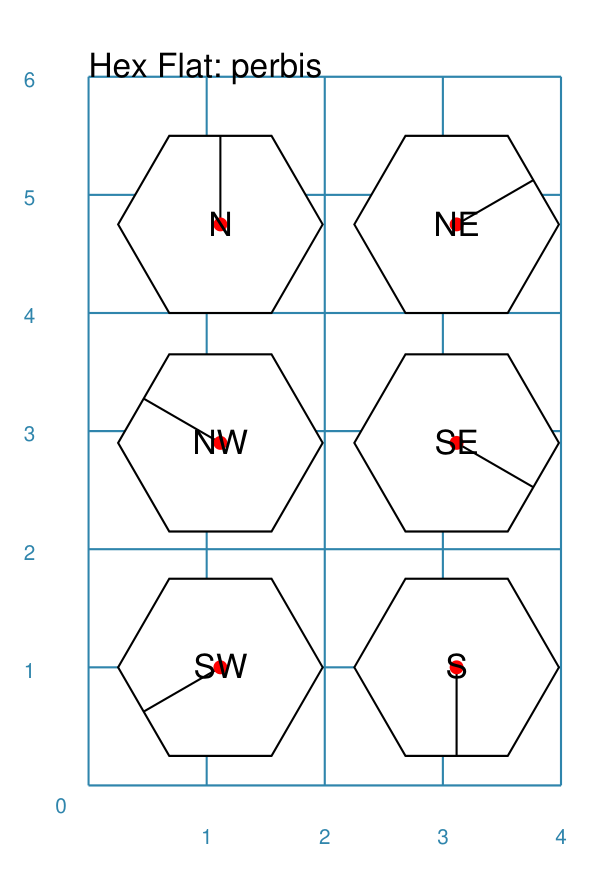

===== ======
|hpf| This example shows Hexagons constructed using these commands:

      .. code:: python

        hxg = Common(
            height=1.5, font_size=8,
            dot=0.05, dot_stroke=red,
            orientation="flat")

        Hexagon(common=hxg, x=0.25, y=0.25, perbis='sw', label="SW")
        Hexagon(common=hxg, x=0.25, y=2.15, perbis='w', label="W")
        Hexagon(common=hxg, x=0.25, y=4, perbis='nw', label="NW")
        Hexagon(common=hxg, x=2.25, y=4, perbis='ne', label="NE")
        Hexagon(common=hxg, x=2.25, y=2.15, perbis='e', label="E")
        Hexagon(common=hxg, x=2.25, y=0.25, perbis='se', label="SE")

      These have the following properties:

      - *common* - all Hexagons drawn with the Common value of ``hxg`` will
        share the same properties; height, font size, dot and orientation
      - *x* and *y* to set the lower-left position
      - *perbis* - a compass direction in which the bisector is drawn
        (centre to mid-point)
      - *label* - the text displayed in the centre shows the compass direction

===== ======

.. _hexPerbisPointy:

Perbis: Pointy
--------------
`^ <hexagon_>`__

Perbis are like spokes of a bicycle wheel; they are drawn from the vertices
of a Hexagon towards its centre.

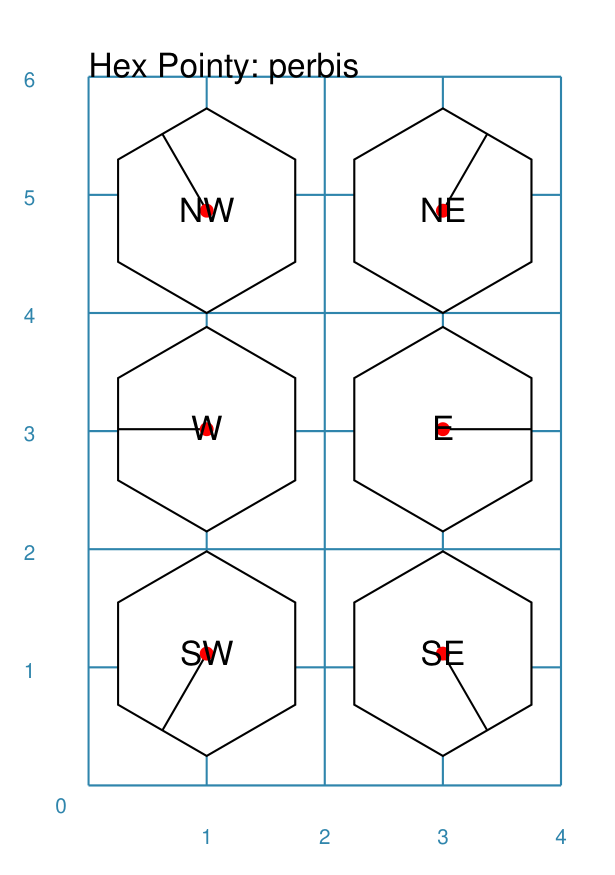

===== ======
|hpp| This example shows Hexagons constructed using these commands:

      .. code:: python

        hxg = Common(
            height=1.5, font_size=8,
            dot=0.05, dot_stroke=red,
            orientation="pointy")
        Hexagon(common=hxg, x=0.25, y=0.25, perbis='sw', label="SW")
        Hexagon(common=hxg, x=0.25, y=2.15, perbis='nw', label="NW")
        Hexagon(common=hxg, x=0.25, y=4, perbis='n', label="N")
        Hexagon(common=hxg, x=2.25, y=4, perbis='ne', label="NE")
        Hexagon(common=hxg, x=2.25, y=0.25, perbis='s', label="S")
        Hexagon(common=hxg, x=2.25, y=2.15, perbis='se', label="SE")

      These have the following properties:

      - *common* - all Hexagons drawn with the Common value of ``hxg`` will
        share the same properties; height, font size, dot and orientation
      - *x* and *y* to set the lower-left position
      - *perbis* - a compass direction in which the bisector is drawn
        (centre to mid-point)
      - *label* - the text displayed in the centre

===== ======

.. _hexTextFlat:

Text: Flat
----------
`^ <hexagon_>`_

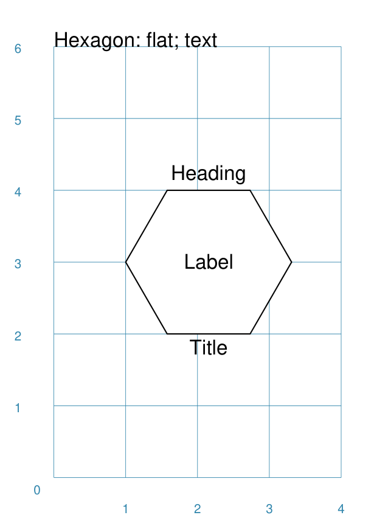

===== ======
|htf| This example shows a Hexagon constructed using this command:

      .. code:: python

        Hexagon(
            y=2,
            height=2,
            title="Title",
            label="Label",
            heading="Heading")

      It has the following properties that differ from the defaults:

      - *y* and *height* used to draw the shape; upwards and larger
      - *heading* - this text appears above the shape  (slightly offset)
      - *label* - this text appears in the middle of the shape
      - *title* - this test appears below the shape (slightly offset)

      All of this text is, by default, centred horizontally.

      Each text item can be further customised in terms of its color, size and
      font face by appending *_stroke*, *_size* and *_face* respectively to the
      text type's name.

===== ======

.. _hexTextPointy:

Text: Pointy
------------
`^ <hexagon_>`_

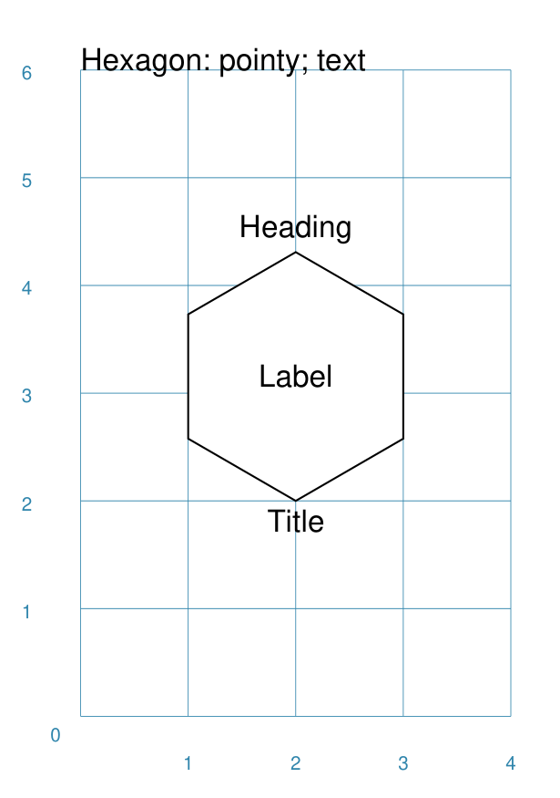

===== ======
|htp| This example shows a Hexagon constructed using this command:

      .. code:: python

        Hexagon(
            y=2,
            height=2,
            orientation='pointy',
            title="Title",
            label="Label",
            heading="Heading")

      It has the following properties that differ from the defaults:

      - *y* and *height* used to draw the shape; upwards and larger
      - *heading* - this text appears above the shape  (slightly offset)
      - *label* - this text appears in the middle of the shape
      - *title* - this text appears below the shape (slightly offset)

      All of this text is, by default, centred horizontally.

      Each text item can be further customised in terms of its color, size and
      font face by appending *_stroke*, *_size* and *_face* respectively to the
      text type's name.

===== ======

.. _hexBorders:

Borders
-------
`^ <hexagon_>`_

The ``Borders`` property allows for the normal line, that is drawn around a
Hexagon, to be overwritten on specific sides by another type of line.

The ``Borders`` property is specified by providing a set of values, which are
comma-separated inside of round brackets, in the following order:

- direction - one of (n)orth, (s)outh, (e)ast, (w)est, ne(northeast),
  se(southeast), nw(northwest), or sw(southwest)
- width - the line thickness
- color - either a named color or a hexadecimal value
- style - ``True`` makes it dotted; or a list of values creates dashes

Direction and width are required, but color and style are optional.

One or more border values can be used together with spaces between them
e.g. ``ne se`` to draw lines on both northeast **and** southeast.

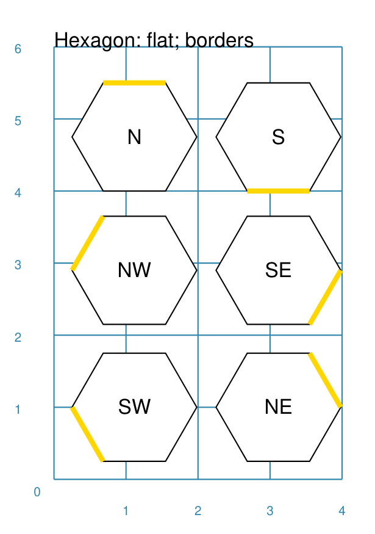

===== ======
|hb1| This example shows ``flat`` Hexagons constructed using these commands:

      .. code:: python

        hxg = Common(
          height=1.5, orientation="flat", font_size=8)
        Hexagon(common=hxg, x=0.25, y=0.25, borders=('sw', 2, gold), label="SW")
        Hexagon(common=hxg, x=0.25, y=2.15, borders=('nw', 2, gold), label="NW")
        Hexagon(common=hxg, x=0.25, y=4.00, borders=('n', 2, gold), label="N")
        Hexagon(common=hxg, x=2.25, y=4.00, borders=('s', 2, gold), label="S")
        Hexagon(common=hxg, x=2.25, y=0.25, borders=('ne', 2, gold), label="NE")
        Hexagon(common=hxg, x=2.25, y=2.15, borders=('se', 2, gold), label="SE")

      Each Hexagon has a normal *stroke_width* as its outline, with a
      default *fill* and *stroke* color of black.

      For each Hexagon, there is a single thick yellow line on one side set by
      the direction in  *borders*.

===== ======

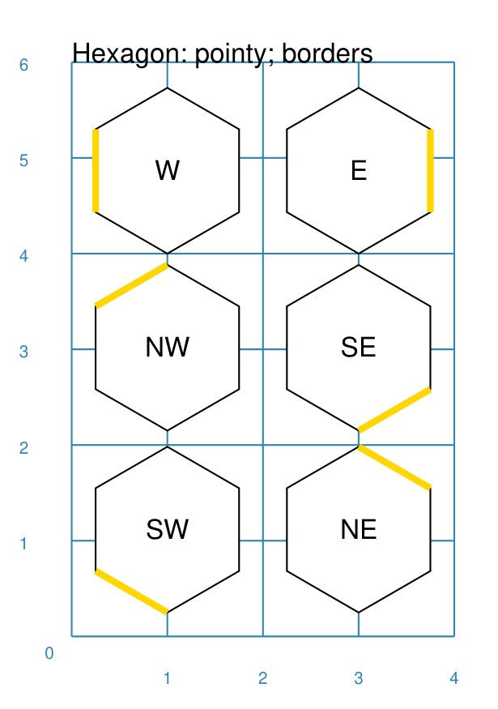

===== ======
|hb2| This example shows ``pointy`` Hexagons constructed using these commands:

      .. code:: python

        hxg = Common(
          height=1.5, orientation="pointy", font_size=8)
        Hexagon(common=hxg, x=0.25, y=0.25, borders=('sw', 2, gold), label="SW")
        Hexagon(common=hxg, x=0.25, y=2.15, borders=('nw', 2, gold), label="NW")
        Hexagon(common=hxg, x=0.25, y=4.00, borders=('w', 2, gold), label="W")
        Hexagon(common=hxg, x=2.25, y=4.00, borders=('e', 2, gold), label="E")
        Hexagon(common=hxg, x=2.25, y=0.25, borders=('ne', 2, gold), label="NE")
        Hexagon(common=hxg, x=2.25, y=2.15, borders=('se', 2, gold), label="SE")

      Each Hexagon has a normal *stroke_width* as its outline, with a
      default *fill* and *stroke* color of black.

      For each Hexagon, there is a single thick yellow line on one side set by
      the direction in *borders*.

===== ======

.. _circleIndex:

Circle
======
`↑ <table-of-contents_>`_

A Circle is a very common shape in many designs; it provides a number of
ways that it can be customised.

- `Dot and Cross <circleCross_>`_
- `Hatch <circleHatch_>`_
- `Radii <circleRadii_>`_
- `Petals: petal <circlePetalsPetal_>`_
- `Petals: curve <circlePetalsCurve_>`_
- `Petals: triangle <circlePetalsTriangle_>`_

.. _circleCross:

Dot & Cross
-----------
`^ <circle_>`_

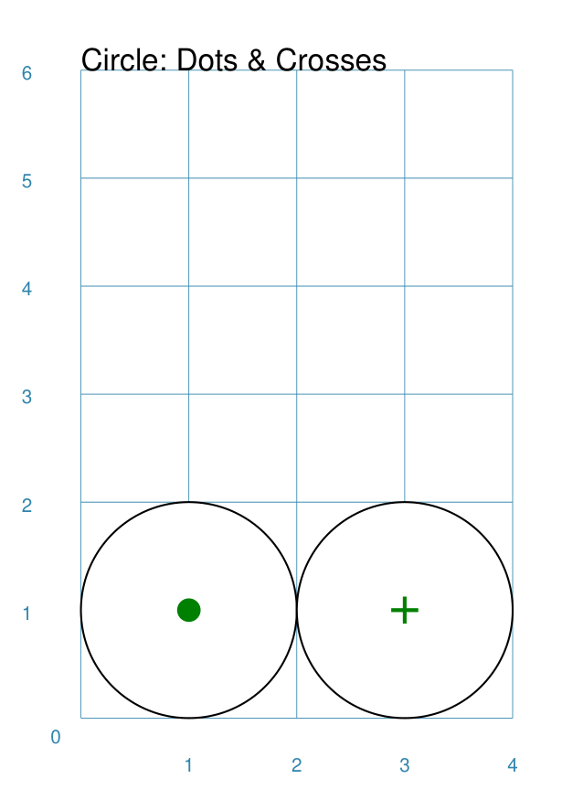

===== ======
|ccd| This example shows Circles constructed using these commands:

      .. code:: python

        Circle(cx=1, cy=1, radius=1, dot=0.1, dot_stroke=green)
        Circle(
            cx=3, cy=1, radius=1,
            cross=0.25, cross_stroke=green, cross_stroke_width=1)

      These Circles have properties set as follows:

      - *cx* and *cy* - set the centre position of the Circle
      - *radius* - sets the distance from centre to circumference
      - *dot* - sets the size of dot at the centre
      - *dot_stroke*  - sets the color of the dot. Note that the dot is
        "filled in" with that same color.
      - *cross* - sets the length of each of the two lines that cross
        at the centre
      - *cross_stroke*  - sets the color of the cross lines
      - *cross_stroke_width* - sets the thickness of the cross lines

===== ======

.. _circleHatch:

Hatch
-----
`^ <circle_>`_

Hatches are a set of parallel lines that are drawn, in a specified direction,
across the Circle from one opposing side to another in a vertical, horizontal
or diagonal direction.

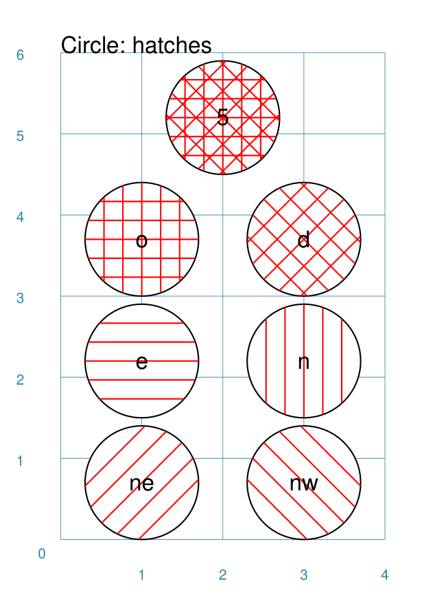

===== ======
|chf| This example shows Circles constructed using these commands:

      .. code:: python

        htc = Common(radius=0.7, hatch_count=5, hatch_stroke=red)
        Circle(common=htc, cx=2, cy=5.2, label='5')
        Circle(common=htc, cx=1, cy=3.7, hatch='o', label='o')
        Circle(common=htc, cx=3, cy=3.7, hatch='d', label='d')
        Circle(common=htc, cx=1, cy=2.2, hatch='e', label='e')
        Circle(common=htc, cx=3, cy=2.2, hatch='n', label='n')
        Circle(common=htc, cx=1, cy=0.7, hatch='ne', label='ne')
        Circle(common=htc, cx=3, cy=0.7, hatch='nw', label='nw')

      These Circles all share the following Common properties that differ
      from the defaults:

      - *radius* - sets the basic size
      - *hatch_count* - sets the **number** of lines to be drawn; the interval
        between them is equal and depends on the direction
      - *hatch_stroke* - set to the color `red` to make it stand out from the
        hexagon sides

      Each Circle has its own setting for:

      - *cx* and *cy* - different positions on the page for the centres
      - *label* - text to help identify it
      - *hatch* - if not specified, hatches will be drawn in all
        directions - as seen in top-most circle - otherwise:

        - ``o`` (orthogonal) draws vertical **and** horizontal lines
        - ``d`` (diagonal) draws diagonal lines between all corners
        - ``e`` (East) or ``w`` (West) or draws horizontal lines
        - ``n`` (West) or ``s`` (East) draws vertical lines
        - ``ne`` (North-East) or ``sw`` (South-West) draws diagonal lines from
          bottom-left to top-right
        - ``nw`` (North-West) or ``se`` (South-East) draws diagonal lines from
          top-left to bottom-right

===== ======

.. _circleRadii:

Radii
-----
`^ <circle_>`_

Radii are like spokes of a bicycle wheel; they are drawn from the circumference
of a Circle towards its centre.

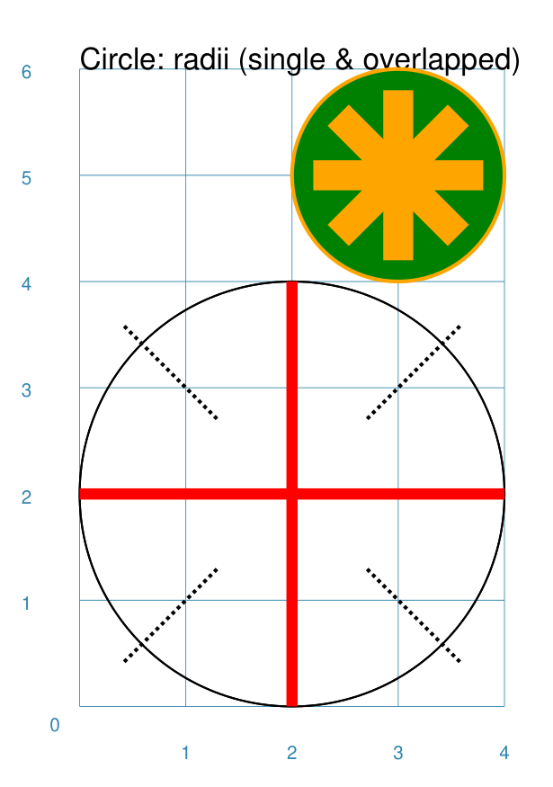

===== ======
|crr| This example shows Circles constructed using these commands:

      .. code:: python

        Circle(x=0, y=0, radius=2,
               fill=None,
               radii=[45,135,225,315],
               radii_stroke_width=1,
               radii_dotted=True,
               radii_offset=1,
               radii_length=1.25)
        Circle(x=0, y=0, radius=2,
               fill=None,
               radii=[0,90,180,270],
               radii_stroke_width=3,
               radii_stroke=red)
        Circle(cx=3, cy=5, radius=1,
               fill=green, stroke=orange, stroke_width=1,
               radii=[0,90,180,270,45,135,225,315],
               radii_stroke_width=8,
               radii_stroke=orange,
               radii_length=0.8)

      These Circles have some of the following properties:

      - *x* and *y* to set the lower-left position; or *cx* and *cy* to set the
        centre
      - *fill* - the color inside the Circle; if ``None`` then it is transparent
      - *radii* - a list of angles (in |deg|) sets the directions at which the
        radii lines are drawn
      - *radii_stroke_width* - if set, will determine the thickness of the radii
      - *radii_dotted* - if set to True, will make the radii lines dotted
      - *radii_stroke* - if set, will determine the color of the radii
      - *radii_length* - if set, will change the length of the radii lines
        from the default (centre to circumference)
      - *radii_offset* - if set, will move the endpoint of the radii line
        **away** from the centre

===== ======

.. _circlePetalsPetal:

Petals - petal
--------------
`^ <circle_>`_

Petals are projecting shapes drawn from the circumference of a Circle outwards
at regular intervals.  They are typically used to create a "flower" or "sun"
effect.

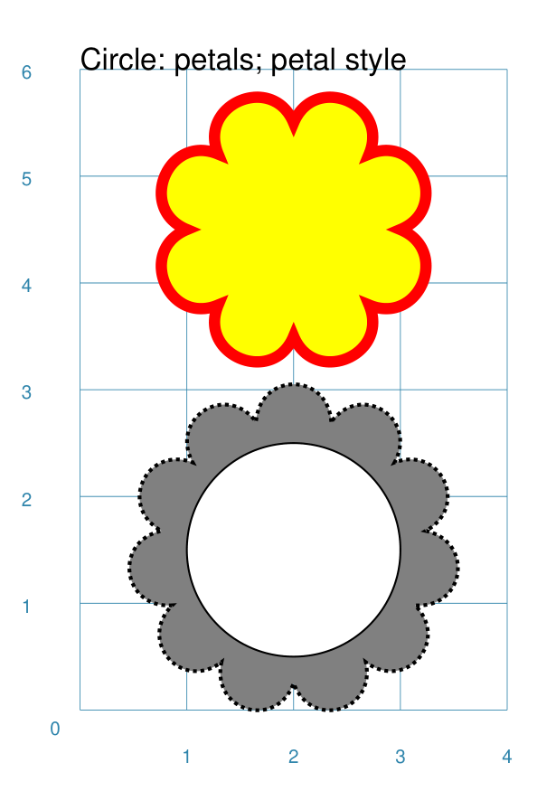

===== ======
|cpp| This example shows Circles constructed using these commands:

      .. code:: python

        Circle(cx=2, cy=4.5, radius=1,
               stroke=None,
               fill=None,
               petals=8,
               petals_style="p",
               petals_stroke_width=3,
               petals_height=0.25,
               petals_stroke=red,
               petals_fill=yellow)
        Circle(cx=2, cy=1.5, radius=1,
               petals=11,
               petals_style="petal",
               petals_offset=0.25,
               petals_stroke_width=1,
               petals_dotted=1,
               petals_height=0.25,
               petals_fill=grey)

      These Circles have the following properties:

      - *cx*, *cy*, *radius*, *stroke* and *fill* - set the properties of the
        `Circle`_; if these are set to ``None`` then the *petal_fill*
        setting will be used for the whole area
      - *petals* - sets the number of petals to drawn
      - *petals_style* - a style of ``p`` or ``petal`` affects the way petals
        are drawn
      - *petals_offset* - sets the distance of the lowest point of the petal
        line away from the circle's circumference
      - *petals_stroke_width* - sets the thickness of the line used to draw
        the petals
      - *petals_fill* - sets the color of the area inside the line used to
        draw the petals. Any *fill* or *stroke* settings for the circle itself
        may appear superimposed on this area.
      - *petals_dotted* - if True, sets the line style to ``dotted``
      - *petals_height* - sets the distance between the highest and the lowest
        points of the petal line

===== ======

.. _circlePetalsCurve:

Petals - curve
--------------
`^ <circle_>`_

Petals are projecting shapes drawn from the circumference of a Circle outwards
at regular intervals.  They are typically used to create a "flower" or "sun"
effect.

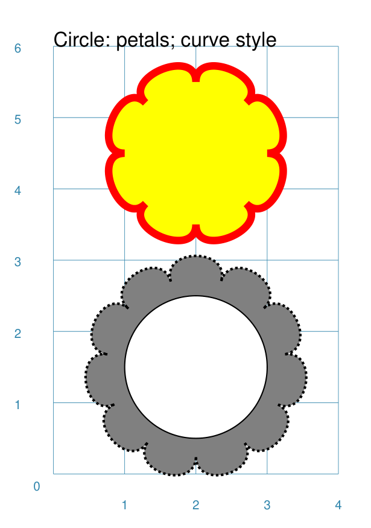

===== ======
|cpc| This example shows Circles constructed using the commands:

      .. code:: python

        Circle(cx=2, cy=4.5, radius=1,
               stroke=None,  fill=None,
               petals=8,
               petals_style="c",
               petals_stroke_width=3,
               petals_height=0.5,
               petals_stroke=red,
               petals_fill=yellow)
        Circle(cx=2, cy=1.5, radius=1,
               petals=11,
               petals_style="curve",
               petals_offset=0.25,
               petals_stroke_width=1,
               petals_dotted=1,
               petals_height=0.5,
               petals_fill=grey)

      These Circles have the following properties:

      - *cx*, *cy*, *radius*, *stroke* and *fill* - set the properties of the
        `Circle`_; if these are set to ``None`` then the *petal_fill*
        setting will be used for the whole area
      - *petals* - sets the number of petals to drawn
      - *petals_style* - a style of ``c`` or ``curve`` affects the way petals
        are drawn
      - *petals_offset* - sets the distance of the lowest point of the petal
        line away from the circle's circumference
      - *petals_stroke_width* - sets the thickness of the line used to draw
        the petals
      - *petals_fill* - sets the color of the area inside the line used to
        draw the petals. Any *fill* or *stroke* settings for the circle itself
        may appear superimposed on this area.
      - *petals_dotted* - if True, sets the line style to ``dotted``
      - *petals_height* - sets the distance between the highest and the lowest
        points of the petal line

===== ======

.. _circlePetalsTriangle:

Petals - triangle
-----------------
`^ <circle_>`_

Petals are projecting shapes drawn from the circumference of a Circle outwards
at regular intervals.  They are typically used to create a "flower" or "sun"
effect.

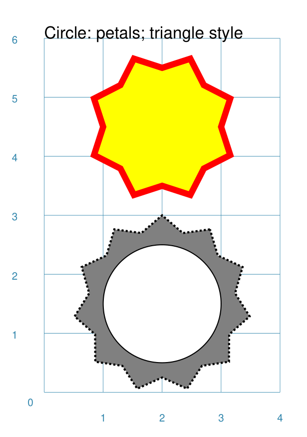

===== ======
|cpt| This example shows Circles constructed using these commands:

      .. code:: python

        Circle(cx=2, cy=4.5, radius=1,
               stroke=None, fill=None,
               petals=8,
               petals_stroke_width=3,
               petals_height=0.25,
               petals_stroke=red,
               petals_fill=yellow)
        Circle(cx=2, cy=1.5, radius=1,
               petals=11,
               petals_offset=0.25,
               petals_stroke_width=1,
               petals_dotted=True,
               petals_height=0.25,
               petals_fill=grey)

      These Circles have the following properties:

      - *cx*, *cy*, *radius*, *stroke* and *fill* - set the properties of the
        `Circle`_; if these are set to ``None`` then the *petal_fill*
        setting will be used for the whole area
      - *petals* - sets the number of petals to drawn
      - *petals_offset* - sets the distance of the lowest point of the petal
        line away from the circle's circumference
      - *petals_stroke_width* - sets the thickness of the line used to draw
        the petals
      - *petals_fill* - sets the color of the area inside the line used to
        draw the petals. Any *fill* or *stroke* settings for the circle itself
        may appear superimposed on this area.
      - *petals_dotted* - if True, sets the line style to `dotted`
      - *petals_height* - sets the distance between the highest and the lowest
        points of the petal line

      Note that these petals have a default *petals_style* of
      ``t`` or ``triangle``.

===== ======

.. _blueprintIndex:

Blueprint
=========
`↑ <table-of-contents_>`_

This shape is primarily intended to support drawing while it is "in progress".

It can take on the appearance of typical "cutting board", so it provides a quick
and convenient way to orientate and place other shapes that *are* required for
the final product.

Typically one would just comment out the Blueprint command when its purpose has
been served.

It can be styled as described below.

- `Subdivisions <blueSub_>`_
- `Style: Blue <blueStyleBlue_>`_
- `Style: Green <blueStyleGreen_>`_
- `Style: Grey <blueStyleGrey_>`_
- `Stroke <blueStroke_>`_
- `Fill <blueFill_>`_
- `Decimals <blueDec_>`_

.. _blueSub:

Subdivisions
------------
`↑ <blueprint_>`_

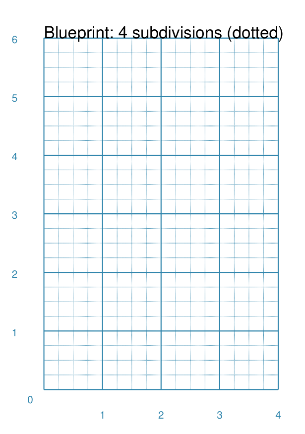

===== ======
|bl1| This example shows the Blueprint constructed using the command with these
      properties:

        .. code:: python

          Blueprint(subdivisions=5, stroke_width=0.5)

      It has the following properties set:

      - *subdivisions* - set to ``5``; these are the number of thinner lines that
        are drawn between each pair of primary lines - they do not have any
        numbering and are automatically drawn with a *dotted* style
      - *stroke_width* - set to ``0.5``; this slightly thicker primary line makes
        the grid more visible

===== ======

.. _blueStyleBlue:

Style - Blue
------------
`↑ <blueprint_>`_

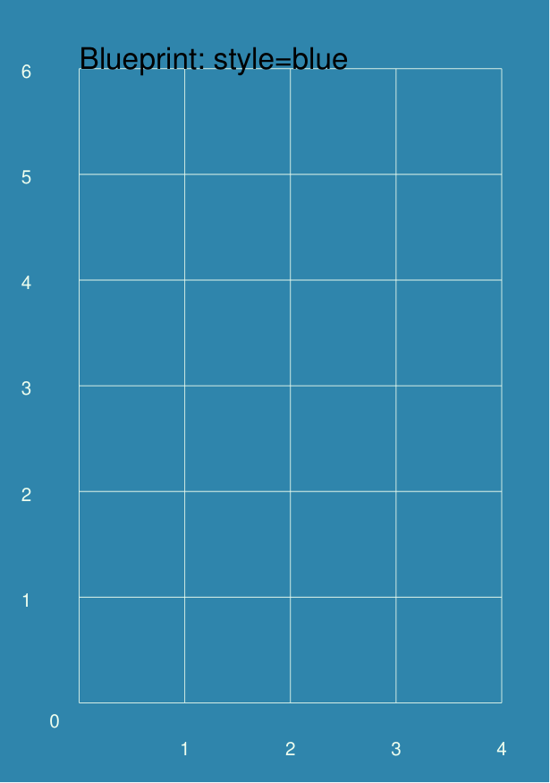

===== ======
|bl2| This example shows the Blueprint constructed using the command with these
      properties:

        .. code:: python

          Blueprint(style='blue')

      It has the following properties set:

      - *style* - set to ``blue``; this affects both the line and the
        background colors

===== ======

.. _blueStyleGreen:

Style - Green
-------------
`↑ <blueprint_>`_

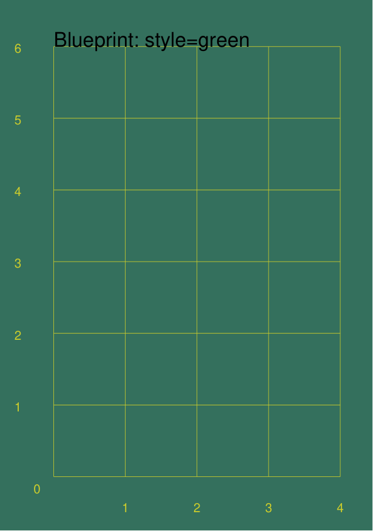

===== ======
|bl3| This example shows the Blueprint constructed using the command with these
      properties:

        .. code:: python

          Blueprint(style='green')

      It has the following properties set:

      - *style* - set to `green`; this affects both the line and the background
        colors

===== ======

.. _blueStyleGrey:

Style - Grey
------------
`↑ <blueprint_>`_

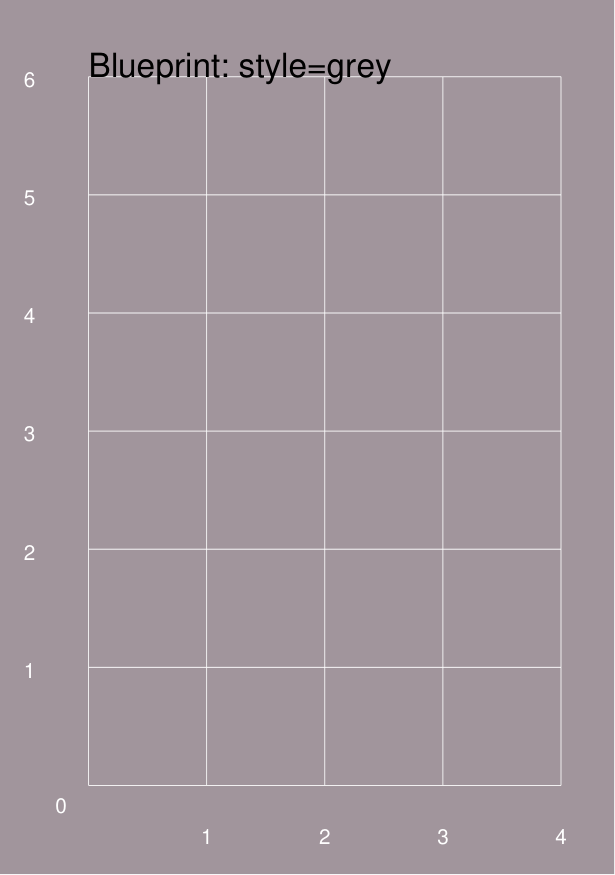

===== ======
|bl4| This example shows the Blueprint constructed using the command with these
      properties:

        .. code:: python

          Blueprint(style='grey')

      It has the following properties set:

      - *style* - set to ``grey``; this affects both the line and the background
        colors

===== ======

.. _blueStroke:

Stroke
------
`↑ <blueprint_>`_

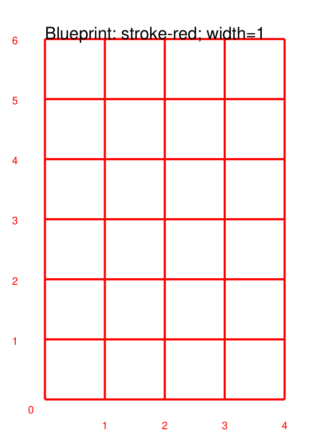

===== ======
|bl5| This example shows the Blueprint constructed using the command with these
      properties:

        .. code:: python

          Blueprint(stroke_width=1, stroke=red)

      It has the following properties set:

      - *stroke* - set to ``red``; ; changes the grid line color
      - *stroke_width* - set to ``1``; this thicker primary line makes
        the grid more visible

===== ======

.. _blueFill:

Fill
----
`↑ <blueprint_>`_

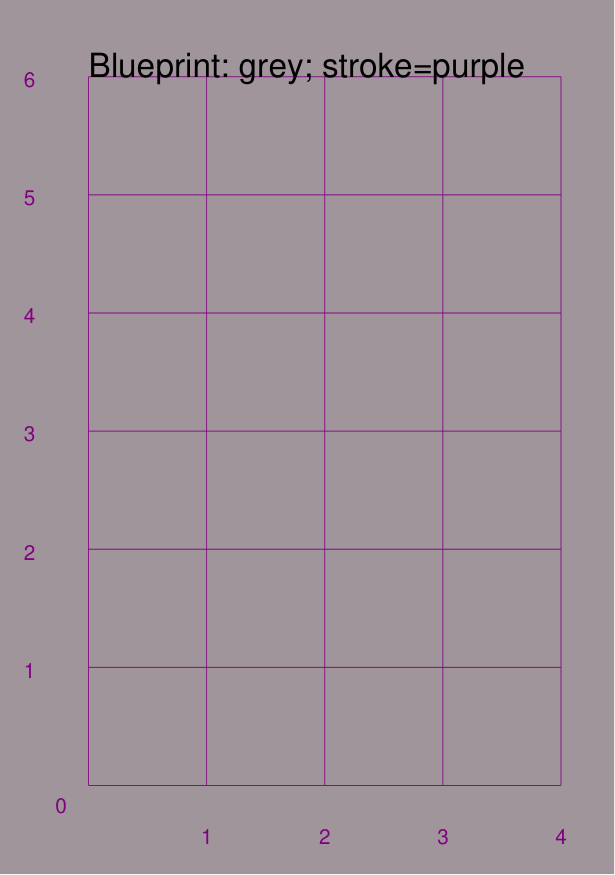

===== ======
|bl6| This example shows the Blueprint constructed using the command with these
      properties:

        .. code:: python

          Blueprint(style='grey', stroke=purple)

      It has the following properties set:

      - *style* - see `Style: Grey <blueStyleGrey_>`_ above
      - *stroke* - set to ``purple``; changes the grid line color and overrides
        the default color used for that style

===== ======

.. _blueDec:

Decimals
--------
`↑ <blueprint_>`_

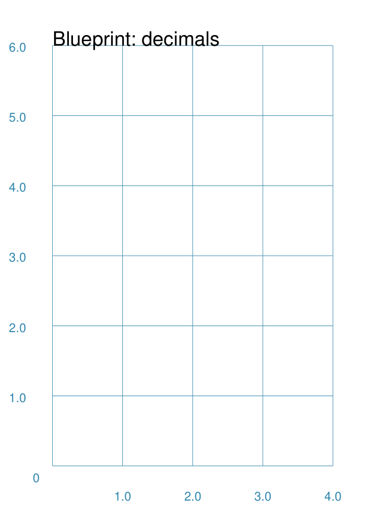

===== ======
|bl7| This example shows the Blueprint constructed using the command with these
      properties:

        .. code:: python

          Blueprint(decimals=1)

      It has the following properties set:

      - *decimals* - set to ``1``; these are the number of decimal points to
        be shown in the grid numbers

===== ======
