===============
Hexagonal Grids
===============

.. |copy| unicode:: U+000A9 .. COPYRIGHT SIGN
   :trim:
.. |deg|  unicode:: U+00B0 .. DEGREE SIGN
   :ltrim:

This section assumes you are very familiar with the concepts, terms and
ideas for :doc:`protograf <index>` as presented in the
:doc:`Basic Concepts <basic_concepts>` , that you understand all of the
:doc:`Additional Concepts <additional_concepts>`
and that you've created some basic scripts of your own using the
:doc:`Core Shapes <core_shapes>`.

.. _table-of-contents:

Table of Contents
=================

- `Overview`_
- `Rectangular Hexagonal Grid`_
- `Circular Hexagonal Grid`_
- `Diamond Hexagonal Grid`_
- `Grid Locations`_
- `Grid LinkLine`_
- `Other Resources`_


Overview
========
`↑ <table-of-contents_>`_

Hexagonal grids are now widely used in the table top gaming industry.

They are particularly suitable in providing an overlay for maps and have been
used for decades in war games and role playing games, but can also act as grids
or tiles in regular board games.

Some practical example of these grids are shown in the section containing
examples of both :doc:`commercial <examples/commercial>` and
:doc:`abstract <examples/abstract>` boards.

You should have already seen how a single Hexagon and a basic grid of Hexagons
are created using defaults, via a :doc:`Hexagon Shape <core_shapes#hexagon>`.
You should also have seen how a single Hexagon can be further enhanced in
:doc:`Customised Shapes <customised_shapes#hexagon>`.

.. _rectIndex:

Rectangular Hexagonal Grid
==========================
`↑ <table-of-contents_>`_

The basic hexagonal grid is laid out in a rectangular fashion. It can be
customised in a number of ways.

- `Rows and Columns <rectRowsCols_>`_
- `Coordinates <rectCoords_>`_
- `Caltrops <rectCaltrops_>`_
- `Hidden <rectHidden_>`_
- `Offset <rectOffset_>`_
- `Radii <rectRadii_>`_

.. _rectRowsCols:

Rows and Columns
----------------
`^ <rectIndex_>`_

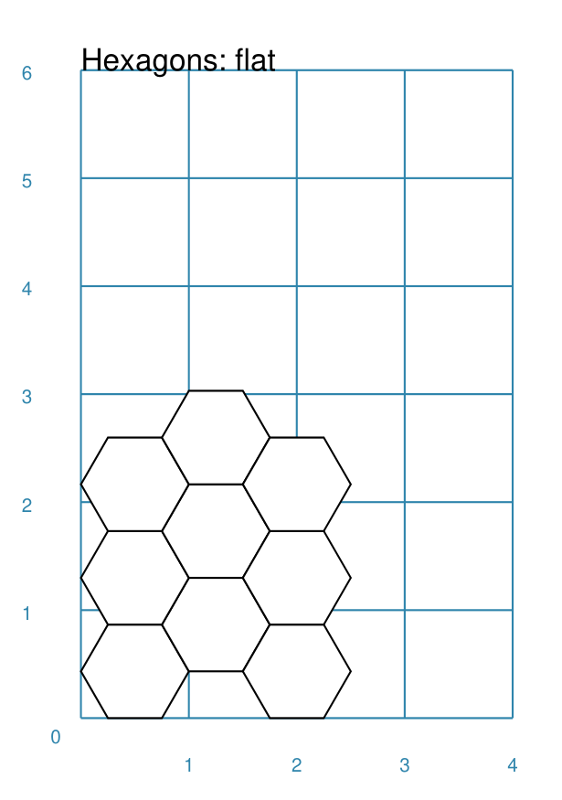

===== ======
|rr1| This example shows a grid constructed using the command:

      .. code:: python

        Hexagons(
            side=0.5,
            x=0, y=0,
            rows=3, cols=3,
        )

      It has the following properties that differ from the defaults:

      - *side* sets the length of each side of a hexagon in the grid
      - *x* and *y* are used to set the lower-left corner of the grid
      - *rows* sets the number of rows  in the grid
      - *cols* sets the number of columns in the grid
===== ======


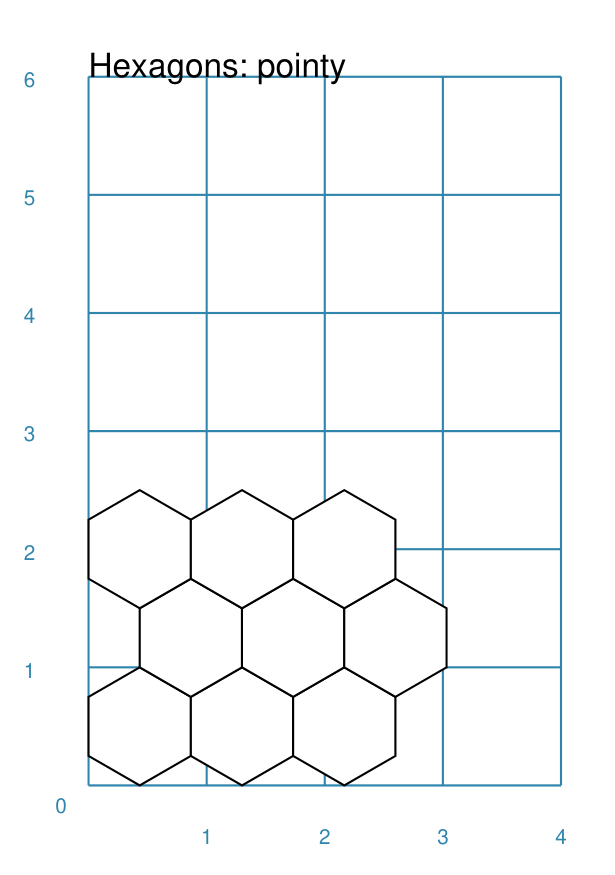

===== ======
|rr2| This example shows a grid constructed using the command:

      .. code:: python

        Hexagons(
            side=0.5,
            x=0, y=0,
            rows=3, cols=3,
            orientation='pointy',
        )

      It has the following properties that differ from the defaults:

      - *side* sets the length of each side of a hexagon in the grid
      - *x* and *y* are used to set the lower-left corner of the grid
      - *rows* sets the number of rows  in the grid
      - *cols* sets the number of columns in the grid
===== ======

.. _rectCoords:

Coordinates
-----------
`^ <rectIndex_>`_

Every location in a grid has a row and column number - these are not, by
default, displayed on the grid; but they are needed in some cases; for example,
to support grid references for a wargame map.

The coordinate system starts at the top-left of the grid; the column is, by
default, the first value (the "x" location) and the row is the second value
(the "y" location).

The coordinates can be displayed using either letters (upper or lowercase) or
numbers (the default behaviour). A separator may be specified to help
visualise, or differentiate, the row versus the column value. For numeric
coordinates, numbers have a "zero padding"; so ``1`` is displayed as ``01``.

The coordinates can also be displayed in various positions within the hexagon.

Most coordinate property names are prefixed with ``coord_``.

.. |rc1| image:: images/custom/hexagonal_grid/rect_coords_flat.png
   :width: 330

===== ======
|rc1| This example shows grids constructed using the commands:

      .. code:: python

        Hexagons(
            side=0.6,
            x=2, y=3,
            rows=2, cols=2,
            fill=darkseagreen,
            hex_offset="odd",
            coord_elevation="top",
            coord_type_x="upper",
            coord_separator='::',
        )
        Hexagons(
            side=0.6,
            x=0, y=0,
            rows=2, cols=2,
            coord_elevation="middle",
            coord_prefix='z',
            coord_suffix='!',
        )

      Each has the following properties that differ from the defaults:

      - *side* sets the length of each side of a hexagon in the grid
      - *x* and *y* are used to set the lower-left corner of the grid
      - *rows* sets the number of rows  in the grid
      - *cols* sets the number of columns in the grid
      - *coord_elevation* can be ``top``, ``middle`` or ``bottom`` to set
        the vertical position of the coordinates text; the horizontal
        always matches to the hexagon's centre

      The green grid also has:

      - *hex_offset* - controls the appearance of the
        `column offset <rectOffset_>`_
      - *coord_type_x* - ``upper`` displays the column (x-value) as an
        uppercase letter
      - *coord_separator* - can be any text used that must be displayed between
        the row and column values; in this case it is two colons ``::``

      The white grid also has:

      - *coord_prefix* - this is text that appears before the row and column
        values are shown (to their left)
      - *coord_suffix* - this is text that appears after the row and column
        values are shown (to their right)
===== ======

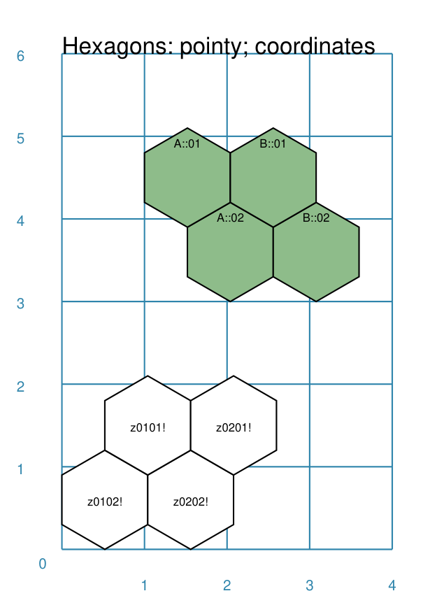

===== ======
|rc2| This example shows grids constructed using the commands:

      .. code:: python

        Hexagons(
            side=0.6,
            x=1, y=3,
            rows=2, cols=2,
            orientation='pointy',
            fill=darkseagreen,
            hex_offset="odd",
            coord_elevation="top",
            coord_type_x="upper",
            coord_separator='::',
        )
        Hexagons(
            side=0.6,
            x=0, y=0,
            rows=2, cols=2,
            orientation='pointy',
            coord_elevation="middle",
            coord_prefix='z',
            coord_suffix='!',
        )

      Each has the following properties that differ from the defaults:

      - *side* sets the length of each side of a hexagon in the grid
      - *x* and *y* are used to set the lower-left corner of the grid
      - *rows* sets the number of rows  in the grid
      - *cols* sets the number of columns in the grid
      - *orientation* set to ``pointy`` to have hexagons with pointed tops
      - *coord_elevation* can be ``top``, ``middle`` or ``bottom`` to set
        the vertical position of the coordinate text

      The green grid also has:

      - *hex_offset* - controls the appearance of the
        `row offset <rectOffset_>`_
      - *coord_type_x* - ``upper`` displays the column (x-value) as an
        uppercase letter
      - *coord_separator* - can be any text used that must be displayed between
        the row and column values; in this case it is two colons ``::``

      The white grid also has:

      - *coord_prefix* - this is text that appears before the row and column
        values are shown (to their left)
      - *coord_suffix* - this is text that appears after the row and column
        values are shown (to their right)
===== ======

.. _rectCaltrops:

Caltrops
--------
`^ <rectIndex_>`_

Caltrops is a term when the point at which three hexagons meet is drawn by
a set of three small lines; these replace the normal edge of the hexagon.

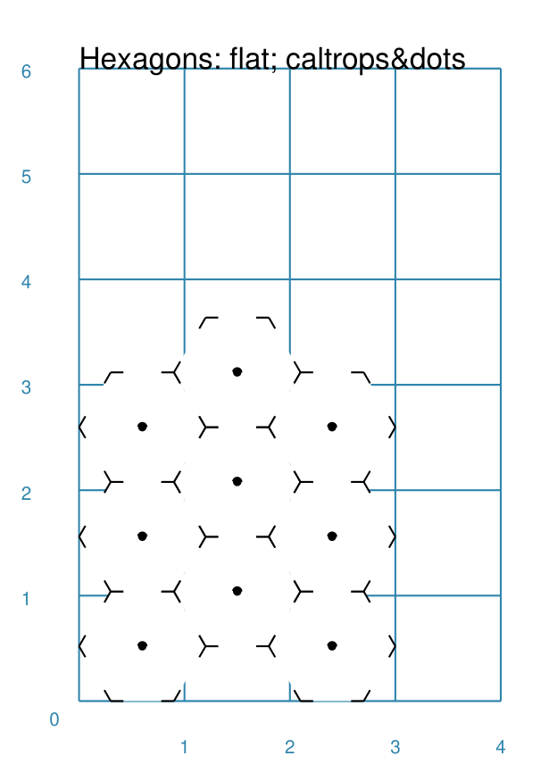

===== ======
|rp1| This example shows a grid constructed using the command:

      .. code:: python

        Hexagons(
            side=0.6,
            x=0, y=0,
            rows=3, cols=3,
            dot=0.04,
            caltrops="medium",
        )

      It has the following properties that differ from the defaults:

      - *side* sets the length of each side of a hexagon in the grid
      - *x* and *y* are used to set the lower-left corner of the grid
      - *rows* sets the number of rows  in the grid
      - *cols* sets the number of columns in the grid
      - *dot* draws a small dot (of size ``0.04``) in the centre of the
        hexagon
      - *caltrops* sets the size of the caltrop lines; this can be ``small``,
        ``medium`` or ``large``
===== ======


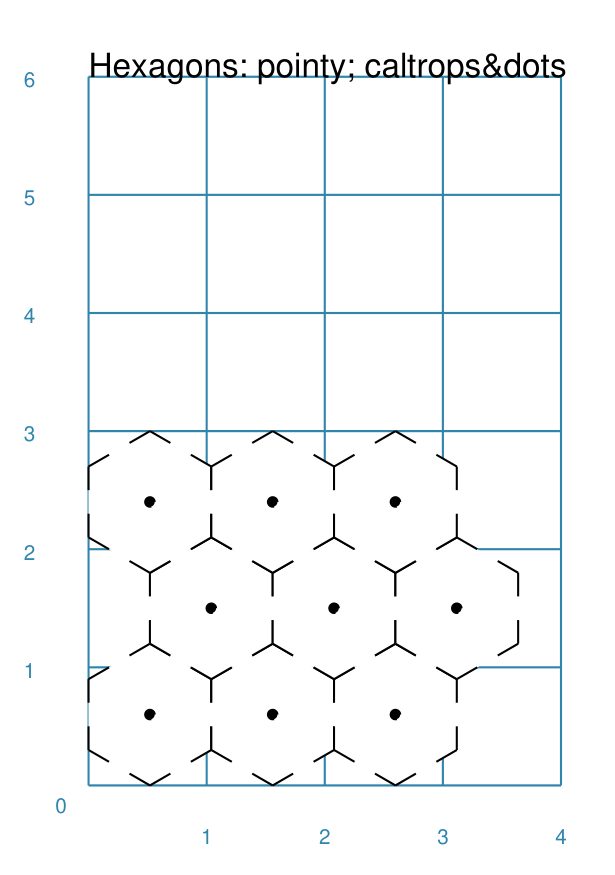

===== ======
|rp2| This example shows a grid constructed using the command:

      .. code:: python

        Hexagons(
            side=0.6,
            x=0, y=0,
            rows=3, cols=3,
            orientation='pointy',
            dot=0.04,
            caltrops="large",
        )

      It has the following properties that differ from the defaults:

      - *side* sets the length of each side of a hexagon in the grid
      - *x* and *y* are used to set the lower-left corner of the grid
      - *rows* sets the number of rows  in the grid
      - *cols* sets the number of columns in the grid
      - *orientation* set to ``pointy`` to have hexagons with pointed tops
      - *dot* draws a small dot (of size ``0.04``) in the centre of the
        hexagon
      - *caltrops* sets the size of the caltrop lines; this can be ``small``,
        ``medium`` or ``large``
===== ======

.. _rectHidden:

Hidden
------
`^ <rectIndex_>`_

As every location in a grid has a row and column number, these values can be
used to hide or mask certain hexagons from being displayed.  This can be useful
when a grid is designed for a scenario where not all hexagons are needed.

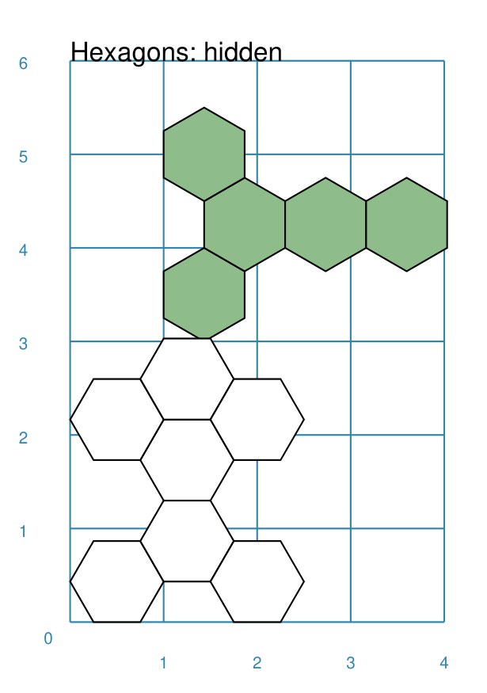

===== ======
|rdd| This example shows grids constructed using the commands:

      .. code:: python

        Hexagons(
            side=0.5,
            x=1, y=3,
            rows=3, cols=3,
            orientation='pointy',
            fill=darkseagreen,
            hidden=[(1, 2), (1, 3), (3, 2), (3, 3)]
        )
        Hexagons(
            side=0.5,
            x=0, y=0,
            rows=3, cols=3,
            hidden="2,1 2,3"
        )

      Each has the following properties that differ from the defaults:

      - *x* and *y* are used to set the lower-left corner of the grid
      - *rows* sets the number of rows  in the grid
      - *cols* sets the number of columns in the grid

      In the green pointy grid:

      - *hidden* - this is a list, shown by the square brackets
        (``[`` to ``]``), of one or more sets of row and column numbers,
        each pair enclosed by the round brackets;
        the second and third columns are hidden in both the first and the
        third row

      In the white flat grid:

      - *hidden* - this is a string, which should contain one or more
        pairs of row and column numbers, each pair separated by a space;
        here the second row hexagon is hidden in both first and second
        columns

===== ======

.. _rectOffset:

Offset
------
`^ <rectIndex_>`_

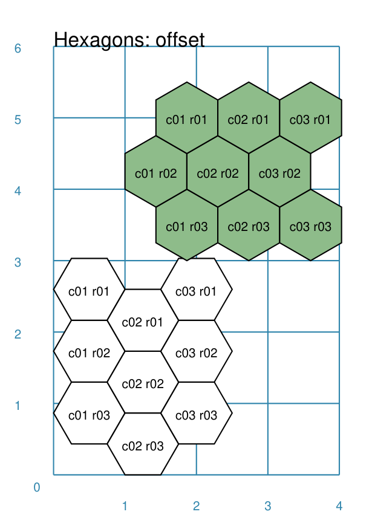

===== ======
|rof| This example shows grids constructed using the commands:

      .. code:: python

        Hexagons(
            side=0.5,
            x=1, y=3,
            rows=3, cols=3,
            hex_offset="odd",
            orientation='pointy',
            fill=darkseagreen,
            coord_elevation="middle",
            coord_font_size=5,
            coord_separator=' r',
            coord_prefix='c',
        )
        Hexagons(
            side=0.5,
            x=0, y=0,
            rows=3, cols=3,
            hex_offset="odd",
            coord_elevation="middle",
            coord_font_size=5,
            coord_separator=' r',
            coord_prefix='c',
        )

      Each has the following properties that differ from the defaults:

      - *side* sets the length of each side of a hexagon in the grid
      - *x* and *y* are used to set the lower-left corner of the grid
      - *rows* sets the number of rows  in the grid
      - *cols* sets the number of columns in the grid
      - *hex_offset* - if ``odd``, then every odd column - for a flat grid - or
        every odd row - for a pointy grid - is offset one-half hexagon from
        those on either side
      - *coord_...* - various settings to control the appearance of the
        `hex coordinates <rectCoords_>`_
===== ======

.. _rectRadii:

Radii
-----
`^ <rectIndex_>`_

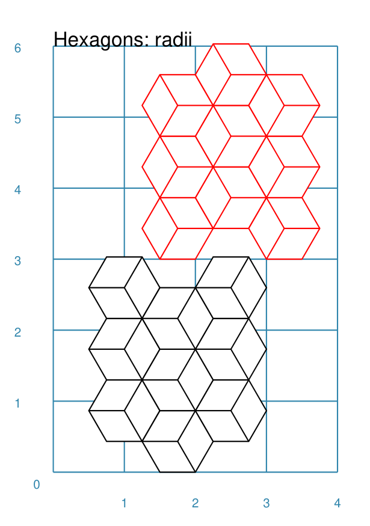

===== ======
|rdi| This example shows grids constructed using the commands:

      .. code:: python

        Hexagons(
            side=0.5,
            x=0.5, y=0,
            rows=3, cols=3,
            hex_offset="odd",
            radii="w ne se",
        )
        Hexagons(
            side=0.5,
            x=1.25, y=3,
            rows=3, cols=3,
            stroke=red,
            radii_stroke=red,
            hex_offset="even",
            radii="e nw sw",
        )

      Each has the following properties that differ from the defaults:

      - *side* sets the length of each side of a hexagon in the grid
      - *x* and *y* are used to set the lower-left corner of the grid
      - *rows* sets the number of rows  in the grid
      - *cols* sets the number of columns in the grid
      - *hex_offset* determines which columns are shifted
      - *radii* - as described for a
        :doc:`customised hexagon <customised_shapes#hexagon>`,this will
        create lines running from each hexagon centre to the vertices, as
        define by the directions specified
===== ======


.. _circIndex:

Circular Hexagonal Grid
=======================
`↑ <table-of-contents_>`_

An alternative to the basic hexagonal grid, is a circular, or circle, layout.

Most of the properties that associated with the basic grid are can also be
used for the circular grid: coordinates; caltrops; radii and hidden hexagons.

- `Basic <circBasic_>`_
- `Nested Shapes <circNested_>`_

.. _circBasic:

Basic
-----
`^ <circIndex_>`_

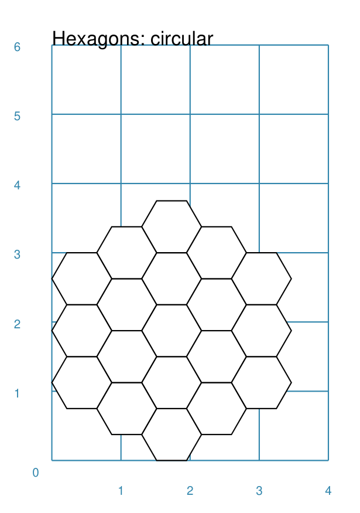

===== ======
|cbs| This example shows a grid constructed using the command:

      .. code:: python

        Hexagons(
            x=0, y=0,
            height=0.75,
            sides=3,
            hex_layout="circle",
        )

      It has the following properties that differ from the defaults:

      - *x* and *y* are used to set the lower-left corner of the grid
      - *height* sets the side-to-side height of a hexagon in the grid
      - *sides* sets the number of hexagons running along each "edge" of the
        grid - there are six sides in all
      - *hex_layout* is set to ``circle`` to create the circular effect

===== ======

.. _circNested:

Nested Shapes
-------------
`^ <circIndex_>`_

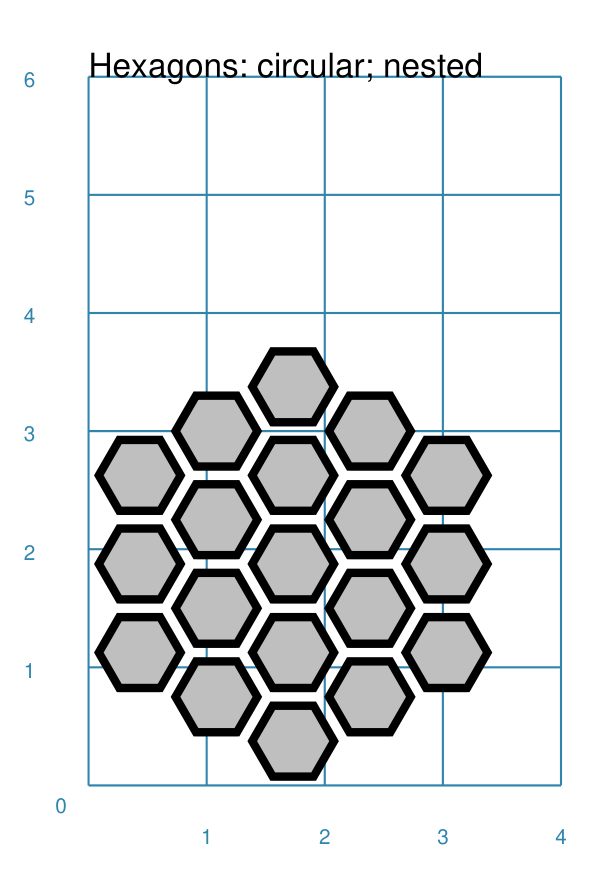

===== ======
|cns| This example shows a grid constructed using the command:

      .. code:: python

        Hexagons(
            x=0, y=0,
            height=0.75,
            sides=3,
            stroke=None, fill=None,
            hex_layout="circle",
            centre_shape=hexagon(
                stroke=black, fill=silver, height=0.6, stroke_width=2),
        )

      It has the following properties that differ from the defaults:

      - *x* and *y* are used to set the lower-left corner of the grid
      - *height* sets the side-to-side height of a hexagon in the grid
      - *sides* sets the number of hexagons running along each "edge" of the
        grid - there are six sides in all
      - *hex_layout* is set to ``circle`` to create the circular pattern
      - *centre_shape* - defines a shape that will appear is all hexagons
        in the grid, and whose centre location will matchthat of the hexagon
        within which it is "nested"; in this case its size is smaller (``0.6``
        is less than ``0.75``) so there is a "gap" around each of the shapes.

===== ======


.. _diamIndex:

Diamond Hexagonal Grid
======================
`↑ <table-of-contents_>`_

An alternative to the basic hexagonal grid, is a diamond layout.

Most of the properties that associated with the basic grid are can also be
used for the diamond grid: coordinates; caltrops; radii and hidden hexagons.

.. _diamBasic:

Basic
-----
`^ <diamIndex_>`_

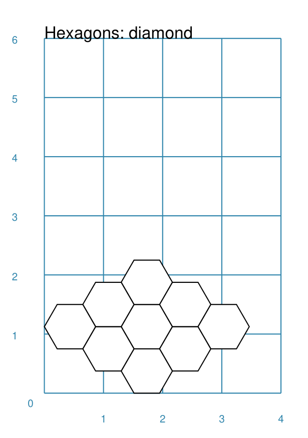

===== ======
|dmb| This example shows a grid constructed using the command:

      .. code:: python

        Hexagons(
            x=0, y=0,
            height=0.75,
            rows=3,
            hex_layout="diamond",
        )

      It has the following properties that differ from the defaults:

      - *x* and *y* are used to set the lower-left corner of the grid
      - *height* sets the side-to-side height of a hexagon in the grid
      - *row* sets the number of hexagons in each row of the grid
      - *hex_layout* is set to ``diamond`` to create the layout pattern
===== ======


Grid Locations
==============
`↑ <table-of-contents_>`_

In order to layout objects within a hexagonal grid, it is possible to use
the ``Location()`` or ``Locations()`` command to specify the "what, where
and how".

These commands should work with any of the types of hexagonal grid layouts
described above.

The following are the key properties required for the ``Location()`` or the
``Locations()`` command:

- *grid* - a grid, or the name assigned to a grid
- *coordinates* - these are coordinates assigned when creating the grid; if
  none have been assigned, the default numbering is used i.e. a label made
  up of two 2-digit numbers (each padded with zero) which correspond to the
  row and column - bear in mind the numbering starts at the top-left of the
  grid
- *shapes* - a list (using square brackets `[` and `]`) of one of more shapes,
  appearing in the order that they must be drawn; the centre of the shapes
  will be set to match the centre of the hexagon in which its drawn.

All examples below make use of a common property (assigned to the
name *a_circle*) defined as:

  .. code:: python

    a_circle = Common(radius=0.4)


Location
--------
`^ <grid locations_>`_

Example 1.  Single Shape
~~~~~~~~~~~~~~~~~~~~~~~~
`^ <location_>`_

.. |hl0| image:: images/custom/hexagonal_grid/hexgrid_location_single.png
   :width: 330

===== ======
|hl0| This example shows a location constructed using the command:

      .. code:: python

        hexgrid = Hexagons(
            side=0.5,
            x=0, y=0,
            rows=6, cols=4,
        )
        Location(
            hexgrid,
            "0101",
            [circle(common=a_circle)]
        )

      The ``Hexagons`` grid is constructed as per the examples described in
      the `Rectangular Hexagonal Grid`_ section.  The grid is assigned the
      name *hexgrid* so it's result can be reused.

      The ``Location`` command has the following properties:

      - *hexgrid* refers to the assigned name for the ``Hexagons`` grid
      - "0101" contains the co-ordinate of the top-left hexagon in the grid
      - the list contains one shape - a ``Circle`` that will be drawn at the
        centre of the hexagon matching the co-ordinate that has been set

===== ======

Example 2. Multiple Shapes
~~~~~~~~~~~~~~~~~~~~~~~~~~
`^ <locations_>`_

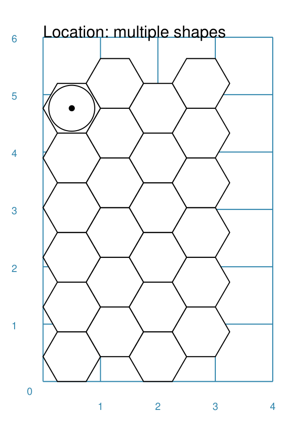

===== ======
|hl1| This example shows a location constructed using the command:

      .. code:: python

        hexgrid = Hexagons(
            side=0.5,
            x=0, y=0,
            rows=6, cols=4,
        )
        Location(
            hexgrid,
            "0101",
            [circle(common=a_circle), dot()]
        )

      The ``Hexagons`` grid is constructed as per the examples described in
      the `Rectangular Hexagonal Grid`_ section.  The grid is assigned the
      name *hexgrid* so it's result can be reused.

      The ``Location`` command has the following properties:

      - *hexgrid* refers to the assigned name for the ``Hexagons`` grid
      - ``"0101"`` is the co-ordinate of the top-left hexagon in the grid
      - the list contains two shapes - a ``Circle`` and a ``Dot``;  these
        will be drawn in that order, each at the centre of the hexagon
        matching the co-ordinate that has been set

===== ======


Locations
---------
`^ <grid locations_>`_

It is often the case that the same shape, or set of shapes, needs to be
displayed at multiple locations within the grid.

Example 1.  Locations and Shapes
~~~~~~~~~~~~~~~~~~~~~~~~~~~~~~~~
`^ <locations_>`_

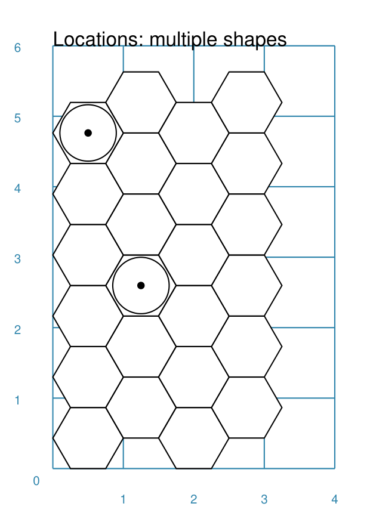

===== ======
|ml0| This example shows locations constructed using the command:

      .. code:: python

        hexgrid = Hexagons(
            side=0.5,
            x=0, y=0,
            rows=6, cols=4,
        )
        Locations(
            hexgrid,
            "0204, 0101",
            [circle(common=a_circle)]
        )

      The ``Hexagons`` grid is constructed as per the examples described in
      the `Rectangular Hexagonal Grid`_ section.  The grid is assigned the
      name *hexgrid* so it's result can be reused.

      The ``Locations`` command has the following properties:

      - *hexgrid* refers to the assigned name for the ``Hexagons`` grid
      - ``"0204, 0101"`` are the co-ordinates of the two hexagons in the grid
      - the list contains two shapes - a ``Circle`` and a ``Dot``;  these
        will be drawn in that order, each at the centre of the hexagon
        matching the co-ordinates that have been set

===== ======


Example 2.  Locations & Sequence
~~~~~~~~~~~~~~~~~~~~~~~~~~~~~~~~
`^ <locations_>`_

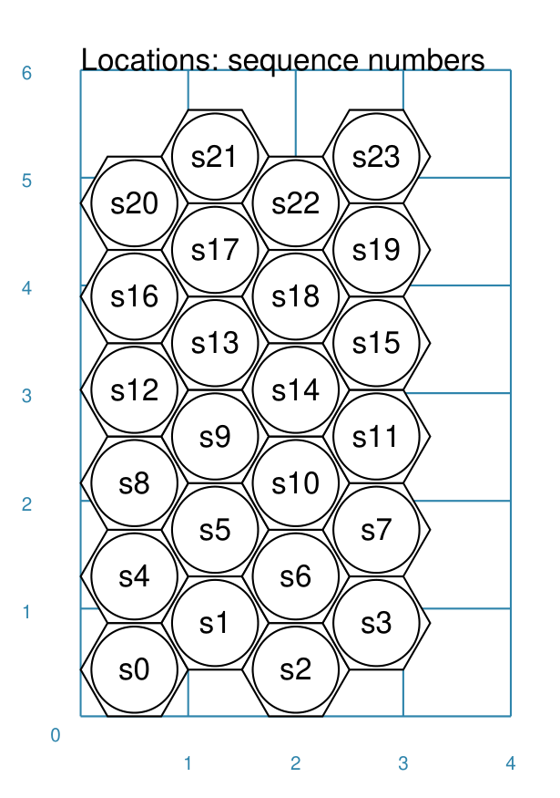

===== ======
|ml1| This example shows locations constructed using the command:

      .. code:: python

        hexgrid = Hexagons(
            side=0.5,
            x=0, y=0,
            rows=6, cols=4,
        )
        Locations(
            hexgrid,
            "all",
            [circle(common=a_circle, label="s{{sequence}}")]
        )

      The ``Hexagons`` grid is constructed as per the examples described in
      the `Rectangular Hexagonal Grid`_ section.  The grid is assigned the
      name *hexgrid* so it's result can be reused.

      The ``Locations`` command has the following properties:

      - *hexgrid* refers to the assigned name for the ``Hexagons`` grid
      - ``"all"`` is a short-cut which refers to **all** the co-ordinates of
        the hexagons in the grid
      - the list contains a single shape - a ``Circle`` whose label has been
        set to the reference keyword ``{{sequence}}``; because of the enclosing
        brackets ``{{...}}`` the keyword will be replaced by the actual value
        of the sequence number in which the hexagon has been drawn.

===== ======


Example 3.  Locations & Labels
~~~~~~~~~~~~~~~~~~~~~~~~~~~~~~
`^ <locations_>`_

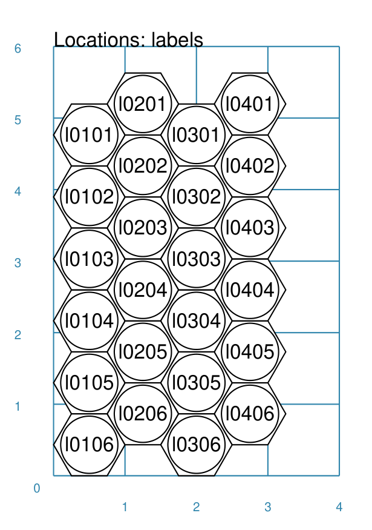

===== ======
|ml2| This example shows locations constructed using the command:

      .. code:: python

        hexgrid = Hexagons(
            side=0.5,
            x=0, y=0,
            rows=6, cols=4,
        )
        Locations(
            hexgrid,
            "all",
            [circle(common=a_circle, label="l{{label}}")]
        )

      The ``Hexagons`` grid is constructed as per the examples described in
      the `Rectangular Hexagonal Grid`_ section.  The grid is assigned the
      name *hexgrid* so it's result can be reused.

      The ``Locations`` command has the following properties:

      - *hexgrid* refers to the assigned name for the ``Hexagons`` grid
      - ``"all"`` is a short-cut which refers to **all** the co-ordinates of
        the hexagons in the grid
      - the list contains a single shape - a ``Circle`` whose label has been
        set to the reference keyword ``{{label}}``; because of the enclosing
        brackets ``{{...}}`` the keyword will be replaced by the actual value
        of the label of the hexagon being drawn.

===== ======


Example 4.  Locations & Col/Row
~~~~~~~~~~~~~~~~~~~~~~~~~~~~~~~
`^ <locations_>`_

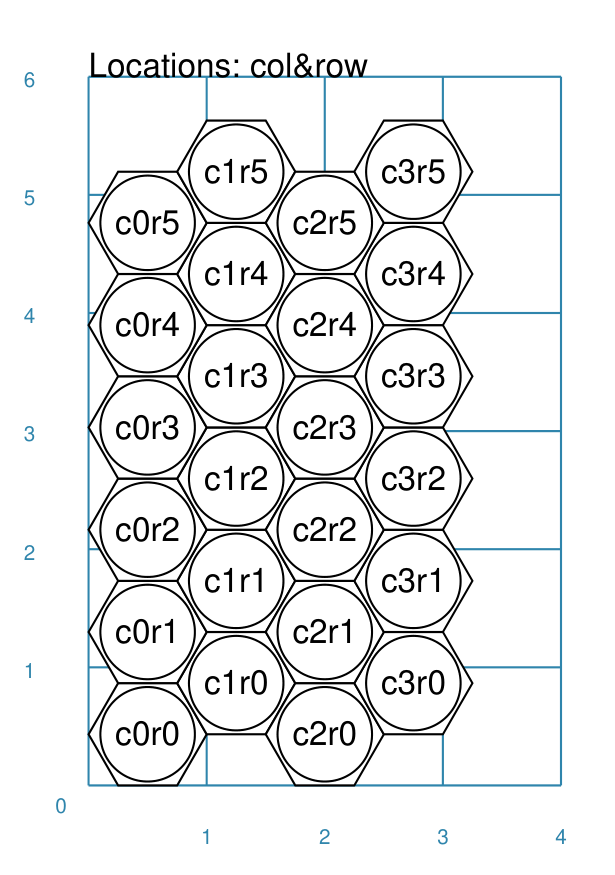

===== ======
|ml3| This example shows locations constructed using the command:

      .. code:: python

        hexgrid = Hexagons(
            side=0.5,
            x=0, y=0,
            rows=6, cols=4,
        )
        Locations(
            hexgrid,
            "all",
            [circle(common=a_circle, label="c{{col}}r{{row}}")]
        )

      The ``Hexagons`` grid is constructed as per the examples described in
      the `Rectangular Hexagonal Grid`_ section.  The grid is assigned the
      name *hexgrid* so it's result can be reused.

      The ``Locations`` command has the following properties:

      - *hexgrid* refers to the assigned name for the ``Hexagons`` grid
      - ``"all"`` is a short-cut which refers to **all** the co-ordinates of
        the hexagons in the grid
      - the list contains a single shape - a ``Circle`` whose label has been
        set to use the reference keywords ``{{col}}`` and ``{{row}}``; because
        of the enclosing brackets ``{{...}}`` these keywords will be replaced
        by the actual values of the grid's *column* and *row* for the hexagon
        being drawn.

===== ======


Grid LinkLine
=============
`↑ <table-of-contents_>`_

The ``LinkLine()`` command allows the creation of a line to join one or more
hexagons within a hexagonal grid.

This command should work with any of the types of hexagonal grid layouts
described above.

All of the examples below make use of the same underlying hexagonal grid:

    .. code:: python

        hexgrid = Hexagons(
            side=0.5,
            x=0, y=0,
            rows=6, cols=4,
            coord_elevation='top'
        )

The grid is assigned the name *hexgrid* so it's result can be reused.


Example 1. A Single LinkLine
----------------------------
`^ <Grid LinkLine_>`_

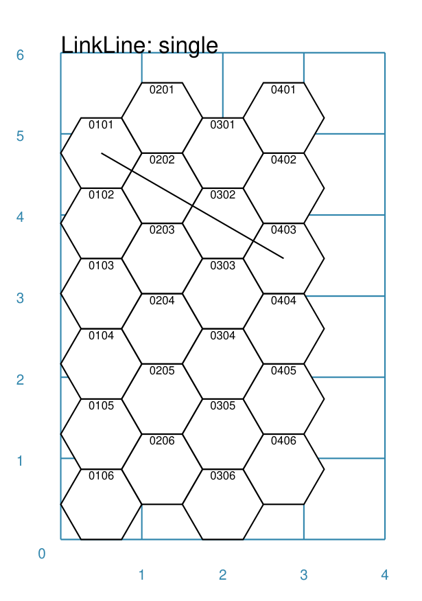

===== ======
|ll0| This example shows a ``LinkLine`` constructed using the command:

      .. code:: python

        LinkLine(
            grid=hexgrid,
            locations="0101,0403"
        )

      The ``LinkLine`` command  has the following properties:

      - the *grid* used is *hexgrid* (as defined for all these examples)
      - the *locations* ``"0101,0403"`` represent the coordinates of the start
        and end locations in the grid, between which the line is drawn. By
        default, the line uses the *x* and *y* values of the centre of the
        hexagon in which it starts or ends, and uses the default styling.

===== ======


Example 2. A Double LinkLine
----------------------------
`^ <Grid LinkLine_>`_

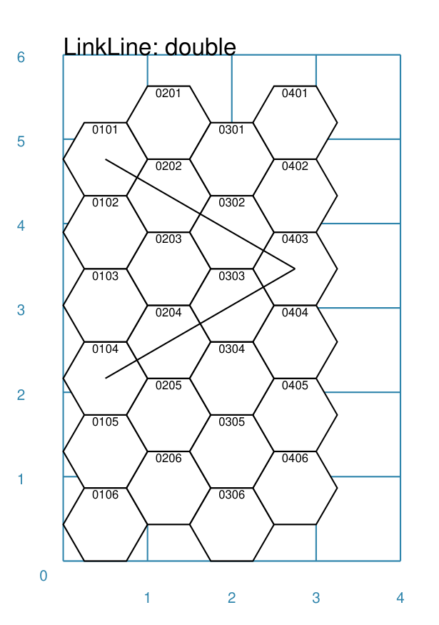

===== ======
|ll1| This example shows a ``LinkLine`` constructed using the command:

      .. code:: python

        LinkLine(
            hexgrid,
            "0101,0403,0104"
        )

      The ``LinkLine`` command  has the following properties:

      - the grid used is *hexgrid* (as defined for all these examples)
      - ``"0101,0403,0104"`` represent the coordinates of multiple start and
        end locations in the grid, between which the line is drawn. The first
        is drawn between the first and second hexagon; the second between the
        second and third hexagon specified. By default, the lines use
        the *x* and *y* values of the centre of the hex in which they start
        or end, and use the default styling.

      **Note** that in this example, the *grid=* and *locations=* are ommitted;
      the program can just use the values presented, provided they are in the
      correct order.

===== ======


Example 3. A Styled LinkLine
----------------------------
`^ <Grid LinkLine_>`_

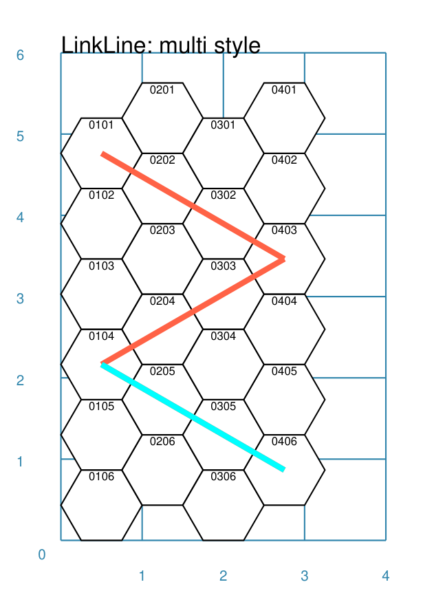

===== ======
|ll2| This example shows a ``LinkLine`` constructed using the command:

      .. code:: python

        LinkLine(
            hexgrid,
            ["0101","0403","0104","0406"],
            common=Common(stroke=tomato, stroke_width=2)
        )
        LinkLine(
            hexgrid,
            ["0104","0406"],
            common=Common(stroke=aqua, stroke_width=2)
        )

      The ``LinkLine`` commands have the following properties:

      - the grid used is *hexgrid* (as defined for all these examples)
      - ``["0101","0403","0104","0406"]`` and ```["0104","0406"]`` represent
        the coordinates of multiple start and end locations in the grid,
        between which the lines are drawn. In this example, the locations are
        define as individual strings in a list. By default, the lines use the
        *x* and *y* values of the centre of the hex in which they start or end.
      - *common* - this third property defines the styling for the line

===== ======


Example 4. An Offset LinkLine
-----------------------------
`^ <Grid LinkLine_>`_

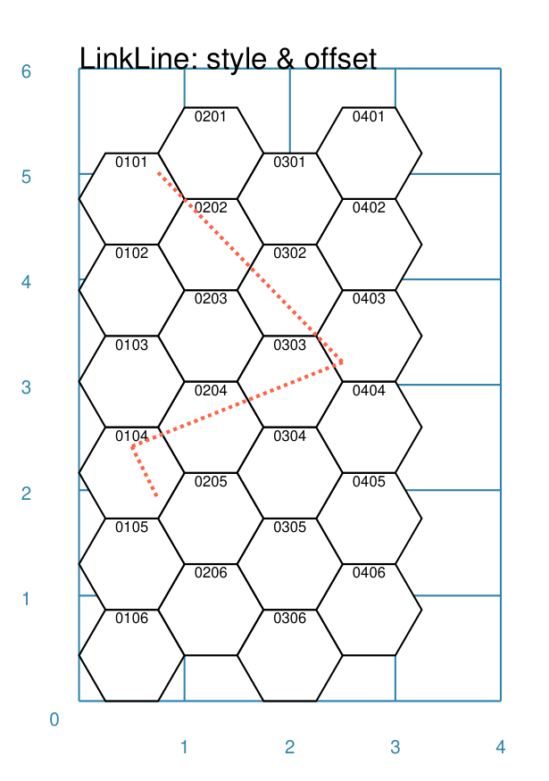

===== ======
|ll3| This example shows a ``LinkLine`` constructed using the command:

      .. code:: python

        LinkLine(
            hexgrid,
            [("0101", 0.25, 0.25),
             ("0403", -0.25, -0.25),
             ("0104", 0.0, 0.25),
             ("0104", 0.25, -0.25)],
            common=Common(
                stroke=tomato, stroke_width=1, dotted=True)
        )

      The ``LinkLine`` command  has the following properties:

      - the grid used is *hexgrid* (as defined for all these examples)
      - the series of set values - such as ``("0101", 0.25, 0.25)`` - represent
        both the coordinates of the location in the grid, as well as the
        **offset** values -  *x* and *y*  - relative to  the centre of the hex
        in which the line starts (or ends). Positive values for the offset move
        the *x* and *y*  up and to the right of the centre; negatives move
        the *x* and *y* down and to the left of the centre
      - *common* - this third property defines the styling for the line

      Note that its possible to define the start and end as different offsets
      within the **same** hexagon.

===== ======


Other Resources
===============
`↑ <table-of-contents_>`_

There are already a number of software tools available for creating
hexagonal grids of various kinds and for different purposes. A few of
them, some of which are game-specific - for example, the so-called
`18XX <https://en.wikipedia.org/wiki/18XX>`_ series, are listed below:

-  *HEXGRID* (https://hamhambone.github.io/hexgrid/) - an online hex
   grid generator which interactively creates a display, downloadable as
   a PNG image.
-  *mkhexgrid* (https://www.nomic.net/~uckelman/mkhexgrid/) - a
   command-line program which generates hexagonal grids, used for
   strategy games, as PNG or SVG images.
-  *Hex Map Extension*
   (https://github.com/lifelike/hexmapextension/tree/master) - an
   extension for creating hex grids in *Inkscape* that can also be used
   to make brick patterns of staggered rectangles.
-  *hexboard* (https://www.ctan.org/pkg/hexboard) - a package for LATEX
   that provides functionality for drawing Hex boards and games.
-  *map18xx* (https://github.com/XeryusTC/map18xx) - a 18XX hex map and
   tile generator that outputs to SVG files, scaled to fit A4 paper.
-  *18xx Maker* (https://www.18xx-maker.com/) - uses 18XX game
   definitions written in JSON, displays them, and renders them for
   printing.
-  *ps18xx* (https://github.com/18xx/ps18xx/tree/master) - software for
   running 18XX email games, and creating maps and tile sheets.
-  *LATEX wargame package* (https://wargames_tex.gitlab.io/wargame_www/tools.html) - a
   package for LaTeX for authoring hex’n’counter wargames.

The options and facilities provided by these tools have been the primary
inspiration for how hexagonal grids work in **protograf**. So if the
functionality available here does not work for you, then possibly one of
these other tools would be of better use.

   For everything - and I mean **everything** - related to how hexagonal
   grids are designed and calculated the single most useful reference is
   https://www.redblobgames.com/grids/hexagons/

An 18XX Footnote
----------------

The 18XX game series hex maps are often criticised for their poor aesthetic.
A fascinating article that deals with this topic - and is perhaps relevant
even at the prototyping stage being supported by this program - can be found at
https://medium.com/grandtrunkgames/mawgd4-18xx-tiles-and-18xx-maps-8a409bba4230
