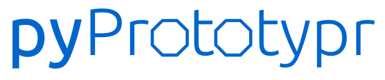

.. protograf documentation master file, created by
   sphinx-quickstart on Sat Jan 11 20:23:56 2025.

Welcome to protograf's documentation!
=====================================

The `protograf <https://github.com/gamesbook/protograf>`_  documentation consists
of the sections listed below.

If it's your first time here, please consult the `guide <guide.html>`_
which presents the sections designed to be read in order; they all contain
useful information but do build on each other.

.. toctree::
   :maxdepth: 2
   :caption: Contents:

   guide
   overview
   setting_up
   basic_concepts
   worked_example
   script_anatomy
   additional_concepts
   core_shapes
   card_decks
   deck_command
   additional_commands
   advanced_commands
   customised_shapes
   layouts
   hexagonal_grids
   terminology
   commands
   examples/index
   examples/abstract
   examples/commercial
   examples/bgg
   examples/cards
   examples/counters
   examples/various
   python_commands
   useful_resources

Indices and tables
==================

* :ref:`genindex`
* :ref:`modindex`
* :ref:`search`
