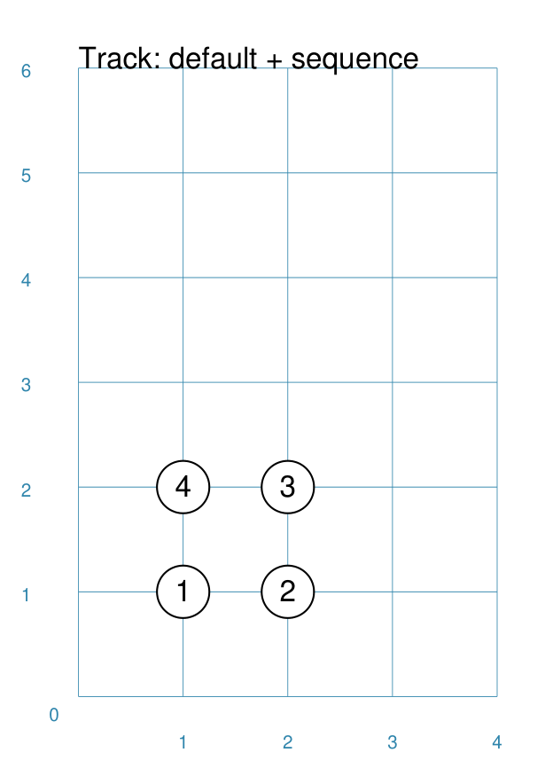
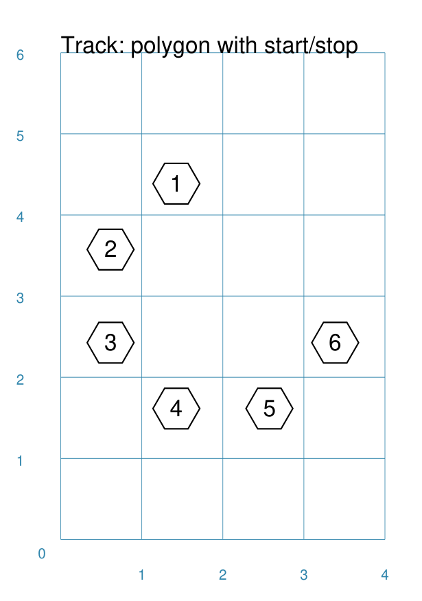
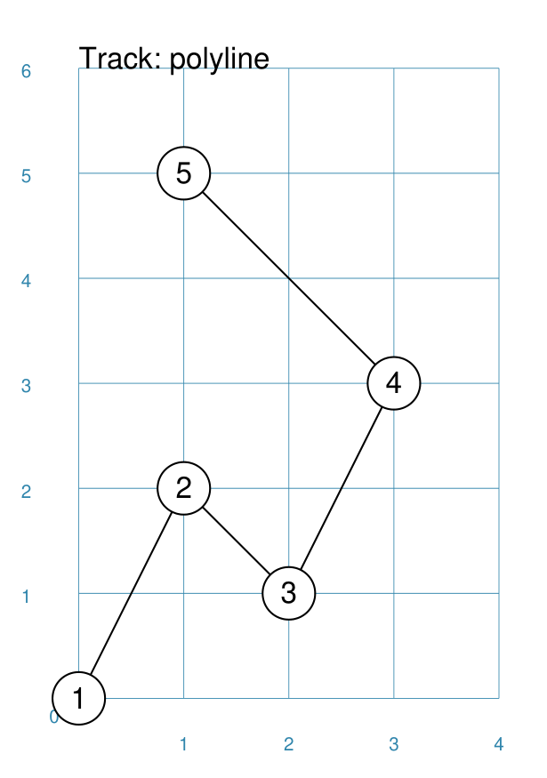
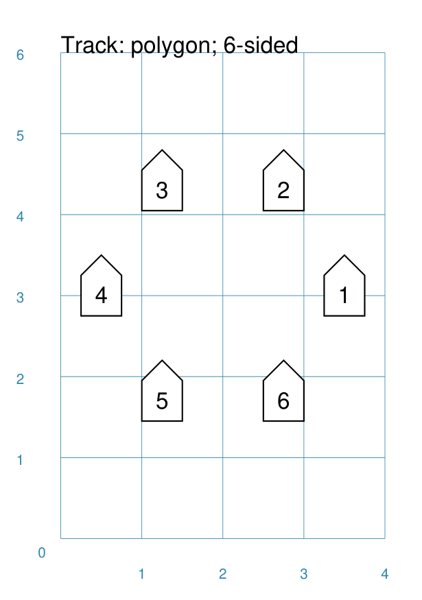
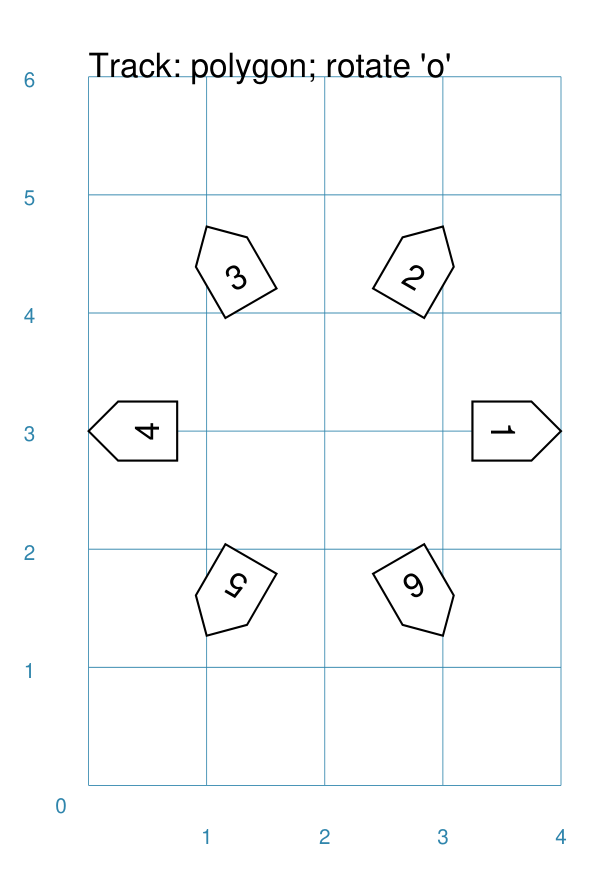
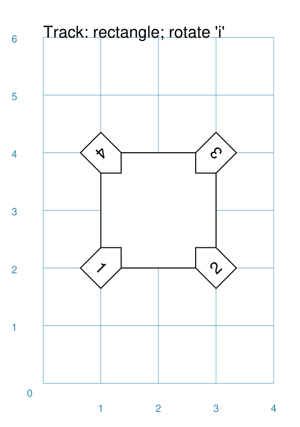
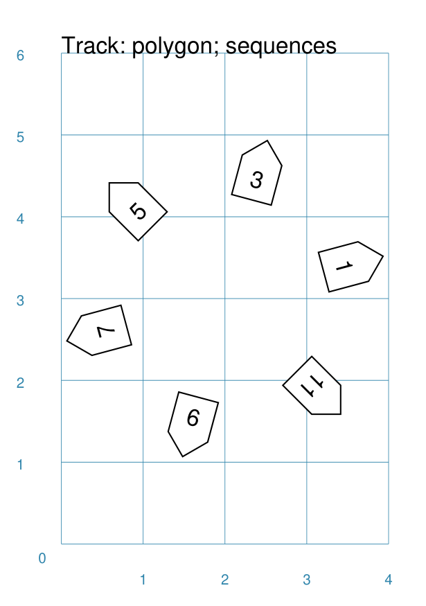
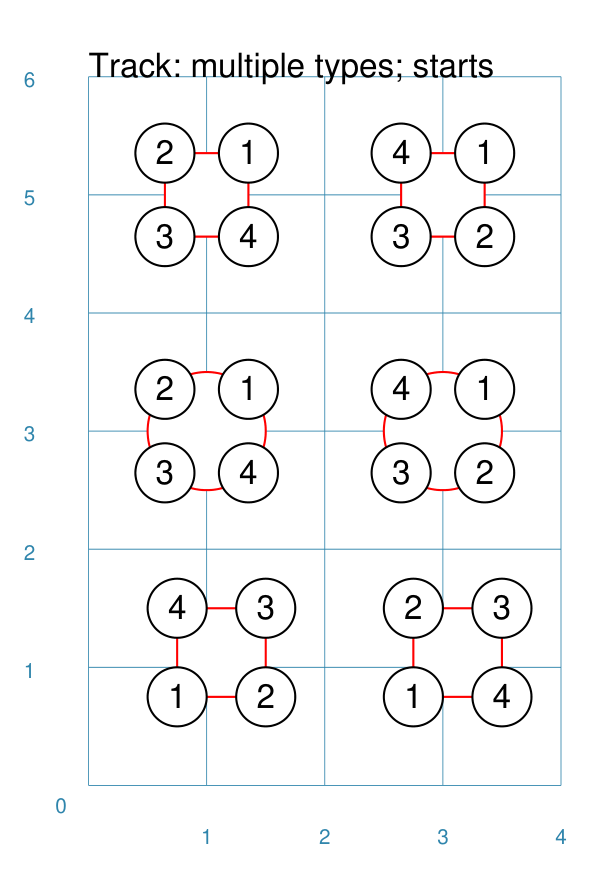
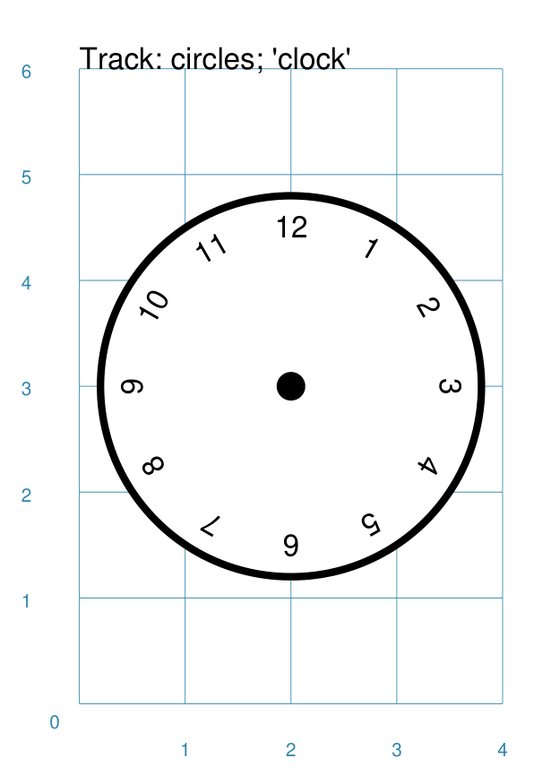
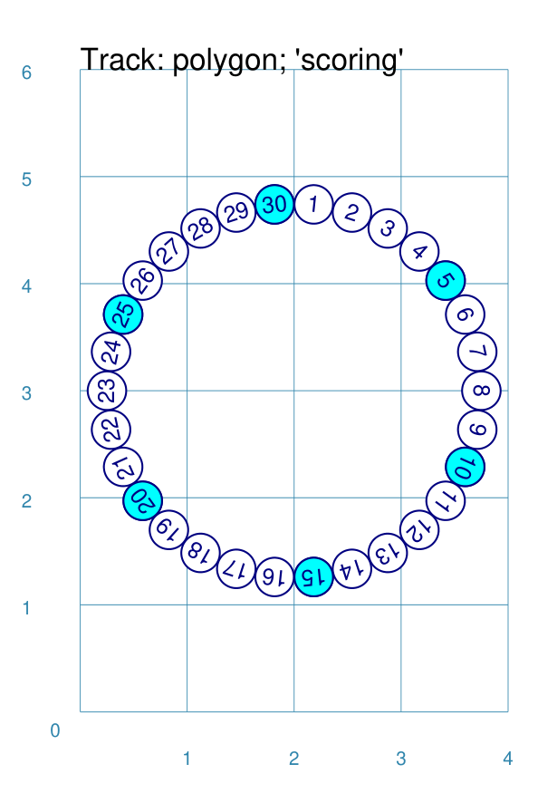

=============
Track Command
=============

This section assumes you are very familiar with the concepts, terms and
ideas for :doc:`protograf <index>` as presented in the
:doc:`Basic Concepts <basic_concepts>` , that you understand all of the
:doc:`Additional Concepts <additional_concepts>`
and that you've created some basic scripts of your own using the
:doc:`Core Shapes <core_shapes>`.

.. _table-of-contents:

Table of Contents
=================

- `Overview`_
- `Usage`_
- `Key Properties`_

Overview
========
`↑ <table-of-contents_>`_

The `Track()` command is designed to lay out a number of items - letters or
numbers, or shapes - at the vertices of another shape. Each vertex is
assigned a **sequence** number; so a ``Rectangle`` has vertices numbered
from 1 to 4; whereas a 12-sided ``Polygon`` has vertices numbered  from
1 to 12.

The sequence number can be assigned to be used by, or as part of, text using
the special keyword ``{{sequence}}``.

Apart from the ``Track()`` command described here,
there are also these other commands which allow you to layout
elements in a more repetitive or regular way within a page:

- :doc:`Repeat <layouts_repeat>`
- :doc:`Sequence <layouts_sequence>`
- :doc:`RectangularLocations <layouts_rectangular>`
- :doc:`TriangularLocations <layouts_triangular>`

Usage
=====
`↑ <table-of-contents_>`_

The ``Track()`` command accepts the following properties:

- **track** - this is the first property accepted, and must correspond to
  one of the allowed Track types; ``Circle``, ``Rectangle``, ``Square``,
  ``Polygon``, or ``Polyline``
- **shapes** - this is a list one of the core shapes available, for example,
  a circle or rectangle; the shape, or shapes, in the list are drawn at each
  location in the sequence on the Track
- **stop** - the sequence number of the last shape to be drawn
- **start** - the sequence *position* from where drawing of shapes must start;
  the default start position varies according to the type of *track* selected
- **clockwise** - by default, shapes are drawn anti-clockwise from the
  *start*; set this to ``True`` to alter the drawing order
- **sequences** - a list (or a string that can be expanded to a list) of the
  **only** sequence *positions* that must be drawn; any position **not** in
  this list is not drawn
- **angles** - used only with a ``Circle()`` track; a list of those angles
  at which shapes should be drawn (along the diameter)
- **rotation_style** - by default, shapes are drawn upright; this property
  can be set to:

  - **i** - to rotate the shape so that it faces inwards
  - **o** - to rotate the shape so that it faces outwards

.. _key-properties:

Key Properties
==============
`↑ <table-of-contents_>`_

- `Example 1. Default`_
- `Example 2. Track with a Shape`_
- `Example 3. Track with sequence`_
- `Example 4. Square Track with Star`_
- `Example 5. Polygon Track`_
- `Example 6. Polygon Track with start and stop`_
- `Example 7. Polyline Track`_
- `Example 8. Circle Track - clockwise`_
- `Example 9. Polygon Track - custom shape`_
- `Example 10. Polygon Track - clockwise`_
- `Example 11. Polygon Track - inwards`_
- `Example 12. Polygon Track - outwards`_
- `Example 13. Circular Track - outwards`_
- `Example 14. Rectangular Track - inwards`_
- `Example 15. Rectangular Track - outwards`_
- `Example 16. Polygon Track - sequences`_
- `Example 17. Multiple Tracks - starts`_
- `Example 18. Circular Track - clock`_
- `Example 19. Polygon Track - scoring`_

Example 1. Default
------------------
`^ <key-properties_>`_

.. |tk1| image:: images/tracks/track_default.png
   :width: 330

===== ======
|tk1| This example shows the Track constructed using the default values for
      its properties.

      .. code:: python

          Track()

      The default Track is a ``Polygon`` of 4 sides, with the usual ``1`` cm
      sides and centred at x = ``1`` cm and y = ``1`` cm.

      However, because no shapes have been assigned to be drawn on
      the Track, the program will issue a warning::

        WARNING:: Track needs at least one Shape assigned to shapes list

===== ======

Example 2. Track with a Shape
-----------------------------
`^ <key-properties_>`_

.. |tk2| image:: images/tracks/track_default_circle.png
   :width: 330

===== ======
|tk2| This example shows the Track constructed using differing values for
      its properties.

      .. code:: python

        Track(
          rectangle(),
          shapes=[circle(radius=0.25, fill=None)]))

      This is similar to the first example; the main difference is the
      specification of *shapes* - this causes the *shp* (a ``Circle``)
      to be drawn at each of the vertices of the ``Rectangle`` that forms
      the track.  This is of default size (similar to the first example)
      of ``1`` cm high by ``1`` cm wide, with the lower-left corner at
      x = ``1`` cm and y = ``1`` cm.

===== ======

Example 3. Track with sequence
------------------------------
`^ <key-properties_>`_

===== ======
|tk3| This example shows the Track constructed using differing values for
      its properties.

      .. code:: python

        shp = circle(
          cx=1, cy=1, radius=0.5, label='{{sequence}}')
        Track(
          rectangle(),
          shapes=[shp])

      This is similar to the second example; the main difference is the
      specification of *label* with a value of *{{sequence}}* for the
      shape being drawn.  In this case, the value is replaced by the
      actual number.  The ``Rectangle`` vertices are numbered in an
      anti-clockwise direction starting with the lower-left corner.

      Note that for this, and further examples, the shape to be drawn
      is defined before the track; this makes the script a bit less
      cluttered and easier to read; but it does not **have** to be
      written this way.

===== ======

Example 4. Square Track with Star
---------------------------------
`^ <key-properties_>`_

.. |tk4| image:: images/tracks/track_square_star.png
   :width: 330

===== ======
|tk4| This example shows the Track constructed using differing values for
      its properties.

      .. code:: python

        shp = star(
          cx=1, cy=1, vertices=5, radius=0.5,
          label='{{sequence - 1}}')
        Track(
          square(side=1.5),
          shapes=[shp])

      This is very similar to the third example; the differences being:

      - a different shape (the ``Star``) is being drawn on a larger
        ``Square`` track
      - the *sequence* number is altered by subtracting one from it

===== ======

Example 5. Polygon Track
------------------------
`^ <key-properties_>`_

.. |tk5| image:: images/tracks/track_polygon_hex.png
   :width: 330

===== ======
|tk5| This example shows the Track constructed using differing values for
      its properties.

      .. code:: python

        shp = hexagon(
          cx=1, cy=1, height=0.5, label='{{sequence}}')
        Track(
           polygon(cx=2, cy=3, radius=1.5, sides=8),
           shapes=[shp])

      Because the vertices of a regular polygon lie on the diameter of a
      circle, a ``Polygon`` track is a fairly easy way to create a
      circular track.

      In this example, there are eight hexagons in a circular arrangement
      - one drawn at each of the vertices of an octagon (an eight-sided
      polygon).

      The polygon numbering starts on the mid-right (or just above) of
      the figure and continues in an anti-clockwise direction.

===== ======

Example 6. Polygon Track with start and stop
--------------------------------------------
`^ <key-properties_>`_

===== ======
|tk6| This example shows the Track constructed using differing values for
      its properties.

      .. code:: python

        shp = hexagon(
          cx=1, cy=1, height=0.5, label='{{sequence}}')
        Track(
          polygon(cx=2, cy=3, radius=1.5, sides=8),
          shapes=[shp],
          start=3,
          stop=6)

      This is very similar to the fifth example; but, in this case, a
      *start* and *stop* property are added.

      The *start* shifts the start of the numbering to what would normally
      be the third location.

      The *stop*  means that the sequence (and hence the drawing of the
      hexagon shape) stops when it reaches the value *six* in the sequence.

===== ======

Example 7. Polyline Track
-------------------------
`^ <key-properties_>`_

===== ======
|tk7| This example shows the Track constructed using differing values for
      its properties.

      .. code:: python

        shp = circle(
          cx=1, cy=1, radius=0.25, label='{{sequence}}')
        Track(
          Polyline(points=[
            (0, 0), (1, 2), (2, 1), (3, 3), (1, 5)]),
          shapes=[shp])

      A ``Polyline`` is a useful way of drawing a shape at irregular
      locations on the page.

      In this example, because ``Polyline`` is used for the *track*,
      and not ``polyline``, the track itself is drawn.

===== ======

Example 8. Circle Track - clockwise
-----------------------------------
`^ <key-properties_>`_

.. |tk8| image:: images/tracks/track_circle.png
   :width: 330

===== ======
|tk8| This example shows the Track constructed using differing values for
      its properties.

      .. code:: python

        shp = hexagon(
          cx=1, cy=1, height=0.5, label='{{sequence}}')
        Track(
           Circle(cx=2, cy=3, radius=1.5),
           angles=[30,120,210,300],
           shapes=[shp],
           clockwise=True)

      In order to draw shapes on a ``Circle``, the *angles* property must
      be set.

      Again, in this example, because ``Circle`` is used for the *track*,
      and not ``circle``, the track itself is drawn.

===== ======

Example 9. Polygon Track - custom shape
---------------------------------------
`^ <key-properties_>`_

===== ======
|tk9| This example shows the Track constructed using differing values for
      its properties.

      .. code:: python

        shp = rectangle(
          cx=1, cy=1, width=0.5, height=0.5,
          label='{{sequence}}', peaks=[("n", 0.25)])
        Track(
          polygon(cx=2, cy=3, sides=6, radius=1.5),
          shapes=[shp])

      This is very similar to the third example; the only differences being
      that a different shape (the ``Rectangle`` with a north-facing *peak*)
      is being drawn on a ``Polygon`` track of hexagonal (six-sided) shape.

===== ======

Example 10. Polygon Track - clockwise
-------------------------------------
`^ <key-properties_>`_

.. |tc0| image:: images/tracks/track_polygon_anti.png
   :width: 330

===== ======
|tc0| This example shows the Track constructed using differing values for
      its properties.

      .. code:: python

        shp = rectangle(
            cx=1, cy=1, width=0.5, height=0.5, peaks=[("n", 0.25)],
            label='{{sequence}}')
        Track(
            polygon(cx=2, cy=3, sides=6, radius=1.5),
            shapes=[shp],
            clockwise=True)

      This is very similar to the ninth example; the only difference being
      that the direction of drawing is now *clockwise*.

===== ======

Example 11. Polygon Track - inwards
-----------------------------------
`^ <key-properties_>`_

.. |tc1| image:: images/tracks/track_polygon_rotate_i.png
   :width: 330

===== ======
|tc1| This example shows the Track constructed using differing values for
      its properties.

      .. code:: python

        shp = rectangle(
          cx=1, cy=1, width=0.5, height=0.5, peaks=[("n", 0.25)],
          label='{{sequence}}')
        Track(
          polygon(cx=2, cy=3, sides=6, radius=1.5),
          shapes=[shp],
          rotation_style='i')

      This is very similar to the ninth example; the only difference being
      that the shapes themselves are re-orientated to face inwards, by using
      ``rotation_style='i'``.

===== ======

Example 12. Polygon Track - outwards
------------------------------------
`^ <key-properties_>`_

===== ======
|tc2| This example shows the Track constructed using differing values for
      its properties.

      .. code:: python

        shp = rectangle(
          cx=1, cy=1, width=0.5, height=0.5, peaks=[("n", 0.25)],
          label='{{sequence}}')
        Track(
          polygon(cx=2, cy=3, sides=6, radius=1.5),
          shapes=[shp],
          rotation_style='o')

      This is very similar to the ninth example; the only difference being
      that the shapes themselves are re-orientated to face outwards, by using
      ``rotation_style='o'``.

===== ======

Example 13. Circular Track - outwards
-------------------------------------
`^ <key-properties_>`_

.. |tc3| image:: images/tracks/track_circle_rotate_o.png
   :width: 330

===== ======
|tc3| This example shows the Track constructed using differing values for
      its properties.

      .. code:: python

        shp = rectangle(
          cx=1, cy=1, width=0.5, height=0.5, peaks=[("n", 0.25)],
          label='{{sequence}}')
        Track(
          Circle(cx=2, cy=3, radius=1.5),
          angles=[30,120,210,300],
          shapes=[shp],
          rotation_style='o')

      This is very similar to the twelfth example; the only difference being
      that a circular track, with locations specified by *angles* is used.

===== ======

Example 14. Rectangular Track - inwards
---------------------------------------
`^ <key-properties_>`_

===== ======
|tc4| This example shows the Track constructed using differing values for
      its properties.

      .. code:: python

        shp = rectangle(
          cx=1, cy=1, width=0.5, height=0.5, peaks=[("n", 0.25)],
          label='{{sequence}}')
        Track(
          Rectangle(cx=2, cy=3, height=2, width=2),
          shapes=[shp],
          rotation_style='i')

      This is very similar to the eleventh example; the only difference being
      that a rectangular track is used.

===== ======

Example 15. Rectangular Track - outwards
----------------------------------------
`^ <key-properties_>`_

.. |tc5| image:: images/tracks/track_square_rotate_o.png
   :width: 330

===== ======
|tc5| This example shows the Track constructed using differing values for
      its properties.

      .. code:: python

        shp = rectangle(
          cx=1, cy=1, width=0.5, height=0.5, peaks=[("n", 0.25)],
          label='{{sequence}}')
        Track(
          Rectangle(cx=2, cy=3, height=2, width=2),
          shapes=[shp],
          rotation_style='o')

      This is very similar to the twelfth example; the only difference being
      that a rectangular track is used.

===== ======

Example 16. Polygon Track - sequences
-------------------------------------
`^ <key-properties_>`_

===== ======
|tc6| This example shows two Tracks constructed using differing values for
      their properties.

      .. code:: python

        shp = rectangle(
          cx=1, cy=1, width=0.5, height=0.5, peaks=[("n", 0.25)],
          label='{{sequence}}')
        Track(
            polygon(cx=2, cy=3, sides=12, radius=1.5),
            shapes=[shp],
            rotation_style='o',
            sequences=[1,3,5,7,9,11])

      Here, the *sequences* property is set to draw the shape at every
      *odd* location.

      As elsewhere, sequences can be specified using a string; for
      example: ``"1-3,7,9"`` which expands to the list containing
      ``[1,2,3,7,9]``.

===== ======

Example 17. Multiple Tracks - starts
------------------------------------
`^ <key-properties_>`_

===== ======
|tc7| This example shows the Track constructed using differing values for
      its properties.

      .. code:: python

        shp = circle(cx=0, cy=0, radius=0.25, label='{{sequence}}')

        # polygon
        Track(
          Polygon(cx=1, cy=5, radius=0.5, sides=4, stroke=red),
          shapes=[shp])
        Track(
          Polygon(cx=3, cy=5, radius=0.5, sides=4, stroke=red),
          shapes=[shp],
          clockwise=True)
        # circle
        Track(
          Circle(cx=1, cy=3, radius=0.5, stroke=red),
          shapes=[shp],
          angles=[45,135,225,315])
        Track(
          Circle(cx=3, cy=3, radius=0.5, stroke=red),
          shapes=[shp],
          angles=[45,135,225,315],
          clockwise=True)
        # square
        Track(
          Square(x=0.75, y=0.75, side=0.75, stroke=red),
          shapes=[shp])
        Track(
          Square(x=2.75, y=0.75, side=0.75, stroke=red),
          shapes=[shp],
          clockwise=True)

      The purpose of this example to show that the start location varies
      per type of track used; from top to bottom these are:

      - ``Polygon``
      - ``Circle``
      - ``Square``

      In each case, the track itself is being shown in red.

      The examples on the left are with default direction; the ones on the
      right show how ``clockwise=True`` switches that.

===== ======

Example 18. Circular Track - clock
----------------------------------
`^ <key-properties_>`_

===== ======
|tc8| This example shows the Track constructed using differing values for
      its properties.

      .. code:: python

        Circle(
          cx=2, cy=3, radius=1.8, stroke_width=2, dot=0.1)

        times = circle(
          cx=1, cy=1, radius=0.25, stroke=white,
          label='{{sequence}}', label_stroke=black)

        Track(
          circle(cx=2, cy=3, radius=1.5),
          angles=[60,90,120,150,180,210,240,270,300,330,0,30],
          shapes=[times],
          rotation_style='o',
          clockwise=True)

      This example is to show how a track could be used to construct a
      familiar shape - an analog clock face. By setting the angles in the
      desired order, the clock numbering starts at the correct place to
      show the 'hour' numbers.

      The outer ``Circle`` with its *dot* is really just for decoration!

===== ======

Example 19. Polygon Track - scoring
-----------------------------------
`^ <key-properties_>`_

===== ======
|tc9| This example shows two Tracks constructed using differing values for
      their properties.

      .. code:: python

        trk = polygon(cx=2, cy=3, sides=30, radius=1.75)
        score = Common(
            cx=1, cy=1, radius=0.18, stroke=navy,
            label='{{sequence}}', label_size=6)
        # white circles
        shp = circle(common=score, fill=white)
        Track(
            trk,
            shapes=[shp],
            rotation_style='o',
            clockwise=True,
            start=24
        )
        # colored circles
        shp5 = circle(common=score, fill=aqua)
        Track(
            trk,
            shapes=[shp5],
            rotation_style='o',
            clockwise=True,
            start=24,
            sequences=[5,10,15,20,25,30,35]
        )

      This example is to show how a track could be used to construct a
      familiar shape - a scoring track for a game.  In this case, a
      30-sided polygon is used as the basis for the track.

      Two tracks are constructed; first the one with the white circles
      and then the second one is constructed "above" it with blue circles;
      these circles are only drawn at every fifth location in the sequence.
      The track's circles share the same *common* property, as the only
      difference between them is their *fill* color.

===== ======
