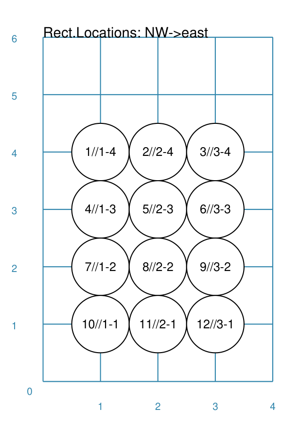

===========================
TriangularLocations Command
===========================

This section assumes you are very familiar with the concepts, terms and
ideas for :doc:`protograf <index>` as presented in the
:doc:`Basic Concepts <basic_concepts>` , that you understand all of the
:doc:`Additional Concepts <additional_concepts>`
and that you've created some basic scripts of your own using the
:doc:`Core Shapes <core_shapes>`.


.. _table-of-contents:

Table of Contents
=================

- `Overview`_
- `Usage`_
- `Key Properties`_


Overview
========

The ``TriangularLocations()`` command defines an ordered series
of row and column locations that create a triangular pattern.  The x- and
y-values of these rows and columns are then used to set the centres of
the elements that can be placed there using the ``Layout()`` command.

Apart from the ``TriangularLocations()`` command described here,
there are also these other commands which allow you to layout
elements in a more repetitive or regular way within a page:

- :doc:`Repeat <layouts_repeat>`
- :doc:`Sequence <layouts_sequence>`
- :doc:`Tracks <layouts_track>`
- :doc:`RectangularLocations <layouts_rectangular>`


Usage
=====

The ``TriangularLocations()`` command accepts the following properties:

- **cols** - this is the number of locations in the horizontal direction; this
  defaults to *2*
- **rows** - this is the number of locations in the vertical direction; this
  defaults to *2*
- **direction** - this is the compass direction of the line of travel when
  creating the row and column layout; the default is e(ast).
- **start** - this is the initial corner, defined a secondary compass direction,
  from where the grid is initially drawn; values can be *ne*, *nw*, *se*, and
  *sw* (the default i.e. the lower-left corner)

The ``Layout()`` command accepts the following properties:

- **grid** - this *must* be the first property used for the command; it will
  refer to
- **shapes** - this is a list of one or more of the core shapes available,
  for example, a circle or rectangle


.. _key-properties:

Key Properties
==============
`↑ <table-of-contents_>`_

- `Example 1. Rows and Columns`_

All examples below make use of a common ```Circle`` shape (called *a_circle*)
defined as:

  .. code:: python

    circles = Common(
        x=0, y=0, diameter=1.0,
        label="{{sequence}}//{{col}}-{{row}}", label_size=6)
    a_circle = circle(common=circles)

In these examples, the placeholder names ``{{sequence}}``, ``{{col}}``
and ``{{row}}`` will be replaced, in the label for the Circle, by the
values for the row and column in which that circle is placed, as well as
by the sequence number (order) in which that Circle is drawn.


Example 1. Rows and Columns
---------------------------
`^ <key-properties_>`_



===== ======
|tl0| This example shows the shape constructed using differing values for
      its properties.

      .. code:: python

          TriangularLocations()

===== ======
