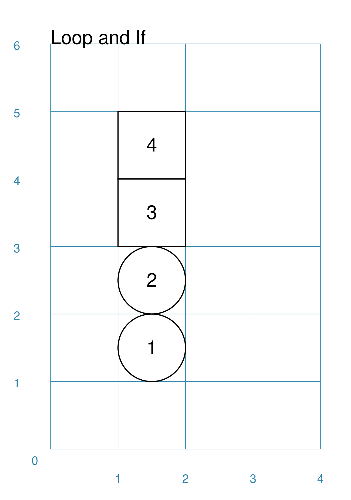
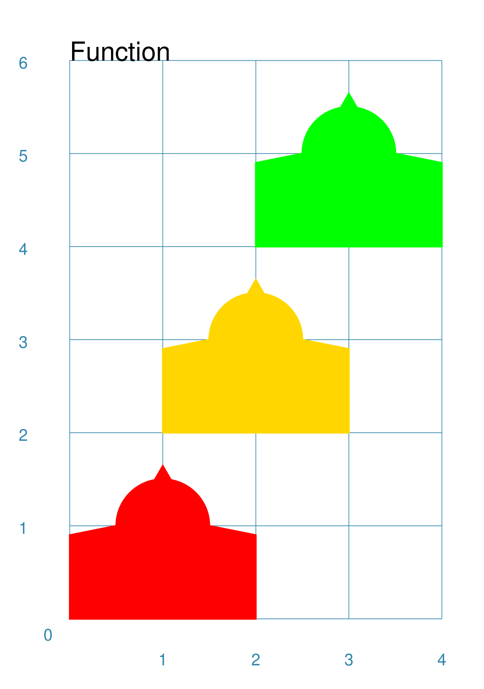

=====================
Using Python Commands
=====================

.. |dash| unicode:: U+2014 .. EM DASH SIGN

This section assumes you are very familiar with the concepts, terms and
ideas for `protograf <index.rst>`_ as presented in the
`Basic Concepts <basic_concepts.rst>`_ , that you understand all of the
`Additional Concepts <additional_concepts.rst>`_
and that you've created some basic scripts of your own using the
`Core Shapes <core_shapes.rst>`_.

.. NOTE::

   Note that if you already know the Python programming language, you can skip
   this section, unless you have any uncertainty about any of these topics!

.. _table-of-contents:

Table of Contents
=================

-  `Background`_
-  `Introduction`_
-  `Loops`_
-  `If Statements`_
-  `Functions`_

Background
==========
`↑ <table-of-contents_>`_

Working with an actual programming language, if you’re not a programmer,
can be a little intimidating. Hopefully though, by the time you’ve
started to look at this section, you will already be somewhat
comfortable with writing and running **protograf** scripts and
therefore already on your way to controlling a computer through a
written language.

The concepts and methods represented here are relatively small
increments to what you likely already know, but should give you more
flexibility in terms of the way you can write scripts |dash| without adding
too much complexity. These are *not* essential but *may* be very useful.

Introduction
============
`↑ <table-of-contents_>`_

As you may already have worked out; the normal operation of the script
is to start with the first command and then go on to the next one and
so on until the last one has been carried out - this is the normal or
"default" behaviour of any program.

However, most programming languages have the concept of **loops** and
**if** statements. These commands are used to change the default
behaviour of the program in some way.  Similarly, **functions** are
used in many languages to create a set of items that must all carried out
together, and which need to be used/activated a number of times.

Any statement or functionality that is part of the Python programming language
can be used in a script if you want to. The ones below are just to give
you some idea of "the basics".

Loops
=====
`↑ <table-of-contents_>`_

A loop represents a section of your script that you want to repeat a
certain number of times.

If you were reading a recipe, for example, it might say: *Add a cup of
flour and add an egg and mix; add another cup of flour and add another
egg and mix; add a third cup of flour and a third egg and mix*. So this
is really the same set of actions that gets repeated three times. You
could rephrase this in a different way. *Repeat three times: Add a cup
of flour, add an egg, and mix*. The two parts of this statement
represents what happens in a loop. The first part indicates how many
times the loop happens, and the second part is the action, or set of
actions, that need to be repeated.

In a Python, or **protograf**, script, a loop can be set-up by using
the following kind of statement:

  .. code:: python

   for number in range(1, 4):
       add_egg()
       add_flour()
       mix()

In this case the first line is the loop set-up:

-  the *for* indicates that we want to set-up a loop
-  the *range* part limits how many times the loop will happen by using
   a start and end value inside a pair of brackets |dash| the 1 and 4
   respectively
-  *number* stores how many times the loop has happened so far (for the very
   first time the value of number will be set to the start value of 1); this
   is referred to as the loop's *counter*

The first line ends with ``:`` to show that it is expected that more lines
will follow that describe what must happen each time the program goes through
the loop.

The lines immediately following this set-up line are all the actions
that must happen each time. **These lines must all be indented 4 spaces
and lined up below each other to show they are part of the loop.**
(*Note:* ignore the actual words used here; they are just to indicate the
concept of actions… more practical examples are shown below!).

Once the action(s) have been carried out, the program goes back to the
line starting with the ``for`` |dash| this is where the "loop" concept
comes from |dash| to increase the ``number`` value and prepare to carry
out the action(s) again.

.. NOTE::

   When the loop counter's value stored in ``number`` matches that of
   the ``end`` value, the loop will stop right away and **not** process any
   of the action(s) again.

In the case of **protograf**, a loop can be used to draw an item a
number of times; for example:

  .. code:: python

    for number in range(1, 4):
        Circle(x=1, y=number)

Here the value of ``y`` for the Circle will be set to a different number
every time the loop operates. For the first time it will have a value of
1 (one); the second time a value of 2 (two); and the third time value of
3 (three) - as noted above, when number reaches the value of 4, the loop
ends right away. This loop will cause a ``Circle`` to be drawn in three
different ``y`` locations on the page but with the same ``x`` location.

You can combine the value of the number with other information to do more
complex kinds of operations. In this next example, the values for ``y``
will be ``0.5``, ``1.0`` and ``1.5`` over the three iterations of the
loop - which is achieved by "halving" the value of the loop counter:

  .. code:: python

    for y_location in range(1, 4):
        Circle(x=1, y=y_location * 0.5)

Note that we have used a different word in place of the usual ``number``.
It does not matter too much which word you use; so just pick one that makes
most sense in terms of what you’re trying to achieve by using it.

The value of the loop counter normally goes up by 1 each time; but you can
set a third value, inside the brackets, for the ``range`` that is a
different increment number. For example:

  .. code:: python

    for number in range(1, 7, 2):
        Circle(x=1, y=number)

Here ``number`` takes on the values ``1``, then ``3`` and then ``5``; because
the third value of 2 is added to the loop counter each time the loop operates.
When the loop counter value stored in ``number`` reaches 7, then the loop
ends right away.

Multiple Loops
--------------

Multiple loops can be used to control different values. For example:

  .. code:: python

    for y_location in range(1, 3):
       for x_location in range(1, 3):
            Circle(x=x_location, y=y_location)

Here the outer loop runs twice, setting values for both ``x`` and ``y``.
The outer loop happens twice, and for each time it happens, the inner
loop happens twice. So there are actually four times i.e. 2 times 2
that the actions |dash| in this case, drawing a Circle |dash| are
carried out.

Python has a shortcut for handling multiple loops that you can use at your
discretion |dash| its called ``zip`` (for more see
`zip function <https://www.freecodecamp.org/news/python-zip-function-explained-with-examples/>`_).

If you wanted to draw a ``Circle`` at three locations, in three different
colors, you can store all of these in lists and then do the drawing in a loop.

For example:

  .. code:: python

     x_pos = [1, 2, 3]
     y_pos = [3, 2, 1]
     fills = [red, green, yellow]
     for x, y, fill in zip(x_pos, y_pos, fills):
         Circle(cx=x, cy=y, fill=fill)

If Statements
=============
`↑ <table-of-contents_>`_

An ``if`` statement is a way to allow the computer to make decisions
based on the information available to it.

All us of make similar decisions. When we are driving a vehicle along a
road and we approach a traffic light, we evaluate the color of the
traffic light and make a decision; if the light is green we carry on
driving, but if the light is red we come to a stop.

In a similar way we can set up a statement to allow the script to behave
differently according to information that it has.

So an ``if`` statement will look something like this:

  .. code:: python

    if color == green:
        keep_driving()
    else:
        stop_driving()

You’ll see that there are really **two** parts to the ``if``. The first part
is the condition that we are trying to evaluate - in this case what the
value of the color is - and the second part is the alternative which is
contained in the ``else``.

As with the loop, a statement that ends with a ``:`` is followed by one
or more lines that are all indented below each other; these represent
the actions that are to be carried out in that part of the script.

The statement itself that forms part of the ``if``, is termed a “true or
false” check. This means that it’s a comparison of some kind. In this
case, the script examines the value stored inside ``color`` and checks
if it is "equal to" |dash| by using the double-equals sign |dash| the
value of ``green``. And because the script understands what is meant by
``green`` it can carry out this comparison.

Should the comparison be dealing with two values that are equivalent
then the check is deemed to be correct or “true”, and so the actions
that are in the first part of the ``if`` are carried out - in this case
the ``keep driving`` action - and the rest will be ignored. However,
should the comparison be false, for example because the value stored in
``color`` is red or orange, then the second part of the if statement
will be carried out - in this case the ``stop driving`` action.

An ``if`` statement can be used inside a loop, for example:

  .. code:: python

    for number in range(1, 5):
        if number < 3:
            Circle(x=1, y=number)
        else:
            Rectangle(x=1, y=number)

Here, the script will either draw a ``Circle`` or a ``Rectangle`` depending
on the value of ``number``: if its less than than 3  |dash| the ``<`` comparison is
a "less than" check |dash| then draw a ``Circle``, otherwise if its 3 or more, then
draw a ``Rectangle``.

This example is shown below.

===== ======
|lpi| An example of a *loop* and an *if* used together:

      .. code:: python

        Blueprint()
        Text(common=txt, text="Loop and If")
        for number in range(1, 5):
            if number < 3:
                Circle(x=1, y=number, label=number)
            else:
                Rectangle(x=1, y=number, label=number)
        PageBreak()

      The value of ``number`` can easily be seen as it is used to
      create the text for the shape's label.
===== ======

Multi-part If Statements
------------------------

An ``if`` statement can deal with multiple choices as well.  To continue with
the driving example, we know there are three colors and so the program must
handle all of them.  Any options after the first one are handled with a
``elif`` prefix - short for "else if":

  .. code:: python

   if color == green:
       keep_driving()
   elif color == orange:
       slow_down()
   elif color == red:
       stop_driving()
   else:
       pull_over()

In this example, the driver might be unsure what to do if the light has
malfunctioned - best to be safe!

Functions
=========
`↑ <table-of-contents_>`_

A function is the workhorse of a language.  It allows you to define your
"recipe" and then use that recipe multiple times with differing properties.

Effectively, it allows you to create a mini  **protograf** script inside your
main script. As with `loops`_, functions embed a set of steps to be carried when
they are activated, but functions are more powerful because they can allow
control of the behaviour of **any** of the properties or commands that are part
of them.

A function is simply created by using a ``def`` command, followed by the name you
want to give the function  |dash| using a word with **no** spaces in it  |dash|
followed by the set of property names and their default values.  These properties
are only available as part of the function, and represent aspects of that function
that you need to be able to change every time the function is used.

The ``def`` line is followed by one or more lines that are all indented below
each other; these represent the actions that are to be carried out in that
functions; this can include drawing of shapes, but could also involve use of
`loops`_ and `if statements`_.

When a function is defined, it is **not** activated; its only when you issue a
command for it - ``name()`` - that it will perform the actions defined as part
of it,

===== ======
|fn1| An example of a *function*:

      .. code:: python

        def capitol(a=0, b=0, c=red):
            Circle(cx=a+1, cy=b+1, radius=0.5, fill_stroke=c)
            Rectangle(
                x=a, y=b, height=1, width=2, fill_stroke=c,
                notch_y=0.1, notch_x=0.5,
                notch_corners="nw ne",)
            EquilateralTriangle(
                cx=a+1, cy=b+1.5, side=0.25, fill_stroke=c)

        Create(paper=A8, margin=0.25)
        Blueprint()
        capitol()  # uses default values
        capitol(a=1, b=2, c=gold)
        capitol(a=2, b=4, c=lime)
        PageBreak()
        Save()

      The function named *capitol* has three properties that
      can be set; *a*, *b* and *c*. These are used to control
      some of the properties of the 3 shapes that are drawn by
      the function.

      The values have defaults - ``0``, ``0`` and ``red``
      - respectively, which are used if no values are provided;
      this can be seen in the first example on the lower left.

      If values are provided to *a* and *b*,
      these will change where the shapes are drawn; if a value
      is provided to *c* it will change the shape's color.
      These changes to the function's properties can be seen in
      the other examples.
===== ======
